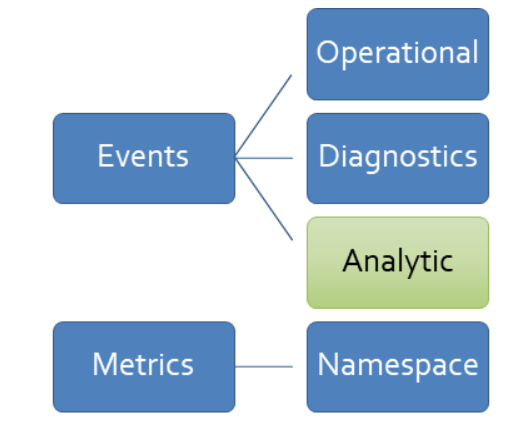

# Monitoring and logging

In this article, you will learn about how you can receive events from the Live Video Analytics on IoT Edge module for remote monitoring. 

You will also learn about how you can control the logs that the module generates.

## Taxonomy of events

Live Video Analytics on IoT Edge emits events, or telemetry data according to the following taxonomy.



* Operational: events that are generated as part of actions taken by a user, or during the execution of a [media graph](media-graph-concept.md).
   
   * Volume: expected to be low (a few times a minute, or even lower rate).
   * Examples:

      Recording started (below), recording stopped
      
      ```
      {
        "body": {
          "outputType": "assetName",
          "outputLocation": "sampleAssetFromEVR-LVAEdge-20200512T233309Z"
        },
        "applicationProperties": {
          "topic": "/subscriptions/XXXXXXXX-XXXX-XXXX-XXXX-XXXXXXXXXXXX/resourceGroups/<my-resource-group>/providers/microsoft.media/mediaservices/<ams-account-name>",
          "subject": "/graphInstances/Sample-Graph-2/sinks/assetSink",
          "eventType": "Microsoft.Media.Graph.Operational.RecordingStarted",
          "eventTime": "2020-05-12T23:33:10.392Z",
          "dataVersion": "1.0"
        }
      }
      ```
* Diagnostics: events that help to diagnose problems and/or issues with performance.

   * Volume: can be high (several times a minute).
   * Examples:
   
      RTSP [SDP](https://en.wikipedia.org/wiki/Session_Description_Protocol) information (below), or gaps in the incoming video feed.

      ```
      {
        "body": {
          "sdp": "SDP:\nv=0\r\no=- 1589326384077235 1 IN IP4 XXX.XX.XX.XXX\r\ns=Matroska video+audio+(optional)subtitles, streamed by the LIVE555 Media Server\r\ni=media/lots_015.mkv\r\nt=0 0\r\na=tool:LIVE555 Streaming Media v2020.04.12\r\na=type:broadcast\r\na=control:*\r\na=range:npt=0-73.000\r\na=x-qt-text-nam:Matroska video+audio+(optional)subtitles, streamed by the LIVE555 Media Server\r\na=x-qt-text-inf:media/lots_015.mkv\r\nm=video 0 RTP/AVP 96\r\nc=IN IP4 0.0.0.0\r\nb=AS:500\r\na=rtpmap:96 H264/90000\r\na=fmtp:96 packetization-mode=1;profile-level-id=640028;sprop-parameter-sets=XXXXXXXXXXXXXXXXXXXXXXXXXXXXXXXXXXX\r\na=control:track1\r\n"
        },
        "applicationProperties": {
          "topic": "/subscriptions/XXXXXXXX-XXXX-XXXX-XXXX-XXXXXXXXXXXX/resourceGroups/<my-resource-group>/providers/microsoft.media/mediaservices/<ams-account-name>",
          "subject": "/graphInstances/Sample-Graph-2/sources/rtspSource",
          "eventType": "Microsoft.Media.Graph.Diagnostics.MediaSessionEstablished",
          "eventTime": "2020-05-12T23:33:04.077Z",
          "dataVersion": "1.0"
        }
      }
      ```
* Analytics: events that are generated as part of video analysis.

   * Volume: can be high (several times a minute or more often).
   * Examples:
      
      Motion detected (below), Inference result.
   ```      
   {
     "body": {
       "timestamp": 143039375044290,
       "inferences": [
         {
           "type": "motion",
           "motion": {
             "box": {
               "l": 0.48954,
               "t": 0.140741,
               "w": 0.075,
               "h": 0.058824
             }
           }
         }
       ]
     },
     "applicationProperties": {
       "topic": "/subscriptions/XXXXXXXX-XXXX-XXXX-XXXX-XXXXXXXXXXXX/resourceGroups/<my-resource-group>/providers/microsoft.media/mediaservices/<ams-account-name>",
       "subject": "/graphInstances/Sample-Graph-2/processors/md",
       "eventType": "Microsoft.Media.Graph.Analytics.Inference",
       "eventTime": "2020-05-12T23:33:09.381Z",
       "dataVersion": "1.0"
     }
   }
   ```
The events emitted by the module are sent to the [IoT Edge Hub](https://docs.microsoft.com/azure/iot-edge/iot-edge-runtime#iot-edge-hub), and from there it can be routed to other destinations. 

## Controlling events

You can use the following module twin properties, as documented in [module twin JSON schema](module-twin-configuration-schema.md), to control the operational and diagnostic events that are published by the Live Video Analytics on IoT Edge module.

`diagnosticsEventsOutputName` – include and provide (any) value for this property, in order to get diagnostic events from the module. Omit it, or leave it empty to stop the module from publishing diagnostic events.
   
`operationalEventsOutputName` – include and provide (any) value for this property, in order to get operational events from the module. Omit it, or leave it empty to stop the module from publishing operational events.
   
The analytics events are generated by nodes such as the motion detection processor, or the HTTP extension processor, and the IoT hub sink is used to send them to the IoT Edge Hub. 

You can control the [routing of all the above events](https://docs.microsoft.com/azure/iot-edge/module-composition#declare-routes) via a desired property of the $edgeHub module twin (in the deployment manifest):

```
 "$edgeHub": {
   "properties.desired": {
     "schemaVersion": "1.0",
     "routes": {
       "moduleToHub": "FROM /messages/modules/lvaEdge/outputs/* INTO $upstream"
     },
     "storeAndForwardConfiguration": {
       "timeToLiveSecs": 7200
     }
   }
 }
```

In the above, lvaEdge is the name for the Live Video Analytics on IoT Edge module, and the routing rule follows the schema defined in [declare routes](https://docs.microsoft.com/azure/iot-edge/module-composition#declare-routes).

> [!NOTE]
> In order to ensure that analytics events reach the IoT Edge Hub, there needs to be an IoT hub sink node downstream of any motion detection processor node and/or any HTTP extension processor node.

## Event schema

Events originate on the Edge device, and can be consumed on the Edge or in the cloud. Events generated by Live Video Analytics on IoT Edge conform to the [streaming messaging pattern](https://docs.microsoft.com/azure/iot-hub/iot-hub-devguide-messages-construct) established by Azure IoT Hub, with system properties, application properties, and a body.

### Summary

Every event, when observed via the IoT Hub, will have a set of common properties as described below.

|Property	|Property Type|	Data Type	|Description|
|---|---|---|---|
|message-id	|system	|guid|	Unique event ID.|
|topic|	applicationProperty	|string|	Azure Resource Manager path for the Media Services account.|
|subject|	applicationProperty	|string|	Sub-path to the entity emitting the event.|
|eventTime|	applicationProperty|	string|	Time the event was generated.|
|eventType|	applicationProperty	|string|	Event Type identifier (see below).|
|body|body	|object|	Particular event data.|
|dataVersion	|applicationProperty|	string	|{Major}.{Minor}|

### Properties

#### message-id

Event globally unique identifier (GUID)

#### topic

Represents the Azure Media Service account associated with the graph.

`/subscriptions/{subId}/resourceGroups/{rgName}/providers/Microsoft.Media/mediaServices/{accountName}`

#### subject

Entity which is emitting the event:

`/graphInstances/{graphInstanceName}`<br/>
`/graphInstances/{graphInstanceName}/sources/{sourceName}`<br/>
`/graphInstances/{graphInstanceName}/processors/{processorName}`<br/>
`/graphInstances/{graphInstanceName}/sinks/{sinkName}`

The subject property allows for generic events to be mapped to its generating module. For instance, in case of invalid RTSP username or password the generated event would be `Microsoft.Media.Graph.Diagnostics.ProtocolError` on the `/graphInstances/myGraph/sources/myRtspSource` node.

#### Event types

Event types are assigned to a namespace according with the following schema:

`Microsoft.Media.Graph.{EventClass}.{EventType}`

#### Event classes

|Class Name|Description|
|---|---|
|Analytics	|Events generated as part of content analysis.|
|Diagnostics	|Events that aid with diagnostics of problems and performance.|
|Operational	|Events generated as part of resource operation.|

The event types are specific to each event class.

Examples:

* Microsoft.Media.Graph.Analytics.Inference
* Microsoft.Media.Graph.Diagnostics.AuthorizationError
* Microsoft.Media.Graph.Operational.GraphInstanceStarted

### Event time

Event time is described in ISO8601 string and it the time the event occurred.

## Logging

Like with other IoT Edge modules, you can also [examine the container logs](https://docs.microsoft.com/azure/iot-edge/troubleshoot#check-container-logs-for-issues) on the Edge device. The information that is written to the logs can be controlled by the [following module twin](module-twin-configuration-schema.md) properties:

* logLevel

   * Allowed values are Verbose, Information, Warning, Error, None.
   * Default value is Information – the logs will contain error, warning, and information. messages.
   * If you set the value to Warning, the logs will contain error and warning messages
   * If you set the value to Error, the logs will only contain error messages.
   * If you set the value to None, no logs will be generated (this is not recommended).
   * You should only use Verbose if you need to share logs with Azure Support for diagnosing an issue.
* logCategories

   * A comma-separated list of one or more of the following: Application, Events, MediaPipeline.
   * Default: Application, Events.
   * Application – this is high-level information from the module, such as module startup messages, environment errors, and direct method calls.
   * Events – these are all the events that were described earlier in this article.
   * MediaPipeline – these are some low-level logs that may offer insight when troubleshooting issues, such as difficulties establishing a connection with an RTSP-capable camera.
   
### Generating debug logs

In certain cases, you may need to generate more detailed logs than the ones described above, to help Azure support resolve an issue. There are two steps to accomplish this.

First, you [link the module storage to the device storage](https://docs.microsoft.com/azure/iot-edge/how-to-access-host-storage-from-module#link-module-storage-to-device-storage) via createOptions. If you examine a [deployment manifest template](https://github.com/Azure-Samples/live-video-analytics-iot-edge-csharp/blob/master/src/edge/deployment.template.json) from the quick-starts, you will see:

```
"createOptions": {
   …
   "Binds": [
     "/var/local/mediaservices/:/var/lib/azuremediaservices/"
   ]
 }
```

Above lets the Edge module write logs to the (device) storage path “/var/local/mediaservices/”. If you add the following desired property to the module:

`"debugLogsDirectory": "/var/lib/azuremediaservices/debuglogs/",`

Then, the module will write debug logs in a binary format to the (device) storage path /var/local/mediaservices/debuglogs/, which you can share with Azure Support.

## FAQ

[FAQs](faq.md#monitoring-and-metrics)

## Next steps

[Continuous video recording](continuous-video-recording-tutorial.md)
