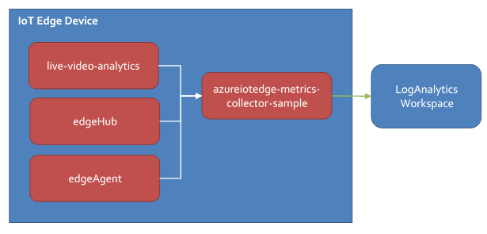
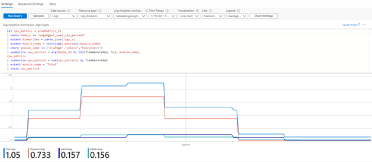

# Monitoring and logging in Live Video Analytics on IoT Edge

[!INCLUDE [redirect to Azure Video Analyzer](./includes/redirect-video-analyzer.md)]

In this article, you'll learn how to receive events for remote monitoring from the Live Video Analytics on IoT Edge module. 

You'll also learn how to control the logs that the module generates.

## Taxonomy of events

Live Video Analytics on IoT Edge emits events, or telemetry data, according to the following taxonomy:

> [!div class="mx-imgBorder"]
> :::image type="content" source="./media/telemetry-schema/taxonomy.png" alt-text="Diagram that shows the taxonomy of events.":::

* Operational: Events generated by the actions of a user or during the execution of a [media graph](media-graph-concept.md)
   
   * Volume: Expected to be low (a few times a minute, or even less)
   * Examples:

      - Recording started (shown in the following example)
      - Recording stopped
      
      ```
      {
        "body": {
          "outputType": "assetName",
          "outputLocation": "sampleAssetFromEVR-LVAEdge-20200512T233309Z"
        },
        "applicationProperties": {
          "topic": "/subscriptions/XXXXXXXX-XXXX-XXXX-XXXX-XXXXXXXXXXXX/resourceGroups/<my-resource-group>/providers/microsoft.media/mediaservices/<ams-account-name>",
          "subject": "/graphInstances/Sample-Graph-2/sinks/assetSink",
          "eventType": "Microsoft.Media.Graph.Operational.RecordingStarted",
          "eventTime": "2020-05-12T23:33:10.392Z",
          "dataVersion": "1.0"
        }
      }
      ```
* Diagnostics: Events that help to diagnose problems with performance

   * Volume: Can be high (several times a minute)
   * Examples:
   
      - RTSP [SDP](https://en.wikipedia.org/wiki/Session_Description_Protocol) information (shown in the following example) 
      - Gaps in the incoming video feed

      ```
      {
        "body": {
          "sdp": "SDP:\nv=0\r\no=- 1589326384077235 1 IN IP4 XXX.XX.XX.XXX\r\ns=Matroska video+audio+(optional)subtitles, streamed by the LIVE555 Media Server\r\ni=media/lots_015.mkv\r\nt=0 0\r\na=tool:LIVE555 Streaming Media v2020.04.12\r\na=type:broadcast\r\na=control:*\r\na=range:npt=0-73.000\r\na=x-qt-text-nam:Matroska video+audio+(optional)subtitles, streamed by the LIVE555 Media Server\r\na=x-qt-text-inf:media/lots_015.mkv\r\nm=video 0 RTP/AVP 96\r\nc=IN IP4 0.0.0.0\r\nb=AS:500\r\na=rtpmap:96 H264/90000\r\na=fmtp:96 packetization-mode=1;profile-level-id=640028;sprop-parameter-sets=XXXXXXXXXXXXXXXXXXXXXXXXXXXXXXXXXXX\r\na=control:track1\r\n"
        },
        "applicationProperties": {
          "topic": "/subscriptions/XXXXXXXX-XXXX-XXXX-XXXX-XXXXXXXXXXXX/resourceGroups/<my-resource-group>/providers/microsoft.media/mediaservices/<ams-account-name>",
          "subject": "/graphInstances/Sample-Graph-2/sources/rtspSource",
          "eventType": "Microsoft.Media.Graph.Diagnostics.MediaSessionEstablished",
          "eventTime": "2020-05-12T23:33:04.077Z",
          "dataVersion": "1.0"
        }
      }
      ```
* Analytics: Events generated as part of video analysis

   * Volume: Can be high (several times a minute or more)
   * Examples:
      
      - Motion detected (shown in the following example) 
      - Inference result

   ```      
   {
     "body": {
       "timestamp": 143039375044290,
       "inferences": [
         {
           "type": "motion",
           "motion": {
             "box": {
               "l": 0.48954,
               "t": 0.140741,
               "w": 0.075,
               "h": 0.058824
             }
           }
         }
       ]
     },
     "applicationProperties": {
       "topic": "/subscriptions/XXXXXXXX-XXXX-XXXX-XXXX-XXXXXXXXXXXX/resourceGroups/<my-resource-group>/providers/microsoft.media/mediaservices/<ams-account-name>",
       "subject": "/graphInstances/Sample-Graph-2/processors/md",
       "eventType": "Microsoft.Media.Graph.Analytics.Inference",
       "eventTime": "2020-05-12T23:33:09.381Z",
       "dataVersion": "1.0"
     }
   }
   ```

The events emitted by the module are sent to the [IoT Edge hub](../../iot-edge/iot-edge-runtime.md#iot-edge-hub). They can be routed from there to other destinations. 

### Timestamps in analytic events

As indicated previously, events generated as part of video analysis have timestamps associated with them. If you [recorded the live video](video-recording-concept.md) as part of your graph topology, these timestamps help you locate where in the recorded video the particular event occurred. Following are guidelines on how to map the timestamp in an analytic event to the timeline of the video recorded into an [Azure Media Services asset](terminology.md#asset).

First, extract the `eventTime` value. Use this value in a [time range filter](playback-recordings-how-to.md#time-range-filters) to retrieve a suitable portion of the recording. For example, you might want to retrieve video that starts 30 seconds before `eventTime` and ends 30 seconds after it. For the previous example, where `eventTime` is 2020-05-12T23:33:09.381Z, a request for an HLS manifest for the 30 seconds before and after `eventTime` would look like this request:

```
https://{hostname-here}/{locatorGUID}/content.ism/manifest(format=m3u8-aapl,startTime=2020-05-12T23:32:39Z,endTime=2020-05-12T23:33:39Z).m3u8
```

The preceding URL would return a [master playlist](https://developer.apple.com/documentation/http_live_streaming/example_playlists_for_http_live_streaming) that contains URLs for media playlists. The media playlist would contain entries like this one:

```
...
#EXTINF:3.103011,no-desc
Fragments(video=143039375031270,format=m3u8-aapl)
...
```
The preceding entry reports that a video fragment is available that starts at a `timestamp` value of `143039375031270`. The `timestamp` value in the analytic event uses the same timescale as the media playlist. It can be used to identify the relevant video fragment and seek to the correct frame.

For more information, see these [articles on frame-accurate seeking](https://www.bing.com/search?q=frame+accurate+seeking+in+HLS) in HLS.

## Controlling events

You can use the following module twin properties to control the operational and diagnostic events published by the Live Video Analytics on IoT Edge module. These properties are documented in the [module twin JSON schema](module-twin-configuration-schema.md).

- `diagnosticsEventsOutputName`: To get diagnostic events from the module, include this property and provide any value for it. Omit it or leave it empty to stop the module from publishing diagnostic events.
   
- `operationalEventsOutputName`: To get operational events from the module, include this property and provide any value for it. Omit it or leave it empty to stop the module from publishing operational events.
   
Analytics events are generated by nodes like the motion detection processor or the HTTP extension processor. The IoT hub sink is used to send them to the IoT Edge hub. 

You can control the [routing of all the preceding events](../../iot-edge/module-composition.md#declare-routes) by using the `desired` property of the `$edgeHub` module twin in the deployment manifest:

```
 "$edgeHub": {
   "properties.desired": {
     "schemaVersion": "1.0",
     "routes": {
       "moduleToHub": "FROM /messages/modules/lvaEdge/outputs/* INTO $upstream"
     },
     "storeAndForwardConfiguration": {
       "timeToLiveSecs": 7200
     }
   }
 }
```

In the preceding JSON, `lvaEdge` is the name of the Live Video Analytics on IoT Edge module. The routing rule follows the schema defined in [Declare routes](../../iot-edge/module-composition.md#declare-routes).

> [!NOTE]
> To ensure that analytics events reach the IoT Edge hub, you need to have an IoT hub sink node downstream of any motion detection processor node and/or any HTTP extension processor node.

## Event schema

Events originate on the edge device and can be consumed at the edge or in the cloud. Events generated by Live Video Analytics on IoT Edge conform to the [streaming messaging pattern](../../iot-hub/iot-hub-devguide-messages-construct.md) established by Azure IoT Hub. The pattern consists of system properties, application properties, and a body.

### Summary

Every event, when observed via IoT Hub, has a set of common properties:

|Property	|Property type|	Data type	|Description|
|---|---|---|---|
|`message-id`	|system	|guid|	Unique event ID.|
|`topic`|	applicationProperty	|string|	Azure Resource Manager path for the Azure Media Services account.|
|`subject`|	applicationProperty	|string|	Subpath of the entity emitting the event.|
|`eventTime`|	applicationProperty|	string|	Time the event was generated.|
|`eventType`|	applicationProperty	|string|	Event type identifier. (See the following section.)|
|`body`|body	|object|	Particular event data.|
|`dataVersion`	|applicationProperty|	string	|{Major}.{Minor}|

### Properties

#### message-id

A globally unique identifier (GUID) for the event.

#### topic

Represents the Azure Media Services account associated with the graph.

`/subscriptions/{subId}/resourceGroups/{rgName}/providers/Microsoft.Media/mediaServices/{accountName}`

#### subject

The entity that's emitting the event:

`/graphInstances/{graphInstanceName}`<br/>
`/graphInstances/{graphInstanceName}/sources/{sourceName}`<br/>
`/graphInstances/{graphInstanceName}/processors/{processorName}`<br/>
`/graphInstances/{graphInstanceName}/sinks/{sinkName}`

The `subject` property allows you to map generic events to the generating module. For example, for an invalid RTSP user name or password, the generated event would be `Microsoft.Media.Graph.Diagnostics.ProtocolError` on the `/graphInstances/myGraph/sources/myRtspSource` node.

#### Event types

Event types are assigned to a namespace according to this schema:

`Microsoft.Media.Graph.{EventClass}.{EventType}`

#### Event classes

|Class name|Description|
|---|---|
|Analytics	|Events generated as part of content analysis.|
|Diagnostics	|Events that help with the diagnostics of problems and performance.|
|Operational	|Events generated as part of resource operation.|

The event types are specific to each event class.

Examples:

* `Microsoft.Media.Graph.Analytics.Inference`
* `Microsoft.Media.Graph.Diagnostics.AuthorizationError`
* `Microsoft.Media.Graph.Operational.GraphInstanceStarted`

### Event time

Event time is formatted in an ISO 8601 string. It represents the time when the event occurred.

### Azure Monitor collection via Telegraf

These metrics will be reported from the Live Video Analytics on IoT Edge module:  

|Metric name|Type|Label|Description|
|-----------|----|-----|-----------|
|lva_active_graph_instances|Gauge|iothub, edge_device, module_name, graph_topology|Total number of active graphs per topology.|
|lva_received_bytes_total|Counter|iothub, edge_device, module_name, graph_topology, graph_instance, graph_node|Total number of bytes received by a node. Supported only for RTSP sources.|
|lva_data_dropped_total|Counter|iothub, edge_device, module_name, graph_topology, graph_instance, graph_node, data_kind|Counter of any dropped data (events, media, and so on).|

> [!NOTE]
> A [Prometheus endpoint](https://prometheus.io/docs/practices/naming/) is exposed at port 9600 of the container. If you name your Live Video Analytics on IoT Edge module "lvaEdge," they will be able to access metrics by sending a GET request to http://lvaEdge:9600/metrics.   

Follow these steps to enable the collection of metrics from the Live Video Analytics on IoT Edge module:

1. Create a folder on your development computer, and go to that folder.

1. In the folder, create a `telegraf.toml` file that contains the following configurations:
    ```
    [agent]
        interval = "30s"
        omit_hostname = true

    [[inputs.prometheus]]
      metric_version = 2
      urls = ["http://edgeHub:9600/metrics", "http://edgeAgent:9600/metrics", "http://{LVA_EDGE_MODULE_NAME}:9600/metrics"]

    [[outputs.azure_monitor]]
      namespace_prefix = "lvaEdge"
      region = "westus"
      resource_id = "/subscriptions/{SUBSCRIPTON_ID}/resourceGroups/{RESOURCE_GROUP}/providers/Microsoft.Devices/IotHubs/{IOT_HUB_NAME}"
    ```
    > [!IMPORTANT]
    > Be sure to replace the variables in the .toml file. The variables are denoted by braces (`{}`).

1. In the same folder, create a Dockerfile that contains the following commands:
    ```
        FROM telegraf:1.15.3-alpine
        COPY telegraf.toml /etc/telegraf/telegraf.conf
    ```

1. Use Docker CLI commands to build the Docker file and publish the image to your Azure container registry.
    
   For more information about using the Docker CLI to push to a container registry, see [Push and pull Docker images](../../container-registry/container-registry-get-started-docker-cli.md). For other information about Azure Container Registry, see the [documentation](../../container-registry/index.yml).


1. After the push to Azure Container Registry is complete, add the following node to your deployment manifest file:
    ```
    "telegraf": 
    {
      "settings": 
        {
            "image": "{AZURE_CONTAINER_REGISTRY_LINK_TO_YOUR_TELEGRAF_IMAGE}"
        },
      "type": "docker",
      "version": "1.0",
      "status": "running",
      "restartPolicy": "always",
      "env": 
        {
            "AZURE_TENANT_ID": { "value": "{YOUR_TENANT_ID}" },
            "AZURE_CLIENT_ID": { "value": "{YOUR CLIENT_ID}" },
            "AZURE_CLIENT_SECRET": { "value": "{YOUR_CLIENT_SECRET}" }
        }
    ``` 
    > [!IMPORTANT]
    > Be sure to replace the variables in the manifest file. The variables are denoted by braces (`{}`).


   Azure Monitor can be [authenticated via service principal](https://github.com/influxdata/telegraf/blob/master/plugins/outputs/azure_monitor/README.md#azure-authentication).
        
   The Azure Monitor Telegraf plug-in exposes [several methods of authentication](https://github.com/influxdata/telegraf/blob/master/plugins/outputs/azure_monitor/README.md#azure-authentication). 

  1. To use service principal authentication, set these environment variables:  
     `AZURE_TENANT_ID`: Specifies the tenant to authenticate to.  
     `AZURE_CLIENT_ID`: Specifies the app client ID to use.  
     `AZURE_CLIENT_SECRET`: Specifies the app secret to use.  
     
     >[!TIP]
     > You can give the service principal the **Monitoring Metrics Publisher** role. Follow the steps in **[Create service principal](../../azure-arc/data/upload-metrics-and-logs-to-azure-monitor.md?pivots=client-operating-system-macos-and-linux#create-service-principal)** to create the service principal and assign the role .

1. After the modules are deployed, metrics will appear in Azure Monitor under a single namespace. Metric names will match the ones emitted by Prometheus. 

   In this case, in the Azure portal, go to the IoT hub and select **Metrics** in the left pane. You should see the metrics there.

### Log Analytics metrics collection
Using [Prometheus endpoint](https://prometheus.io/docs/practices/naming/) along with [Log Analytics](../../azure-monitor/logs/log-analytics-tutorial.md), you can generate and [monitor metrics](../../azure-monitor/essentials/metrics-supported.md) such as used CPUPercent, MemoryUsedPercent, etc.   

> [!NOTE]
> The configuration below does not collect logs, **only metrics**. It is feasible to extend the collector module to also collect and upload logs.

[ ](./media/telemetry-schema/log-analytics.png#lightbox)

1. Learn how to [collect metrics](https://github.com/Azure/iotedge/tree/master/edge-modules/MetricsCollector)
1. Use Docker CLI commands to build the [Docker file](https://github.com/Azure/iotedge/tree/master/edge-modules/MetricsCollector/docker/linux) and publish the image to your Azure container registry.
    
   For more information about using the Docker CLI to push to a container registry, see [Push and pull Docker images](../../container-registry/container-registry-get-started-docker-cli.md). For other information about Azure Container Registry, see the [documentation](../../container-registry/index.yml).

1. After the push to Azure Container Registry is complete, the following is inserted into the deployment manifest:
    ```json
    "azmAgent": {
      "settings": {
        "image": "{AZURE_CONTAINER_REGISTRY_LINK_TO_YOUR_METRICS_COLLECTOR}"
      },
      "type": "docker",
      "version": "1.0",
      "status": "running",
      "restartPolicy": "always",
      "env": {
        "LogAnalyticsWorkspaceId": { "value": "{YOUR_LOG_ANALYTICS_WORKSPACE_ID}" },
        "LogAnalyticsSharedKey": { "value": "{YOUR_LOG_ANALYTICS_WORKSPACE_SECRET}" },
        "LogAnalyticsLogType": { "value": "IoTEdgeMetrics" },
        "MetricsEndpointsCSV": { "value": "http://edgeHub:9600/metrics,http://edgeAgent:9600/metrics,http://lvaEdge:9600/metrics" },
        "ScrapeFrequencyInSecs": { "value": "30 " },
        "UploadTarget": { "value": "AzureLogAnalytics" }
      }
    }
    ```
    > [!NOTE]
    > The modules `edgeHub`, `edgeAgent` and `lvaEdge` are the names of the modules defined in the deployment manifest file. Please make sure that the names of the modules match.   

    You can get your `LogAnalyticsWorkspaceId` and `LogAnalyticsSharedKey` values by following these steps:
    1. Go to the Azure portal
    1. Look for your Log Analytics workspaces
    1. Once you find your Log Analytics workspace, navigate to the `Agents management` option in the left navigation pane.
    1. You will find the Workspace ID and the Secret Keys that you can use.

1. Next, create a workbook by clicking on the `Workbooks` tab in the left navigation pane.
1. Using Kusto query language, you can write queries as below and get CPU percentage used by the IoT Edge modules.
    ```kusto
    let cpu_metrics = IoTEdgeMetrics_CL
    | where Name_s == "edgeAgent_used_cpu_percent"
    | extend dimensions = parse_json(Tags_s)
    | extend module_name = tostring(dimensions.module_name)
    | where module_name in ("lvaEdge","yolov3","tinyyolov3")
    | summarize cpu_percent = avg(Value_d) by bin(TimeGenerated, 5s), module_name;
    cpu_metrics
    | summarize cpu_percent = sum(cpu_percent) by TimeGenerated
    | extend module_name = "Total"
    | union cpu_metrics
    ```

    [ ](./media/telemetry-schema/metrics.png#lightbox)
## Logging

As with other IoT Edge modules, you can also [examine the container logs](../../iot-edge/troubleshoot.md#check-container-logs-for-issues) on the edge device. You can configure the information that's written to the logs by using the [following module twin](module-twin-configuration-schema.md) properties:

* `logLevel`

   * Allowed values are `Verbose`, `Information`, `Warning`, `Error`, and `None`.
   * The default value is `Information`. The logs will contain error, warning, and information messages.
   * If you set the value to `Warning`, the logs will contain error and warning messages.
   * If you set the value to `Error`, the logs will contain only error messages.
   * If you set the value to `None`, no logs will be generated. (We don't recommend this configuration.)
   * Use `Verbose` only if you need to share logs with Azure support to diagnose a problem.

* `logCategories`

   * A comma-separated list of one or more of these values: `Application`, `Events`, `MediaPipeline`.
   * The default value is `Application, Events`.
   * `Application`: High-level information from the module, like module startup messages, environment errors, and direct method calls.
   * `Events`: All the events that were described earlier in this article.
   * `MediaPipeline`: Low-level logs that might offer insight when you're troubleshooting problems, like difficulties establishing a connection with an RTSP-capable camera.
   
### Generating debug logs

In certain cases, to help Azure support resolve a problem, you might need to generate more detailed logs than the ones described previously. To generate these logs:

1. [Link the module storage to the device storage](../../iot-edge/how-to-access-host-storage-from-module.md#link-module-storage-to-device-storage) via `createOptions`. If you look at a [deployment manifest template](https://github.com/Azure-Samples/live-video-analytics-iot-edge-csharp/blob/master/src/edge/deployment.template.json) from the quickstarts, you'll see this code:

   ```
   "createOptions": {
     …
     "Binds": [
       "/var/local/mediaservices/:/var/lib/azuremediaservices/"
     ]
    }
   ```

   This code lets the Edge module write logs to the device storage path `/var/local/mediaservices/`. 

 1. Add the following `desired` property to the module:

    `"debugLogsDirectory": "/var/lib/azuremediaservices/debuglogs/",`

The module will now write debug logs in a binary format to the device storage path `/var/local/mediaservices/debuglogs/`. You can share these logs with Azure support.

## FAQ

If you have questions, see the [monitoring and metrics FAQ](./faq.yml#monitoring-and-metrics).

## Next steps

[Continuous video recording](continuous-video-recording-tutorial.md)