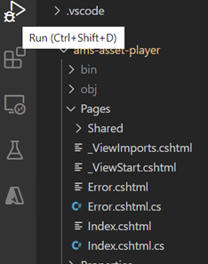
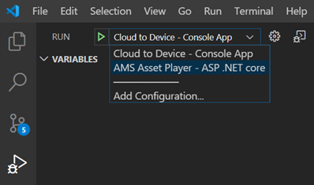
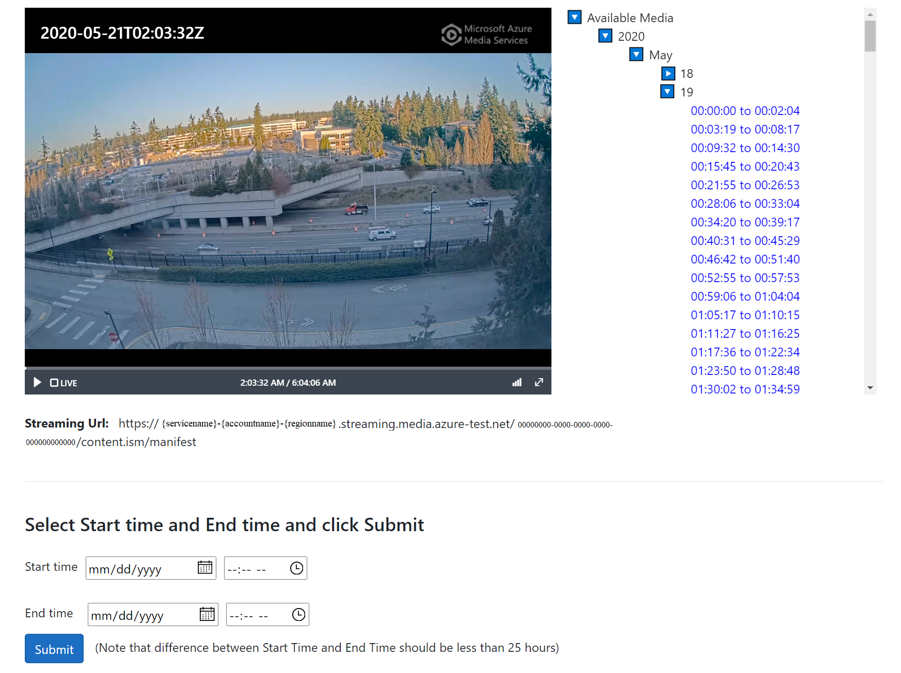
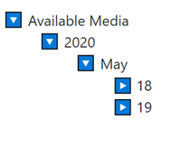
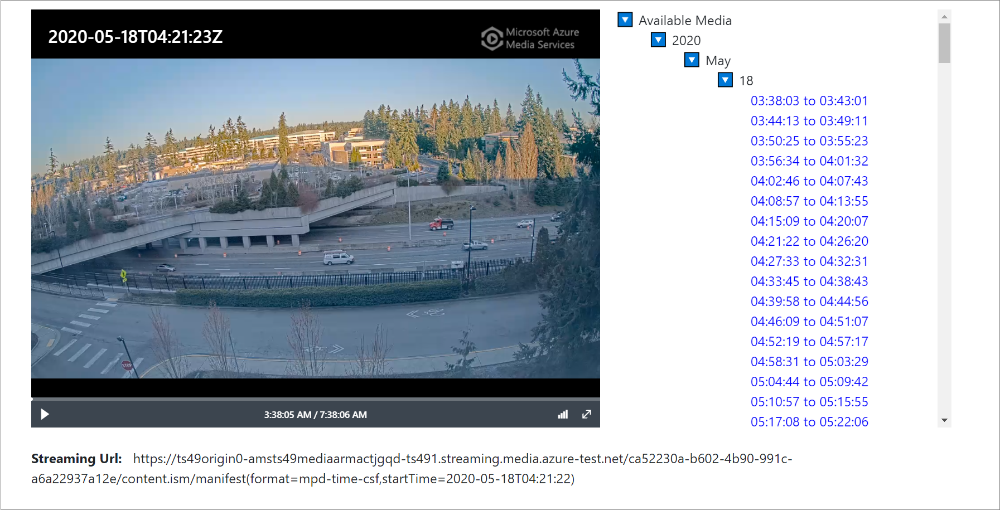

# Tutorial: Playback of multi-day recordings  

This tutorial builds up on the [continuous video recording](continuous-video-recording-concept.md) (CVR) tutorial. In this tutorial, you will learn how to use Azure Media Service APIs to playback a multi-day continuous video recording from the cloud. 

This is useful for scenarios such as public safety, where there is a need to maintain a recording of the footage from a camera for multiple days (or weeks), and there is an occasional need to watch specific portions of that footage.

The tutorial shows you how to:

> [!div class="checklist"]
> * Run the sample app that demonstrates how you can browse the contents of a multi-day recording
> * View selected portions of that recording

## Suggested pre-reading  

It is recommended that you read through the following documentation pages:

* [Live Video Analytics on IoT Edge overview](overview.md)
* [Live Video Analytics on IoT Edge terminology](terminology.md)
* [Media graph concept](media-graph-concept.md)
* [Continuous video recording](continuous-video-recording-concept.md) 
* [How-to-Guide: Playback of recordings](playback-recordings-how-to.md)
* [Tutorial: Continuous video recording](continuous-video-recording-tutorial.md)

## Prerequisites

* Complete the [CVR tutorial](continuous-video-recording-tutorial.md). While this tutorial and the relevant APIs discussed in [Tutorial: Continuous video recording](continuous-video-recording-tutorial.md) apply to recordings that are 5 minutes or longer, it is recommended that you record 5 hours worth of video, if not more. The APIs used to browse recordings are best demonstrated with long recordings.
* We recommend that you run this tutorial while the [Tutorial: Continuous video recording](continuous-video-recording-tutorial.md) is still running – that is, you are still recording video to the cloud.

## Run the sample 

As part of the [CVR tutorial](continuous-video-recording-tutorial.md), you would have created a Media Service account. For this tutorial, you will need to have complete API access to that account. You can use the steps in [Get credentials to access Media Services API](../latest/access-api-howto.md#use-the-azure-portal) to create a service principal. You should be able to get a JSON block from the Azure portal that looks like this:

```
{
    "AadClientId": "<<INSERT_AZURE_AD_APP_ID_HERE>>",
    "AadSecret": "<<INSERT_AZURE_AD_APP_SECRET_HERE>>",
    "AadTenantDomain": "<<YOUR_TENANT_DOMAIN>>",
    "AadTenantId": "<<YOUR_TENANT_ID>>",
    "AccountName": "<<YOUR_ACCOUNT_NAME>>",
    "Location": "<<YOUR_REGION_NAME>>",
    "ResourceGroup": "<<YOUR_RESOURCE_GROUP>>",
    "SubscriptionId": "<<YOUR_SUBSCRIPTION_ID>>",
    "ArmAadAudience": "https://management.core.windows.net",
    "ArmEndpoint": "https://management.azure.com"
}
```

Next, in Visual Studio code, open src/ams-asset-player. This folder contains the necessary files for this tutorial. Open the appsettings.json file, and copy its contents into a new file, appsettings.development.json. Make the following edits to the latter file:

```
  "AMS" : {
    "subscriptionId" : "Use value of SubscriptionId above",
    "resourceGroup" : "Use value of ResourceGroup above",
    "accountId" : "Use value of AccountName above",
    "aadTenantId" : "Use value of AadTenantId above",
    "aadClientId" : "Use value of AadClientId above",
    "aadSecret" : "Use value of AadSecret above"
} 
```

In Visual Studio Code, you can click the Run icon on the left (or Ctrl+Shift+D) to bring up the available applications to run:


 
Select the AMS Asset Player application from the drop down box, as shown below, and hit F5 to start debugging.



The sample application will build and launch your default browser app, and open up the AMS Asset Player page.

> [!NOTE]
> Depending on the security settings on your browser, you may see a warning message. Since the web page is running locally, you can choose to ignore the warning.

The AMS Asset Player prompts you to enter the name of a Media Service asset. You should use the name of the Asset that you used for recording video in [Tutorial: Continuous video recording](continuous-video-recording-tutorial.md).

Upon typing the asset name and hitting submit, the player code will load the streaming URL. For more information, see [How-to-Guide: Playback of recordings](playback-recordings-how-to.md). If, as recommended, you are still recording to the asset, the player will detect that, and attempt to cue the playback to the most recent part of the recorded video. You can see the timestamp (in UTC) at the top left of the player. In the screenshot below, note how the “Live” button is selected.


 
On the right side of the player, you can see the controls to browse the archive. The years, months, and dates in this control are populated using the availableMedia API documented in [How-to-Guide: Playback of recordings](playback-recordings-how-to.md).
When you expand the day, if you have let the CVR Tutorial run for several hours, you will see a result like this:



The source for the video feed in the tutorial is an MKV file. When the RSTP simulator (see [Live555 Media Server](https://github.com/Azure/live-video-analytics/tree/master/utilities/rtspsim-live555)) reaches the end of the file, it ends the stream. The RTSP source node in the media graph detects this and re-establishes the connection, and the video resumes. In between each such end of file and reconnect, there is a gap in the recorded archive, which shows up as a new entry in availableMedia results.


 
When you click on any one entry in the list, the application creates a streaming URL with the appropriate filter, such as https://{hostname}/{locatorId}/content.ism/manifest(format=mpd-time-csf,startTime=YYYY-MM-DDTHH:MM:SS). The player will load this URL and playback will commence at the desired startTime.

Alternatively, you can use specific start and end times, via the controls at the bottom of the page. You can use the results of the availableMedia call, as listed on the right-hand side, as a guide to the allowed values of start and end times. The detailed constraints on the startTime and endTime filters are documented in [How-to-Guide: Playback of recordings](playback-recordings-how-to.md). After selecting the time values, upon clicking on Submit, the application will load the player with a streaming URL like:
https://{hostname}/{locatorId}/content.ism/manifest(format=mpd-time-csf,startTime=YYYY-MM-DDTHH:MM:SS,endTime= YYYY-MM-DDTHH:MM:SS)
Playback will commence at the desired startTime.

## Next steps

[Event-based video recording to cloud and playback from cloud](event-based-video-recording-tutorial.md)
