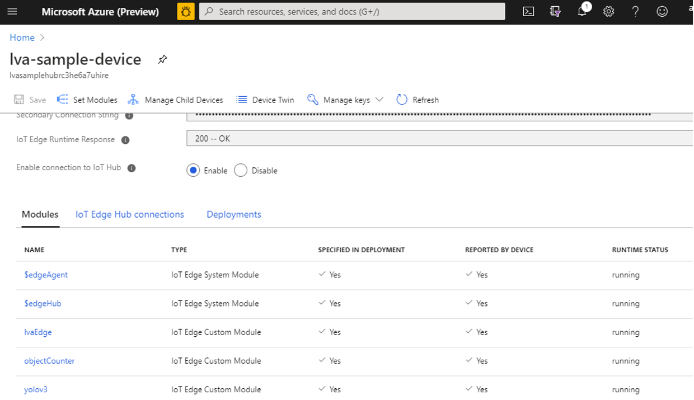
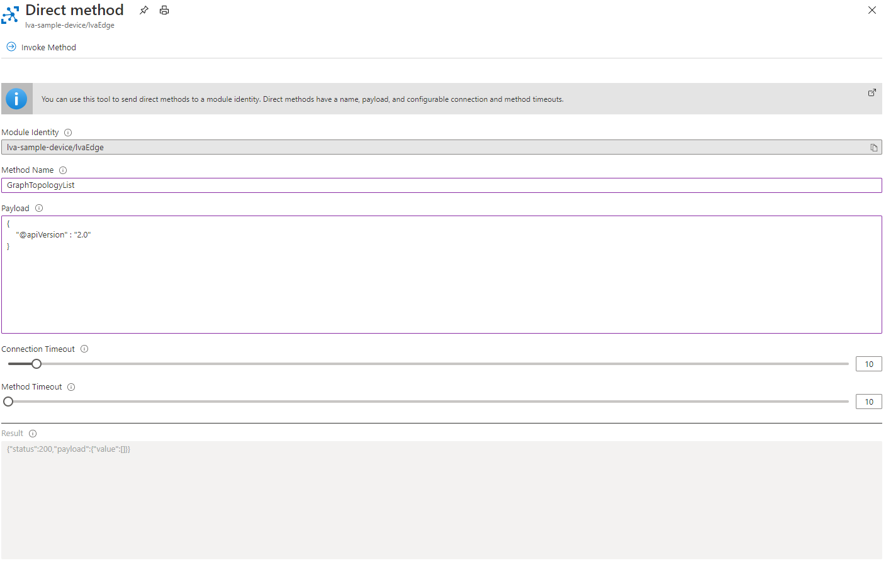
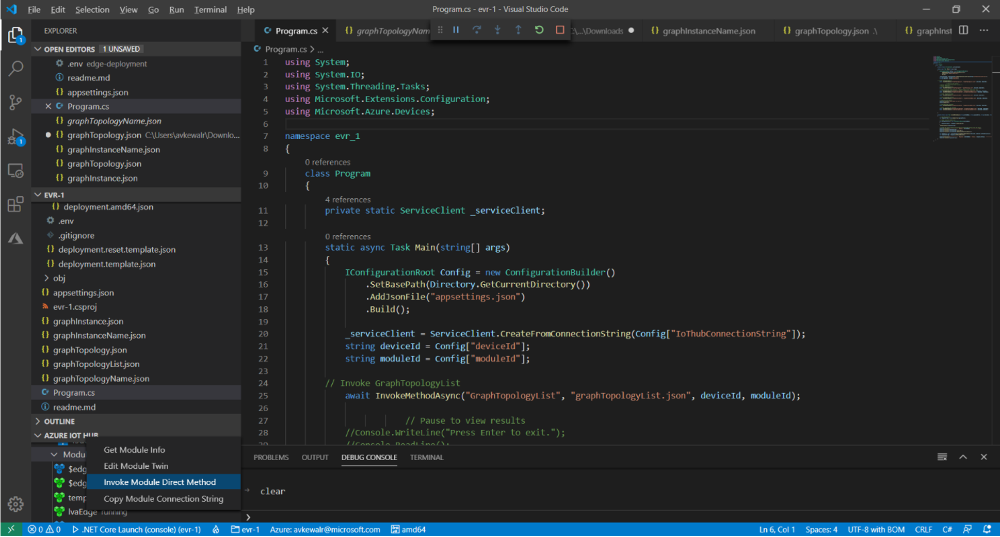
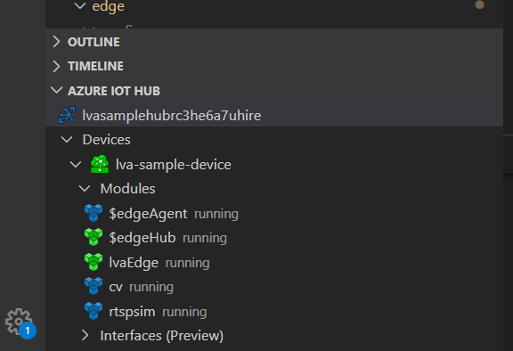

# Troubleshoot Live Video Analytics on IoT Edge

This article covers troubleshooting steps for Live Video Analytics on IoT Edge.

## Troubleshoot deployment issues

### Diagnostics

As part of deploying Live Video Analytics, you will set up Azure resources such as the IoT Hub and the IoT Edge device. As a first step to diagnosing problems always ensures that the edge is properly set up by following these instructions:

1. [Run the 'check' command](https://docs.microsoft.com/azure/iot-edge/troubleshoot#run-the-check-command)
1. [Check your IoT Edge version](https://docs.microsoft.com/azure/iot-edge/troubleshoot#check-your-iot-edge-version)
1. [Check the status of the IoT Edge security manager and its logs](https://docs.microsoft.com/azure/iot-edge/troubleshoot#check-the-status-of-the-iot-edge-security-manager-and-its-logs)
1. [View the messages going through the IoT Edge hub](https://docs.microsoft.com/azure/iot-edge/troubleshoot#view-the-messages-going-through-the-iot-edge-hub)
1. [Restart containers](https://docs.microsoft.com/azure/iot-edge/troubleshoot#restart-containers)
1. [Check your firewall and port configuration rules](https://docs.microsoft.com/azure/iot-edge/troubleshoot#check-your-firewall-and-port-configuration-rules)

### Pre-deployment issues

If the edge infrastructure is fine, then you can look for issues with deployment manifest file. In order to deploy Live Video Analytics on IoT Edge module on the edge device alongside any other IoT modules, you will use a deployment manifest that contains the edge Hub, edge Agent, and other modules with their properties. If the JSON is not well formed, you can get an error as below: 

```
az iot edge set-modules --hub-name <iot-hub-name> --device-id lva-sample-device --content <path-to-deployment_manifest.json>
```

Failed to parse json from file: '<deployment manifest.json>' for argument 'content' with exception: "Extra data: line 101 column 1 (char 5325)"

If you encounter this error, it is recommended to check the JSON file for missing brackets or other issues with the structure of the file. You can use a client such as [Notepad++ with JSON Viewer plugin](https://riptutorial.com/notepadplusplus/example/18201/json-viewer) or an online tool such as https://jsonformatter.curiousconcept.com/ to validate the file structure.

### Deployment – diagnose with media graph direct methods 

Once the Live Video Analytics on IoT Edge module is deployed correctly on the edge device, you can create and run the media graph by invoking [direct methods](direct-methods.md). You can use the portal to run the diagnosis of media graph via direct methods:

1. Via Portal, go to the IoT Hub that is connected to your edge device.
    1. Once in the IoT Hub blade, look for the Automatic device management->IoT Edge.
    1. Clicking on IoT Edge should bring up a list of edge devices. Pick the device you want to diagnose.
         
        
    1. Check if the Response code is 200-OK. There are various other response codes for the [IoT Edge Runtime](https://docs.microsoft.com/azure/iot-edge/iot-edge-runtime) such as:
        1. 400 - The deployment configuration is malformed or invalid.
        1. 417 - The device doesn't have a deployment configuration set.
        1. 412 - The schema version in the deployment configuration is invalid.
        1. 406 - The IoT Edge device is offline or not sending status reports.
        1. 500 - An error occurred in the IoT Edge runtime.
    1. Clicking on the device should also show you the list of expected IoT Edge modules that have been deployed and their status
    1. If the “specified in deployment” and “reported by device” columns indicate “Yes” then you can invoke Direct methods on the Live Video Analytics on IoT Edge module. Click on the module and it will take you to a screen where you can check the desired and reported properties and can invoke direct methods. 
        1. Checking on reported and desired properties helps you understand if the module properties have synched with the deployment. If they have not, you can restart your edge 
        1. Use the [direct methods](direct-methods.md) guide to call a few methods, especially simple ones like GraphTopologyList. The guide also specifies expected request and response payloads and error codes. Once the simple Direct methods are successful, you can be ensured that the Live Video Analytics edge module is functionally ok.
        
         
1. If you get a status 501 code, please check if the Direct method name is accurate. If the method name and request payload are accurate, you should get results back along with success code =200. If the request payload is inaccurate, you will get a status =400 and a response payload that indicates error code and message that should help with diagnosing the issue with your direct method call. 

### Post deployment – diagnose logs for issues during run 

The container logs for our edge module should have diagnostic<!--<todo:add link to diagnostics doc>--> information that should help debug your issues during module runtime. You can [check container logs for issues](https://docs.microsoft.com/azure/iot-edge/troubleshoot#check-container-logs-for-issues) and self-diagnose, however, if all the above checks have been performed and you are still facing issues, then gather logs from the IoT Edge device [with the 'support bundle' command](https://docs.microsoft.com/azure/iot-edge/troubleshoot#gather-debug-information-with-support-bundle-command) that can be analyzed further by the Azure team. You can [reach out](https://ms.portal.azure.com/#blade/Microsoft_Azure_Support/HelpAndSupportBlade/newsupportrequest) to us for support and submit the collected logs.

## Common error resolutions

Live Video Analytics is deployed as an IoT Edge module on the edge device and it works collaboratively with the IoT Edge agent and hub modules. Some of the common errors that you will face with the Live Video Analytics deployment will be due to the issues with the underlying IoT infrastructure. Some common errors that IoT Edge agent and hub can have are:

1. [IoT Edge agent stops after about a minute](https://docs.microsoft.com/azure/iot-edge/troubleshoot-common-errors#iot-edge-agent-stops-after-about-a-minute).
1. [IoT Edge agent can't access a module's image (403)](https://docs.microsoft.com/azure/iot-edge/troubleshoot-common-errors#iot-edge-agent-cant-access-a-modules-image-403).
1. [Edge Agent module reports 'empty config file' and no modules start on the device](https://docs.microsoft.com/azure/iot-edge/troubleshoot-common-errors#edge-agent-module-reports-empty-config-file-and-no-modules-start-on-the-device).
1. [IoT Edge hub fails to start](https://docs.microsoft.com/azure/iot-edge/troubleshoot-common-errors#iot-edge-hub-fails-to-start).
1. [IoT Edge security daemon fails with an invalid hostname](https://docs.microsoft.com/azure/iot-edge/troubleshoot-common-errors#iot-edge-security-daemon-fails-with-an-invalid-hostname).
1. [Live Video Analytics or any other custom IoT Edge module fails to send a message to edge Hub with 404 error](https://docs.microsoft.com/azure/iot-edge/troubleshoot-common-errors#iot-edge-module-fails-to-send-a-message-to-edgehub-with-404-error).
1. [IoT Edge module deploys successfully then disappears from device](https://docs.microsoft.com/azure/iot-edge/troubleshoot-common-errors#iot-edge-module-deploys-successfully-then-disappears-from-device).

### Edge set up script issues

As part of the our documentation, we have provided a [set up script](https://github.com/Azure/live-video-analytics/tree/master/edge/setup) to deploy Edge and Cloud resources to get started with Live Video Analytics Edge. In this section, we have captured errors you might face with the script and how to debug them.

Script runs partly creating few resources but fails with the following message:

```
registering device...

Unable to load extension 'eventgrid: unrecognized kwargs: ['min_profile']'. Use --debug for more information.
The command failed with an unexpected error. Here is the traceback:

No module named 'azure.mgmt.iothub.iot_hub_client'
Traceback (most recent call last):
File "/opt/az/lib/python3.6/site-packages/knack/cli.py", line 215, in invoke
  cmd_result = self.invocation.execute(args)
File "/opt/az/lib/python3.6/site-packages/azure/cli/core/commands/__init__.py", line 631, in execute
  raise ex
File "/opt/az/lib/python3.6/site-packages/azure/cli/core/commands/__init__.py", line 695, in _run_jobs_serially
  results.append(self._run_job(expanded_arg, cmd_copy))
File "/opt/az/lib/python3.6/site-packages/azure/cli/core/commands/__init__.py", line 688, in _run_job
  six.reraise(*sys.exc_info())
File "/opt/az/lib/python3.6/site-packages/six.py", line 693, in reraise
  raise value
File "/opt/az/lib/python3.6/site-packages/azure/cli/core/commands/__init__.py", line 665, in _run_job
  result = cmd_copy(params)
File "/opt/az/lib/python3.6/site-packages/azure/cli/core/commands/__init__.py", line 324, in __call__
  return self.handler(*args, **kwargs)
File "/opt/az/lib/python3.6/site-packages/azure/cli/core/__init__.py", line 574, in default_command_handler
  return op(**command_args)
File "/home/.azure/cliextensions/azure-cli-iot-ext/azext_iot/operations/hub.py", line 75, in iot_device_list
  result = iot_query(cmd, query, hub_name, top, resource_group_name, login=login)
File "/home/.azure/cliextensions/azure-cli-iot-ext/azext_iot/operations/hub.py", line 45, in iot_query
  target = get_iot_hub_connection_string(cmd, hub_name, resource_group_name, login=login)
File "/home/.azure/cliextensions/azure-cli-iot-ext/azext_iot/common/_azure.py", line 112, in get_iot_hub_connection_string
  client = iot_hub_service_factory(cmd.cli_ctx)
File "/home/.azure/cliextensions/azure-cli-iot-ext/azext_iot/_factory.py", line 28, in iot_hub_service_factory
  from azure.mgmt.iothub.iot_hub_client import IotHubClient
ModuleNotFoundError: No module named 'azure.mgmt.iothub.iot_hub_client'
```
    
To fix this issue:

1. Run the following command:

    ```
    az --version
    ```
1. Ensure you have the following extensions installed. As of the writing of this guide, the version for extensions were as follows:

    |||
    |---|---|
    |azure-cli   |      2.5.1*|
    |command-modules-nspkg         |   2.0.3|
    |core  |  	2.5.1*|
    |nspkg    |	3.0.4|
    |telemetry|	1.0.4|
    |Extensions:	||
    |storage-preview          |     0.2.10|
    |azure-cli-iot-ext          |    0.8.9|
    |eventgrid|	0.4.9|
    |azure-iot                       | 0.9.2|
1. If any of the extensions are older than the above release numbers, update the extension to the latest version using the command:

    ```
    az extension update --name <Extension name>
    ```

    For example, `az extension update --name azure-iot`

### Sample app issues

As part of our release, we have provided some .NET sample code to get our developer community bootstrapped. In this section, we have captured errors you might face while running the sample code and how to debug such errors.

1. Program.cs fails with the following error on the direct method invocation:

    ```
    Unhandled exception. Microsoft.Azure.Devices.Common.Exceptions.UnauthorizedException: {"Message":"{\"errorCode\":401002,\"trackingId\":\"b1da85801b2e4faf951a2291a2c467c3-G:32-TimeStamp:04/06/2020 17:15:11\",\"message\":\"Unauthorized\",\"timestampUtc\":\"2020-04-06T17:15:11.6990676Z\"}","ExceptionMessage":""}
    
        at Microsoft.Azure.Devices.HttpClientHelper.ExecuteAsync(HttpClient httpClient, HttpMethod httpMethod, Uri requestUri, Func`3 modifyRequestMessageAsync, Func`2 isMappedToException, Func`3 processResponseMessageAsync, IDictionary`2 errorMappingOverrides, CancellationToken cancellationToken)
    
        at Microsoft.Azure.Devices.HttpClientHelper.ExecuteAsync(HttpMethod httpMethod, Uri requestUri, Func`3 modifyRequestMessageAsync, Func`3 processResponseMessageAsync, IDictionary`2 errorMappingOverrides, CancellationToken cancellationToken)
        
        at Microsoft.Azure.Devices.HttpClientHelper.PostAsync[T,T2](Uri requestUri, T entity, TimeSpan operationTimeout, IDictionary`2 errorMappingOverrides, IDictionary`2 customHeaders, CancellationToken cancellationToken)…
    ```

    1. Ensure you have the [Azure IoT tools](https://marketplace.visualstudio.com/items?itemName=vsciot-vscode.azure-iot-tools) installed in your VS code environment, and the connection to your IoT Hub setup. (Ctrl+shift+P and then pick Select IoT Hub method to connect to your subscription and IoT Hub)
1. Check if you can invoke a direct method on the edge module via VS Code (for example, call GraphToplogyList with the following payload { "@apiVersion": "1.0"}) and you should get the following response back. 

    ```
    {
      "status": 200,
      "payload": {
        "values": [
          {…
    …}
          ]
        }
    }
    ```

    
1. If the above fails, try the following:
    1. Go to the command prompt on your edge device and type.
    
    ```
    sudo systemctl restart iotedge
    ```

    This will restart the edge device and all the modules. Wait a few minutes and run the following to confirm that modules are running, before trying to use the DirectMethod again.

    ```
    sudo iotedge list
    ```
    1. If above also fails, try rebooting your VM or machine.
    1. If all fails, please run the following to obtain a ZIP file with all [relevant logs](https://docs.microsoft.com/azure/iot-edge/troubleshoot#gather-debug-information-with-support-bundle-command) to be attached to that [support ticket](https://ms.portal.azure.com/#blade/Microsoft_Azure_Support/HelpAndSupportBlade/newsupportrequest).

    ```
    sudo iotedge support-bundle --since 2h
    ```
1. If you get an error response 400 code then ensure that your method invocation payload is well formed as per the [direct method](direct-methods.md) guide.
1. If  you get the status 200 code, it indicates that your hub is functioning well and your module deployment is correct and responsive. The next step is to check if the app configurations are accurate. Your app configuration consists of following fields in the appsettings.json file. Please double check that deviceId and moduleId are accurate. An easy way to check this is via Azure IoT Hub extension section in the VSCode. The values in appsettings.json file and the IoT Hub section should match.
    
    ```
    {
        "IoThubConnectionString" : 
        "deviceId" : 
        "moduleId" : 
    }
    ```

    

1. Finally ensure that within appsettings.json you have provided IoT Hub Connection String and not the IoT Hub Device Connection String, as their [formats](https://devblogs.microsoft.com/iotdev/understand-different-connection-strings-in-azure-iot-hub/) are different.

### Live Video Analytics working with external modules

Live Video Analytics via the HTTP extension processor can extend the media graph to send and receive data from other IoT Edge modules over HTTP using REST.  As a [specific example](https://github.com/Azure/live-video-analytics/tree/master/MediaGraph/topologies/httpExtension) the media graph can send video frames as images to an external inference module like Yolo V3 and receive JSON based analytics results back. In such a topology the end destination for the events is mostly the IoT Hub. In situations where you do not see the Inference events on the Hub, please check for the following:

1. Check if the Hub that media graph is publishing to vs. the one you are examining are the same. Sometimes as you create multiple deployments, you will end up with multiple hubs and can be mistakenly checking the wrong hub for events.
1. Check via VSCode if the external module is deployed and running. In the example image here, rtspsim and cv are IoT Edge modules running external to lvaEdge module.

    
1. Check if you are sending events to the correct URL endpoint. The external AI container exposes a URL and a port over which it receives and returns the data from POST requests. This URL is specified as an endpoint: url property for the Http Extension processor. As seen in the [topology url](https://github.com/Azure/live-video-analytics/blob/master/MediaGraph/topologies/httpExtension/topology.json) is set to the inferencing url parameter. Ensure the default value for the parameter(http://yolov3/score) or the passed in value is accurate and you can test if it is working using curl.  
    1. As an example, yolo v3 container running on local machine and the IP address for the container is 172.17.0.3 (use docker inspect to find IP address).

    ```
    curl -X POST http://172.17.0.3/score -H "Content-Type: image/jpeg" --data-binary @<fullpath to jpg>
    ```

    Result returned:

    ```
    {"inferences": [{"type": "entity", "entity": {"tag": {"value": "car", "confidence": 0.8668569922447205}, "box": {"l": 0.3853073438008626, "t": 0.6063712999658677, "w": 0.04174524943033854, "h": 0.02989496027381675}}}]}
    ```

1. If you are running one or multiple instances of a graph leveraging the Http Extension processor, you should have a Frame Rate Filter before each Http Extension Processor to manage the frames per second (fps) of the video feed. In certain situations where the CPU/memory of the edge machine are highly utilized, you can lose certain Inference events. To address this, set a low value for the maximumFps property on the Frame Rate Filter. You can set it to 0.5 ("maximumFps": 0.5 )on each instance of the graph and rerun to check for Inference events on the Hub.
    1. Alternatively, you can also get a more powerful edge machine with higher CPU and memory.
    
### Multiple direct methods in parallel – timeout failure 

Live Video Analytics on IoT Edge provides a direct method based programming model that allows for set up of multiple topologies and multiple graph instances. As part of the topology and graph setup, you will be invoking multiple direct method calls on the edge module. If you invoke these multiple method calls, especially the ones starting and stopping the graphs, in parallel, you may experience some timeout failures such as below. 

Assembly Initialization method Microsoft.Media.LiveVideoAnalytics.Test.Feature.Edge.AssemblyInitializer.InitializeAssemblyAsync threw exception. Microsoft.Azure.Devices.Common.Exceptions.IotHubException: Microsoft.Azure.Devices.Common.Exceptions.IotHubException:<br/> `{"Message":"{\"errorCode\":504101,\"trackingId\":\"55b1d7845498428593c2738d94442607-G:32-TimeStamp:05/15/2020 20:43:10-G:10-TimeStamp:05/15/2020 20:43:10\",\"message\":\"Timed out waiting for the response from device.\",\"info\":{},\"timestampUtc\":\"2020-05-15T20:43:10.3899553Z\"}","ExceptionMessage":""}. Aborting test execution. `

We recommend that you should not call direct methods in a parallel fashion, but do so in a sequential manner, i.e.  one direct method call only after the previous one finishes. 

## Next steps

[Tutorial: Event-based video recording to cloud and playback from cloud](event-based-video-recording-tutorial.md)
