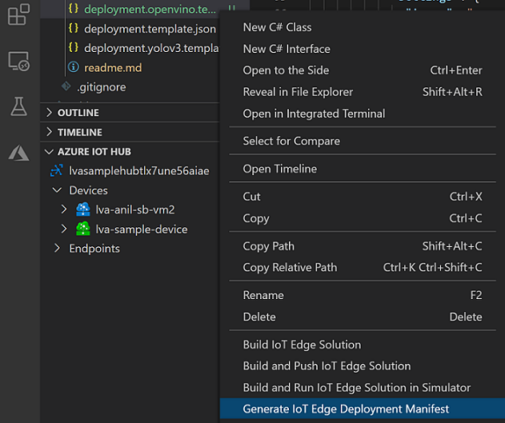
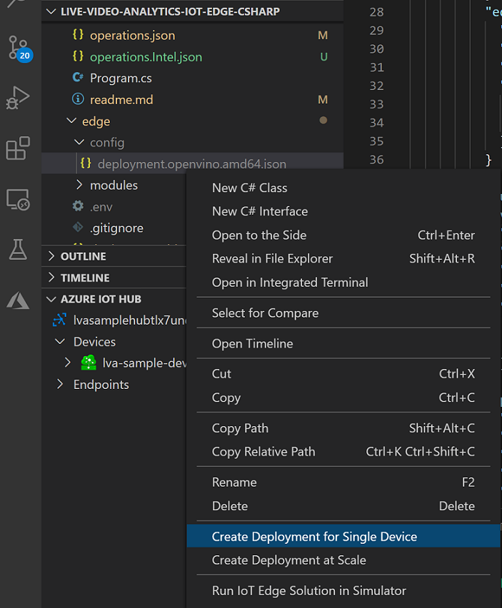

# Tutorial: Analyze live video by using Live Video Analytics with OpenVINO™ Model Server – AI Extension from Intel 

[!INCLUDE [redirect to Azure Video Analyzer](./includes/redirect-video-analyzer.md)]

This tutorial shows you how to use the OpenVINO™ Model Server – AI Extension from Intel to analyze a live video feed from a (simulated) IP camera. You'll see how this inference server gives you access to models for detecting objects (a person, a vehicle, or a bike), and a model for classifying vehicles. A subset of the frames in the live video feed is sent to this inference server, and the results are sent to IoT Edge Hub.

This tutorial uses an Azure VM as an IoT Edge device, and it uses a simulated live video stream. It's based on sample code written in C#, and it builds on the [Detect motion and emit events](detect-motion-emit-events-quickstart.md) quickstart.

> [!NOTE]
> This tutorial requires the use of an x86-64 machine as your Edge device.

## Prerequisites

* An Azure account that includes an active subscription. [Create an account for free](https://azure.microsoft.com/free/?WT.mc_id=A261C142F) if you don't already have one.
  > [!NOTE]
  > You will need an Azure subscription with permissions for creating service principals (**owner role** provides this). If you do not have the right permissions, please reach out to your account administrator to grant you the right permissions. 
* [Visual Studio Code](https://code.visualstudio.com/), with the following extensions:
    * [Azure IoT Tools](https://marketplace.visualstudio.com/items?itemName=vsciot-vscode.azure-iot-tools)
    * [C#](https://marketplace.visualstudio.com/items?itemName=ms-dotnettools.csharp)
* [.NET Core 3.1 SDK](https://dotnet.microsoft.com/download/dotnet-core/3.1).
* If you didn't complete the [Detect motion and emit events](detect-motion-emit-events-quickstart.md) quickstart, then be sure to complete the steps to [set up Azure resources](detect-motion-emit-events-quickstart.md#set-up-azure-resources).

> [!TIP]
> When installing Azure IoT Tools, you might be prompted to install Docker. You can ignore the prompt.

## Review the sample video

When you set up the Azure resources, a short video of a parking lot is copied to the Linux VM in Azure that you're using as the IoT Edge device. This quickstart uses the video file to simulate a live stream.

Open an application such as [VLC media player](https://www.videolan.org/vlc/). Select Ctrl+N and then paste a link to [the video](https://lvamedia.blob.core.windows.net/public/lots_015.mkv) to start playback. You see the footage of vehicles in a parking lot, most of them parked, and one moving.

> [!VIDEO https://www.microsoft.com/en-us/videoplayer/embed/RE4LUbN]

In this quickstart, you'll use Live Video Analytics on IoT Edge along with the OpenVINO™ Model Server – AI Extension from Intel to detect objects such as vehicles, or to classify them. You'll publish the resulting inference events to IoT Edge Hub.

## Overview

> [!div class="mx-imgBorder"]
> :::image type="content" source="./media/use-intel-openvino-tutorial/http-extension-with-vino.svg" alt-text="Overview":::

This diagram shows how the signals flow in this quickstart. An [edge module](https://github.com/Azure/live-video-analytics/tree/master/utilities/rtspsim-live555) simulates an IP camera hosting a Real-Time Streaming Protocol (RTSP) server. An [RTSP source](media-graph-concept.md#rtsp-source) node pulls the video feed from this server and sends video frames to the [HTTP extension processor](media-graph-concept.md#http-extension-processor) node. 

The HTTP extension node plays the role of a proxy. It  It samples the incoming video frames set by you `samplingOptions` field and also converts the video frames to the specified image type. Then it relays the image over REST to another edge module that runs AI models behind an HTTP endpoint. In this example, that edge module is the OpenVINO™ Model Server – AI Extension from Intel. The HTTP extension processor node gathers the detection results and publishes events to the [IoT Hub sink](media-graph-concept.md#iot-hub-message-sink) node. The node then sends those events to [IoT Edge Hub](../../iot-fundamentals/iot-glossary.md#iot-edge-hub).

In this tutorial, you will:

1. Create and deploy the media graph, modifying it.
1. Interpret the results.
1. Clean up resources.

## About OpenVINO™ Model Server – AI Extension from Intel

The Intel® Distribution of [OpenVINO™ toolkit](https://software.intel.com/content/www/us/en/develop/tools/openvino-toolkit.html) (open visual inference and neural network optimization) is a free software kit that helps developers and data scientists speed up computer vision workloads, streamline deep learning inference and deployments, and enable easy, heterogeneous execution across Intel® platforms from edge to cloud. It includes the Intel® Deep Learning Deployment Toolkit with model optimizer and inference
engine, and the [Open Model Zoo](https://github.com/openvinotoolkit/open_model_zoo) repository that includes more than 40 optimized pre-trained models.

In order to build complex, high-performance live video analytics solutions, the Live Video Analytics on IoT Edge module should be paired with a powerful inference engine that can leverage the scale at the edge. In this tutorial, inference requests are sent to the [OpenVINO™ Model Server – AI Extension from Intel](https://aka.ms/lva-intel-ovms), an Edge module that has been designed to work with Live Video Analytics on IoT Edge. This inference server module contains the OpenVINO™ Model Server (OVMS), an inference server powered by the OpenVINO™ toolkit, that is highly optimized for computer vision workloads and developed for Intel® architectures. An extension has been added to OVMS for easy exchange of video frames and inference results between the inference server and the Live Video Analytics on IoT Edge module, thus empowering you to run any OpenVINO™ toolkit supported model (you can customize the inference server module by modifying the [code](https://github.com/openvinotoolkit/model_server/tree/master/extras/ams_wrapper)). You can further select from the wide variety of acceleration mechanisms provided by Intel® hardware. These include CPUs (Atom, Core, Xeon), FPGAs, VPUs.

In the initial release of this inference server, you have access to the following [models](https://github.com/openvinotoolkit/model_server/tree/master/extras/ams_models):

- Vehicle Detection (inference URL: http://{module-name}:4000/vehicleDetection)
- Person/Vehicle/Bike Detection (inference URL: http://{module-name}:4000/personVehicleBikeDetection)
- Vehicle Classification (inference URL: http://{module-name}:4000/vehicleClassification)
- Face Detection (inference URL: http://{module-name}:4000/faceDetection)

> [!NOTE]
> By downloading and using the Edge module: OpenVINO™ Model Server – AI Extension from Intel, and the included software, you agree to the terms and conditions under the [License Agreement](https://www.intel.com/content/www/us/en/legal/terms-of-use.html).
> Intel is committed to respecting human rights and avoiding complicity in human rights abuses. See [Intel’s Global Human Rights Principles](https://www.intel.com/content/www/us/en/policy/policy-human-rights.html). Intel’s products and software are intended only to be used in applications that do not cause or contribute to a violation of an internationally recognized human right.

## Create and deploy the media graph

### Examine and edit the sample files

As part of the prerequisites, you downloaded the sample code to a folder. Follow these steps to examine and edit the sample files.

1. In Visual Studio Code, go to *src/edge*. You see your *.env* file and a few deployment template files.

    The deployment template refers to the deployment manifest for the edge device. It includes some placeholder values. The *.env* file includes the values for those variables.

1. Go to the *src/cloud-to-device-console-app* folder. Here you see your *appsettings.json* file and a few other files:

    * ***c2d-console-app.csproj*** - The project file for Visual Studio Code.
    * ***operations.json*** - A list of the operations that you want the program to run.
    * ***Program.cs*** - The sample program code. This code:

        * Loads the app settings.
        * Invokes direct methods that the Live Video Analytics on IoT Edge module exposes. You can use the module to analyze live video streams by invoking its [direct methods](direct-methods.md).
        * Pauses so that you can examine the program's output in the **TERMINAL** window and examine the events that were generated by the module in the **OUTPUT** window.
        * Invokes direct methods to clean up resources.


1. Edit the *operations.json* file:
    * Change the link to the graph topology:

        `"topologyUrl" : "https://raw.githubusercontent.com/Azure/live-video-analytics/master/MediaGraph/topologies/httpExtensionOpenVINO/2.0/topology.json"`

    * Under `GraphInstanceSet`, edit the name of the graph topology to match the value in the preceding link:

      `"topologyName" : "InferencingWithOpenVINO"`

    * Under `GraphTopologyDelete`, edit the name:

      `"name": "InferencingWithOpenVINO"`

### Generate and deploy the IoT Edge deployment manifest

1. Right-click the *src/edge/deployment.openvino.template.json* file and then select **Generate IoT Edge Deployment Manifest**.

      

    The *deployment.openvino.amd64.json* manifest file is created in the *src/edge/config* folder.

1. If you completed the [Detect motion and emit events](detect-motion-emit-events-quickstart.md) quickstart, then skip this step. 

    Otherwise, near the **AZURE IOT HUB** pane in the lower-left corner, select the **More actions** icon and then select **Set IoT Hub Connection String**. You can copy the string from the *appsettings.json* file. Or, to ensure you've configured the proper IoT hub within Visual Studio Code, use the [Select IoT hub command](https://github.com/Microsoft/vscode-azure-iot-toolkit/wiki/Select-IoT-Hub).
    
    

> [!NOTE]
> You might be asked to provide Built-in endpoint information for the IoT Hub. To get that information, in Azure portal, navigate to your IoT Hub and look for **Built-in endpoints** option in the left navigation pane. Click there and look for the **Event Hub-compatible endpoint** under **Event Hub compatible endpoint** section. Copy and use the text in the box. The endpoint will look something like this:  
    ```
    Endpoint=sb://iothub-ns-xxx.servicebus.windows.net/;SharedAccessKeyName=iothubowner;SharedAccessKey=XXX;EntityPath=<IoT Hub name>
    ```

1. Right-click *src/edge/config/deployment.openvino.amd64.json* and select **Create Deployment for Single Device**. 

    

1. When you're prompted to select an IoT Hub device, select **lva-sample-device**.
1. After about 30 seconds, in the lower-left corner of the window, refresh Azure IoT Hub. The edge device now shows the following deployed modules:

    * The Live Video Analytics module, named **lvaEdge**
    * The **rtspsim** module, which simulates an RTSP server and acts as the source of a live video feed
    * The **openvino** module, which is the OpenVINO™ Model Server – AI Extension module from Intel 

### Prepare to monitor events

Right-click the Live Video Analytics device and select **Start Monitoring Built-in Event Endpoint**. You need this step to monitor the IoT Hub events in the **OUTPUT** window of Visual Studio Code. 

 

### Run the sample program to detect vehicles
If you open the [graph topology](https://raw.githubusercontent.com/Azure/live-video-analytics/master/MediaGraph/topologies/httpExtensionOpenVINO/topology.json) for this tutorial in a browser, you will see that the value of `inferencingUrl` has been set to `http://openvino:4000/vehicleDetection`, which means the inference server will return results after detecting vehicles, if any, in the live video.

1. In Visual Studio Code, open the **Extensions** tab (or press Ctrl+Shift+X) and search for Azure IoT Hub.
1. Right click and select **Extension Settings**.

    > [!div class="mx-imgBorder"]
    > :::image type="content" source="./media/run-program/extensions-tab.png" alt-text="Extension Settings":::
1. Search and enable “Show Verbose Message”.

    > [!div class="mx-imgBorder"]
    > :::image type="content" source="./media/run-program/show-verbose-message.png" alt-text="Show Verbose Message":::
1. To start a debugging session, select the F5 key. You see messages printed in the **TERMINAL** window.
1. The *operations.json* code starts off with calls to the direct methods `GraphTopologyList` and `GraphInstanceList`. If you cleaned up resources after you completed previous quickstarts, then this process will return empty lists and then pause. To continue, select the Enter key.

    The **TERMINAL** window shows the next set of direct method calls:

     * A call to `GraphTopologySet` that uses the preceding `topologyUrl`
     * A call to `GraphInstanceSet` that uses the following body:

         ```
         {
           "@apiVersion": "2.0",
           "name": "Sample-Graph-1",
           "properties": {
             "topologyName": "InferencingWithOpenVINO",
             "description": "Sample graph description",
             "parameters": [
               {
                 "name": "rtspUrl",
                 "value": "rtsp://rtspsim:554/media/lots_015.mkv"
               },
               {
                 "name": "rtspUserName",
                 "value": "testuser"
               },
               {
                 "name": "rtspPassword",
                 "value": "testpassword"
               }
             ]
           }
         }
         ```

     * A call to `GraphInstanceActivate` that starts the graph instance and the flow of video
     * A second call to `GraphInstanceList` that shows that the graph instance is in the running state
1. The output in the **TERMINAL** window pauses at a `Press Enter to continue` prompt. Don't select Enter yet. Scroll up to see the JSON response payloads for the direct methods you invoked.
1. Switch to the **OUTPUT** window in Visual Studio Code. You see messages that the Live Video Analytics on IoT Edge module is sending to the IoT hub. The following section of this quickstart discusses these messages.
1. The media graph continues to run and print results. The RTSP simulator keeps looping the source video. To stop the media graph, return to the **TERMINAL** window and select Enter. 

    The next series of calls cleans up resources:
      * A call to `GraphInstanceDeactivate` deactivates the graph instance.
      * A call to `GraphInstanceDelete` deletes the instance.
      * A call to `GraphTopologyDelete` deletes the topology.
      * A final call to `GraphTopologyList` shows that the list is empty.

## Interpret results

When you run the media graph, the results from the HTTP extension processor node pass through the IoT Hub sink node to the IoT hub. The messages you see in the **OUTPUT** window contain a `body` section and an `applicationProperties` section. For more information, see [Create and read IoT Hub messages](../../iot-hub/iot-hub-devguide-messages-construct.md).

In the following messages, the Live Video Analytics module defines the application properties and the content of the body. 

### MediaSessionEstablished event

When a media graph is instantiated, the RTSP source node attempts to connect to the RTSP server that runs on the rtspsim-live555 container. If the connection succeeds, then the following event is printed. The event type is **Microsoft.Media.MediaGraph.Diagnostics.MediaSessionEstablished**.

```
[IoTHubMonitor] [9:42:18 AM] Message received from [lvaedgesample/lvaEdge]:
{
  "body": {
    "sdp": "SDP:\nv=0\r\no=- 1586450538111534 1 IN IP4 nnn.nn.0.6\r\ns=Matroska video+audio+(optional)subtitles, streamed by the LIVE555 Media Server\r\ni=media/lots_015.mkv\r\nt=0 0\r\na=tool:LIVE555 Streaming Media v2020.03.06\r\na=type:broadcast\r\na=control:*\r\na=range:npt=0-300.000\r\na=x-qt-text-nam:Matroska video+audio+(optional)subtitles, streamed by the LIVE555 Media Server\r\na=x-qt-text-inf:media/lots_015.mkv\r\nm=video 0 RTP/AVP 96\r\nc=IN IP4 0.0.0.0\r\nb=AS:500\r\na=rtpmap:96 H264/90000\r\na=fmtp:96 packetization-mode=1;profile-level-id=4D0029;sprop-parameter-sets=Z00AKeKQCgC3YC3AQEBpB4kRUA==,aO48gA==\r\na=control:track1\r\n"
  },
  "applicationProperties": {
    "dataVersion": "1.0",
    "topic": "/subscriptions/{subscriptionID}/resourceGroups/{name}/providers/microsoft.media/mediaservices/hubname",
    "subject": "/graphInstances/GRAPHINSTANCENAMEHERE/sources/rtspSource",
    "eventType": "Microsoft.Media.MediaGraph.Diagnostics.MediaSessionEstablished",
    "eventTime": "2020-07-24T16:42:18.1280000Z"
  }
}
```

In this message, notice these details:

* The message is a diagnostics event. `MediaSessionEstablished` indicates that the RTSP source node (the subject) connected with the RTSP simulator and has begun to receive a (simulated) live feed.
* In `applicationProperties`, `subject` indicates that the message was generated from the RTSP source node in the media graph.
* In `applicationProperties`, `eventType` indicates that this event is a diagnostics event.
* The `eventTime` indicates the time when the event occurred.
* The `body` contains data about the diagnostics event. In this case, the data comprises the [Session Description Protocol (SDP)](https://en.wikipedia.org/wiki/Session_Description_Protocol) details.

### Inference event

The HTTP extension processor node receives inference results from the OpenVINO™ Model Server – AI Extension module. It then emits the results through the IoT Hub sink node as inference events. 

In these events, the type is set to `entity` to indicate it's an entity, such as a car or truck. The `eventTime` value is the UTC time when the object was detected. 

In the following example, two vehicles were detected, with a confidence values above 0.9.

```
[IoTHubMonitor] [9:43:18 AM] Message received from [lva-sample-device/lvaEdge]:
{
  "body": {
    "inferences": [
      {
        "type": "entity",
        "subtype": "vehicleDetection",
        "entity": {
          "tag": {
            "value": "vehicle",
            "confidence": 0.9951713681221008
          },
          "box": {
            "l": 0.042635321617126465,
            "t": 0.4004564881324768,
            "w": 0.10961548984050751,
            "h": 0.07942074537277222
          }
        }
      },
      {
        "type": "entity",
        "subtype": "vehicleDetection",
        "entity": {
          "tag": {
            "value": "vehicle",
            "confidence": 0.928486168384552
          },
          "box": {
            "l": 0.2506900727748871,
            "t": 0.07512682676315308,
            "w": 0.05470699071884155,
            "h": 0.07408371567726135
          }
        }
      }
    ]
  },
  "applicationProperties": {
    "topic": "/subscriptions/{subscriptionID}/resourceGroups/{name}/providers/microsoft.media/mediaservices/hubname",
    "subject": "/graphInstances/GRAPHINSTANCENAMEHERE/processors/inferenceClient",
    "eventType": "Microsoft.Media.Graph.Analytics.Inference",
    "eventTime": "2020-07-24T16:43:18.1280000Z"
  }
}
```

In the messages, notice the following details:

* In `applicationProperties`, `subject` references the node in the graph topology from which the message was generated. 
* In `applicationProperties`, `eventType` indicates that this event is an analytics event.
* The `eventTime` value is the time when the event occurred.
* The `body` section contains data about the analytics event. In this case, the event is an inference event, so the body contains `inferences` data.
* The `inferences` section indicates that the `type` is `entity`. This section includes additional data about the entity.

## Run the sample program to detect persons or vehicles or bikes
To use a different model, you will need to modify the graph topology, and as well as `operations.json` file.

Copy the [graph topology](https://raw.githubusercontent.com/Azure/live-video-analytics/master/MediaGraph/topologies/httpExtensionOpenVINO/topology.json) to a local file, say `C:\TEMP\topology.json`. Open that copy, and edit the value of `inferencingUrl` to `http://openvino:4000/personVehicleBikeDetection`.

Next, in Visual Studio Code, go to the *src/cloud-to-device-console-app* folder and open `operations.json` file. Edit the line with `topologyUrl` to:

```
      "topologyFile" : "C:\\TEMP\\topology.json" 
```
You can now repeat the steps above to run the sample program again, with the new topology. The inference results will be similar (in schema) to that of the vehicle detection model, with just the `subtype` set to `personVehicleBikeDetection`.

## Run the sample program to classify vehicles
In Visual Studio Code, open the local copy of `topology.json` from the previous step, and edit the value of `inferencingUrl` to `http://openvino:4000/vehicleClassification`. If you have run the previous example to detect persons or vehicles or bikes, you do not need to modify the `operations.json` file again.

You can now repeat the steps above to run the sample program again, with the new topology. A sample classification result is as follows.

```
[IoTHubMonitor] [9:44:18 AM] Message received from [lva-sample-device/lvaEdge]:
{
  "body": {
    "inferences": [
      {
        "type": "classification",
        "subtype": "color",
        "classification": {
          "tag": {
            "value": "black",
            "confidence": 0.9179772138595581
          }
        }
      },
      {
        "type": "classification",
        "subtype": "type",
        "classification": {
          "tag": {
            "value": "truck",
            "confidence": 1
          }
        }
      }
    ]
  },
  "applicationProperties": {
    "topic": "/subscriptions/{subscriptionID}/resourceGroups/{name}/providers/microsoft.media/mediaservices/hubname",
    "subject": "/graphInstances/GRAPHINSTANCENAMEHERE/processors/inferenceClient",
    "eventType": "Microsoft.Media.Graph.Analytics.Inference",
    "eventTime": "2020-07-24T16:44:18.1280000Z"
  }
}
```

## Run the sample program to detect faces
In Visual Studio Code, open the local copy of `topology.json` from the previous step, and edit the value of `inferencingUrl` to `http://openvino:4000/faceDetection`. If you have run the previous example to detect persons or vehicles or bikes, you do not need to modify the `operations.json` file again.

You can now repeat the steps above to run the sample program again, with the new topology. A sample detection result is as follows (note: the parking lot video used above does not contain any detectable faces - you should another video in order to try this model).

```
[IoTHubMonitor] [9:54:18 AM] Message received from [lva-sample-device/lvaEdge]:
{
  "body": {
    "inferences": [
      {
        "type": "entity",
        "subtype": "faceDetection",
        "entity": {
          "tag": {
            "value": "face",
            "confidence": 0.9997053742408752
          },
          "box": {
            "l": 0.2559490501880646,
            "t": 0.03403960168361664,
            "w": 0.17685115337371826,
            "h": 0.45835764706134796
          }
        }
      }
    ]
  },
  "applicationProperties": {
    "topic": "/subscriptions/{subscriptionID}/resourceGroups/{name}/providers/microsoft.media/mediaservices/hubname",
    "subject": "/graphInstances/GRAPHINSTANCENAMEHERE/processors/inferenceClient",
    "eventType": "Microsoft.Media.Graph.Analytics.Inference",
    "eventTime": "2020-07-24T16:54:18.1280000Z"
  }
}
```

## Clean up resources

If you intend to try other quickstarts or tutorials, keep the resources you created. Otherwise, go to the Azure portal, go to your resource groups, select the resource group where you ran this tutorial, and delete all the resources.

## Next steps

Review additional challenges for advanced users:

* Use an [IP camera](https://en.wikipedia.org/wiki/IP_camera) that has support for RTSP instead of using the RTSP simulator. You can search for IP cameras that support RTSP on the [ONVIF conformant](https://www.onvif.org/conformant-products/) products page. Look for devices that conform with profiles G, S, or T.
* Use an AMD64 or x64 Linux device instead of an Azure Linux VM. This device must be in the same network as the IP camera. You can follow the instructions in [Install Azure IoT Edge runtime on Linux](../../iot-edge/how-to-install-iot-edge.md). Then register the device with Azure IoT Hub by following instructions in [Deploy your first IoT Edge module to a virtual Linux device](../../iot-edge/quickstart-linux.md).
