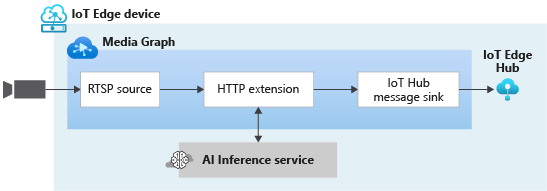
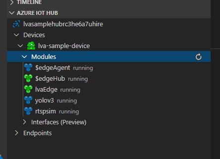

# Quickstart: Analyze live video with your own model

This quickstart shows you how to use Live Video Analytics on IoT Edge to analyze the live video feed from a (simulated) IP camera by applying a computer vision model to detect objects. A subset of the frames in the live video feed are sent to an inference service, and its results are sent to the IoT Edge Hub. It uses an Azure VM as an IoT Edge device and a simulated live video stream. This article is based on sample code written in C#.

This article builds on top of [this](detect-motion-emit-events-quickstart.md) quickstart. 

## Prerequisites

* An Azure account with an active subscription. [Create an account for free](https://azure.microsoft.com/free/?WT.mc_id=A261C142F).
* [Visual Studio Code](https://code.visualstudio.com/) on your machine with the following extensions:
    * [Azure IoT Tools](https://marketplace.visualstudio.com/items?itemName=vsciot-vscode.azure-iot-tools)
    * [C#](https://marketplace.visualstudio.com/items?itemName=ms-dotnettools.csharp)
* [.NET Core 3.1 SDK](https://dotnet.microsoft.com/download/dotnet-core/3.1) installed on your system
* If you have not previously completed [this](detect-motion-emit-events-quickstart.md) quickstart, then finish the following steps:
     * [Set up Azure resources](detect-motion-emit-events-quickstart.md#set-up-azure-resources)

> [!TIP]
> When installing the Azure IoT Tools, you might be prompted to install docker. Feel free to ignore it.

## Review the sample video
As part of the steps above to set up the Azure resources, a (short) video of a highway traffic will be copied to the Linux VM in Azure being used as the IoT Edge device. This video file will be used to simulate a live stream for this tutorial.

You can use an application like [VLC Player](https://www.videolan.org/vlc/), launch it, hit Control+N, and paste [this](https://lvamedia.blob.core.windows.net/public/camera-300s.mkv) link to the video to start playback. You will see that the footage is of traffic on a highway, with many vehicles moving on it.

When you complete the steps below, you will have used Live Video Analytics on IoT Edge to detect objects such as vehicles,persons etc., and publish associated inference events to the IoT Edge Hub.

## Overview



The diagram above shows how the signals flow in this quickstart. An edge module (detailed [here](https://github.com/Azure/live-video-analytics/tree/master/utilities/rtspsim-live555)) simulates an IP camera hosting an RTSP server. An [RTSP source](media-graph-concept.md#rtsp-source) node pulls the video feed from this server, and sends video frames to the [frame fate filter processor](media-graph-concept.md#frame-rate-filter-processor) node. This processor limits the frame rate of the video stream reaching the [HTTP extension processor](media-graph-concept.md#http-extension-processor) node. 

The HTTP extension node plays the role of a proxy, by converting the video frames to the specified image type and relaying the image over REST to another Edge module running an AI model behind an HTTP endpoint. In this example, that Edge module is built using the [YOLOv3](https://github.com/Azure/live-video-analytics/tree/master/utilities/video-analysis/yolov3-onnx) model, which is capable of detecting many types of objects. The HTTP extension processor node gathers the detection results and publishes events to the [IoT Hub sink](media-graph-concept.md#iot-hub-message-sink ) node, which then sends those event to the [IoT Edge Hub](../../iot-edge/iot-edge-glossary.md#iot-edge-hub).

In this quickstart, you will:

1. Create and deploy the media graph.
1. Interpret the results.
1. Clean up resources.


## Create and deploy the media graph
    
### Examine and edit the sample files

As part of the pre-requisites, you would have downloaded the sample code to a folder. Launch Visual Studio Code, and open the folder.

1. In Visual Studio Code, browse to "src/edge". You will see the .env file that you created along with a few deployment template files.

    * The deployment template refers to the deployment manifest for the edge device with some placeholder values. The .env file has the values for those variables.
1. Next, browse to "src/cloud-to-device-console-app" folder. Here you will see the appsettings.json file that you created along with a few other files:

    * c2d-console-app.csproj - This is the project file for Visual Studio Code.
    * operations.json - This file will list the different operations that you would like the program to run.
    * Program.cs - This is the sample program code, which does the following:

        * Loads the app settings.
        *  Invokes direct methods exposed by the Live Video Analytics on IoT Edge module. You can use the module to analyze live video streams by invoking its [direct methods](direct-methods.md) 
        * Pauses for you to examine the output from the program in the TERMINAL window and the events generated by the module in the OUTPUT window
        * Invokes direct methods to clean up resources   


1. Make the following edits to the operations.json file
    * Change the link to the graph topology:
    `"topologyUrl" : "https://raw.githubusercontent.com/Azure/live-video-analytics/master/MediaGraph/topologies/httpExtension/topology.json"`
    * Under GraphInstanceSet, edit the name of the graph topology to match the value in the link above
    `"topologyName" : "InferencingWithHttpExtension"`
    * Under GraphTopologyDelete, edit the name
    `"name": "InferencingWithHttpExtension"`

### Generate and deploy the IoT Edge deployment manifest

1. Right click on "src/edge/ deployment.yolov3.template.json" file and click on Generate IoT Edge Deployment Manifest.

      
1. This should create a manifest file in src/edge/config folder named " deployment.yolov3.amd64.json".
1. If you have previously completed the [quickstart](detect-motion-emit-events-quickstart.md), then skip this step. Otherwise, set the IoTHub connection string by clicking on the "More actions" icon next to AZURE IOT HUB pane in the bottom-left corner. You can copy the string from the appsettings.json file. (Here is another recommended approach to ensure you have the proper IoT Hub configured within Visual Studio Code via the [Select Iot Hub command](https://github.com/Microsoft/vscode-azure-iot-toolkit/wiki/Select-IoT-Hub)).
    
    
1. Next, right click on "src/edge/config/ deployment.yolov3.amd64.json" and click “Create Deployment for Single Device”. 

    
1. You will then be asked to select an IoT Hub device. Select lva-sample-device from the drop-down.
1. In about 30 seconds, refresh the Azure IOT Hub on the bottom-left section and you should have the edge device with the following modules deployed:

    1. The Live Video Analytics module, named as “lvaEdge”.
    1. A module named “rtspsim” which simulates an RTSP Server, acting as the source of a live video feed.
    1. A module named “yolov3” which as the name suggests is the YOLOv3 object detection model that applies computer vision to the images and return multiple classes of object types.
 
        

### Prepare for monitoring events

Right click on the Live Video Analytics device and click on “Start Monitoring Built-in Event Endpoint”. This step is needed to monitor the IoT Hub events and see it in the Output window of Visual Studio Code. 

 

### Run the sample program

1. Start a debugging session (hit F5). You will start seeing some messages printed in the TERMINAL window.
1. The operations.json starts off with calls to the direct methods GraphTopologyList and GraphInstanceList. If you have cleaned up resources after previous quickstarts, this will return empty lists, and then pause for you to hit Enter
   ```
   --------------------------------------------------------------------------
   Executing operation GraphTopologyList
   -----------------------  Request: GraphTopologyList  --------------------------------------------------
   {
   "@apiVersion": "1.0"
   }
   ---------------  Response: GraphTopologyList - Status: 200  ---------------
   {
   "value": []
   }
   --------------------------------------------------------------------------
   Executing operation WaitForInput
   Press Enter to continue
   ```

1. When you press the "Enter" key in the TERMINAL window, the next set of direct method calls are made
     * A call to GraphTopologySet using the topologyUrl above
     * A call to GraphInstanceSet using the following body
     ```
     {
       "@apiVersion": "1.0",
       "name": "Sample-Graph-1",
       "properties": {
         "topologyName": "InferencingWithHttpExtension",
         "description": "Sample graph description",
         "parameters": [
           {
             "name": "rtspUrl",
             "value": "rtsp://rtspsim:554/media/camera-300s.mkv"
           },
           {
             "name": "rtspUserName",
             "value": "testuser"
           },
           {
             "name": "rtspPassword",
             "value": "testpassword"
           }
         ]
       }
     }
     ```
     * A call to GraphInstanceActivate to start the graph instance, and start the flow of video
     * A second call to GraphInstanceList to show that the graph instance is indeed in the running state
1. The output in the TERMINAL window will pause now at a 'Press Enter to continue' prompt. Do not hit "Enter" at this time. You can scroll up to see the JSON response payloads for the direct methods you invoked
1. If you now switch over to the OUTPUT window in Visual Studio Code, you will see messages that are being sent to the IoT Hub, by the  Live Video Analytics on IoT Edge module.
     * These messages are discussed in the section below
1. The media graph will continue to run, and print results – the RTSP simulator will keep looping the source video. In order to stop the media graph, you go back to the TERMINAL window and hit "Enter". The next series of calls are made to clean up resources:
     * A call to GraphInstanceDeactivate to deactivate the graph instance
     * A call to GraphInstanceDelete to delete the instance
     * A call to GraphTopologyDelete to delete the topology
     * A final call to GraphTopologyList to show that the list is now empty

## Interpret results

When you run the media graph, the results from the Http Extension processor node are sent via the IoT Hub sink node to the IoT Hub. The messages you see in the OUTPUT window of Visual Studio Code contain a "body" section and an "applicationProperties" section. To understand what these sections represent, read [this](https://docs.microsoft.com/azure/iot-hub/iot-hub-devguide-messages-construct) article.

In the messages below, the application properties and the content of the body are defined by the Live Video Analytics module. 


### MediaSession Established event

When a media graph is instantiated, the RTSP source node attempts to connect to the RTSP server running on the rtspsim-live55 container. If successful, it will print this event. The event type is Microsoft.Media.MediaGraph.Diagnostics.MediaSessionEstablished.

```
[IoTHubMonitor] [9:42:18 AM] Message received from [lvaedgesample/lvaEdge]:
{
  "body": {
    "sdp": "SDP:\nv=0\r\no=- 1586450538111534 1 IN IP4 nnn.nn.0.6\r\ns=Matroska video+audio+(optional)subtitles, streamed by the LIVE555 Media Server\r\ni=media/camera-300s.mkv\r\nt=0 0\r\na=tool:LIVE555 Streaming Media v2020.03.06\r\na=type:broadcast\r\na=control:*\r\na=range:npt=0-300.000\r\na=x-qt-text-nam:Matroska video+audio+(optional)subtitles, streamed by the LIVE555 Media Server\r\na=x-qt-text-inf:media/camera-300s.mkv\r\nm=video 0 RTP/AVP 96\r\nc=IN IP4 0.0.0.0\r\nb=AS:500\r\na=rtpmap:96 H264/90000\r\na=fmtp:96 packetization-mode=1;profile-level-id=4D0029;sprop-parameter-sets=Z00AKeKQCgC3YC3AQEBpB4kRUA==,aO48gA==\r\na=control:track1\r\n"
  },
  "applicationProperties": {
    "dataVersion": "1.0",
    "topic": "/subscriptions/{subscriptionID}/resourceGroups/{name}/providers/microsoft.media/mediaservices/hubname",
    "subject": "/graphInstances/GRAPHINSTANCENAMEHERE/sources/rtspSource",
    "eventType": "Microsoft.Media.MediaGraph.Diagnostics.MediaSessionEstablished",
    "eventTime": "2020-04-09T16:42:18.1280000Z"
  }
}
```

Note the following in the above message:
* The message is a Diagnostics event, MediaSessionEstablished, indicates that the RTSP source node (the subject) was able to establish connection with the RTSP simulator, and begin to receive a (simulated) live feed.
* "subject" in applicationProperties indicates that the message was generated from the RTSP source node in the media graph.
* "eventType" in applicationProperties indicates that this is a Diagnostic event.
* "eventTime" indicates the time when the event occurred.
* "body" contains data about the diagnostic event, which, in this case, is the [SDP](https://en.wikipedia.org/wiki/Session_Description_Protocol) details.

### Inference event

The HTTP Extension processor node receives inference results from the yolov3 module, and emits them via the IoT Hub sink node as Inference events. In these events, the type is set to “entity” to indicate it’s an entity such as a car or truck, and the eventTime tells you at what time (UTC) the object was detected. Below is an example where two cars were detected with varying levels of confidence in the same video frame.

```
[IoTHubMonitor] [11:37:17 PM] Message received from [lva-sample-device/lvaEdge]:
{
  "body": {
    "inferences": [
      {
        "entity": {
          "box": {
            "h": 0.0344108157687717,
            "l": 0.5756940841674805,
            "t": 0.5929375966389974,
            "w": 0.04484643936157227
          },
          "tag": {
            "confidence": 0.8714089393615723,
            "value": "car"
          }
        },
        "type": "entity"
      },
      {
        "entity": {
          "box": {
            "h": 0.03960910373263889,
            "l": 0.2750667095184326,
            "t": 0.6102327558729383,
            "w": 0.031027007102966308
          },
          "tag": {
            "confidence": 0.7042660713195801,
            "value": "car"
          }
        },
        "type": "entity"
      }
    ]
  },
  "applicationProperties": {
    "topic": "/subscriptions/{subscriptionID}/resourceGroups/{name}/providers/microsoft.media/mediaservices/hubname",
    "subject": "/graphInstances/GRAPHINSTANCENAMEHERE/processors/inferenceClient",
    "eventType": "Microsoft.Media.Graph.Analytics.Inference",
    "eventTime": "2020-04-23T06:37:16.097Z"
  }
}
```

Note the following in the above messages:

* "subject" in applicationProperties references the node in the graph topology from which the message was generated. 
* "eventType" in applicationProperties indicates that this is an Analytics event.
* "eventTime" indicates the time when the event occurred.
* "body" contains data about the analytics event. In this case, the event is an Inference event and hence the body contains "inferences" data.
* "inferences" section indicates that the "type" is "entity" and has additional data about the "entity”.

## Clean up resources

If you intend to try the other quickstarts, you should hold on to the resources created. Otherwise, go to the Azure portal, browse to your resource groups, select the resource group under which you ran this quickstart, and delete all the resources.

## Next steps

Review additional challenges for advanced users:

* Use an [IP camera](https://en.wikipedia.org/wiki/IP_camera) with support for RTSP instead of using the RTSP simulator. You can search for IP cameras with RTSP support on the [ONVIF conformant](https://www.onvif.org/conformant-products/) products page by looking for devices that conform with profiles G, S, or T.
* Use an AMD64 or X64 Linux device (vs. using an Azure Linux VM). This device must be in the same network as the IP camera. You can follow instructions in [Install Azure IoT Edge runtime on Linux](https://docs.microsoft.com/azure/iot-edge/how-to-install-iot-edge-linux) and then follow instructions in this [Deploy your first IoT Edge module to a virtual Linux device](https://docs.microsoft.com/azure/iot-edge/quickstart-linux) quickstart to register the device with Azure IoT Hub.

