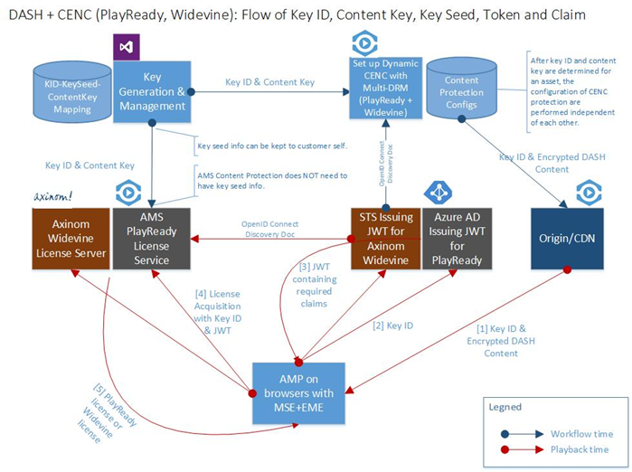

<properties 
	pageTitle="Using Axinom to deliver Widevine licenses to Azure Media Services" 
	description="This article describes how you can use Azure Media Services (AMS) to deliver a stream that is dynamically encrypted by AMS with both PlayReady and Widevine DRMs. The PlayReady license comes from Media Services PlayReady license server and Widevine license is delivered by Axinom license server." 
	services="media-services" 
	documentationCenter="" 
	authors="willzhan" 
	manager="dwrede" 
	editor=""/>

<tags 
	ms.service="media-services" 
	ms.workload="media" 
	ms.tgt_pltfrm="na" 
	ms.devlang="na" 
	ms.topic="article" 
	ms.date="06/22/2016"   
	ms.author="willzhan;Mingfeiy;rajputam;Juliako"/>

#Using Axinom to deliver Widevine licenses to Azure Media Services  

> [AZURE.SELECTOR]
- [castLabs](media-services-castlabs-integration.md)
- [Axinom](media-services-axinom-integration.md)

##Overview

Azure Media Services (AMS) has added Google Widevine dynamic protection (see [Mingfei’s blog](https://azure.microsoft.com/blog/azure-media-services-adds-google-widevine-packaging-for-delivering-multi-drm-stream/) for details). In addition, Azure Media Player (AMP) has also added Widevine support (see [AMP document](http://amp.azure.net/libs/amp/latest/docs/) for details). This is a major accomplishment in streaming DASH content protected by CENC with multi-native-DRM (PlayReady and Widevine) on modern browsers equipped with MSE and EME.

Starting with the Media Services .NET SDK version 3.5.2, Media Services enables you to configure Widevine license template and get Widevine licenses. You can also use the following AMS partners to help you deliver Widevine licenses: [Axinom](http://www.axinom.com/press/ibc-axinom-drm-6/), [EZDRM](http://ezdrm.com/), [castLabs](http://castlabs.com/company/partners/azure/).

This article describes how to integrate and test Widevine license server managed by Axinom. Specifically, it covers:  

- Configuring dynamic Common Encryption with multi-DRM (PlayReady and Widevine) with corresponding license acquisition URLs;
- Generating a JWT token in order to meet the license server requirements;
- Developing Azure Media Player app which handles license acquisition with JWT token authentication;

The complete system and the flow of content key, key ID, key seed, JTW token and its claims can be best described by the following diagram.

##Content Protection

For configuring dynamic protection and key delivery policy, please see Mingfei’s blog: [How to configure Widevine packaging with Azure Media Services](http://mingfeiy.com/how-to-configure-widevine-packaging-with-azure-media-services).

You can configure dynamic CENC protection with multi-DRM for DASH streaming having both of the following:

1. PlayReady protection for MS Edge and IE11, that could have a token authorization restrictions. The token restricted policy must be accompanied by a token issued by a Secure Token Service (STS), such as Azure Active Directory;
1. Widevine protection for Chrome, it can require token authentication with token issued by another STS. 

Please see [JWT Token Generation](media-services-axinom-integration.md#jwt-token-generation) section for why Azure Active Directory cannot be used as an STS for Axinom’s Widevine license server.

###Considerations

1. You must use the Axinom specified key seed (8888000000000000000000000000000000000000) and your generated or selected key ID to generate the content key for configuring key delivery service. Axinom license server will issue all licenses containing content keys based on the same key seed, which is valid for both testing and production.
1. The Widevine license acquisition URL for testing: [https://drm-widevine-licensing.axtest.net/AcquireLicense](https://drm-widevine-licensing.axtest.net/AcquireLicense). Both HTTP and HTTS are allowed.

##Azure Media Player Preparation

AMP v1.4.0 supports playback of AMS content that is dynamically packaged with both PlayReady and Widevine DRM.
If Widevine license server does not require token authentication, there is nothing additional you need to do to test a DASH content protected by Widevine. For an example, the AMP team provides a simple [sample](http://amp.azure.net/libs/amp/latest/samples/dynamic_multiDRM_PlayReadyWidevine_notoken.html), where you can see it working in Edge and IE11 with PlayReady and Chrome with Widevine.
The Widevine license server provided by Axinom requires JWT token authentication. The JWT token needs to be submitted with license request through an HTTP header “X-AxDRM-Message”. For this purpose, you need to add the following javascript in the web page hosting AMP before setting the source:

	

The rest of AMP code is standard AMP API as in AMP document [here](http://amp.azure.net/libs/amp/latest/docs/).

Note that the above javascript for setting custom authorization header is still a short term approach before the official long term approach in AMP is released.

##JWT Token Generation

Axinom Widevine license server for testing requires JWT token authentication. In addition, one of the claims in the JWT token is of a complex object type instead of primitive data type.

Unfortunately, Azure AD can only issue JWT tokens with primitive types. Similarly, .NET Framework API (System.IdentityModel.Tokens.SecurityTokenHandler and JwtPayload) only allows you to input complex object type as claims. However, the claims are still serialized as string. Therefore we cannot use any of the two for generating the JWT token for Widevine license request.

John Sheehan’s [JWT Nuget package](https://www.nuget.org/packages/JWT) meets the needs so we are going to use this Nuget package.

Below is the code for generating JWT token with the needed claims as required by Axinom Widevine license server for testing:

	
	using System;
	using System.Collections.Generic;
	using System.Linq;
	using System.Web;
	using System.IdentityModel.Tokens;
	using System.IdentityModel.Protocols.WSTrust;
	using System.Security.Claims;
	
	namespace OpenIdConnectWeb.Utils
	{
	    public class JwtUtils
	    {
	        //using John Sheehan's NuGet JWT library: https://www.nuget.org/packages/JWT/
	        public static string CreateJwtSheehan(string symmetricKeyHex, string key_id)
	        {
	            byte[] symmetricKey = ConvertHexStringToByteArray(symmetricKeyHex);  //hex string to byte[] Note: Note that the key is a hex string, however it must be treated as a series of bytes not a string when encoding.
	
	            var payload = new Dictionary<string, object>()
	                         {
	                             { "version", 1 },
	                             { "com_key_id", System.Configuration.ConfigurationManager.AppSettings["ax:com_key_id"] },
	                             { "message", new { type = "entitlement_message", key_ids = new string[] { key_id } }  }
	                         };
	
	            string token = JWT.JsonWebToken.Encode(payload, symmetricKey, JWT.JwtHashAlgorithm.HS256);
	
	            return token;
	        }
	
	        //convert hex string to byte[]
	        public static byte[] ConvertHexStringToByteArray(string hexString)
	        {
	            if (hexString.Length % 2 != 0)
	            {
	                throw new ArgumentException(String.Format(System.Globalization.CultureInfo.InvariantCulture, "The binary key cannot have an odd number of digits: {0}", hexString));
	            }
	
	            byte[] HexAsBytes = new byte[hexString.Length / 2];
	            for (int index = 0; index < HexAsBytes.Length; index++)
	            {
	                string byteValue = hexString.Substring(index * 2, 2);
	                HexAsBytes[index] = byte.Parse(byteValue, System.Globalization.NumberStyles.HexNumber, System.Globalization.CultureInfo.InvariantCulture);
	            }
	
	            return HexAsBytes;
	        }
	
	    }  
	
	}  

Axinom Widevine license server

	<add key="ax:laurl" value="http://drm-widevine-licensing.axtest.net/AcquireLicense" />
	<add key="ax:com_key_id" value="69e54088-e9e0-4530-8c1a-1eb6dcd0d14e" />
	<add key="ax:com_key" value="4861292d027e269791093327e62ceefdbea489a4c7e5a4974cc904b840fd7c0f" />
	<add key="ax:keyseed" value="8888000000000000000000000000000000000000" />

###Considerations

1.	Even though AMS PlayReady license delivery service requires “Bearer=” preceding an authentication token, Axinom Widevine license server does not use it.
2.	The Axinom communication key is used as signing key. Note that the key is a hex string, however it must be treated as a series of bytes not a string when encoding. This is achieved by the method ConvertHexStringToByteArray.

##Retrieving Key ID

You may have noticed that in the code for generating a JWT token, key ID is required. Since the JWT token needs to be ready before loading AMP player, key ID needs to be retrieved in order to generate JWT token.

Of course there are multiple ways to get hold of key ID. For example, one may store key ID together with content metadata in a database. Or you can retrieve key ID from DASH MPD (Media Presentation Description) file. The code below is for the latter.

	//get key_id from DASH MPD
	public static string GetKeyID(string dashUrl)
	{
	    if (!dashUrl.EndsWith("(format=mpd-time-csf)"))
	    {
	        dashUrl += "(format=mpd-time-csf)";
	    }
	
	    XPathDocument objXPathDocument = new XPathDocument(dashUrl);
	    XPathNavigator objXPathNavigator = objXPathDocument.CreateNavigator();
	    XmlNamespaceManager objXmlNamespaceManager = new XmlNamespaceManager(objXPathNavigator.NameTable);
	    objXmlNamespaceManager.AddNamespace("",     "urn:mpeg:dash:schema:mpd:2011");
	    objXmlNamespaceManager.AddNamespace("ns1",  "urn:mpeg:dash:schema:mpd:2011");
	    objXmlNamespaceManager.AddNamespace("cenc", "urn:mpeg:cenc:2013");
	    objXmlNamespaceManager.AddNamespace("ms",   "urn:microsoft");
	    objXmlNamespaceManager.AddNamespace("mspr", "urn:microsoft:playready");
	    objXmlNamespaceManager.AddNamespace("xsi",  "http://www.w3.org/2001/XMLSchema-instance");
	    objXmlNamespaceManager.PushScope();
	
	    XPathNodeIterator objXPathNodeIterator;
	    objXPathNodeIterator = objXPathNavigator.Select("//ns1:MPD/ns1:Period/ns1:AdaptationSet/ns1:ContentProtection[@value='cenc']", objXmlNamespaceManager);
	
	    string key_id = string.Empty;
	    if (objXPathNodeIterator.MoveNext())
	    {
	        key_id = objXPathNodeIterator.Current.GetAttribute("default_KID", "urn:mpeg:cenc:2013");
	    }
	
	    return key_id;
	}

##Summary

With latest addition of Widevine support in both Azure Media Services Content Protection and Azure Media Player, we are able to implement streaming of DASH + Multi-native-DRM (PlayReady + Widevine) with both PlayReady license service in AMS and Widevine license server from Axinom for the following modern browsers:

- Chrome
- Microsoft Edge on Windows 10
- IE 11 on Windows 8.1 and Windows 10
- Both Firefox (Desktop) and Safari on Mac (not iOS) are also supported via Silverlight and the same URL with Azure Media Player

The following parameters are required in the mini-solution leveraging Axinom Widevine license server. Except for key ID, the rest of parameters are provided by Axinom based on their Widevine server setup.

Parameter|How it is used
---|---
Communication key ID|Must be included as value of the claim "com_key_id" in JWT token (see [this](media-services-axinom-integration.md#jwt-token-generation) section).
Communication key|Must be used as the signing key of JWT token (see [this](media-services-axinom-integration.md#jwt-token-generation) section).
Key seed|Must be used to generate content key with any given content key ID (see  [this](media-services-axinom-integration.md#content-protection) section).
Widevine License acquisition URL|Must be used in configuring asset delivery policy for DASH streaming (see  [this](media-services-axinom-integration.md#content-protection) section ).
Content Key ID|Must be included as part of the value of Entitlement Message claim of JWT token (see [this](media-services-axinom-integration.md#jwt-token-generation) section). 

##Media Services learning paths

[AZURE.INCLUDE [media-services-learning-paths-include](../../includes/media-services-learning-paths-include.md)]

##Provide feedback

[AZURE.INCLUDE [media-services-user-voice-include](../../includes/media-services-user-voice-include.md)]

###Acknowledgments 

We would like to acknowledge the following people who contributed towards creating this document: Kristjan Jõgi of Axinom, Mingfei Yan, and Amit Rajput.
