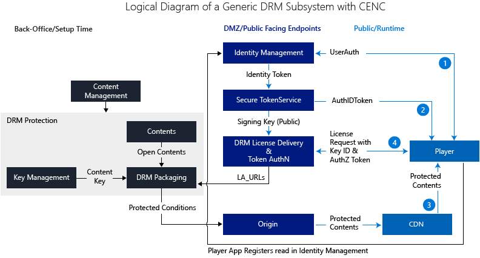
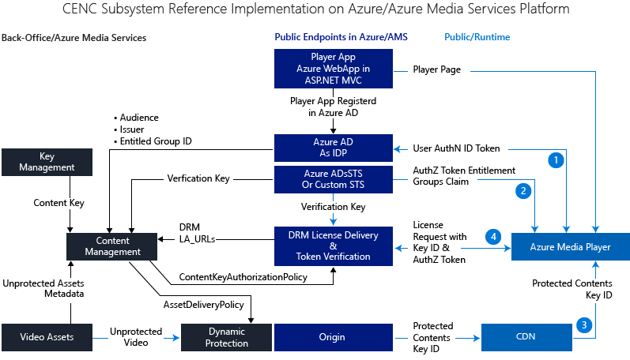
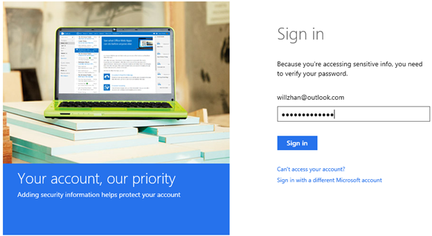

<properties 
	pageTitle="CENC with Multi-DRM and Access Control: A Reference Design and Implementation on Azure and Azure Media Services" 
	description="Learn about how to licensing the Microsoft® Smooth Streaming Client Porting Kit." 
	services="media-services" 
	documentationCenter="" 
	authors="willzhan"  
	manager="erikre" 
	editor=""/>

<tags 
	ms.service="media-services" 
	ms.workload="media" 
	ms.tgt_pltfrm="na" 
	ms.devlang="na" 
	ms.topic="article" 
	ms.date="06/22/2016"  
	ms.author="willzhan;kilroyh;yanmf;juliako"/>

#CENC with Multi-DRM and Access Control: A Reference Design and Implementation on Azure and Azure Media Services

##Key words
 
Azure Active Directory, Azure Media Services, Azure Media Player, Dynamic Encryption, License Delivery,PlayReady, Widevine, FairPlay, Common Encryption(CENC), Multi-DRM, Axinom, DASH, EME, MSE, JSON Web Token (JWT), Claims, Modern Browsers,Key Rollover, Symmetric Key, Asymmetric Key, OpenID Connect, X509 certificate. 

##In this article

The following topics are covered in this article:

- [Introduction](media-services-cenc-with-multidrm-access-control.md#introduction)
	- [Overview of this article](media-services-cenc-with-multidrm-access-control.md#overview-of-this-article)
- [A reference design](media-services-cenc-with-multidrm-access-control.md#a-reference-design)
- [Mapping design to technology for implementation](media-services-cenc-with-multidrm-access-control.md#mapping-design-to-technology-for-implementation)
- [Implementation](media-services-cenc-with-multidrm-access-control.md#implementation)
	- [Implementation procedures](media-services-cenc-with-multidrm-access-control.md#implementation-procedures)
	- [Some gotchas in implementation](media-services-cenc-with-multidrm-access-control.md#some-gotchas-in-implementation)
- [Additional Topics for Implementation](media-services-cenc-with-multidrm-access-control.md#additional-topics-for-implementation)
	- [HTTP or HTTPS](media-services-cenc-with-multidrm-access-control.md#http-or-https)
	- [Azure Active Directory signing key rollover](media-services-cenc-with-multidrm-access-control.md#azure-active-directory-signing-key-rollover)
	- [Where is the Access Token?](media-services-cenc-with-multidrm-access-control.md#where-is-the-access-token)
	- [What about Live Streaming?](media-services-cenc-with-multidrm-access-control.md#what-about-live-streaming)
	- [What about license servers outside of Azure Media Services?](media-services-cenc-with-multidrm-access-control.md#what-about-license-servers-outside-of-azure-media-services)
	- [What if I want to use a custom STS?](media-services-cenc-with-multidrm-access-control.md#what-if-i-want-to-use-a-custom-sts)
- [The completed system and test](media-services-cenc-with-multidrm-access-control.md#the-completed-system-and-test)
	- [User login](media-services-cenc-with-multidrm-access-control.md#user-login)
	- [Using Encrypted Media Extensions for PlayReady](media-services-cenc-with-multidrm-access-control.md#using-encrypted-media-extensipons-for-playready)
	- [Using EME for Widevine](media-services-cenc-with-multidrm-access-control.md#using-eme-for-widevine)
	- [Not entitled users](media-services-cenc-with-multidrm-access-control.md#not-entitled-users)
	- [Running custom Secure Token Service](media-services-cenc-with-multidrm-access-control.md#running-custom-secure-token-service)
- [Summary](media-services-cenc-with-multidrm-access-control.md#summary)

##Introduction

It is well known that it is a complex task to design and build a DRM subsystem for an OTT or online streaming solution. And it is a common practice for operators/online video providers to outsource this part to specialized DRM service providers. The goal of this document is to present a reference design and implementation of end-to-end DRM subsystem in OTT or online streaming solution.

The targeted readers of this document are engineers working in DRM subsystem of OTT or online streaming/multi-screen solutions, or any readers interested in DRM subsystem. The assumption is that readers are familiar with at least one of the DRM technologies on the market, such as PlayReady, Widevine, FairPlay or Adobe Access.

By DRM, we also include CENC (Common Encryption) with multi-DRM. A major trend in online streaming and OTT industry is to use CENC with multi-native-DRM on various client platforms, which is a shift from the previous trend of using a single DRM and its client SDK for various client platforms. When using CENC with multi-native-DRM, both PlayReady and Widevine are encrypted per the [Common Encryption (ISO/IEC 23001-7 CENC)](http://www.iso.org/iso/home/store/catalogue_ics/catalogue_detail_ics.htm?csnumber=65271/) specification.

The benefits of CENC with multi-DRM are as follows:

1. Reduces encryption cost since a single encryption processing is used targeting different platforms with its native DRMs;
1. Reduces the cost of managing encrypted assets since only a single copy of encrypted assets is needed;
1. Eliminates DRM client licensing cost since the native DRM client is usually free on its native platform.

Microsoft has been an active promoter of DASH and CENC together with some major industry players. Microsoft Azure Media Services has been providing support of DASH and CENC. For recent announcements, please see Mingfei’s blogs: [Announcing Google Widevine license delivery services in Azure Media Services](https://azure.microsoft.com/blog/announcing-general-availability-of-google-widevine-license-services/), and [Azure Media Services adds Google Widevine packaging for delivering multi-DRM stream](https://azure.microsoft.com/blog/azure-media-services-adds-google-widevine-packaging-for-delivering-multi-drm-stream/).  

### Overview of this article

The goal of this article includes the following:

1. Provides a reference design of DRM subsystem using CENC with multi-DRM;
1. Provides a reference implementation on Microsoft Azure/Azure Media Services platform;
1. Discusses some design and implementation topics.

In the article, “multi-DRM” covers the following:

1. Microsoft PlayReady
1. Google Widevine
1. Apple FairPlay (not yet supported by Azure Media Services)

The following table summarizes the native platform/native app, and browsers supported by each DRM.

**Client Platform**|**Native DRM Support**|**Browser/App**|**Streaming Formats**
----|------|----|----
**Smart TVs, operator STBs, OTT STBs**|PlayReady primarily, and/or Widevine, and/or other|Linux, Opera, WebKit, Other|Various formats
**Windows 10 devices (Windows PC, Windows Tablets, Windows Phone, Xbox)**|PlayReady|MS Edge/IE11/EME   UWP|DASH (For HLS, PlayReady is not supported)  DASH, Smooth Streaming (For HLS, PlayReady is not supported) 
**Android devices (Phone, Tablet, TV)**|Widevine|Chrome/EME|DASH
**iOS (iPhone, iPad), OS X clients and Apple TV**|FairPlay|Safari 8+/EME|HLS
**Plugin: Adobe Primetime**|Primetime Access|Browser plugin|HDS, HLS

Considering the current state of deployment for each DRM, a service will typically want to implement 2 or 3 DRMs to make sure you address all the types of endpoints in the best way.

There is a tradeoff between the complexity of the service logic and the complexity on the client side to reach a certain level of user experience on the various clients.

To make your selection, keep in mind these facts:

- PlayReady is natively implemented in every Windows device, on some Android devices, and available through software SDKs on virtually any platform
- Widevine is natively implemented in every Android device, in Chrome, and in some other devices
- FairPlay is available only on iOS and Mac OS clients or through iTunes.

So a typical multi-DRM would be:

- Option 1: PlayReady and Widevine
- Option 2: PlayReady, Widevine and FairPlay

## A reference design

In this section, we will present a reference design which is agnostic to technologies used to implement it.

A DRM subsystem may contain the following components:

1. Key management
1. DRM packaging
1. DRM license delivery
1. Entitlement check
1. Authentication/authorization
1. Player
1. Origin/CDN

The following diagram illustrates the high level interaction among the components in a DRM subsystem.

 
There are three basic “layers” in the design:

1. Back office layer (in black) which are not exposed externally;
1. “DMZ” layer (blue) containing all the endpoints facing public;
1. Public Internet layer (light blue) containing CDN and players with traffic across public Internet.
 
There should be a content management tool for controlling DRM protection, regardless it is static or dynamic encryption. The inputs for DRM encryption should include:

1. MBR video content;
1. Content key;
1. License acquisition URLs.

During playback time, the high level flow is:

1. User is authenticated;
1. Authorization token is created for the user;
1. DRM protected content (manifest) is downloaded to player;
1. Player submits license acquisition request to license servers together with key ID and authorization token.

Before moving to the next topic, a few words about the design of key management.

**ContentKey–to-Asset**|**Scenario**
------|---------------------------
1–to-1|The simplest case. It provides the finest control. But this generally results in the highest license delivery cost. At minimum one license request is required for each protected asset.
1–to-Many|You could use the same content key for multiple assets. For example, for all the assets in a logical group such as a genre or subset of genre (or Movie Gene), you could use a single content key.
Many–to-1|Multiple content keys are needed for each asset.   For example, if you need to apply dynamic CENC protection with multi-DRM for MPEG-DASH, and dynamic AES-128 encryption for HLS, you need two separate content keys, each with its own ContentKeyType. (For the content key used for dynamic CENC protection, ContentKeyType.CommonEncryption should be used, while for the content key used for dynamic AES-128 encryption, ContentKeyType.EnvelopeEncryption should be used.)  Another example, in CENC protection of DASH content, in theory, one content key can be used to protect video stream and another content key to protect audio stream. 
Many – to - Many|Combination of the above two scenarios: one set of content keys are used for each of the multiple assets in the same asset “group”.

Another important factor to consider is the use of persistent and non-persistent licenses.

Why are these considerations important? 

They have direct impact to license delivery cost if you use public cloud for license delivery. Let’s consider the following two different design cases to illustrate:

1. Monthly subscription: Use persistent license, and 1-to-many content key-to-asset mapping. E.g. for all the kids movies, we use a single content key for encryption. In this case: 

	Total # licenses requested for all kids movies/device = 1

1. Monthly subscription: Use non-persistent license, and 1-to-1 mapping between content key and asset. In this case:

	Total # licenses requested for all kids movies/device = [# movies watched] x [# sessions]

As you can easily see, the two different designs result in very different license request patterns hence license delivery cost if license delivery service is provided by a public cloud such as Azure Media Services.

## Mapping design to technology for implementation

Next, we map our generic design to technologies on Microsoft Azure/Azure Media Services platform, by specifying which technology to use for each building block.

The following table shows the mapping:

**Building Block**|**Technology**
------|-------
**Player**|[Azure Media Player](https://azure.microsoft.com/services/media-services/media-player/)
**Identity Provider (IDP)**|Azure Active Directory
**Secure Token Service (STS)**|Azure Active Directory
**DRM Protection Workflow**|Azure Media Services Dynamic Protection
**DRM License Delivery**|1. Azure Media Services License Delivery (PlayReady, Widevine, FairPlay), or  2. Axinom License Server,  3. Custom PlayReady License Server
**Origin**|Azure Media Services Streaming Endpoint
**Key Management**|Not needed for reference implementation
**Content Management**|A C# console application

In other words, both Identity Provider (IDP) and Secure Token Service (STS) will be Azure AD. For player, we will use [Azure Media Player API](http://amp.azure.net/libs/amp/latest/docs/). Both Azure Media Services and Azure Media Player support DASH and CENC with multi-DRM.

The following diagram shows the overall structure and flow with the above technology mapping.

In order to set up dynamic CENC encryption, the content management tool will use the following inputs:

1. Open content;
1. Content key from key generation/management;
1. License acquisition URLs;
1. A list of information from Azure AD.

The output of the content management tool will be:

1. ContentKeyAuthorizationPolicy containing the specification on how license delivery verifies a JWT token and DRM license specifications;
1. AssetDeliveryPolicy containing specifications on streaming format, DRM protection and license acquisition URLs.

During runtime, the flow is as below:

1. Upon user authentication, a JWT token is generated;
1. One of the claims contained in the JWT token is “groups” claim containing the group object ID of “EntitledUserGroup”. This claim will be used for passing “entitlement check”.
1. Player downloads client manifest of a CENC protected content and “sees” the following:
	1. key ID, 
	1. the content is CENC protected,
	1. License acquisition URLs.

1. Player makes a license acquisition request based on the browser/DRM supported. In the license acquisition request, key ID and the JWT token will also be submitted. License delivery service will verify the JWT token and the claims contained before issuing the needed license.

##Implementation

###Implementation procedures

The implementation will include the following steps:

1. Prepare test asset(s): encode/package a test video to multi-bitrate fragmented MP4 in Azure Media Services. This asset is NOT DRM protected. DRM protection will be done by dynamic protection later.
1. Create key ID and content key (optionally from key seed). For our purpose, key management system is not needed since we are dealing with only a single set of key ID and content key for a couple of test assets;
1. Use AMS API to configure multi-DRM license delivery services for the test asset. If you are using custom license servers by your company or your company’s vendors instead of license services in Azure Media Services, you can skip this step and specify license acquisition URLs in the step for configuring license delivery. AMS API is needed to specify some detailed configurations, such as authorization policy restriction, license response templates for different DRM license services, etc. At this time, the Azure portal does not yet provide the needed UI for this configuration. You can find API level info and sample code in Julia Kornich’s document: [Using PlayReady and/or Widevine Dynamic Common Encryption](media-services-protect-with-drm.md). 
1. Use AMS API to configure asset delivery policy for the test asset. You can find API level info and sample code in Julia Kornich’s document: [Using PlayReady and/or Widevine Dynamic Common Encryption](media-services-protect-with-drm.md).
1. Create and configure an Azure Active Directory tenant in Azure;
1. Create a few user accounts and groups in your Azure Active Directory tenant: you should create at least “EntitledUser” group and add a user to this group. Users in this group will pass entitlement check in license acquisition and users not in this group will fail to pass authentication check and will not be able to acquire any license. Being a member of this “EntitledUser” group is a required “groups” claim in the JWT token issued by Azure AD. This claim requirement should be specified in configuring multi-DRM license delivery services step.
1. Create an ASP.NET MVC app which will be hosting your video player. This ASP.NET app will be protected with user authentication against the Azure Active Directory tenant. Proper claims will be included in the access tokens obtained after user authentication. OpenID Connect API is recommended for this step. You need to install the following NuGet packages:
	- Install-Package Microsoft.Azure.ActiveDirectory.GraphClient
	- Install-Package Microsoft.Owin.Security.OpenIdConnect
	- Install-Package Microsoft.Owin.Security.Cookies
	- Install-Package Microsoft.Owin.Host.SystemWeb
	- Install-Package Microsoft.IdentityModel.Clients.ActiveDirectory
1. Create a player using [Azure Media Player API](http://amp.azure.net/libs/amp/latest/docs/). [Azure Media Player’s ProtectionInfo API](http://amp.azure.net/libs/amp/latest/docs/) allows you to specify which DRM technology to use on different DRM platform.
1. Test matrix:

**DRM**|**Browser**|**Result for Entitled User**|**Result for Un-entitled User**
---|---|-----|---------
**PlayReady**|MS Edge or IE11 on Windows 10|Succeed|Fail
**Widevine**|Chrome on Windows 10|Succeed|Fail
**FairPlay** |TBD||

George Trifonov of Azure Media Services Team has written a blog providing detailed steps in setting up Azure Active Directory for an ASP.NET MVC player app: [Integrate Azure Media Services OWIN MVC based app with Azure Active Directory and restrict content key delivery based on JWT claims](http://gtrifonov.com/2015/01/24/mvc-owin-azure-media-services-ad-integration/).

George has also written a blog on [JWT token Authentication in Azure Media Services and Dynamic Encryption](http://gtrifonov.com/2015/01/03/jwt-token-authentication-in-azure-media-services-and-dynamic-encryption/). And here is his [sample on Azure AD integration with Azure Media Services key delivery](https://github.com/AzureMediaServicesSamples/Key-delivery-with-AAD-integration/).

For information on Azure Active Directory:

- You can find developer information in [Azure Active Directory Developer’s Guide](../active-directory/active-directory-developers-guide.md).
- You can find administrator information in [Administer Your Azure AD Directory](../active-directory/active-directory-administer.md).

### Some gotchas in implementation

There are some “gotchas” in the implementation. Hopefully the following list of “gotchas” can help you troubleshooting in case you run into issues.

1. **Issuer** URL should end with **"/"**.  

	**Audience** should be the player application client ID and you should also add **"/"** at the end of the issuer URL.

		<add key="ida:audience" value="[Application Client ID GUID]" />
		<add key="ida:issuer" value="https://sts.windows.net/[AAD Tenant ID]/" /> 

	In [JWT Decoder](http://jwt.calebb.net/), you should see **aud** and **iss** as below in the JWT token:
	
	

2. Add Permissions to the application in AAD (on Configure tab of the application). This is required for each application (local and deployed versions).

	

3. Use the right issuer in setting up dynamic CENC protection:

		<add key="ida:issuer" value="https://sts.windows.net/[AAD Tenant ID]/"/>
	
	The following will not work:
	
		<add key="ida:issuer" value="https://willzhanad.onmicrosoft.com/" />
	
	The GUID is the AAD tenant ID. The GUID can be found in Endpoints popup in Azure portal.

4. Grant group membership claims privileges. Make sure in AAD application manifest file, we have the following

	"groupMembershipClaims": "All",    (the default value is null)

5. Setting proper TokenType when creating restriction requirements.

		objTokenRestrictionTemplate.TokenType = TokenType.JWT;

	Since adding support of JWT (AAD) in addition to SWT (ACS), the default TokenType is TokenType.JWT. If you use SWT/ACS, you must set to TokenType.SWT.

## Additional Topics for Implementation
Next we will disc
uss some additional topics in our design and implementation.

###HTTP or HTTPS?

The ASP.NET MVC player application we built must support the following:

1. User authentication through Azure AD which needs to be under HTTPS;
1. JWT token exchange between client and Azure AD which needs to be under HTTPS;
1. DRM license acquisition by the client which is required to be under HTTPS if license delivery is provided by Azure Media Services. Of course, PlayReady product suite does not mandate HTTPS for license delivery. If your PlayReady license server is outside of Azure Media Services, either HTTP or HTTPS could be used.

Therefore, the ASP.NET player application will use HTTPS as a best practice. This means the Azure Media Player will be on a page under HTTPS. However, for streaming we prefer HTTP, hence we need to consider mixed content issue.

1. Browser does not allow mixed content. But plugins like Silverlight and OSMF plugin for smooth and DASH allow. Mixed content is a security concern - This is due to the threat of the ability to inject malicious JS which can cause the customer data to be at risk.  Browsers block this by default and so far the only way to work around it is on the server (origin) side, to allow all domains (regardless https or http). This is probably not a good idea either.
1. We should avoid mixed content: either both use HTTP or both use HTTPS. When playing mixed content, silverlightSS tech requires clearing a mixed content warning. flashSS tech handles mixed content without mixed content warning.
1. If your streaming endpoint was created before August 2014, it will not support HTTPS. In this case, please create and use a new streaming endpoint for HTTPS.

In the reference implementation, for DRM protected contents, both application and streaming will be under HTTTPS. For open contents, the player does not need authentication or license, so you have the liberty to use either HTTP or HTTPS.

### Azure Active Directory signing key rollover

This is an important point to take into consideration of your implementation. If you do not consider this in your implementation, the completed system will eventually stop working completely within at most 6 weeks.

Azure AD uses industry standard to establish trust between itself and applications using Azure AD. Specifically, Azure AD uses a signing key that consists of a public and private key pair. When Azure AD creates a security token that contains information about the user, this token is signed by Azure AD using its private key before it is sent back to the application. To verify that the token is valid and actually originated from Azure AD, the application must validate the token’s signature using the public key exposed by Azure AD that is contained in the tenant’s federation metadata document. This public key – and the signing key from which it derives – is the same one used for all tenants in Azure AD.

Detailed info on Azure AD key rollover can be found in the document: [Important Information about Signing Key Rollover in Azure AD](../active-directory/active-directory-signing-key-rollover.md).

Between the [public-private key pair](https://login.windows.net/common/discovery/keys/), 

- The private key is used by Azure Active Directory to generate a JWT token;
- The public key is used by an application such as DRM License Delivery Services in AMS to verify the JWT token;
 
For security purpose, Azure Active Directory rotates this certificate periodically (every 6 weeks). In case of security breaches, the key rollover can occur any time. Therefore, the license delivery services in AMS need to update the public key used as Azure AD rotates the key pair, otherwise token authentication in AMS will fail and no license will be issued. 

This is achieved by setting TokenRestrictionTemplate.OpenIdConnectDiscoveryDocument when configuring DRM license delivery services.

The JWT token flow is as below:

1.	Azure AD will issue the JWT token with the current private key for an authenticated user;
2.	When a player sees a CENC with multi-DRM protected content, it will first locate the JWT token issued by Azure AD.
3.	The player sends license acquisition request with the JWT token to license delivery services in AMS;
4.	The license delivery services in AMS will use the current/valid public key from Azure AD to verify the JWT token, before issuing licenses.

DRM license delivery services will always be checking for the current/valid public key from Azure AD. The public key presented by Azure AD will be the key used for verifying a JWT token issued by Azure AD.

What if the key rollover happens after AAD generates a JWT token but before the JWT token is sent by players to DRM license delivery services in AMS for verification? 

Because a key may be rolled at any moment, there is always more than one valid public key available in the federation metadata document. Azure Media Services license delivery can use any of the keys specified in the document, since one key may be rolled soon, another may be its replacement, and so forth.

### Where is the Access Token?

If you look at how a web app calls an API app under [Application Identity with OAuth 2.0 Client Credentials Grant](active-directory-authentication-scenarios.md#web-application-to-web-api), the authentication flow is as below:

1.	A user is signed in to Azure AD in the web application (see the [Web Browser to Web Application](active-directory-authentication-scenarios.md#web-browser-to-web-application).
2.	The Azure AD authorization endpoint redirects the user agent back to the client application with an authorization code. The user agent returns authorization code to the client application’s redirect URI.
3.	The web application needs to acquire an access token so that it can authenticate to the web API and retrieve the desired resource. It makes a request to Azure AD’s token endpoint, providing the credential, client ID, and web API’s application ID URI. It presents the authorization code to prove that the user has consented.
4.	Azure AD authenticates the application and returns a JWT access token that is used to call the web API.
5.	Over HTTPS, the web application uses the returned JWT access token to add the JWT string with a “Bearer” designation in the Authorization header of the request to the web API. The web API then validates the JWT token, and if validation is successful, returns the desired resource.

In this “application identity” flow, the web API trusts that the web application authenticated the user. For this reason, this pattern is called a trusted subsystem. The [diagram on this page](http://msdn.microsoft.com/library/azure/dn645542.aspx/) describes how authorization code grant flow works.

In license acquisition with token restriction, we are following the same trusted subsystem pattern. And the license delivery service in Azure Media Services is the web API resource, the “backend resource” a web application needs to access. So where is the access token?

Indeed, we are obtaining access token from Azure AD. After successful user authentication, authorization code is returned. The authorization code is then used, together with client ID and app key, to exchange for access token. And the access token is for accessing a “pointer” application pointing or representing Azure Media Services license delivery service.

We need to register and configure the “pointer” app in Azure AD by following the steps below:

1.	In the Azure AD tenant

	- add an application (resource) with sign-on URL: 

	https://[resource_name].azurewebsites.net/ and 

	- app ID URL: 
	
	https://[aad_tenant_name].onmicrosoft.com/[resource_name]; 
2.	Add a new key for the resource app;
3.	Update the app manifest file so that the groupMembershipClaims property has the following value: "groupMembershipClaims": "All",  
4.	In the Azure AD app pointing to the player web app, in the section “permissions to other applications”, add the resource app which was added in step 1 above. Under “delegated permissions” check “Access [resource_name]” checkmark. This gives the web app permission to create access tokens for accessing the resource app. You should do this for both local and deployed version of the web app if you are developing with Visual Studio and Azure web app.
	
Therefore, the JWT token issued by Azure AD is indeed the access token for accessing this “pointer” resource.

### What about Live Streaming?

In the above, our discussion has been focusing on on-demand assets. What about live streaming?

The good news is that you can use exactly the same design and implementation for protecting live streaming in Azure Media Services, by treating the asset associated with a program as a “VOD asset”.

Specifically, it is well known that to do live streaming in Azure Media Services, you need to create a channel, then a program under the channel. To create the program, you need to create an asset which will contain the live archive for the program. In order to provide CENC with multi-DRM protection of the live content, all you need to do, is to apply the same setup/processing to the asset as if it was a “VOD asset” before you start the program.

### What about license servers outside of Azure Media Services?

Often, customers may have invested in license server farm either in their own data center or hosted by DRM service providers. Fortunately, Azure Media Services Content Protection allows you to operate in hybrid mode: contents hosted and dynamically protected in Azure Media Services, while DRM licenses are delivered by servers outside Azure Media Services. In this case, there are the following considerations of changes:

1. The Secure Token Service needs to issue tokens which are acceptable and can be verified by the license server farm. For example, the Widevine license servers provided by Axinom requires a specific JWT token which contains “entitlement message”. Therefore, you need to have an STS to issue such JWT token. The authors have completed such an implementation and you can find the details in the following document in [Azure Documentation Center](https://azure.microsoft.com/documentation/): [Using Axinom to deliver Widevine licenses to Azure Media Services](media-services-axinom-integration.md). 
1. You no longer need to configure license delivery service (ContentKeyAuthorizationPolicy) in Azure Media Services. What you need to do is to provide the license acquisition URLs (for PlayReady, Widevine and FairPlay) when you configure AssetDeliveryPolicy in setting up CENC with multi-DRM.
 
### What if I want to use a custom STS?

There could be a few reasons that a customer may choose to use a custom STS (Secure Token Service) for providing JWT tokens. Some of them are:

1.	The Identity Provider (IDP) used by the customer does not support STS. In this case a custom STS may be an option.
2.	The customer may need more flexible or tighter control in integrating STS with customer’s subscriber billing system. For example, an MVPD operator may offer multiple OTT subscriber packages such as premium, basic, sports, etc. The operator may want to match the claims in a token with a subscriber’s package so that only contents in the right package is made available. In this case, a custom STS provides the needed flexibility and control.

Two changes need to be made when using a custom STS:

1.	When configuring license delivery service for an asset, you need to specify the security key used for verification by the custom STS (more details below) instead of the current key from Azure Active Directory.
2.	When a JTW token is generated, a security key is specified instead of the private key of the current X509 certificate in Azure Active Directory.

There are two types of security keys:

1.	Symmetric key: the same key is used for both generating and verifying a JWT token;
2.	Asymmetric key: a public-private key pair in an X509 certificate is used with private key for encrypting/generating a JWT token and the public key for verifying the token.

####Tech note

If you use .NET Framework/C# as your development platform, the X509 certificate used for asymmetric security key must have key length at least 2048. This is a requirement of the class System.IdentityModel.Tokens.X509AsymmetricSecurityKey in .NET Framework. Otherwise, the following exception will be thrown:

IDX10630: The 'System.IdentityModel.Tokens.X509AsymmetricSecurityKey' for signing cannot be smaller than '2048' bits. 

## The completed system and test

We will walk through a few scenarios in the completed end-to-end system so that readers can have a basic “picture” of the behavior before getting a login account.

The player web application and its login can be found [here](https://openidconnectweb.azurewebsites.net/).

If what you need is “non-integrated” scenario: video assets hosted in Azure Media Services which are either unprotected, or DRM protected but without token authentication (issuing a license to whoever requesting it), you can test it without login (by switching to HTTP if your video streaming is over HTTP).

If what you need is end-to-end integrated scenario: video assets is under dynamic DRM protection in Azure Media Services, with token authentication and JWT token being generated by Azure AD, you need to login.

### User login

In order to test the end-to-end integrated DRM system, you need to have an “account” created or added. 

What account?

Although Azure originally allowed access only by Microsoft account users, it now allows access by users from both systems. This was done by having all the Azure properties trust Azure AD for authentication, having Azure AD authenticate organizational users, and by creating a federation relationship where Azure AD trusts the Microsoft account consumer identity system to authenticate consumer users. As a result, Azure AD is able to authenticate “guest” Microsoft accounts as well as “native” Azure AD accounts.

Since Azure AD trusts Microsoft Account (MSA) domain, you can add any accounts from any of the following domains to the custom Azure AD tenant and use the account to login:

**Domain Name**|**Domain**
-----------|----------
**Custom Azure AD tenant domain**|somename.onmicrosoft.com
**Corporate domain**|microsoft.com
**Microsoft Account (MSA) domain**|outlook.com, live.com, hotmail.com

You may contact any of the authors to have an account created or added for you. 

Below are the screenshots of different login pages used by different domain accounts.

**Custom Azure AD tenant domain account**: In this case, you see the customized login page of the custom Azure AD tenant domain.

**Microsoft domain account with smart card**: In this case you see the login page customized by Microsoft corporate IT with two-factor authentication.

**Microsoft Account (MSA)**: In this case, you see the login page of Microsoft Account for consumers.

### Using Encrypted Media Extensions for PlayReady

On a modern browser with Encrypted Media Extensions (EME) for PlayReady support, such as IE 11 on Windows 8.1 and up, and Microsoft Edge browser on Windows 10, PlayReady will be the underlying DRM for EME.

The dark player area is due to the fact that PlayReady protection prevents one from making screen capture of protected video. 

The following screen shows the player plugins and MSE/EME support.

EME in Microsoft Edge and IE 11 on Windows 10 allows invoking of [PlayReady SL3000](https://www.microsoft.com/playready/features/EnhancedContentProtection.aspx/) on Windows 10 devices which support it. PlayReady SL3000 unlocks the flow of enhanced premium content (4K, HDR, etc.) and new content delivery models (early window for Enhanced Content).

Focus on the Windows devices: PlayReady is the only DRM in the HW available on Windows devices (PlayReady SL3000). A streaming service can use PlayReady through EME or through a UWP application and offer a higher video quality using PlayReady SL3000 than another DRM. Typically, 2K content will flow through Chrome or Firefox, and 4K content through Microsoft Edge/IE11 or a UWP application on the same device (depending on service settings and implementation).

#### Using EME for Widevine

On a modern browser with EME/Widevine support, such as Chrome 41+ on Windows 10, Windows 8.1, Mac OSX Yosemite, and Chrome on Android 4.4.4, Google Widevine is the DRM behind EME.

Notice that Widevine does not prevent one from making screen capture of protected video.

### Not entitled users

If a user is not a member of “Entitled Users” group, the user will not be able to pass “entitlement check” and the multi-DRM license service will refuse to issue the requested license as shown below. The detailed description is “License acquire failed”, which is as designed.

### Running custom Secure Token Service

For the scenario of running custom Secure Token Service (STS), the JWT token will be issued by the custom STS using either symmetric or asymmetric key. 

The case of using symmetric key (using Chrome):

The case of using asymmetric key via an X509 certificate (using Microsoft modern browser).

In both of the above cases, user authentication stays the same – through Azure AD. The only difference is that JWT tokens are issued by the custom STS instead of Azure AD. Of course, when configuring dynamic CENC protection, the restriction of license delivery service specifies the type of JWT token, either symmetric or asymmetric key.

## Summary

In this document, we discussed CENC with multi-native-DRM and access control via token authentication: its design and its implementation using Azure, Azure Media Services and Azure Media Player.

- A reference design is presented which contains all the necessary components in a DRM/CENC subsystem;
- A reference implementation on Azure, Azure Media Services and Azure Media Player.
- Some topics directly involved in the design and implementation are also discussed.

##Media Services learning paths

[AZURE.INCLUDE [media-services-learning-paths-include](../../includes/media-services-learning-paths-include.md)]

##Provide feedback

[AZURE.INCLUDE [media-services-user-voice-include](../../includes/media-services-user-voice-include.md)]

###Acknowledgments 

William Zhang, Mingfei Yan, Roland Le Franc, Kilroy Hughes, Julia Kornich
