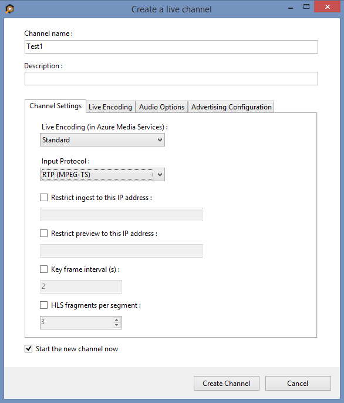
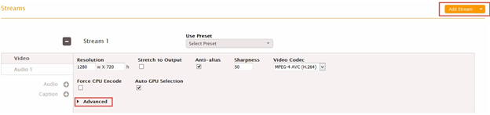
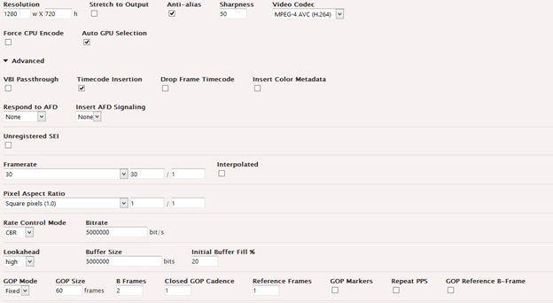
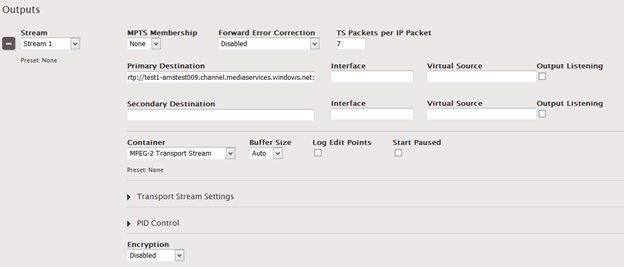

<properties 
	pageTitle="Configure the Elemental Live encoder to send a single bitrate live stream" 
	description="This topic shows how to configure the Elemental Live encoder to send a single bitrate stream to AMS channels that are enabled for live encoding." 
	services="media-services" 
	documentationCenter="" 
	authors="cenkdin" 
	manager="dwrede" 
	editor=""/>

<tags 
	ms.service="media-services" 
	ms.workload="media" 
	ms.tgt_pltfrm="na" 
	ms.devlang="ne" 
	ms.topic="article" 
	ms.date="06/22/2016"
	ms.author="cenkdin;anilmur;juliako"/>

#Use the Elemental Live encoder to send a single bitrate live stream

> [AZURE.SELECTOR]
- [Elemental Live](media-services-configure-elemental-live-encoder.md)
- [Tricaster](media-services-configure-tricaster-live-encoder.md)
- [Wirecast](media-services-configure-wirecast-live-encoder.md)
- [FMLE](media-services-configure-fmle-live-encoder.md)

This topic shows how to configure the [Elemental Live](http://www.elementaltechnologies.com/products/elemental-live) encoder to send a single bitrate stream to AMS channels that are enabled for live encoding.  For more information, see [Working with Channels that are Enabled to Perform Live Encoding with Azure Media Services](media-services-manage-live-encoder-enabled-channels.md).

This tutorial shows how to manage Azure Media Services (AMS) with Azure Media Services Explorer (AMSE) tool. This tool only runs on Windows PC. If you are on Mac or Linux, use the Azure Classic Portal to create [channels](media-services-portal-creating-live-encoder-enabled-channel.md#create-a-channel) and [programs](media-services-portal-creating-live-encoder-enabled-channel.md#create-and-manage-a-program).

##Prerequisites

- Must have a working knowledge of using Elemental Live web interface to create live events.
- [Create an Azure Media Services account](media-services-create-account.md)
- Ensure there is a Streaming Endpoint running with at least one streaming unit allocated. For more information, see [Manage Streaming Endpoints in a Media Services Account](media-services-manage-origins.md)

- Install the latest version of the [AMSE](https://github.com/Azure/Azure-Media-Services-Explorer) tool.
- Launch the tool and connect to your AMS account.

##Tips

- Whenever possible, use a hardwired internet connection.
- A good rule of thumb when determining bandwidth requirements is to double the streaming bitrates. While this is not a mandatory requirement, it will help mitigate the impact of network congestion.
- When using software based encoders, close out any unnecessary programs.

## Elemental Live with RTP ingest

This section shows how to configure the Elemental Live encoder that sends a single bitrate live stream over RTP.  For more information, see [MPEG-TS stream over RTP](media-services-manage-live-encoder-enabled-channels.md#channel).

### Create a channel

1.  In the AMSE tool, navigate to the **Live** tab, and right click within the channel area. Select **Create channel…** from the menu.

2. Specify a channel name, the description field is optional. Under Channel Settings, select **Standard** for the Live Encoding option, with the Input Protocol set to **RTP (MPEG-TS)**. You can leave all other settings as is.

Make sure the **Start the new channel now** is selected.

3. Click **Create Channel**.

>[AZURE.NOTE] The channel can take as long as 20 minutes to start.

While the channel is starting you can [configure the encoder](media-services-configure-elemental-live-encoder.md#configure_elemental_rtp).

>[AZURE.IMPORTANT] Note that billing starts as soon as Channel goes into a ready state. For more information, see [Channel's states](media-services-manage-live-encoder-enabled-channels.md#states).

###Configure the Elemental Live encoder 

In this tutorial the following output settings are used. The rest of this section describes configuration steps in more detail. 

**Video**:
 
- Codec: H.264 
- Profile: High (Level 4.0) 
- Bitrate: 5000 kbps 
- Keyframe: 2 seconds (60 seconds) 
- Frame Rate: 30
 
**Audio**:

- Codec: AAC (LC) 
- Bitrate: 192 kbps 
- Sample Rate: 44.1 kHz

####Configuration steps

1. Navigate to the **Elemental Live** web interface, and set up the encoder for **UDP/TS** streaming. 

2. Once a new event is created, scroll down to the output groups and add the **UDP/TS** output group. 

3. Create a new output by selecting **New Stream** and then clicking **Add Output**.  
	
	
	
	>[AZURE.NOTE] It is recommended that the Elemental event has the timecode set to "System Clock" to help the encoder reconnect in the case of a stream failure.

4. Now that the Output has been created, click **Add Stream**. The output settings can now be configured. 
5. Scroll down to the "Stream 1" that was just created, click the **Video** tab on the left and expand the **Advanced** settings section. 

	

	While Elemental Live has a wide range of available customizing, the following settings are recommended for getting started with streaming to AMS. 
	
	- Resolution: 1280 x 720 
	- Framerate: 30 
	- GOP Size: 60 frames 
	- Interlace Mode: Progressive 
	- Bitrate: 5000000 bit/s (This can be adjusted based on network limitations) 
	

	

6. Get the channel's input URL.
	
	Navigate back to the AMSE tool, and check on the channel completion status. Once the State has changed from **Starting** to **Running**, you can get the input URL.
	  
	When the channel is running, right click the channel name, navigate down to hover over **Copy Input URL to clipboard** and then select **Primary Input 
	URL**.  
	
	
	
1. Paste this information in the **Primary Destination** field of the Elemental. All other settings can remain the default.
	
	

	For extra redundancy, repeat these steps with the Secondary Input URL by creating a separate "Output" tab for UDP/TS Streaming.
	
7. Click **Create** (if a new event was created) or **Update** (if editing a pre-existing event) and then proceed to start the encoder. 

>[AZURE.IMPORTANT] Before you click **Start** on the Elemental Live web interface, you **must** ensure that the Channel is ready. 
>Also, make sure not to leave the Channel in a ready state without an event for longer than > 15 minutes.

After the stream has been running for 30 seconds, navigate back to the AMSE tool and test playback.  

###Test playback
  
1. Navigate to the AMSE tool, and right click the channel to be tested. From the menu, hover over **Playback the Preview** and select **with Azure Media Player**.  

	

If the stream appears in the player, then the encoder has been properly configured to connect to AMS. 

If an error is received, the channel will need to be reset and encoder settings adjusted. Please see the [troubleshooting](media-services-troubleshooting-live-streaming.md) topic for guidance.   

###Create a program

1. Once channel playback is confirmed, create a program. Under the **Live** tab in the AMSE tool, right click within the program area and select **Create New Program**.  

	

2. Name the program and, if needed, adjust the **Archive Window Length** (which defaults to 4 hours). You can also specify a storage location or leave as the default.  
3. Check the **Start the Program now** box.
4. Click **Create Program**.  
  
	Note: Program creation takes less time than channel creation.    
 
5. Once the program is running, confirm playback by right clicking the program and navigating to **Playback the program(s)** and then selecting **with Azure Media Player**.  
6. Once confirmed, right click the program again and select **Copy the Output URL to Clipboard** (or retrieve this information from the **Program information and settings** option from the menu). 

The stream is now ready to be embedded in a player, or distributed to an audience for live viewing.  

## Troubleshooting

Please see the [troubleshooting](media-services-troubleshooting-live-streaming.md) topic for guidance. 

##Media Services learning paths

[AZURE.INCLUDE [media-services-learning-paths-include](../../includes/media-services-learning-paths-include.md)]

##Provide feedback

[AZURE.INCLUDE [media-services-user-voice-include](../../includes/media-services-user-voice-include.md)]
