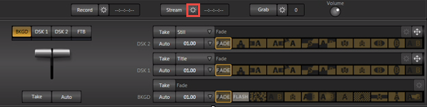
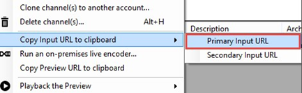

<properties 
	pageTitle="Configure the Tricaster encoder to send a single bitrate live stream" 
	description="This topic shows how to configure the Tricaster live encoder to send a single bitrate live stream to the Media Services Channel." 
	services="media-services" 
	documentationCenter="" 
	authors="juliako" 
	manager="dwrede" 
	editor=""/>

<tags 
	ms.service="media-services" 
	ms.workload="media" 
	ms.tgt_pltfrm="na" 
	ms.devlang="na" 
	ms.topic="article" 
	ms.date="09/25/2015"    
	ms.author="juliako"/>

#Use the Tricaster encoder to send a single bitrate live stream

> [AZURE.SELECTOR]
- [Tricaster](media-services-configure-tricaster-live-encoder.md)
- [Elemental Live](media-services-configure-elemental-live-encoder.md)
- [Wirecast](media-services-configure-wirecast-live-encoder.md)
- [FMLE](media-services-configure-fmle-live-encoder.md) 

This topic shows how to configure the Tricaster live encoder to send a single bitrate live stream over RTMP to the Media Services Channel.  For more information, see [Working with Channels that are Enabled to Perform Live Encoding with Azure Media Services](media-services-manage-live-encoder-enabled-channels.md).

##Prerequisites

- [Create an Azure Media Services account](media-services-create-account.md)
- Ensure there is a Streaming Endpoint running with at least one streaming unit allocated. For more information, see [Manage Streaming Endpoints in a Media Services Account](media-services-manage-origins.md) 

	This tutorial shows how to manage Azure Media Services (AMS) with Azure Media Services Explorer (AMSE) tool. 

- Install the latest version of the [AMSE](https://github.com/Azure/Azure-Media-Services-Explorer) tool. 
- Launch the tool and connect to your AMS account.

##Tips

- Whenever possible, use a hardwired internet connection. 
- A good rule of thumb when determining bandwidth requirements is to double the streaming bitrates. While this is not a mandatory requirement, it will help mitigate the impact of network congestion.  
- When using software based encoders, close out any unnecessary programs.
 
## Create a channel

1.  In the AMSE tool, navigate to the **Live** tab, and right click within the channel area. Select **Create channel…** from the menu.  

	

2. Specify a channel name, the description field is optional. Under Channel Settings, select **Standard** for the Live Encoding option, with the Input Protocol set to **RTMP**. You can leave all other settings as is.  

	 Make sure the **Start the new channel now** is selected. 
 
3. Click **Create Channel**.  
	

>[AZURE.NOTE] The channel can take as long as 20 minutes to start.  

While the channel is starting you can [configure the encoder](media-services-configure-tricaster-live-encoder.md#configure_tricaster_rtmp).

>[AZURE.IMPORTANT] Note that billing starts as soon as Channel goes into a ready state. For more information, see [Channel's states](media-services-manage-live-encoder-enabled-channels.md#states).

##Configure the Tricaster encoder

In this tutorial the following output settings are used. The rest of this section describes configuration steps in more detail. 

**Video**:
 
- Codec: H.264 
- Profile: High (Level 4.0) 
- Bitrate: 5000 kbps 
- Keyframe: 2 seconds (60 seconds) 
- Frame Rate: 30
 
**Audio**:

- Codec: AAC (LC) 
- Bitrate: 192 kbps 
- Sample Rate: 44.1 kHz

###Configuration steps

1. Create a new **Tricaster** project depending on what video input source is being used. 
2. Once within that project, find the **Stream** button, and click the gear icon next to it to access the stream configuration menu.

	
3. Once the menu has opened, click **New** under the Connection heading. When prompted for the connection type, select **Adobe Flash**.

	

4. Click **OK**.

5. An FMLE profile can now be imported by clicking the drop down arrow under **Streaming Profile** and navigating to **Browse**.

	

6. Navigate to where the configured FMLE profile was saved.
7. Select it, and press **OK**.

	Once the profile is uploaded, proceed to the next step.

6. Get the channel's input URL in order to assign it to the Tricaster **RTMP Endpoint**.
	
	Navigate back to the AMSE tool, and check on the channel completion status. Once the State has changed from **Starting** to **Running**, you can get the input URL.
	  
	When the channel is running, right click the channel name, navigate down to hover over **Copy Input URL to clipboard** and then select **Primary Input 
	URL**.  
	
	

7. Paste this information in the **Location** field under **Flash Server** within the Tricaster project. Also assign a stream name in the **Stream ID** field. 

	If stream information was added to the FMLE profile, it can also be imported to this section by clicking **Import Settings**, navigating to the saved FMLE profile and clicking **OK**. The relevant Flash Server fields should populate with the information from FMLE.

	

9. When finished, click **OK** at the bottom of the screen. When video and audio inputs into the Tricaster are ready, begin streaming to AMS by clicking the **Stream** button.

	

>[AZURE.IMPORTANT] Before you click **Stream**, you **must** ensure that the Channel is ready. 
>Also, make sure not to leave the Channel in a ready state without an input contribution feed for longer than > 15 minutes. 

##Test playback
  
1. Navigate to the AMSE tool, and right click the channel to be tested. From the menu, hover over **Playback the Preview** and select **with Azure Media Player**.  

	

If the stream appears in the player, then the encoder has been properly configured to connect to AMS. 

If an error is received, the channel will need to be reset and encoder settings adjusted. Please see the [troubleshooting](#troubleshooting) section for guidance.  

##Create a program

1. Once channel playback is confirmed, create a program. Under the **Live** tab in the AMSE tool, right click within the program area and select **Create New Program**.  

	

2. Name the program and, if needed, adjust the **Archive Window Length** (which defaults to 4 hours). You can also specify a storage location or leave as the default.  
3. Check the **Start the Program now** box.
4. Click **Create Program**.  
  
	Note: Program creation takes less time than channel creation.    
 
5. Once the program is running, confirm playback by right clicking the program and navigating to **Playback the program(s)** and then selecting **with Azure Media Player**.  
6. Once confirmed, right click the program again and select **Copy the Output URL to Clipboard** (or retrieve this information from the **Program information and settings** option from the menu). 

The stream is now ready to be embedded in a player, or distributed to an audience for live viewing.  

## Troubleshooting

###Problem: There is no option for outputting a progressive stream

- **Potential issue**: The encoder being used doesn't automatically deinterlace. 

	**Troubleshooting steps**: Look for a de-interlacing option within the encoder interface. Once de-interlacing is enabled, check again for progressive output settings. 
 
###Problem: Tried several encoder output settings and still unable to connect. 

- **Potential issue**: Azure encoding channel was not properly reset. 

	**Troubleshooting steps**: Make sure the encoder is no longer pushing to AMS, stop and reset the channel. Once running again, try connecting your encoder with the new settings. If this still does not correct the issue, try creating a new channel entirely, sometimes channels can become corrupt after several failed attempts.  

- **Potential issue**: The GOP size or key frame settings are not optimal. 

	**Troubleshooting steps**: Recommended GOP size or keyframe interval is 2 seconds. Some encoders calculate this setting in number of frames, while others use seconds. For example: When outputting 30fps, the GOP size would be 60 frames, which is equivalent to 2 seconds.  
	 
- **Potential issue**: Closed ports are blocking the stream. 

	**Troubleshooting steps**: When streaming via RTMP, check firewall and/or proxy settings to confirm that outbound ports 1935 and 1936 are open. When using RTP streaming, confirm that outbound port 2010 is open. 

###Problem: When configuring the encoder to stream with the RTP protocol, there is no place to enter a host name. 

- **Potential issue**: Many RTP encoders do not allow for host names, and an IP address will need to be acquired.  

	**Troubleshooting steps**: To find the IP address, open a command prompt on any computer. To do this in Windows, open the Run launcher (WIN + R) and type “cmd” to open.  

	Once the command prompt is open, type "Ping [AMS Host Name]". 

	The host name can be derived by omitting the port number from the Azure Ingest URL, as highlighted in the following example: 

	rtp://test2-amstest009.rtp.channel.mediaservices.windows.net:2010/ 

	

###Problem: Unable to playback the published stream.
 
- **Potential issue**: There is no Streaming Endpoint running, or there is no streaming units (scale units) allocated. 

	**Troubleshooting steps**: Navigate to the "Streaming Endpoint" tab in the AMSE tool, and confirm there is a Streaming Endpoint running with one streaming unit. 
	
>[AZURE.NOTE] If after following the troubleshooting steps you still cannot successfully stream, submit a support ticket using the Azure Management Portal.

##Media Services learning paths

You can view AMS learning paths here:

- [AMS Live Streaming Workflow](http://azure.microsoft.com/documentation/learning-paths/media-services-streaming-live/)
- [AMS on Demand Streaming Workflow](http://azure.microsoft.com/documentation/learning-paths/media-services-streaming-on-demand/)