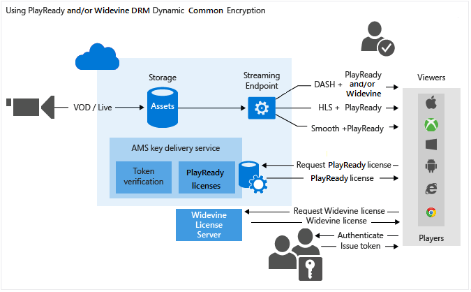

<properties 
	pageTitle="Protecting Content Overview" 
	description="This articles give an overview of content protection with Media Services." 
	services="media-services" 
	documentationCenter="" 
	authors="Juliako" 
	manager="erikre" 
	editor=""/>

<tags 
	ms.service="media-services" 
	ms.workload="media" 
	ms.tgt_pltfrm="na" 
	ms.devlang="na" 
	ms.topic="article" 
	ms.date="06/22/2016" 
	ms.author="juliako"/>

#Protecting Content Overview

Microsoft Azure Media Services enables you to secure your media from the time it leaves your computer through storage, processing, and delivery. Media Services allows you to deliver your content encrypted dynamically with Advanced Encryption Standard (AES) (using 128-bit encryption keys) and common encryption (CENC) using PlayReady and/or Widevine DRM. Media Services also provides a service for delivering AES keys and PlayReady licenses to authorized clients. You can also use the following AMS partners to help you deliver Widevine licenses: [Axinom](http://www.axinom.com/press/ibc-axinom-drm-6/), [EZDRM](http://ezdrm.com/), [castLabs](http://castlabs.com/company/partners/azure/).

- The following image demonstrates the "PlayReady and/or Widevine DRM dynamic common encryption" workflow. For details, see [Using PlayReady and/or Widevine DRM dynamic common encryption](media-services-protect-with-drm.md).

- The following image demonstrates the "AES-128 dynamic encryption" workflow. For details, see [Use AES-128 Dynamic Encryption and Key Delivery Service](media-services-protect-with-aes128.md).

>[AZURE.NOTE]To be able to use dynamic encryption, you must first get at least one streaming reserved unit on the streaming endpoint from which you want to stream encrypted content.

##Asset encryption options

Depending on the type of content you want to upload, store, and deliver, Media Services provides various encryption options that you can choose from.

###None 

No encryption is used. This is the default value. When using this option your content is not protected in transit or at rest in storage.

If you plan to deliver an MP4 using progressive download, use this option to upload your content.

###StorageEncrypted 

Use **StorageEncrypted** to encrypt your clear content locally using AES 256 bit encryption and then upload it to Azure Storage where it is stored encrypted at rest. Assets protected with storage encryption are automatically unencrypted and placed in an encrypted file system prior to encoding, and optionally re-encrypted prior to uploading back as a new output asset. The primary use case for storage encryption is when you want to secure your high quality input media files with strong encryption at rest on disk.

In order to deliver a storage encrypted asset, you must configure the asset’s delivery policy so Media Services knows how you want to deliver your content. Before your asset can be streamed, the streaming server removes the storage encryption and streams your content using the specified delivery policy (for example, AES, common encryption, or no encryption).

####Implementation details

The AMS storage encryption applies **AES-CTR** mode encryption to the entire file.  AES-CTR mode is a block cipher that can encrypt arbitrary length data without need for padding. It operates by encrypting a counter block with the AES algorithm and then XOR-ing the output of AES with the data to encrypt or decrypt.  The counter block used is constructed by copying the value of the InitializationVector to bytes 0 to 7 of the counter value and bytes 8 to 15 of the counter value are set to zero. Of the 16 byte counter block, bytes 8 to 15 (i.e. the least significant bytes) are used as a simple 64 bit unsigned integer that is incremented by one for each subsequent block of data processed and is kept in network byte order. Note that if this integer reaches the maximum value (0xFFFFFFFFFFFFFFFF) then incrementing it resets the block counter to zero (bytes 8 to 15) without affecting the other 64 bits of the counter (i.e. bytes 0 to 7).   In order to maintain the security of the AES-CTR mode encryption, the InitializationVector value for a given KID shall be unique for each file and files shall be less than 2^64 blocks in length.  This is to ensure that a counter value is never reused with a given key. For more information about the CTR mode, see [this wiki page](https://en.wikipedia.org/wiki/Block_cipher_mode_of_operation#CTR) (the wiki article uses the term "Nonce" instead of "InitializationVector").

If you want to see how the basic algorithm works, view the AMS .NET implementation of the following methods:

- [ApplyEncryptionTransform](https://github.com/Azure/azure-sdk-for-media-services/blob/dev/src/net/Client/Common/Common.BlobTransfer/BlobTransferBase.cs)
- [AesCtr](https://github.com/Azure/azure-sdk-for-media-services/blob/dev/src/net/Client/Common/Common.FileEncryption/FileEncryptionTransform.cs)

###CommonEncryptionProtected 

Use **CommonEncryptionProtected** if you want to encrypt (or upload already encrypted) content with Common Encryption. Both PlayReady and Widewine are encrypted per the Common Encryption (CENC) specification and are supported by AMS.

###EnvelopeEncryptionProtected

Use **EnvelopeEncryptionProtected** if you want to protect (or upload already protected) HTTP Live Streaming (HLS) encrypted with Advanced Encryption Standard (AES). Note that if you are uploading HLS already encrypted with AES, it must have been encrypted by Transform Manager.

##Dynamic encryption

Microsoft Azure Media Services enables you to deliver your content encrypted  dynamically with Advanced Encryption Standard (AES) (using 128-bit encryption keys) and PlayReady and/or Widevine DRM.

Currently, you can encrypt the following streaming formats: HLS, MPEG DASH, and Smooth Streaming. You cannot encrypt HDS streaming format, or progressive downloads.

If you want for Media Services to encrypt an asset, you need to associate an encryption key (CommonEncryption or EnvelopeEncryption) with your asset and also configure authorization policies for the key.

You also need to configure the asset's delivery policy. If you want to stream a storage encrypted asset, make sure to specify how you want to deliver it by configuring asset delivery policy.

When a stream is requested by a player, Media Services uses the specified key to dynamically encrypt your content using AES or common encryption. To decrypt the stream, the player will request the key from the key delivery service. To decide whether or not the user is authorized to get the key, the service evaluates the authorization policies that you specified for the key.

>[AZURE.NOTE]To take advantage of dynamic encryption, you must first get at least one On-demand streaming unit for the streaming endpoint from which you plan to delivery your encrypted content. For more information, see [How to Scale Media Services](media-services-manage-origins.md#scale_streaming_endpoints).

##Licenses and keys delivery service

Media Services provides a service for delivering DRM (PlayReady and Widevine) licenses and AES clear keys to authorized clients. You can use the Azure Classic Portal, REST API, or Media Services SDK for .NET to configure authorization and authentication policies for your licenses and keys.

Note if you are using the Portal, you can configure one AES policy (which will be applied to all the AES encrypted content) and one PlayReady policy (which will be applied to all the PlayReady encrypted content). Use Media Services SDK for .NET if you want more control over the configurations.

##DRM licenses 

###PlayReady license 

Media Services provides a service for delivering PlayReady licenses. When the end user player (for example, Silverlight) tries to play your PlayReady protected content, a request is sent to the license delivery service to obtain a license. If the license service approves the request, it issues the license which is sent to the client and can be used to decrypt and play the specified content.

Licenses contain the rights and restrictions that you want for the PlayReady DRM runtime to enforce when a user is trying to playback protected content. Media Services provides APIs that let you configure your PlayReady licenses. For more information, see [Media Services PlayReady License Template Overview](media-services-playready-license-template-overview.md).

###Widevine license

AMS also enables you to delivery MPEG DASH encrypted with Widevine DRM. Both PlayReady and Widewine are encrypted per the Common Encryption (CENC) specification. You can use [AMS .NET SDK](https://www.nuget.org/packages/windowsazure.mediaservices/) (starting with the version 3.5.1) or REST API to configure your AssetDeliveryConfiguration to use Widevine.

Starting with the Media Services .NET SDK version 3.5.2, Media Services enables you to configure [Widevine license template](media-services-widevine-license-template-overview.md) and get Widevine licenses. You can also use the following AMS partners to help you deliver Widevine licenses: [Axinom](http://www.axinom.com/press/ibc-axinom-drm-6/), [EZDRM](http://ezdrm.com/), [castLabs](http://castlabs.com/company/partners/azure/).

##Token restriction

The content key authorization policy could have one or more authorization restrictions: open or token restriction. The token restricted policy must be accompanied by a token issued by a Secure Token Service (STS). Media Services supports tokens in the Simple Web Tokens (SWT) format and JSON Web Token (JWT) format. Media Services does not provide Secure Token Services. You can create a custom STS or leverage Microsoft Azure ACS to issue tokens. The STS must be configured to create a token signed with the specified key and issue claims that you specified in the token restriction configuration. The Media Services key delivery service will return the requested key (or license) to the client if the token is valid and the claims in the token match those configured for the key (or license).

When configuring the token restricted policy, you must specify the primary verification key, issuer and audience parameters. The primary verification key contains the key that the token was signed with, issuer is the secure token service that issues the token. The audience (sometimes called scope) describes the intent of the token or the resource the token authorizes access to. The Media Services key delivery service validates that these values in the token match the values in the template.

##Common scenarios

###Protect content in storage, deliver dynamically encrypted streaming media, use AMS key/license delivery service

1. Ingest a high-quality mezzanine file into an asset. Apply storage encryption option to the asset.
2. Configure streaming endpoints.
1. Encode to adaptive bitrate MP4 set. Apply storage encryption option to the output asset.
1. Create encryption content key for the asset you want to be dynamically encrypted during playback.
2. Configure content key authorization policy.
1. Configure asset delivery policy (used by dynamic packaging and dynamic encryption).
1. Publish the asset by creating an OnDemand locator.
1. Stream published content.

For for more information see: [Protect with AES](media-services-protect-with-aes128.md) and [Protect with PlayReady and/or Widevine ](media-services-protect-with-drm.md).

###Use Media Service key and license delivery service with your own encryption and streaming services

For more information, see [How to integrate Azure PlayReady License service with your own encryptor/streaming server](http://mingfeiy.com/integrate-azure-playready-license-service-encryptorstreaming-server).

###Integrate with partners

[Using castLabs to deliver DRM licenses to Azure Media Services](media-services-castlabs-integration.md)

##Media Services learning paths

[AZURE.INCLUDE [media-services-learning-paths-include](../../includes/media-services-learning-paths-include.md)]

##Provide feedback

[AZURE.INCLUDE [media-services-user-voice-include](../../includes/media-services-user-voice-include.md)]

##Related Links

[Announcing PlayReady as a service and AES dynamic encryption with Azure Media Services](http://mingfeiy.com/playready)

[Azure Media Services PlayReady license delivery pricing explained](http://mingfeiy.com/playready-pricing-explained-in-azure-media-services)

[How to debug for AES encrypted stream in Azure Media Services](http://mingfeiy.com/debug-aes-encrypted-stream-azure-media-services)

[JWT token authenitcation](http://www.gtrifonov.com/2015/01/03/jwt-token-authentication-in-azure-media-services-and-dynamic-encryption/)

[Integrate Azure Media Services OWIN MVC based app with Azure Active Directory and restrict content key delivery based on JWT claims](http://www.gtrifonov.com/2015/01/24/mvc-owin-azure-media-services-ad-integration/).

[Use Azure ACS to issue tokens](http://mingfeiy.com/acs-with-key-services).

[content-protection]: ./media/media-services-content-protection-overview/media-services-content-protection.png
