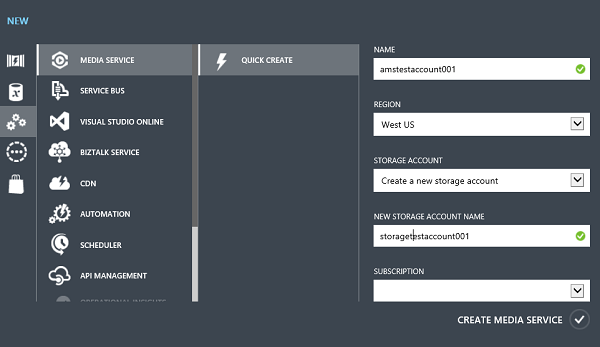

<properties
	pageTitle="Create a Media Services account | Microsoft Azure"
	description="Describes how to create a new Azure Media Services account in Azure."
	services="media-services"
	documentationCenter=""
	authors="Juliako"
	manager="erikre"
	editor=""/>

<tags
	ms.service="media-services"
	ms.workload="media"
	ms.tgt_pltfrm="na"
	ms.devlang="na"
	ms.topic="get-started-article"
	ms.date="06/22/2016"
	ms.author="juliako"/>

# Create an Azure Media Services account

> [AZURE.SELECTOR]
- [Portal](media-services-create-account.md)
- [PowerShell](media-services-manage-with-powershell.md)
- [REST](http://msdn.microsoft.com/library/azure/dn194267.aspx)

> [AZURE.NOTE] To complete this tutorial, you need an Azure account. For details, see [Azure Free Trial](/pricing/free-trial/?WT.mc_id=A261C142F).
 
The Azure Classic Portal provides a way to quickly create an Azure Media Services account. You can use your account to access Media Services that enable you to store, encrypt, encode, manage, and stream media content in Azure. At the time you create a Media Services account, you also create an associated storage account (or use an existing one) in the same geographic region as the Media Services account.

This article explains how to use the Quick Create method to create a new Media Services account and then associate it with a storage account.

## Concepts

Accessing Media Services requires two associated accounts:

-   **A Media Services account**. Your account gives you access to a set of cloud-based Media Services that are available in Azure. A Media Services account does not store actual media content. Instead it stores metadata about the media content and media processing jobs in your account. At the time you create the account, you select an available Media Services region. The region you select is a data center that stores the metadata records for your account.

	Available Media Services (AMS) regions include the following: North Europe, West Europe, West US, East US, Southeast Asia, East Asia, Japan West, Japan East. Media Services does not use affinity groups.
	
	AMS is now also available in the following data centers: Brazil South, India West, India South and India Central. You can now use the Azure Classic Portal to [create Media Service accounts](media-services-create-account.md#create-a-media-services-account-using-quick-create) and perform various tasks described [here](https://azure.microsoft.com/documentation/services/media-services/). However, Live Encoding is not enabled in these data centers. Further, not all types of Encoding Reserved Units are available in these data centers.
	
	- Brazil South:                                          Only Standard and Basic Encoding Reserved Units are available
	- India West, India South and India Central:             Only Basic Encoding Reserved Units are available

-   **An associated storage account**. Your storage account is an Azure storage account that is associated with your Media Services account. The storage account provides blob storage for media files, and must be located in the same geographic region as the Media Services account. When you create a Media Services account, you can either choose an existing storage account in the same region, or you can create a new storage account in the same region. If you delete a Media Services account, the blobs in your related storage account are not deleted.

## Create a Media Services account using Quick Create

1. In the [Azure Classic Portal][], click **New**, click **Media Service**, and then click **Quick Create**.

2. In **NAME**, enter the name of the new account. A Media Services account name is all lowercase numbers or letters with no spaces, and is 3 to 24 characters in length.

3. In **REGION**, select the geographic region that will be used to store the metadata records for your Media Services account. Only the available Media Services regions appear in the drop-down list.

4. In **STORAGE ACCOUNT**, select a storage account to provide blob storage of the media content from your Media Services account. You can select an existing storage account in the same geographic region as your Media Services account, or you can create a new storage account. A new storage account is created in the same region.

5. If you created a new storage account, in **NEW STORAGE ACCOUNT NAME**, enter a name for the storage account. The rules for storage account names are the same as for Media Services accounts.

6. Click **Quick Create** at the bottom of the form.

You can monitor the status of the process in the message area at the bottom of the window.

The status changes to Active when the account is successfully created. The **media services** page opens with the new account displayed.

At the bottom of the page, the **MANAGE KEYS** button appears. When you click this button, a page with the Media Services account name and the primary and secondary keys is displayed. You will need the account name and the primary key information to programmatically access the Media Services account.

When you double-click the account name, the **Quick Start** page is displayed by default. This page enables you to do some management tasks that are also available on other pages of the portal. For example, you can upload a video file from this page, or do it from the **CONTENT** page.

In addition, you can view code that uses the Azure Media Services SDK to accomplish the following tasks: upload, encode, and publish videos. You can click one of the links under the **WRITE SOME CODE** section, copy the code  and use it in your application.

##Media Services learning paths

[AZURE.INCLUDE [media-services-learning-paths-include](../../includes/media-services-learning-paths-include.md)]

##Provide feedback

[AZURE.INCLUDE [media-services-user-voice-include](../../includes/media-services-user-voice-include.md)]

## Next steps

- [Get started with delivering Video-on-Demand (VoD) content using .NET SDK](media-services-dotnet-get-started.md)

- [Use .NET SDK to create channels that perform live encoding from a single-bitrate to multi-bitrate stream](media-services-dotnet-creating-live-encoder-enabled-channel.md)

<!-- Reusable paths. -->

<!-- Anchors. -->
  [Concepts]: #concepts
  [Before you begin]: #begin
  [How to: Create a Media Services account using Quick Create]: #quick

<!-- URLs. -->
  [Web Platform Installer]: http://go.microsoft.com/fwlink/?linkid=255386

  [Azure Classic Portal]: http://manage.windowsazure.com/
