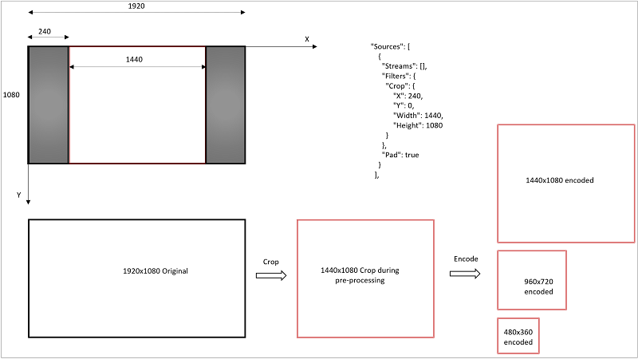

<properties
	pageTitle="How to crop video | Microsoft Azure"
	description="This article shows how to crop videos with Media Encoder Standard."
	services="media-services"
	documentationCenter=""
	authors="anilmur"
	manager="erikre"
	editor=""/>

<tags
	ms.service="media-services"
	ms.workload="media"
	ms.tgt_pltfrm="na"
	ms.devlang="dotnet"
	ms.topic="article"
	ms.date="07/11/2016"  
	ms.author="anilmur;juliako;"/>

# Crop videos with Media Encoder Standard

You can use Media Encoder Standard (MES) to crop your input video. Cropping is the process of selecting a rectangular window within the video frame, and encoding just the pixels within that window. The following diagram helps illustrate the process.

Suppose you have as input a video that has a resolution of 1920x1080 pixels (16:9 aspect ratio), but has black bars (pillar boxes) at the left and right, so that only a 4:3 window or 1440x1080 pixels contains active video. You can use MES to crop or edit out the black bars, and encode the 1440x1080 region.

Cropping in MES is a pre-processing stage, so the cropping parameters in the encoding preset apply to the original input video. Encoding is a subsequent stage, and the width/height settings apply to the *pre-processed* video, and not to the original video. When designing your preset you need to do the following: (a) select the crop parameters based on the original input video, and (b) select your encode settings based on the cropped video. If you do not match your encode settings to the cropped video, the output will not be as you expect.

The [following](media-services-advanced-encoding-with-mes.md#encoding_with_dotnet) topic shows how to create an encoding job with MES and how to specify a custom preset for the encoding task. 

## Creating a custom preset

In the example shown in the diagram:

1. Original input is 1920x1080
1. It needs to be cropped to an output of 1440x1080, which is centered in the input frame
1. This means an X offset of (1920 – 1440)/2 = 240, and a Y offset of zero
1. The Width and Height of the Crop rectangle are 1440 and 1080, respectively
1. In the encode stage, the ask is to produce three layers, are resolutions 1440x1080, 960x720 and 480x360, respectively

###JSON preset

	{
	  "Version": 1.0,
	  "Sources": [
	    {
	      "Streams": [],
	      "Filters": {
	        "Crop": {
	            "X": 240,
	            "Y": 0,
	            "Width": 1440,
	            "Height": 1080
	        }
	      },
	      "Pad": true
	    }
	  ],
	  "Codecs": [
	    {
	      "KeyFrameInterval": "00:00:02",
	      "H264Layers": [
	        {
	          "Profile": "Auto",
	          "Level": "auto",
	          "Bitrate": 3400,
	          "MaxBitrate": 3400,
	          "BufferWindow": "00:00:05",
	          "Width": 1440,
	          "Height": 1080,
	          "BFrames": 3,
	          "ReferenceFrames": 3,
	          "AdaptiveBFrame": true,
	          "Type": "H264Layer",
	          "FrameRate": "0/1"
	        },
	        {
	          "Profile": "Auto",
	          "Level": "auto",
	          "Bitrate": 2250,
	          "MaxBitrate": 2250,
	          "BufferWindow": "00:00:05",
	          "Width": 960,
	          "Height": 720,
	          "BFrames": 3,
	          "ReferenceFrames": 3,
	          "AdaptiveBFrame": true,
	          "Type": "H264Layer",
	          "FrameRate": "0/1"
	        },
	        {
	          "Profile": "Auto",
	          "Level": "auto",
	          "Bitrate": 1250,
	          "MaxBitrate": 1250,
	          "BufferWindow": "00:00:05",
	          "Width": 480,
	          "Height": 360,
	          "BFrames": 3,
	          "ReferenceFrames": 3,
	          "AdaptiveBFrame": true,
	          "Type": "H264Layer",
	          "FrameRate": "0/1"
	        }
	      ],
	      "Type": "H264Video"
	    },
	    {
	      "Profile": "AACLC",
	      "Channels": 2,
	      "SamplingRate": 48000,
	      "Bitrate": 128,
	      "Type": "AACAudio"
	    }
	  ],
	  "Outputs": [
	    {
	      "FileName": "{Basename}_{Width}x{Height}_{VideoBitrate}.mp4",
	      "Format": {
	        "Type": "MP4Format"
	      }
	    }
	  ]
	}

##Restrictions on cropping

The cropping feature is meant to be manual. You would need to load your input video into a suitable editing tool that lets you select frames of interest, position the cursor to determine offsets for the cropping rectangle, to determine the encoding preset that is tuned for that particular video, etc. This feature is not meant to enable things like: automatic detection and removal of black letterbox/pillarbox borders in your input video.

Following constraints apply to the cropping feature. If these are not met, the encode Task can fail, or produce an unexpected output.

1. The co-ordinates and size of the Crop rectangle have to fit within the input video
1. As mentioned above, the Width & Height in the encode settings have to correspond to the cropped video
1. Cropping applies to videos captured in landscape mode (i.e. not applicable to videos recorded with a smartphone held vertically or in portrait mode)
1. Works best with progressive video captured with square pixels

##Provide feedback

[AZURE.INCLUDE [media-services-user-voice-include](../../includes/media-services-user-voice-include.md)]

##Next step
 
See Azure Media Services learning paths to help you learn about great features offered by AMS.  

[AZURE.INCLUDE [media-services-learning-paths-include](../../includes/media-services-learning-paths-include.md)]
