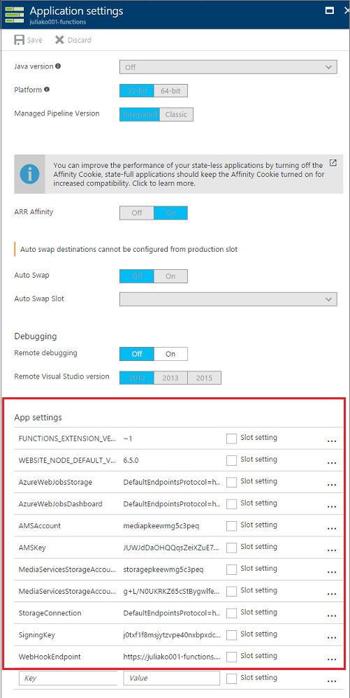
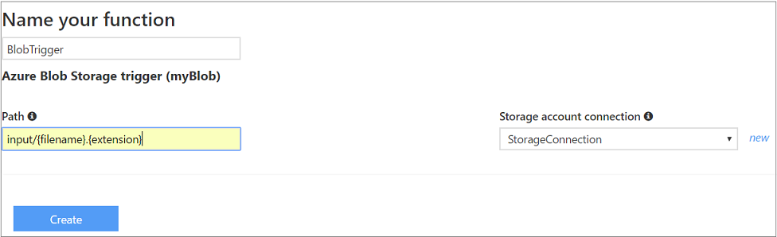
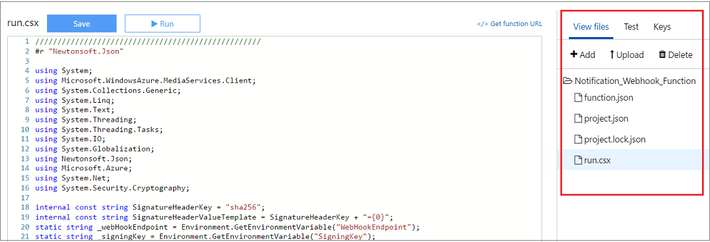

#Develop Azure Functions with Media Services

This topic discusses how to start developing Azure Functions with Media Services using the Azure portal. 

You can also deploy existing [Media Services Azure Functions](https://github.com/Azure-Samples/media-services-dotnet-functions-integration) by pressing the **Deploy to Azure** button. This repository contains Azure Functions examples that use Azure Media Services to show workflows related to ingesting content directly from blob storage, encoding, and writing content back to blob storage. It also includes examples of how to monitor job notifications via WebHooks and Azure Queues. You can also develop your Functions based on the examples in the [Media Services Azure Functions](https://github.com/Azure-Samples/media-services-dotnet-functions-integration) repository. 

This topic shows you how to get started with creating Azure Functions that use Media Services. The Azure Function defined in this topic monitors a storage account container named **input** for new MP4 files. Once a file is dropped into the storage container, the blob trigger will execute the function.

## Prerequisites

- Before you can create your first function, you need to have an active Azure account. If you don't already have an Azure account, [free accounts are available](https://azure.microsoft.com/free/).
- If you are going to create Azure Functions that perform actions on your Azure Media Services (AMS) account or listen to events sent by Media Services, you should create an AMS account, as described [here](media-services-portal-create-account.md).
- Understanding of [how to use Azure functions](../azure-functions/functions-overview.md). Also, review:
	- [Azure functions HTTP and webhook bindings](../azure-functions/functions-triggers-bindings.md)
	- [How to configure Azure Function app settings](../azure-functions/functions-how-to-use-azure-function-app-settings.md)
	
## Considerations

-  Azure Functions running under the Consumption plan have 5 minutes timeout limit.

## Create a function app

1. Go to the [Azure portal](http://portal.azure.com) and sign-in with your Azure account.
2. Create a function app as described [here](../azure-functions/functions-create-function-app-portal.md).

>[!NOTE]
> A storage account that you specify in the **StorageConnection** environment variable (see the next step) should be in the same region as your app.

## Configure function app settings

When developing Media Services functions, it is handy to add environment variables that will be used throughout your functions. To configure app settings, click the Configure App Settings link. For more information, see  [How to configure Azure Function app settings](../azure-functions/functions-how-to-use-azure-function-app-settings.md). 

For example:

The function, defined in this article, assumes you have the following environment variables in your app settings:

**AMSAccount** : *AMS account name* (e.g. testams)

**AMSKey** : *AMS account key* (e.g. IHOySnH+XX3LGPfraE5fKPl0EnzvEPKkOPKCr59aiMM=)

**MediaServicesStorageAccountName** : *storage account name* (e.g., testamsstorage)

**MediaServicesStorageAccountKey** : *storage account key* (e.g., xx7RN7mvpcipkuXvn5g7jwxnKh5MwYQ/awZAzkSIxQA8tmCtn93rqobjgjt41Wb0zwTZWeWQHY5kSZF0XXXXXX==)

**StorageConnection** : *storage connection* (e.g., DefaultEndpointsProtocol=https;AccountName=testamsstorage;AccountKey=xx7RN7mvpcipkuXvn5g7jwxnKh5MwYQ/awZAzkSIxQA8tmCtn93rqobjgjt41Wb0zwTZWeWQHY5kSZF0XXXXX==)

## Create a function

Once your function app is deployed, you can find it among **App Services** Azure Functions.

1. Select your function app and click **New Function**.
2. Choose the **C#** language and **Data Processing** scenario.
3. Choose **BlobTrigger** template. This function will be triggered whenever a blob is uploaded into the **input** container. The **input** name is specified in the **Path**, in the next step.

	

4. Once you select **BlobTrigger**, some more controls will appear on the page.

	

4. Click **Create**. 

## Files

Your Azure function is associated with code files and other files that are described in this section. By default, a function is associated with **function.json** and **run.csx** (C#) files. You will need to add a **project.json** file. The rest of this section shows the definitions for these files.

### function.json

The function.json file defines the function bindings and other configuration settings. The runtime uses this file to determine the events to monitor and how to pass data into and return data from function execution. For more information, see [Azure functions HTTP and webhook bindings](../azure-functions/functions-reference.md#function-code).

>[!NOTE]
>Set the **disabled** property to **true** to prevent the function from being executed. 

Here is an example of **function.json** file.

	{
	"bindings": [
	  {
	    "name": "myBlob",
	    "type": "blobTrigger",
	    "direction": "in",
	    "path": "input/{fileName}.mp4",
	    "connection": "StorageConnection"
	  }
	],
	"disabled": false
	}

### project.json

The project.json file contains dependencies. Here is an example of **project.json** file that includes the required .NET Azure Media Services packages from Nuget. Note that the version numbers will change with latest updates to the packages, so you should confirm the most recent versions. 

	{
	  "frameworks": {
	    "net46":{
	      "dependencies": {
		"windowsazure.mediaservices": "3.8.0.5",
		"windowsazure.mediaservices.extensions": "3.8.0.3"
	      }
	    }
	   }
	}
	
### run.csx

This is the C# code for your function.  The function defined below monitors a storage account container named **input** (that is what was specified in the path) for new MP4 files. Once a file is dropped into the storage container, the blob trigger will execute the function.
	
The example defined in this section demonstrates 

1. how to ingest an asset into a Media Services account (by coping a blob into an AMS asset) and 
2. how to submit an encoding job that uses Media Encoder Standard's "Adaptive Streaming" preset .

In the real life scenario, you most likely want to track job progress and then publish your encoded asset. For more information, see [Use Azure WebHooks to monitor Media Services job notifications](media-services-dotnet-check-job-progress-with-webhooks.md). For more examples, see [Media Services Azure Functions](https://github.com/Azure-Samples/media-services-dotnet-functions-integration).  

Once you are done defining your function click **Save and Run**.

	#r "Microsoft.WindowsAzure.Storage"
	#r "Newtonsoft.Json"
	#r "System.Web"

	using System;
	using Microsoft.WindowsAzure.MediaServices.Client;
	using System.Collections.Generic;
	using System.Linq;
	using System.Text;
	using System.Net;
	using System.Threading;
	using System.Threading.Tasks;
	using System.IO;
	using Microsoft.WindowsAzure.Storage;
	using Microsoft.WindowsAzure.Storage.Blob;
	using Microsoft.WindowsAzure.Storage.Auth;

	private static readonly string _mediaServicesAccountName = Environment.GetEnvironmentVariable("AMSAccount");
	private static readonly string _mediaServicesAccountKey = Environment.GetEnvironmentVariable("AMSKey");

	static string _storageAccountName = Environment.GetEnvironmentVariable("MediaServicesStorageAccountName");
	static string _storageAccountKey = Environment.GetEnvironmentVariable("MediaServicesStorageAccountKey");

	private static CloudStorageAccount _destinationStorageAccount = null;

	// Field for service context.
	private static CloudMediaContext _context = null;
	private static MediaServicesCredentials _cachedCredentials = null;

	public static void Run(CloudBlockBlob myBlob, string fileName, TraceWriter log)
	{
	    // NOTE that the variables {fileName} here come from the path setting in function.json
	    // and are passed into the  Run method signature above. We can use this to make decisions on what type of file
	    // was dropped into the input container for the function. 

	    // No need to do any Retry strategy in this function, By default, the SDK calls a function up to 5 times for a 
	    // given blob. If the fifth try fails, the SDK adds a message to a queue named webjobs-blobtrigger-poison.

	    log.Info($"C# Blob trigger function processed: {fileName}.mp4");
	    log.Info($"Using Azure Media Services account : {_mediaServicesAccountName}");

	    try
	    {
		// Create and cache the Media Services credentials in a static class variable.
		_cachedCredentials = new MediaServicesCredentials(
				_mediaServicesAccountName,
				_mediaServicesAccountKey);

		// Used the chached credentials to create CloudMediaContext.
		_context = new CloudMediaContext(_cachedCredentials);

		// Step 1:  Copy the Blob into a new Input Asset for the Job
		// ***NOTE: Ideally we would have a method to ingest a Blob directly here somehow. 
		// using code from this sample - https://azure.microsoft.com/en-us/documentation/articles/media-services-copying-existing-blob/

		StorageCredentials mediaServicesStorageCredentials =
		    new StorageCredentials(_storageAccountName, _storageAccountKey);

		IAsset newAsset = CreateAssetFromBlob(myBlob, fileName, log).GetAwaiter().GetResult();

		// Step 2: Create an Encoding Job

		// Declare a new encoding job with the Standard encoder
		IJob job = _context.Jobs.Create("Azure Function - MES Job");

		// Get a media processor reference, and pass to it the name of the 
		// processor to use for the specific task.
		IMediaProcessor processor = GetLatestMediaProcessorByName("Media Encoder Standard");

		// Create a task with the encoding details, using a custom preset
		ITask task = job.Tasks.AddNew("Encode with Adaptive Streaming",
		    processor,
		    "Adaptive Streaming",
		    TaskOptions.None); 

		// Specify the input asset to be encoded.
		task.InputAssets.Add(newAsset);

		// Add an output asset to contain the results of the job. 
		// This output is specified as AssetCreationOptions.None, which 
		// means the output asset is not encrypted. 
		task.OutputAssets.AddNew(fileName, AssetCreationOptions.None);

		job.Submit();
		log.Info("Job Submitted");

	    }
	    catch (Exception ex)
	    {
		log.Error("ERROR: failed.");
		log.Info($"StackTrace : {ex.StackTrace}");
		throw ex;
	    }
	}

	private static IMediaProcessor GetLatestMediaProcessorByName(string mediaProcessorName)
	{
	    var processor = _context.MediaProcessors.Where(p => p.Name == mediaProcessorName).
	    ToList().OrderBy(p => new Version(p.Version)).LastOrDefault();

	    if (processor == null)
		throw new ArgumentException(string.Format("Unknown media processor", mediaProcessorName));

	    return processor;
	}

	public static async Task<IAsset> CreateAssetFromBlob(CloudBlockBlob blob, string assetName, TraceWriter log){
		IAsset newAsset = null;

		try{
		    Task<IAsset> copyAssetTask = CreateAssetFromBlobAsync(blob, assetName, log);
		    newAsset = await copyAssetTask;
		    log.Info($"Asset Copied : {newAsset.Id}");
		}
		catch(Exception ex){
		    log.Info("Copy Failed");
		    log.Info($"ERROR : {ex.Message}");
		    throw ex;
		}

		return newAsset;
	}

	/// 

	/// Creates a new asset and copies blobs from the specifed storage account.
	/// 

	/// <param name="blob">The specified blob.</param>
	/// <returns>The new asset.</returns>
	public static async Task<IAsset> CreateAssetFromBlobAsync(CloudBlockBlob blob, string assetName, TraceWriter log)
	{
	     //Get a reference to the storage account that is associated with the Media Services account. 
	    StorageCredentials mediaServicesStorageCredentials =
		new StorageCredentials(_storageAccountName, _storageAccountKey);
	    _destinationStorageAccount = new CloudStorageAccount(mediaServicesStorageCredentials, false);

	    // Create a new asset. 
	    var asset = _context.Assets.Create(blob.Name, AssetCreationOptions.None);
	    log.Info($"Created new asset {asset.Name}");

	    IAccessPolicy writePolicy = _context.AccessPolicies.Create("writePolicy",
		TimeSpan.FromHours(4), AccessPermissions.Write);
	    ILocator destinationLocator = _context.Locators.CreateLocator(LocatorType.Sas, asset, writePolicy);
	    CloudBlobClient destBlobStorage = _destinationStorageAccount.CreateCloudBlobClient();

	    // Get the destination asset container reference
	    string destinationContainerName = (new Uri(destinationLocator.Path)).Segments[1];
	    CloudBlobContainer assetContainer = destBlobStorage.GetContainerReference(destinationContainerName);

	    try{
		assetContainer.CreateIfNotExists();
	    }
	    catch (Exception ex)
	    {
		log.Error ("ERROR:" + ex.Message);
	    }

	    log.Info("Created asset.");

	    // Get hold of the destination blob
	    CloudBlockBlob destinationBlob = assetContainer.GetBlockBlobReference(blob.Name);

	    // Copy Blob
	    try
	    {
		using (var stream = await blob.OpenReadAsync()) 
		{            
		    await destinationBlob.UploadFromStreamAsync(stream);          
		}

		log.Info("Copy Complete.");

		var assetFile = asset.AssetFiles.Create(blob.Name);
		assetFile.ContentFileSize = blob.Properties.Length;
		assetFile.IsPrimary = true;
		assetFile.Update();
		asset.Update();
	    }
	    catch (Exception ex)
	    {
		log.Error(ex.Message);
		log.Info (ex.StackTrace);
		log.Info ("Copy Failed.");
		throw;
	    }

	    destinationLocator.Delete();
	    writePolicy.Delete();

	    return asset;
	}
##Test your function

To test your function, you need to upload an MP4 file into the **input** container of the storage account that you specified in the connection string.  

## Next step

At this point, you are ready to start developing a Media Services application. 
 
For more details and complete samples/solutions of using Azure Functions and Logic Apps with Azure Media Services to create custom content creation workflows, see the [Media Services .NET Functions Integraiton Sample on GitHub](https://github.com/Azure-Samples/media-services-dotnet-functions-integration)

Also, see [Use Azure WebHooks to monitor Media Services job notifications with .NET](media-services-dotnet-check-job-progress-with-webhooks.md). 

## Media Services learning paths
[!INCLUDE [media-services-learning-paths-include](../../includes/media-services-learning-paths-include.md)]

## Provide feedback
[!INCLUDE [media-services-user-voice-include](../../includes/media-services-user-voice-include.md)]

