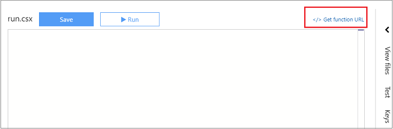

#Develop Azure Functions with Media Services
[!INCLUDE [media-services-selector-setup](../../includes/media-services-selector-setup.md)]

This topic discusses how to start developing Azure functions with Media Services using the Azure portal. 

You can also deploy existing Media Services Azure functions from [here](https://github.com/Azure-Samples/media-services-dotnet-functions-integration) by pressing the **Deploy to Azure** button. This repository contains Azure functions examples that use Azure Media Services to show workflows related to ingesting content directly from blob storage, encoding, and writing content back to blob storage. It also includes examples of how to monitor job notifications via WebHooks and Azure Queues.

You can develop your functions based on the examples in [this](https://github.com/Azure-Samples/media-services-dotnet-functions-integration) repository. This topic shows you how to get started with creating Azure functions that use Media Services. 

## Prerequisites

Before you can create your first function, you need to have an active Azure account. If you don't already have an Azure account, [free accounts are available](https://azure.microsoft.com/free/).

If you are going to create Azure functions that perform actions on your Azure Media Services (AMS) account or listen to events sent by Media Services, you should create an AMS account, as described [here](media-services-portal-create-account.md).

## Create a function app

Create Create a function app as described [here](../azure-functions/functions-create-first-azure-function-azure-portal.md#create-a-function-app).

## Create a function

Once your function app was deployed, you can find it among **App Services** Azure functions. 

1. Select your function app and click **New Function**.
3. Choose the **C#** language and **Webhook + API** scenario.
3. Select **GenericWebHook-CSharp** (will be run whenever it receives a webhook request) or **HttpTrigger-CSharp** (will be run whenever it receives an HTTP request) and name your function.
4. Click **Create**. 

## Get function URL

To trigger execution of your functions from an HTTP testing tool or from another browser window, you will need the Function URL value. 

## Files

Your Azure function is associated with code files and other files that are described in this section. By default, a function is associated with **function.json** and **run.csx** files. You will need to add a **project.json** file. The rest of this section shows the definitions for these files.

### function.json

The function.json file defines the function bindings and other configuration settings. The runtime uses this file to determine the events to monitor and how to pass data into and return data from function execution. 

Here is an example of **function.json** file.

	{
	  "bindings": [
	    {
	      "type": "httpTrigger",
	      "name": "req",
	      "direction": "in",
	      "methods": [
		"post",
		"get",
		"put",
		"update",
		"patch"
	      ]
	    },
	    {
	      "type": "http",
	      "name": "res",
	      "direction": "out"
	    }
	  ]
	}
	
### project.json

The project.json file contains dependencies. Here is an example of **function.json** file that includes AMS libraries.

	{
	  "frameworks": {
	    "net46":{
	      "dependencies": {
		"windowsazure.mediaservices": "3.8.0.5",
		"windowsazure.mediaservices.extensions": "3.8.0.3"
	      }
	    }
	   }
	}
	
### run.csx

This is the C# code for your function. For an example of a webhook function, see [this](media-services-dotnet-check-job-progress-with-webhooks.md) topic. 

Once you are done defining your function click **Run**.
	
	///////////////////////////////////////////////////
	#r "Newtonsoft.Json"
	
	using System;
	using Microsoft.WindowsAzure.MediaServices.Client;
	using System.Collections.Generic;
	using System.Linq;
	using System.Text;
	using System.Threading;
	using System.Threading.Tasks;
	using System.IO;
	using System.Globalization;
	using Newtonsoft.Json;
	using Microsoft.Azure;
	using System.Net;
	using System.Security.Cryptography;
	

	static string _mediaServicesAccountName = Environment.GetEnvironmentVariable("AMSAccount");
	static string _mediaServicesAccountKey = Environment.GetEnvironmentVariable("AMSKey");
	
	static CloudMediaContext _context = null;
	
	public static async Task<HttpResponseMessage> Run(HttpRequestMessage req, TraceWriter log)
	{
	    log.Info($"C# HTTP trigger function processed a request. RequestUri={req.RequestUri}");
	
	    Task<byte[]> taskForRequestBody = req.Content.ReadAsByteArrayAsync();
	    byte[] requestBody = await taskForRequestBody;
	
	    string jsonContent = await req.Content.ReadAsStringAsync();
	    log.Info($"Request Body = {jsonContent}");
	
		// some valication code ...

        _context = new CloudMediaContext(new MediaServicesCredentials(
        _mediaServicesAccountName,
        _mediaServicesAccountKey));

		// some AMS operations ...
  	
	    return req.CreateResponse(HttpStatusCode.BadRequest, "Generic Error.");
	}

## Configure function app settings

When developing Media Services functions it is handy to add parameters that will be used throughout your functions to the **App Settings** section. 

For example:

## Next step

At this point, you are ready to start developing a Media Services application. For more information, see [Use Azure WebHooks to monitor Media Services job notifications with .NET](media-services-dotnet-check-job-progress-with-webhooks.md);   

## Media Services learning paths
[!INCLUDE [media-services-learning-paths-include](../../includes/media-services-learning-paths-include.md)]

## Provide feedback
[!INCLUDE [media-services-user-voice-include](../../includes/media-services-user-voice-include.md)]

