<properties 
	pageTitle="Using multiple input files and component properties with Premium Encoder | Microsoft Azure" 
	description="This topic explains how to use setRuntimeProperties to use multiple input files and pass custom data to the Media Encoder Premium Workflow media processor." 
	services="media-services" 
	documentationCenter="" 
	authors="xpouyat" 
	manager="erikre" 
	editor=""/>

<tags 
	ms.service="media-services" 
	ms.workload="media" 
	ms.tgt_pltfrm="na" 
	ms.devlang="na" 
	ms.topic="article" 
	ms.date="07/12/2016"  
	ms.author="xpouyat;anilmur;juliako"/>

#Using multiple input files and component properties with Premium Encoder

##Overview 

There are scenarios in which you may need to customize component properties, specify Clip List XML content or send multiple input files when submitting a task with the **Media Encoder Premium Workflow** media processor. Some examples are: 

- overlaying text on video and setting the text value (for example, the current date) at run-time for each input video
- customize the Clip List XML (to specify one or several source files, with or without trimming, etc)
- overlaying a logo image on the input video while encoding

To let the **Media Encoder Premium Workflow** knows that you are changing some properties in the workflow when creating the task or sending multiple input files, you have to use a configuration string that contains **setRuntimeProperties** and/or **transcodeSource**. This topic explains how to use them.

##Configuration string syntax

The configuration string to set in the encoding task uses a XML document that looks like:
  
    <?xml version="1.0" encoding="utf-8"?>
    <transcodeRequest>
      <transcodeSource>
      </transcodeSource>
      <setRuntimeProperties>
        <property propertyPath="Media File Input/filename" value="MyInputVideo.mp4" />
      </setRuntimeProperties>
    </transcodeRequest>

The code in C# to read the XML configuration from a file and pass it to the task in a job is:

    XDocument configurationXml = XDocument.Load(xmlFileName);
    IJob job = _context.Jobs.CreateWithSingleTask(
                                                  "Media Encoder Premium Workflow",
                                                  configurationXml.ToString(),
                                                  myAsset,
                                                  "Output asset",
                                                  AssetCreationOptions.None);

##Customizing component properties  

###Property with a simple value
In some cases, it is useful to customize a component property together with the workflow file that is going to be executed by Media Encoder Premium Workflow. Suppose you designed a workflow that overlays text on your videos and the text (for example, the current date) should be set at run-time. You can do this by sending the text to as the new value for the text property of the overlay component from the encoding task. You can use this mechanism to change other properties of a component in the workflow (such as change the position or color of the overlay, change the bitrate of the AVC encoder, etc.).
**setRuntimeProperties** is used to override a property in the components of the workflow.

Example:

    <?xml version="1.0" encoding="utf-8"?>
      <transcodeRequest>
        <setRuntimeProperties>
          <property propertyPath="Media File Input/filename" value="MyInputVideo.mp4" />
          <property propertyPath="/primarySourceFile" value="MyInputVideo.mp4" />
          <property propertyPath="Optional Overlay/Overlay/filename" value="MyLogo.png"/>
          <property propertyPath="Optional Text Overlay/Text To Image Converter/text" value="Today is Friday the 13th of May, 2016"/>
      </setRuntimeProperties>
    </transcodeRequest>

###Property with a XML value

To set a property that expects a XML value, please encapsulate using <![CDATA[ and ]]>

Example:

    <?xml version="1.0" encoding="utf-8"?>
      <transcodeRequest>
        <setRuntimeProperties>
          <property propertyPath="/primarySourceFile" value="start.mxf" />
          <property propertyPath="/inactiveTimeout" value="65" />
          <property propertyPath="clipListXml" value="xxx">
          <extendedValue><![CDATA[<clipList>
            <clip>
              <videoSource>
                <mediaFile>
                  <file>start.mxf</file>
                </mediaFile>
              </videoSource>
              <audioSource>
                <mediaFile>
                  <file>start.mxf</file>
                </mediaFile>
              </audioSource>
            </clip>
            <primaryClipIndex>0</primaryClipIndex>
            </clipList>]]>
          </extendedValue>
          </property>
          <property propertyPath="Media File Input Logo/filename" value="logo.png" />
        </setRuntimeProperties>
      </transcodeRequest>

>[AZURE.NOTE]Make sure to not put a carriage return just after <![CDATA[

###propertyPath value

In the previous examples, the propertyPath was "/Media File Input/filename" or "/inactiveTimeout" or "clipListXml".
This is in general the name of the component then the name of the property.
The path could have more or less levels, like "/primarySourceFile" (because the property is at the root of the workflow), or "/Video Processing/Graphic Overlay/Opacity" (because the Overlay is in a group).    

To check the path and property name, use the action button immediately beside each property. You can click this action button and select ‘Edit’. This will show you the actual name of the property, and immediately above it the namespace.

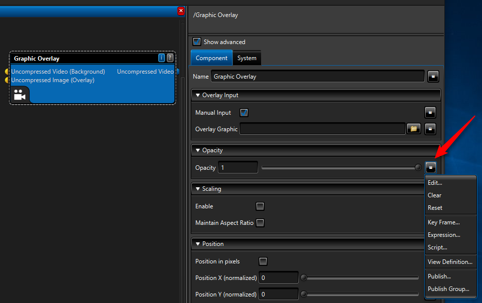

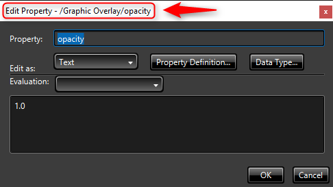

##Multiple input files

Each task that you submit to the **Media Encoder Premium Workflow** requires two Assets: 

- the first one is a "Workflow Asset" that contains a workflow file. You can design workflow files using the [Workflow Designer](media-services-workflow-designer.md), 
- the second one is a "Media Asset" that contains the media file(s) that you want to encode. 

When sending multiple media files to the **Media Encoder Premium Workflow** encoder, the following constraints apply:

- All the media files must be in the same "Media Asset". Using multiple Media Assets is not supported.
- You must set the primary file in this Media Asset (ideally, this is the main video file that the encoder is asked to process).
- It is necessary to pass configuration data that includes the **setRuntimeProperties** and/or **transcodeSource** element to the processor.
  - **setRuntimeProperties** is used to override the filename or another property in the components of the workflow
  - **transcodeSource** is used to specify the Clip List XML content

Connections in the workflow
  - If you use one or several Media File Input components and plan to use **setRuntimeProperties** to specify the file name, then do not connect the primary file component PIN to them. Please make sure there is no connection between the primary file object and the Media File Input(s).
  - If you prefer to use Clip List XML and one Media Source component, then you can connect both together.

*No connection from primary file to Media File Input component(s) if you use setRuntimeProperties to set the filename*

*You can connect Clip List XML to Media Source and use transcodeSource*

###Clip List XML customization
You can specify the Clip List XML in the workflow, at runtime, by using **sourceTranscode** in the configuration string XML. This requires the Clip List XML pin to be connected to the Media Source component in the workflow.

    <?xml version="1.0" encoding="utf-16"?>
      <transcodeRequest>
        <transcodeSource>
          <clipList>
            <clip>
              <videoSource>
                <mediaFile>
                  <file>video-part1.mp4</file>
                </mediaFile>
              </videoSource>
              <audioSource>
                <mediaFile>
                  <file>video-part1.mp4</file>
                </mediaFile>
              </audioSource>
            </clip>
            <primaryClipIndex>0</primaryClipIndex>
          </clipList>
        </transcodeSource>
        <setRuntimeProperties>
          <property propertyPath="Media File Input Logo/filename" value="logo.png" />
        </setRuntimeProperties>
      </transcodeRequest>

If you want to specify /primarySourceFile to use this property to name the output files using 'Expressions', then it is recommended to pass the Clip List XML as a property, *after* the /primarySourceFile property, to avoid the Clip List being overridden by the /primarySourceFile setting. 

    <?xml version="1.0" encoding="utf-8"?>
      <transcodeRequest>
        <setRuntimeProperties>
          <property propertyPath="/primarySourceFile" value="c:\temp\start.mxf" />
          <property propertyPath="/inactiveTimeout" value="65" />
          <property propertyPath="clipListXml" value="xxx">
          <extendedValue><![CDATA[<clipList>
            <clip>
              <videoSource>
                <mediaFile>
                  <file>c:\temp\start.mxf</file>
                </mediaFile>
              </videoSource>
              <audioSource>
                <mediaFile>
                  <file>c:\temp\start.mxf</file>
                </mediaFile>
              </audioSource>
            </clip>
            <primaryClipIndex>0</primaryClipIndex>
            </clipList>]]>
          </extendedValue>
          </property>
          <property propertyPath="Media File Input Logo/filename" value="logo.png" />
        </setRuntimeProperties>
      </transcodeRequest>

With additional frame accurate trimming:

    <?xml version="1.0" encoding="utf-8"?>
      <transcodeRequest>
        <setRuntimeProperties>
          <property propertyPath="/primarySourceFile" value="start.mxf" />
          <property propertyPath="/inactiveTimeout" value="65" />
          <property propertyPath="clipListXml" value="xxx">
          <extendedValue><![CDATA[<clipList>
            <clip>
              <videoSource>
                <trim>
                  <inPoint fps="25">00:00:05:24</inPoint>
                  <outPoint fps="25">00:00:10:24</outPoint>
                </trim>
                <mediaFile>
                  <file>start.mxf</file>
                </mediaFile>
              </videoSource>
              <audioSource>
               <trim>
                  <inPoint fps="25">00:00:05:24</inPoint>
                  <outPoint fps="25">00:00:10:24</outPoint>
                </trim>
                <mediaFile>
                  <file>start.mxf</file>
                </mediaFile>
              </audioSource>
            </clip>
            <primaryClipIndex>0</primaryClipIndex>
            </clipList>]]>
          </extendedValue>
          </property>
          <property propertyPath="Media File Input Logo/filename" value="logo.png" />
        </setRuntimeProperties>
      </transcodeRequest>

##Example

Consider an example in which you want to overlay a logo image on the input video while encoding. In this example, the input video is named "MyInputVideo.mp4" and the logo is named "MyLogo.png". The following steps should be performed:

- Create a Workflow Asset with the workflow file (example below)
- Create a Media Asset, which contains two files: MyInputVideo.mp4 as the primary file and MyLogo.png.
- Send a Task to the Media Encoder Premium Workflow media processor with the above input assets and specify the following configuration string

Configuration:

    <?xml version="1.0" encoding="utf-8"?>
      <transcodeRequest>
        <setRuntimeProperties>
          <property propertyPath="Media File Input/filename" value="MyInputVideo.mp4" />
          <property propertyPath="/primarySourceFile" value="MyInputVideo.mp4" />
          <property propertyPath="Media File Input Logo/filename" value="MyLogo.png" />
        </setRuntimeProperties>
      </transcodeRequest>

In the example above, the name of the video file is sent to the Media File Input component and the primarySourceFile property, the name of the logo file is sent to another Media File Input connected to the graphic overlay component.

>[AZURE.NOTE]The video file name is sent to primarySourceFile property. The reason for this is to use this property in the workflow, for building the correct output file name using Expressions, for example.

###Step by step workflow creation that overlays a logo on top of the video     

Here are the steps to create a workflow that takes as input two files: a video and an image. It will overlay the image on top of the video.

Open **Workflow Designer** and select **File**-> **New Workspace** -> **Transcode Blueprint** 

The new workflow shows 3 elements: 

- Primary Source File
- Clip List XML
- Output File/Asset  

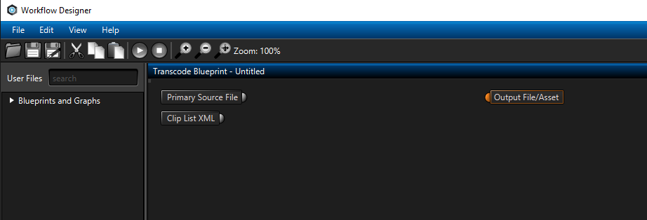

*New Encoding Workflow*

In order to accept the input media file, start with adding a Media File Input component. To add a component to the workflow, look for it in the Repository search box and drag the desired entry onto the designer pane.

Next, add the video file to be used for designing your workflow. To do so, click the background pane in Workflow Designer and look for the Primary Source File property on the right-hand property pane. Click the folder icon and select the appropriate video file.

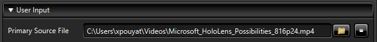

*Primary File Source*

Next, specify the video file in the Media File Input component.   

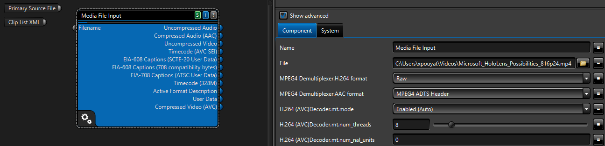

*Media File Input Source*

As soon as this is done, the Media File Input component will inspect the file and populate its output pins to reflect the file it inspected.

The next step is to add a "Video Data Type Updater" to specify the color space to Rec.709. Add a "Video Format Converter" set to Data Layout/Layout type = Configurable Planar. This will convert the video stream to a format that can be taken as a source of the overlay component.

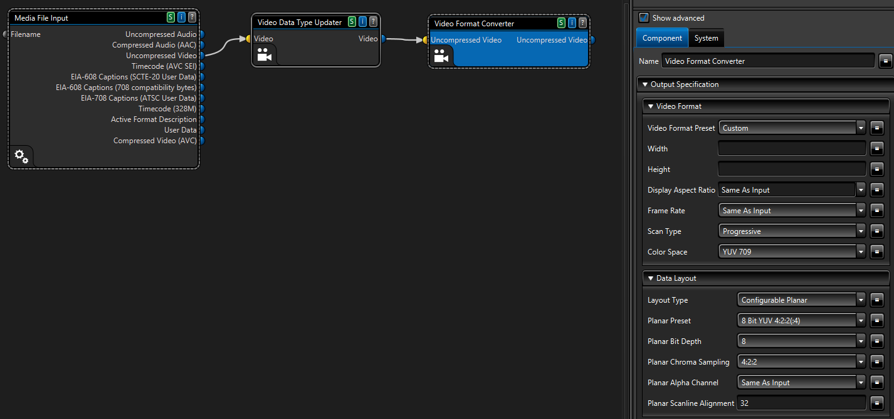

*Video Data Type Updater and Format Converter*

*Layout type = Configurable Planar*

Next, add a Video Overlay component and connect the (uncompressed) video pin to the (uncompressed) video pin of the media file input.

Add another Media File Input (to load the logo file), click on this component and rename it to "Media File Input Logo", select a image (png file for example) in the file property. Connect the Uncompressed image pin to the Uncompressed image pin of the overlay.

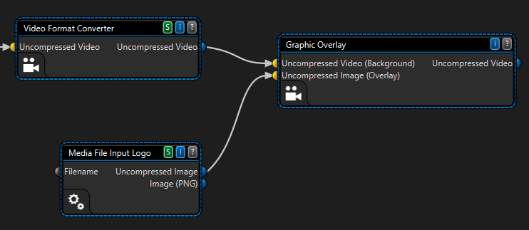

*Overlay component and image file source*

If you wish to modify the position of the logo on the video (for example, you may want to position it at 10% off of the top left corner of the video), uncheck "Manual Input". You can uncheck this option because you are using a Media File Input to provide the logo file to the overlay component. 

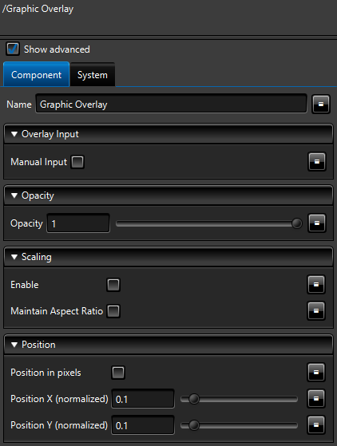

*Overlay position*

To encode the video stream to H.264, add the AVC Video Encoder and AAC encoder components to the designer surface. Connect the pins.
Setup the AAC encoder and select: Audio Format Conversion/Preset : 2.0 (L, R) 

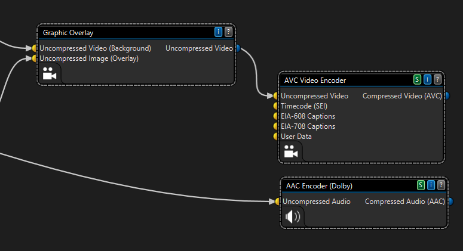

*Audio and Video Encoders*

Now add the **ISO Mpeg-4 Multiplexer** and  **File Output** components and connect the pins as shown.

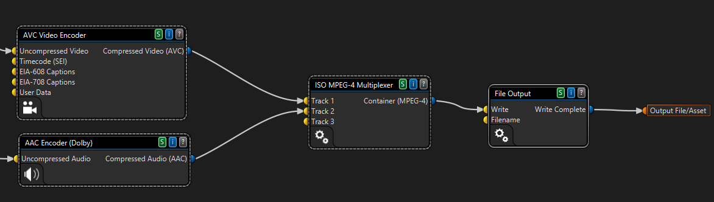

*MP4 multiplexer and file output*

You need to set the  name for the output file. Click on the "File Output" component and edit the expression for file:

    ${ROOT_outputWriteDirectory}\${ROOT_sourceFileBaseName}_withoverlay.mp4

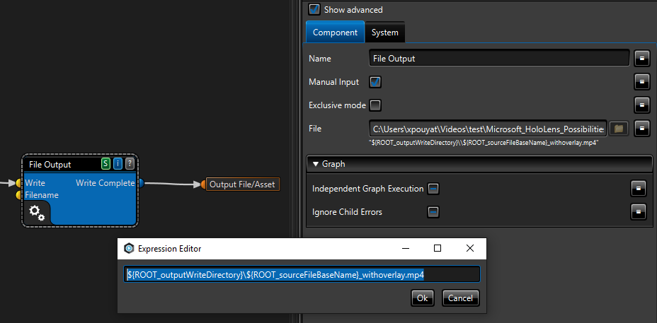

*File output name*

You can run the workflow locally to check that it is running correctly.

Once this succeeds, you can run it in Azure Media Services.

First prepare an asset in Azure Media Services with two files in it: the video file and the logo. You can do it using .NET or REST API. You can also do it with the Azure Portal or [Azure Media Services Explorer](https://github.com/Azure/Azure-Media-Services-Explorer) (AMSE). 

This tutorial shows how to manage assets with AMSE. There are two ways add files to an asset. 

1. Create a local folder, copy the two files in it and drag and drop the folder to the Asset tab
1. Upload the video file as an asset, then display the asset information, go to the files tab and upload an additional file (logo).

>[AZURE.NOTE]Make sure to set a primary file in the asset (the main video file).

*Asset files in AMSE*

Select the asset and choose to encode it with Premium Encoder. Upload the workflow and select it.

Click on the button to pass data to the processor, and add the following XML to set the runtime properties:

*Premium Encoder in AMSE*

Then, paste the following XML data. You need to specify the name of the video file for both the Media File Input and primarySourceFile. Specify the name of the file name for the logo too.

    <?xml version="1.0" encoding="utf-16"?>
      <transcodeRequest>
        <setRuntimeProperties>
          <property propertyPath="Media File Input/filename" value="Microsoft_HoloLens_Possibilities_816p24.mp4" />
          <property propertyPath="/primarySourceFile" value="Microsoft_HoloLens_Possibilities_816p24.mp4" />
          <property propertyPath="Media File Input Logo/filename" value="logo.png" />
        </setRuntimeProperties>
      </transcodeRequest>

*setRuntimeProperties*

If you use the .Net SDK to create and run the task, this XML data has to be passed as the configuration string.

    public ITask AddNew(string taskName, IMediaProcessor mediaProcessor, string configuration, TaskOptions options);
  
Once the the job complete, the MP4 file in the output asset displays the overlay!

*Overlay on the video*

You can download the sample workflow from [here](https://github.com/Azure/azure-media-services-samples/tree/master/Encoding%20Presets/VoD/MediaEncoderPremiumWorkfows/).

##Also see 

[Introducing Premium Encoding in Azure Media Services](http://azure.microsoft.com/blog/2015/03/05/introducing-premium-encoding-in-azure-media-services)

[How to Use Premium Encoding in Azure Media Services](http://azure.microsoft.com/blog/2015/03/06/how-to-use-premium-encoding-in-azure-media-services)

[Encoding On-Demand Content with Azure Media Service](media-services-encode-asset.md#media_encoder_premium_workflow)

[Media Encoder Premium Workflow Formats and Codecs](media-services-premium-workflow-encoder-formats.md)

[Sample workflow files](https://github.com/AzureMediaServicesSamples/Encoding-Presets/tree/master/VoD/MediaEncoderPremiumWorkfows)

[Azure Media Services Explorer tool](http://aka.ms/amse)

##Media Services learning paths

[AZURE.INCLUDE [media-services-learning-paths-include](../../includes/media-services-learning-paths-include.md)]

##Provide feedback

[AZURE.INCLUDE [media-services-user-voice-include](../../includes/media-services-user-voice-include.md)]