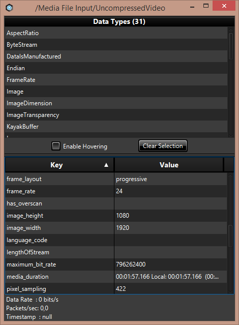
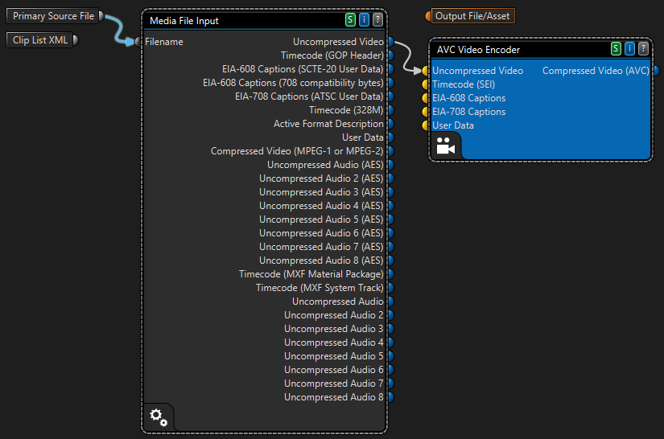
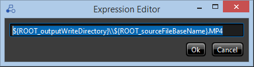
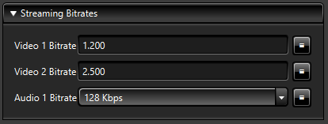
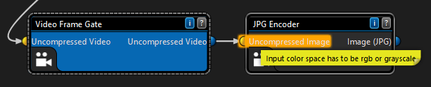
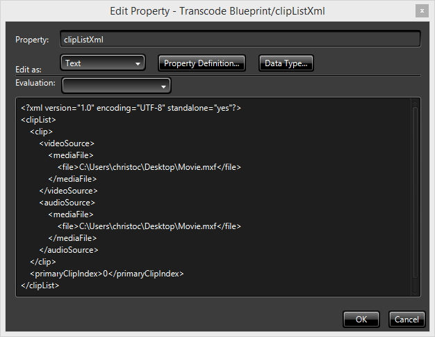
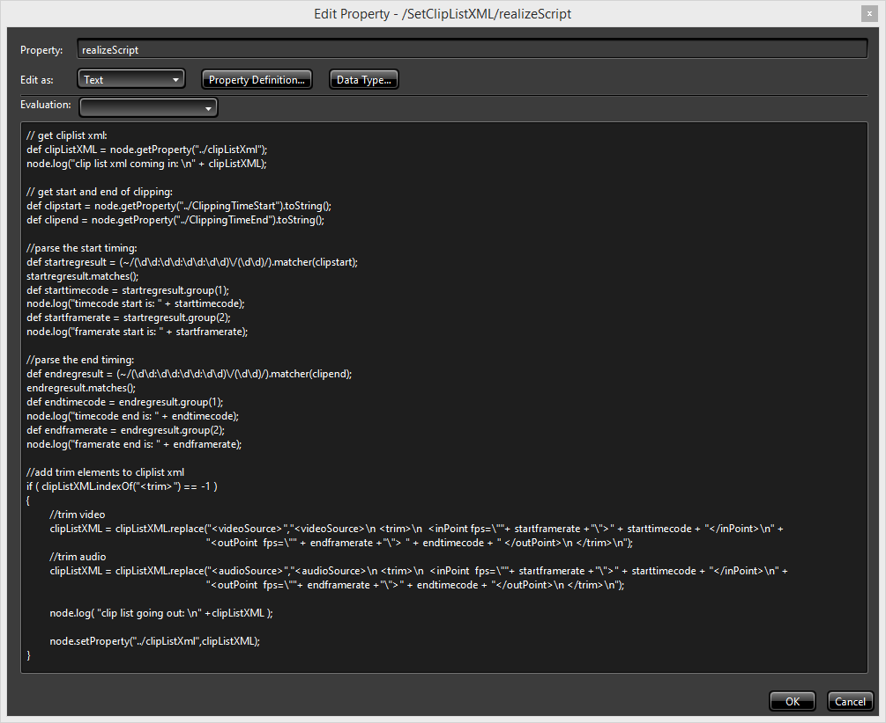

<properties 
	pageTitle="Avanced Media Encoder Premium Workflow tutorials" 
	description="This document contains walkthroughs that show how to perform advanced tasks with Media Encoder Premium Workflow and also how to create complex workflows with Workflow Designer." 
	services="media-services" 
	documentationCenter="" 
	authors="xstof" 
	manager="erikre" 
	editor=""/>

<tags 
	ms.service="media-services" 
	ms.workload="media" 
	ms.tgt_pltfrm="na" 
	ms.devlang="na" 
	ms.topic="article" 
	ms.date="07/11/2016"  
	ms.author="xstof;xpouyat;juliako"/>

#Advanced Media Encoder Premium Workflow tutorials

##Overview 

This document contains walkthroughs that show how to customize workflows with  **Workflow Designer**. You can find the actual workflow
 files [here](https://github.com/Azure/azure-media-services-samples/tree/master/Encoding%20Presets/VoD/MediaEncoderPremiumWorkfows/PremiumEncoderWorkflowSamples).  

##TOC

The following topics are covered:

- [Encoding MXF into a single bitrate MP4](media-services-media-encoder-premium-workflow-tutorials.md#MXF_to_MP4)
	- [Starting a new workflow](media-services-media-encoder-premium-workflow-tutorials.md#MXF_to_MP4_start_new) 
	- [Using the Media File Input](media-services-media-encoder-premium-workflow-tutorials.md#MXF_to_MP4_with_file_input)
	- [Inspecting media streams](media-services-media-encoder-premium-workflow-tutorials.md#MXF_to_MP4_streams)
	- [Adding a video encoder for .MP4 file generation](media-services-media-encoder-premium-workflow-tutorials.md#MXF_to_MP4_file_generation)
	- [Encoding the audio stream](media-services-media-encoder-premium-workflow-tutorials.md#MXF_to_MP4_audio)
	- [Multiplexing Audio and Video streams into an MP4 container](media-services-media-encoder-premium-workflow-tutorials.md#MXF_to_MP4_audio_and_fideo)
	- [Writing the MP4 file](media-services-media-encoder-premium-workflow-tutorials.md#MXF_to_MP4_writing_mp4)
	- [Creating a Media Services Asset from the output file](media-services-media-encoder-premium-workflow-tutorials.md#MXF_to_MP4_asset_from_output)
	- [Test the finished workflow locally](media-services-media-encoder-premium-workflow-tutorials.md#MXF_to_MP4_test)
- [Encoding MXF into multibitrate MP4s - dynamic packaging enabled](media-services-media-encoder-premium-workflow-tutorials.md#MXF_to_MP4_with_dyn_packaging)
	- [Adding one or more additional MP4 outputs](media-services-media-encoder-premium-workflow-tutorials.md#MXF_to_MP4_with_dyn_packaging_more_outputs)
	- [Configuring the file output names](media-services-media-encoder-premium-workflow-tutorials.md#MXF_to_MP4_with_dyn_packaging_conf_output_names)
	- [Adding a separate Audio Track](media-services-media-encoder-premium-workflow-tutorials.md#MXF_to_MP4_with_dyn_packaging_audio_tracks)
	- [Adding the .ISM SMIL File](media-services-media-encoder-premium-workflow-tutorials.md#MXF_to_MP4_with_dyn_packaging_ism_file)
- [Encoding MXF into multibitrate MP4 - enhanced blueprint](media-services-media-encoder-premium-workflow-tutorials.md#MXF_to__multibitrate_MP4)
	- [Workflow overview to enhance](media-services-media-encoder-premium-workflow-tutorials.md#MXF_to__multibitrate_MP4_overview)
	- [File Naming Conventions](vMXF_to__multibitrate_MP4_file_naming)
	- [Publishing component properties onto the workflow root](media-services-media-encoder-premium-workflow-tutorials.md#MXF_to__multibitrate_MP4_publishing)
	- [Have generated output file names rely on published property values](media-services-media-encoder-premium-workflow-tutorials.md#MXF_to__multibitrate_MP4_output_files)
- [Adding thumbnails to multibitrate MP4 output](media-services-media-encoder-premium-workflow-tutorials.md#thumbnails_to__multibitrate_MP4)
	- [Workflow overview to add thumbnails to](media-services-media-encoder-premium-workflow-tutorials.md#thumbnails_to_multibitrate_MP4_overview)
	- [Adding JPG Encoding](media-services-media-encoder-premium-workflow-tutorials.md#thumbnails_to__multibitrate_MP4__with_jpg)
	- [Dealing with Color Space conversion](media-services-media-encoder-premium-workflow-tutorials.md#thumbnails_to__multibitrate_MP4_color_space)
	- [Writing the thumbnails](media-services-media-encoder-premium-workflow-tutorials.md#thumbnails_to__multibitrate_MP4_writing_thumbnails)
	- [Detecting errors in a workflow](media-services-media-encoder-premium-workflow-tutorials.md#thumbnails_to__multibitrate_MP4_errors)
	- [Finished Workflow](media-services-media-encoder-premium-workflow-tutorials.md#thumbnails_to__multibitrate_MP4_finish)
- [Time-based trimming of multibitrate MP4 output](media-services-media-encoder-premium-workflow-tutorials.md#time_based_trim)
	- [Workflow overview to start adding trimming to](media-services-media-encoder-premium-workflow-tutorials.md#time_based_trim_start)
	- [Using the Stream Trimmer](media-services-media-encoder-premium-workflow-tutorials.md#time_based_trim_use_stream_trimmer)
	- [Finished Workflow](media-services-media-encoder-premium-workflow-tutorials.md#time_based_trim_finish)
- [Introducing the Scripted Component](media-services-media-encoder-premium-workflow-tutorials.md#scripting)
	- [Scripting within a workflow: hello world](media-services-media-encoder-premium-workflow-tutorials.md#scripting_hello_world)
- [Frame-based trimming of multibitrate MP4 output](media-services-media-encoder-premium-workflow-tutorials.md#frame_based_trim)
	- [Blueprint overview to start adding trimming to](media-services-media-encoder-premium-workflow-tutorials.md#frame_based_trim_start)
	- [Using the Clip List XML](media-services-media-encoder-premium-workflow-tutorials.md#frame_based_trim_clip_list)
	- [Modifying the clip list from a Scripted Component](media-services-media-encoder-premium-workflow-tutorials.md#frame_based_trim_modify_clip_list)
	- [Adding a ClippingEnabled convenience property](media-services-media-encoder-premium-workflow-tutorials.md#frame_based_trim_clippingenabled_prop)

##Encoding MXF into a single bitrate MP4
 
In this walkthrough we'll create a single bitrate .MP4 file with AAC-HE encoded audio from an .MXF input file. 

###Starting a new workflow 

Open Workflow Designer and select "File"-"New Workspace"-"Transcode Blueprint" 

The new workflow will show 3 elements: 

- Primary Source File
- Clip List XML
- Output File/Asset  

*New Encoding Workflow*

###Using the Media File Input

In order to accept our input media file, one starts with adding a Media File Input component. To add a component to the workflow, look for it in the Repository search box and drag the desired entry onto the designer pane. Do this for the Media File Input and connect the Primary Source File component to the Filename input pin from the Media File Input.

*Connected Media File Input*

Before we can do much else, we'll first need to indicate to the workflow designer what sample file we'd like to use to design our workflow with. To do so, click the designer pane background and look for the Primary Source File property on the right-hand property pane. Click the folder icon and select the desired file to test the workflow with. As soon as this is done, the Media File Input component will inspect the file and populate its output pins to reflect the file it inspected.

*Populated Media File Input*

While this specifies with what input we'd like to work with, it doesn't tell yet where the encoded output should go to. Similar to how the Primary Source File was configured, now configure the Output Folder Variable property, just below it.

*Configured Input and Output properties*

###Inspecting media streams

Often it's desired to know how the stream looks like that flows through the workflow. To inspect a stream at any point in the workflow, just click an output or input pin on any of the components. In this case, try clicking on the Uncompressed Video output pin from our Media File Input. A dialog will open up that allows to inspect the outbound video.

*Inspecting the Uncompressed Video output pin*

In our case, it tells us for example that we're dealing with a 1920x1080 input at 24 frames per second in 4:2:2 sampling for a video of almost 2 minutes.

###Adding a video encoder for .MP4 file generation

Note that now, an Uncompressed Video and multiple Uncompressed Audio output pins are available for use on our Media File Input. In order to encode the inbound video, we need an encoding component - in this case for generating .MP4 files.

To encode the video stream to H.264, add the AVC Video Encoder component to the designer surface. This component takes an uncompress video stream as input and delivers an AVC compressed video stream on its output pin.

*Unconnected AVC Encoder*

Its properties determine how the encoding exactly happens. Let's have a look at some of the more important settings:

- Output width and Output height: these determine the resolution of the encoded video. In our case let's go with 640x360
- Frame Rate: when set to passthrough it will just adopt the source frame rate, it's possible to override this though. Note that such framerate conversion is not motion-compensated.
- Profile and Level: these determine the AVC profile and level. To conveniently get more information about the different levels and profiles, click the question mark icon on the AVC Video Encoder component and the help page will show more detail about each of the levels. For our sample, let's go with Main Profile at level 3.2 (the default).
- Rate Control Mode and Bitrate (kbps): in our scenario we opt for a constant bitrate (CBR) output at 1200 kbps
- Video Format: this is about the VUI (Video Usability Information) that gets written into the H.264 stream (side information that might be used by a decoder to enhance the display but not essential to correctly decode):
- NTSC (typical for US or Japan, using 30 fps)
- PAL (typical for Europe, using 25 fps)
- GOP Size Mode: we'll configure Fixed GOP Size for our purposes with a Key Interval of 2 seconds with Closed GOPs. This ensures compatibility with the dynamic packaging Azure Media Services provides.

To feed our AVC encoder, connect the Uncompressed Video output pin from the Media File Input component to the Uncompressed Video input pin from the AVC encoder.

*Connected AVC Main encoder*

###Encoding the audio stream

At this point, we have encoded video but the original uncompressed audio stream still needs to be compressed. For this we'll go with AAC encoding by the AAC Encoder (Dolby) component. Add it to the workflow.

*Unconnected AAC encoder*

Now there's an incompatibility: there's only a single uncompressed audio input pin from the AAC Encoder while more than likely the Media File Input will have two different uncompressed audio stream available: one for the left audio channel and one for the right. (If you're dealing with surround sound, that's 6 channels.) So it's not possible to directly connect the audio from the Media File Input source into the AAC audio encoder. The AAC component expects a so-called "interleaved" audio stream: a single stream that has both the left and the right channels interleaved with each other. Once we know from our source media file which audio tracks are on what position in the source, we can generate such interleaved audio stream with the correctly assigned speaker positions for left and right.

First one will want to generated an interleaved stream from the required source audio channels. The Audio Stream Interleaver component will handle this for us. Add it to the workflow and connect the audio outputs from the Media File Input into it.

*Connected Audio Stream Interleaver*

Now that we have an interleaved audio stream, we still didn't specify where to assign the left or right speaker positions to. In order to specify this, we can leverage the Speaker Position Assigner.

*Adding a Speaker Position Assigner*

Configure the Speaker Position Assigner for use with a stereo input stream through an Encoder Preset Filter of "Custom" and the Channel Preset called "2.0 (L,R)". (This will assign the left speaker position to channel 1 and the right speaker position to channel 2.)

Connect the output of the Speaker Position Assigner to the input of the AAC Encoder. Then, tell the AAC Encoder to work with a "2.0 (L,R)" Channel Preset, so it knows to deal with stereo audio as input.

###Multiplexing Audio and Video streams into an MP4 container

Given our AVC encoded video stream and our AAC encoded audio stream, we can capture both into an .MP4 container. The process of mixing different streams into a single one is called "multiplexing" (or "muxing"). In this case we're interleaving the audio and the video streams in a single coherent .MP4 package. The component that coordinates this for an .MP4 container is called the ISO MPEG-4 Multiplexer. Add one to the designer surface and connect both the AVC Video Encoder and the AAC Encoder to its inputs.

*Connected MPEG4 Multiplexer*

###Writing the MP4 file

When writing an output file, the File Output component is used. We can connect this to the output of the ISO MPEG-4 Multiplexer so that its output gets written to disk. To do this, connect the Container (MPEG-4) output pin to the Write input pin of the File Output.

*Connected File Output*

The filename that will be used is determined by the File property. While that property can be hardcoded to a given value, most likely one will want to set it through an expression instead.

To have the workflow automatically determine the output File name property from an expression, click the buton next to the File name (next to the folder icon). From the drop down menu then select "Expression". This will bring up the expression editor. Clear the contents of the editor first.

*Empty Expression Editor*

The expression editor allows to enter any literal value, mixed with one or more variables. Variables start with a dollar sign. As you hit the $ key, the editor will show a dropdown box with a choice of available variables. In our case we'll use a combination of the output directory variable and the base input file name variable:

	${ROOT_outputWriteDirectory}\\${ROOT_sourceFileBaseName}.MP4

*Filled out Expression Editor*

>[AZURE.NOTE]In order to see see an output file of your encoding job in Azure, you must provide a value in the expression editor. 

When you confirm the expression by hitting ok, the property window will preview to what value the File property resolves at this point in time.

*File Expression resolves output dir*

###Creating a Media Services Asset from the output file

While we have written an MP4 output file, we still need to indicate that this file belongs to the output asset which media services will generate as a result of executing this workflow. To this end, the Output File/Asset node on the workflow canvas is used. All incoming files into this node will make part of the resulting Azure Media Services asset.

Connect the File Output component to the Output File/Asset component to finish the workflow.

*Finished Workflow*

###Test the finished workflow locally

To test the workflow locally, hit the play button in the toolbar at the top. When the workflow finished executing, inspect the output generated in the configured output folder. You'll see the finished MP4 output file that was encoded from the MXF input source file.

##Encoding MXF into MP4 - multibitrate dynamic packaging enabled

In this walkthrough we'll create a set of multiple bitrate MP4 files with AAC encoded audio from a single .MXF input file.

When a multi-bitrate asset output is desired for use in combination with the Dynamic Packaging features offered by Azure Media Services, multiple GOP-aligned MP4 files of each a different bitrate and resolution will need to be generated. To do so, the [Encoding MXF into a single bitrate MP4](media-services-media-encoder-premium-workflow-tutorials.md#MXF_to_MP4) walkthrough provides us with a good starting point.

*Starting Workflow*

###Adding one or more additional MP4 outputs

Every MP4 file in our resulting Azure Media Services asset will support a different bitrate and resolution. Let's add one or more MP4 output files to the workflow.

To make sure we have all our video encoders created with the same settings, it's most convenient to duplicate the already existing AVC Video Encoder and configure another combination of resolution and bitrate (let's add one of 960 x 540 at 25 frames per second at 2,5 Mbps). To duplicate the existing encoder, copy paste it on the designer surface.

Connect the Uncompressed Video output pin of the Media File Input into our new AVC component.

*Second AVC encoder connected*

Now adapt the configuration for our new AVC encoder to output 960x540 at 2,5 Mbps. (Use its properties "Output width", "Output height", and "Bitrate (kbps)" for this.)

Given we want to use the resulting asset together with Azure Media Services' dynamic packaging, the streaming endpoint needs to be capable of generating from these MP4 files HLS/Fragmented MP4/DASH fragments that are exactly aligned to each other in a way that clients that are switching between different bitrates get a single smooth continuous video and audio experience. To make that happen, we need to ensure that, in the properties of both AVC encoders the GOP ("group of pictures") size for both MP4 files is set to 2 seconds, which can be done by:

- setting the GOP Size Mode to Fixed GOP size and
- the Key Frame Interval to two seconds.
- also set the GOP IDR Control to Closed GOP to ensure all GOP's are standing on their own without dependencies

To make our workflow convenient to understand, rename the first AVC encoder to "AVC Video Encoder 640x360 1200kbps" and the second AVC encoder "AVC Video Encoder 960x540 2500 kbps".

Now add a second ISO MPEG-4 Multiplexer and a second File Output. Connect the multiplexer to the new AVC encoder and make sure its output is directed into the File Output. Then also connect the AAC audio encoder output to the new multiplexer's input. The File Output in turn can then be connected to the Output File/Asset node to add it to the Media Services Asset that will be created.

*Second Muxer and File Output connected*

For compatibility with Azure Media Services dynamic packaging, configure the multiplexer's Chunk Mode to GOP count or duration and set the GOPs per chunk to 1. (This should be the default.)

*Muxer Chunk Modes*

Note: you may want to repeat this process for any other bitrate and resolution combinations you want to have added to the asset output.

###Configuring the file output names

We have more than one single file added to the output asset. This provides a need to make sure the filenames for each of the output files are different from each other and maybe even apply a file-naming convention so it becomes clear from the file name what you're dealing with.

File output naming can be controlled through expressions in the designer. Open the property pane for one of the File Output components and open the expression editor for the File property. Our first output file was configured through the following expression (see the tutorial for going from [MXF to a single bitrate MP4 output](media-services-media-encoder-premium-workflow-tutorials.md#MXF_to_MP4)):

	${ROOT_outputWriteDirectory}\${ROOT_sourceFileBaseName}.MP4

This means that our filename is determined by two variables: the output directory to write in and the source file base name. The former is exposed as a property on the workflow root and the latter is determined by the incoming file. Note that the output directory is what you use for local testing; this property will be overridden by the workflow engine when the workflow is executed by the cloud-based media processor in Azure Media Services.
To give both our output files a consistent output naming, change the first file naming expression to:

	${ROOT_outputWriteDirectory}\${ROOT_sourceFileBaseName}_640x360_1.MP4

and the second to:

	${ROOT_outputWriteDirectory}\${ROOT_sourceFileBaseName}_960x540_2.MP4

Execute an intermediate test run to make sure both MP4 output files are properly generated.

###Adding a separate Audio Track

As we'll see later when we generate an .ism file to go with our MP4 output files, we will also require a audio-only MP4 file as the audio track for our adaptive streaming. To create this file, add an additional muxer to the workflow (ISO-MPEG-4 Multiplexer) and connect the AAC encoder's output pin with its input pin for Track 1.

*Audio Muxer Added*

Create a third File Output component to output the outbound stream from the muxer and configure the file naming expression as:
	
	${ROOT_outputWriteDirectory}\${ROOT_sourceFileBaseName}_128kbps_audio.MP4

*Audio Muxer creating File Output*

###Adding the .ISM SMIL File

For the dynamic packaging to work in combination with both MP4 files (and the audio-only MP4) in our Media Services asset, we also need a manifest file (also called a "SMIL" file: Synchronized Multimedia Integration Language). This file indicates to Azure Media Services what MP4 files are available for dynamic packaging and which of those to consider for the audio streaming. A typical manifest file for a set of MP4's with a single audio stream looks like this:
	
	<?xml version="1.0" encoding="utf-8" standalone="yes"?>
	<smil xmlns="http://www.w3.org/2001/SMIL20/Language">
	  <head>
	    <meta name="formats" content="mp4" />
	  </head>
	  <body>
	    <switch>
	      <video src="H264_1900kbps_AAC_und_ch2_96kbps.mp4" />
	      <video src="H264_1300kbps_AAC_und_ch2_96kbps.mp4" />
	      <video src="H264_900kbps_AAC_und_ch2_96kbps.mp4" />
	      <audio src="AAC_ch2_96kbps.mp4" title="AAC_und_ch2_96kbps" />
	    </switch>
	  </body>
	</smil>

The .ism file contains within a switch statement, a reference to each of the individual MP4 video files and in addition to those also one (or more) audio file references to an MP4 that only contains the audio.

Generating the manifest file for our set of MP4's can be done through a component called the "AMS Manifest Writer". To use it, drag it onto the surface and connect the "Write Complete" output pins from the three File Output components to the AMS Manifest Writer input. Then make sure to connect the output of the AMS Manifest Writer to the Output File/Asset.

As with our other file output components, configure the .ism file output name with an expression:

	${ROOT_outputWriteDirectory}\\${ROOT_sourceFileBaseName}_manifest.ism

Our finished workflow looks like the below:

*Finished MXF to multibitrate MP4 workflow*

##Encoding MXF into multibitrate MP4 - enhanced blueprint

In the [previous workflow walkthrough](media-services-media-encoder-premium-workflow-tutorials.md#MXF_to_MP4_with_dyn_packaging) we've seen how a single MXF input asset can be converted into an output asset with multi-bitrate MP4 files, an audio-only MP4 file and a manifest file for use in conjunction with Azure Media Services dynamic packaging.

This walkthrough will show how some of the aspects can be enhanced and made more convenient.

###Workflow overview to enhance

*Multibitrate MP4 workflow to enhance*

###File Naming Conventions

In the previous workflow we specified a simple expression as the basis for generating output file names. We have some duplication though: all of the the individual output file components specified such expression.

For example, our file output component for the first video file is configured with this expression:

	${ROOT_outputWriteDirectory}\${ROOT_sourceFileBaseName}_640x360_1.MP4

While for the second output video, we have an expression like:

	${ROOT_outputWriteDirectory}\\${ROOT_sourceFileBaseName}_960x540_2.MP4

Wouldn't it be cleaner, less error prone and more convenient if we could remove some of this duplication and make things more configurable instead? Luckily we can: the designer's expression capabilities in combination with the ability to create custom properties on our workflow root will give us an added layer of convenience.

Let's assume we'll drive filename configuration from the bitrates of the individual MP4 files. These bitrates we'll aim to configure in one central place (on the root of our graph), from where they'll be accessed to configure and drive file name generation. To do this, we start by publishing the bitrate property from both AVC encoders to the root of our workflow, so that it becomes accessible from both the root as well as from the AVC encoders. (Even if displayed in two different spots, there's only one underlying value.)

###Publishing component properties onto the workflow root

Open the first AVC encoder, go to the Bitrate (kbps) property and from the dropdown choose Publish.

*Publishing the bitrate property*

Configure the publish dialog to publish to the root of our workflow graph, with a published name of "video1bitrate" and a readable display name of "Video 1 Bitrate". Configure a custom group name called "Streaming Bitrates" and hit Publish.

*Publishing dialog for bitrate property*

Repeat the same for the bitrate property of the second AVC encoder and name it "video2bitrate" with a display name of "Video 2 Bitrate", in the same custom group "Streaming Bitrates".

If we now inspect the workflow root properties, we'll see our custom group with the two published properties show up. Both are reflecting the value of their respective AVC encoder bitrate.

Whenever we want to access these properties from code or from an expression, we can do so like this:

- from inline code from a component right below the root: node.getPropertyAsString('../video1bitrate',null)
- within an expression: ${ROOT_video1bitrate}
 
Let's complete the "Streaming Bitrates" group by publishing our audio track bitrate on it as well. Within the properties of the AAC Encoder, search for the Bitrate setting and select Publish from the dropdown next to it. Publish to the root of the graph with name "audio1bitrate" and display name "Audio 1 Bitrate" within our custom group "Streaming Bitrates".

*Publishing dialog for audio bitrate*

*Resulting video and audio props on root*

Note that changing any of those three values also re-configures and changes the values on the respective components they are linked with (and where published from).

###Have generated output file names rely on published property values

Instead of hardcoding our generated file names, we can now change our filename expression on each of the File Output components to rely on the bitrate properties we just published on the graph root. Starting with our first file output, find the File property and edit the expression like this:

	${ROOT_outputWriteDirectory}\${ROOT_sourceFileBaseName}_${ROOT_video1bitrate}kbps.MP4

The different parameters in this expression can be accessed and entered by hitting the dollar sign on the keyboard while in the expression window. One of the available parameters is our video1bitrate property which we published earlier.

*Accessing parameters within an expression*

Do the same for the file output for our second video:

	${ROOT_outputWriteDirectory}\${ROOT_sourceFileBaseName}_${ROOT_video2bitrate}kbps.MP4

and for the audio-only file output:

	${ROOT_outputWriteDirectory}\${ROOT_sourceFileBaseName}_${ROOT_audio1bitrate}bps_audio.MP4

If we now change the bitrate for any of the video or audio files, the respective encoder will be reconfigured and the bitrate-based file name convention will be honored all automatic.

##Adding thumbnails to multibitrate MP4 output

Starting from a workflow that generates [a multibitrate MP4 output from an MXF input](media-services-media-encoder-premium-workflow-tutorials.md#MXF_to_MP4_with_dyn_packaging), we will now be looking into adding thumbnails to the output.

###Workflow overview to add thumbnails to

*Multibitrate MP4 workflow to start from*

###Adding JPG Encoding

The heart of our thumbnail generation will be the JPG Encoder component, able to output JPG files.

*JPG Encoder*

We cannot however directly connect our Uncompressed Video stream from the Media File Input into the JPG encoder. Instead, it expects to be handed individual frames. This, we can do through the Video Frame Gate component.

*Connecting a frame gate to the JPG encoder*

The frame gate once every so many seconds or frames allows a video frame to pass. The interval and the time offset with which this happens is configurable in the properties.

*Video Frame Gate properties*

Let's create a thumbnail every minute by setting the mode to Time (seconds) and the Interval to 60.

###Dealing with Color Space conversion

While it would seem logical both Uncompressed Video pins of the frame gate and the Media File Input can now be connected, we would get a warning if we would do so.

*Input color space error*

This is because the way in which colour information is represented in our original raw uncompressed video stream, coming from our MXF, is different from what the JPG Encoder is expecting. More specifically, a so-called "color space" of "RGB" or "Grayscale" is expected to flow in. This means that the Video Frame Gate's inbound video stream will need to have a conversion applied regarding its color space first.

Drag onto the workflow the Color Space Converter - Intel and connect it to our frame gate.

*Connecting a Color Space Convertor*

In the properties window, pick the BGR 24 entry from the Preset list.

###Writing the thumbnails

Different from our MP4 video's, the JPG Encoder component will output more than one file. In order to deal with this, a Scene Search JPG File Writer component can be used: it will take the incoming JPG thumbnails and write them out, each filename being suffixed by a different number. (The number typically indicating the number of seconds/units in the stream which the thumbnail was drawn from.)

*Introducing the Scene Search JPG File Writer*

Configure the Output Folder Path property with the expression: 
	${ROOT_outputWriteDirectory} 

and the Filename Prefix property with: 

	${ROOT_sourceFileBaseName}_thumb_

The prefix will determine how the thumbnail files are being named. They will be suffixed with a number indicating the thumb's position in the stream.

*Scene Search JPG File Writer properties*

Connect the Scene Search JPG File Writer to the Output File/Asset node.

###Detecting errors in a workflow

Connect the input of the color space converter to the raw uncompressed video output. Now perform a local test run for the workflow. There's a good chance the workflow will suddenly stop executing and indicate with a red outline on the component that encountered an error:

*Color Space Converter error*

Click the little red "E" icon in the top right corner of the Color Space Converter component to see what's the reason the encoding attempt failed.

*Color Space Converter error dialog*

It turns out, as you can see, that the incoming color space standard for the color space converter has to be rec601 for our requested conversion of YUV to RGB. Apparently our stream doesn't indicate it's rec601. (Rec 601 is a standard for encoding interlaced analog video signals in digital video form. It specifies an active region covering 720 luminance samples and 360 chrominance samples per line. The color encoding system is known as YCbCr 4:2:2.)

To fix this, we'll indicate on the metadata of our stream that we're dealing with rec601 content. To do so we'll use a Video Data Type Updater component, which we'll put in between our raw source and the color space conversion component. This data type updater allows for the manual update of certain video data type properties. Configure it to indicate a Color Space Standard of "Rec 601". This will cause the Video Data Type Updater to tag the stream with the "Rec 601" color space if there was no color space defined yet. (It will not override any existing metadata, unless the Override checkbox was checked.)

*Updating Color Space Standard on the Data Type Updater*

###Finished Workflow

Now that our our workflow is finished, do another test run to see it pass.

*Finished workflow for multi-mp4 output with thumbnails*

##Time-based trimming of multibitrate MP4 output

Starting from a workflow that generates [a multibitrate MP4 output from an MXF input](media-services-media-encoder-premium-workflow-tutorials.md#MXF_to_MP4_with_dyn_packaging), we will now be looking into trimming the source video based on time-stamps.

###Workflow overview to start adding trimming to

*Starting workflow to add trimming to*

###Using the Stream Trimmer

The Stream Trimmer component allows to trim the beginning and ending of an input stream base on timing information (seconds, minutes, ...). The trimmer does not support frame-based trimming.

*Stream Trimmer*

Instead of linking the AVC encoders and speaker position assigner to the Media File Input directly, we'll put in between those the stream trimmer. (One for the video signal and one for the interleaved audio signal.)

*Put Stream Trimmer in between*

Let's configure the trimmer so that we will only process video and audio between 15 seconds and 60 seconds in the video.

Go to the properties of the Video Stream Trimmer and configure both Start Time (15s) and End Time (60s) properties. To make sure both our audio and video trimmer are always configured to the same start and end values, we will publish those to the root of the workflow.

*Publish start time property from Stream Trimmer*

*Publish property dialog for start time*

*Publish property dialog for end time*

If we now inspect the root of our workflow, both properties will be neatly displayed and configurable from there.

*Published properties available on root*

Now open the trimming properties from the audio trimmer and configure both start and end times with an expression that refers to the published properties on the root of our workflow.

For the audio trimming start time:

	${ROOT_TrimmingStartTime}

and for its end time:

	${ROOT_TrimmingEndTime}

###Finished Workflow

*Finished Workflow*

##Introducing the Scripted Component

Scripted Components can execute arbitrary scripts during the execution phases of our workflow. There are four different scripts that can be executed, each with specific characteristics and their own place in the workflow life-cycle:

- **commandScript**
- **realizeScript**
- **processInputScript**
- **lifeCycleScript**

The documentation of the Scripted Component goes in more detail for each of the above. In [the following section](media-services-media-encoder-premium-workflow-tutorials.md#frame_based_trim), the **realizeScript** scripting component is used to construct a cliplist xml on the fly when the workflow starts. This script is called during the component setup, which happens only once in it's lifecycle.

###Scripting within a workflow: hello world

Drag a Scripted Component onto the designer surface and rename it (for example, "SetClipListXML").

*Adding a Scripted Component*

When you inspect the properties of the Scripted Component, the four different script types will be shown, each configurable to a different script.

*Scripted Component properties*

Clear the processInputScript and open the editor for the realizeScript. Now we're set up and ready to start scripting.

Scripts are written in Groovy, a dynamically compiled scripting language for the Java platform that retains compatibility with Java. Actually, most Java code is valid Groovy code.

Let's write a simple hello world groovy script in the context of our realizeScript. Enter the following in the editor:

	node.log("hello world");

Now execute a local test run. After this run, inspect (through the System tab on the Scripted Component) the Logs property.

*Hello world log output*

The node object we call the log method on, refers to our current "node" or the component we're scripting within. Every component as such has the ability to output logging data, available through the system tab. In this case, we output the string literal "hello world". Important to understand here is that this can prove to be an invaluable debugging tool, providing you with insight on what the script is actually doing.

From within our scripting environment, we also have access to properties on other components. Try this:

	//inspect current node: 
	def nodepath = node.getNodePath(); 
	node.log("this node path: " + nodepath);
	
	//walking up to other nodes: 
	def parentnode = node.getParentNode(); 
	def parentnodepath = parentnode.getNodePath(); 
	node.log("parent node path: " + parentnodepath);
	
	//read properties from a node: 
	def sourceFileExt = parentnode.getPropertyAsString( "sourceFileExtension", null ); 
	def sourceFileName = parentnode.getPropertyAsString("sourceFileBaseName", null); 
	node.log("source file name with extension " + sourceFileExt + " is: " + sourceFileName);

Our log window will show us the following:

*Log output for accessing node paths*

##Frame-based trimming of multibitrate MP4 output

Starting from a workflow that generates [a multibitrate MP4 output from an MXF input](media-services-media-encoder-premium-workflow-tutorials.md#MXF_to_MP4_with_dyn_packaging), we will now be looking into trimming the source video based on frame counts.

###Blueprint overview to start adding trimming to

*Workflow to start adding trimming to*

###Using the Clip List XML

In all previous workflow tutorials, we used the Media File Input component as our video input source. For this specific scenario though, we'll be using the Clip List Source component instead. Note that this should not be the preferred way of working; only use the Clip List Source when there's a real reason to do so (like in the below case, where we're making use of the clip list trimming capabilities).

To switch from our Media File Input to the Clip List Source, drag the Clip List Source component onto the design surface and connect the Clip List XML pin to the Clip List XML node of the workflow designer. This should populate the Clip List Source with output pins, according to our input video. Now connect the Uncompressed Video and Uncompressed Audio pins from the the Clip List Source to the respective AVC Encoders and Audio Stream Interleaver. Now remove the Media File Input.

*Replaced the Media File Input with the Clip List Source*

The Clip List Source component takes as its input a "Clip List XML". When selecting the source file to test with locally, this clip list xml is auto-populated for you.

*Auto-populated Clip List XML property*

Looking a bit closer to the xml, this is how it looks like:

*Edit clip list dialog*

This however does not reflect the capabilities of the clip list xml. One option we have is to add a "Trim" element under both the video and audio source, like this:

*Adding a trim element to the clip list*

If you modify the clip list xml like this above and perform a local test run, you'll see the video correctly been trimmed between 10 and 20 seconds in the video.

Contrary to what happens when you do a local run though, this very same cliplist xml would not have the same effect when applied in a workflow that runs in Azure Media Services. When Azure Premium Encoder starts, the cliplist xml is generated every time again, based on the input file the encoding job was given. This means that any changes we do on the xml would unfortunately be overridden.

To counter the cliplist xml being wiped when an encoding job is started, we can re-generate it on the fly just after the start of our workflow. Such custom actions can be taken through what is called a "Scripted Component". For more information, see [Introducing the Scripted Component](media-services-media-encoder-premium-workflow-tutorials.md#scripting).

Drag a Scripted Component onto the designer surface and rename it to "SetClipListXML".

*Adding a Scripted Component*

When you inspect the properties of the Scripted Component, the four different script types will be shown, each configurable to a different script.

*Scripted Component properties*

###Modifying the clip list from a Scripted Component

Before we can re-write the cliplist xml that is generated during workflow startup, we'll need to have access to the cliplist xml property and contents. We can do so like this:

	// get cliplist xml: 
	def clipListXML = node.getProperty("../clipListXml");
	node.log("clip list xml coming in: " + clipListXML);

*Incoming clip list being logged*

First we need a way to determine from which point till which point we want to trim the video. To make this convenient to the less-technical user of the workflow, publish two properties to the root of the graph. To do this, right click the designer surface and select "Add Property":

- First property: "ClippingTimeStart" of type: "TIMECODE"
- Second property: "ClippingTimeEnd" of type: "TIMECODE"

*Add Property dialog for clipping start time*

*Published clipping time props on workflow root*

Configure both properties to a suitable value:

*Configure the clipping start and end properties*

Now, from within our script, we can access both properties, like this:

	
	// get start and end of clipping:
	def clipstart = node.getProperty("../ClippingTimeStart").toString();
	def clipend = node.getProperty("../ClippingTimeEnd").toString();
	
	node.log("clipping start: " + clipstart);
	node.log("clipping end: " + clipend);

*Log window showing start and end of clipping*

Let's parse the timecode strings into a more convenient to use form, using a simple regular expression:
	
	//parse the start timing: 
	def startregresult = (~/(\d\d:\d\d:\d\d:\d\d)\/(\d\d)/).matcher(clipstart); 
	startregresult.matches(); 
	def starttimecode = startregresult.group(1); 
	node.log("timecode start is: " + starttimecode); 
	def startframerate = startregresult.group(2); 
	node.log("framerate start is: " + startframerate);
	
	//parse the end timing: 
	def endregresult = (~/(\d\d:\d\d:\d\d:\d\d)\/(\d\d)/).matcher(clipend); 
	endregresult.matches(); 
	def endtimecode = endregresult.group(1); 
	node.log("timecode end is: " + endtimecode); 
	def endframerate = endregresult.group(2); 
	node.log("framerate end is: " + endframerate);

*Log window with output of parsed timecode*

With this information at hand, we can now modify the cliplist xml to reflect the start and end times for the desired frame-accurate clipping of the movie.

*Script code to add trim elements*

This was done through normal string manipulation operations. The resulting modified clip list xml is written back to the clipListXML property on the workflow root through the "setProperty" method. The log window after another test run would show us the following:

*Logging the resulting clip list*

Do a test-run to see how the video and audio streams have been clipped. As you'll do more than one test-run with different values for the trimming points, you'll notice that those will not be taken into account however! The reason for this is that the designer, unlike the Azure runtime, does NOT override the cliplist xml every run. This means that only the very first time you have set the in and out points, will cause the xml to transform, all the other times, our guard clause (if(clipListXML.indexOf("<trim>") == -1)) will prevent the workflow from adding another trim element when there's already one present.

To make our workflow convenient to test locally, we best add some house-keeping code that inspects if a trim element was already present. If so, we can remove it before continuing by modifying the xml with the new values. Rather than using plain string manipulations, it's probably safer to do this through real xml object model parsing.

Before we can add such code though, we'll need to add a number of import statements at the start of our script first:
	
	import javax.xml.parsers.*; 
	import org.xml.sax.*; 
	import org.w3c.dom.*;
	import javax.xml.*;
	import javax.xml.xpath.*; 
	import javax.xml.transform.*; 
	import javax.xml.transform.stream.*; 
	import javax.xml.transform.dom.*;

After this, we can add the required cleaning code:

	//for local testing: delete any pre-existing trim elements from the clip list xml by parsing the xml into a DOM:
	DocumentBuilderFactory factory=DocumentBuilderFactory.newInstance();
	DocumentBuilder builder=factory.newDocumentBuilder();
	InputSource is=new InputSource(new StringReader(clipListXML)); 
	Document dom=builder.parse(is);

	//find the trim element inside videoSource and audioSource and remove it if it exists already: 
	XPath xpath = XPathFactory.newInstance().newXPath();
	String findAllTrimElements = "//trim"; 
	NodeList trimelems = xpath.evaluate(findAllTrimElements,dom,XPathConstants.NODESET);

	//copy trim nodes into a "to-be-deleted" collection 
	Set<Element> elementsToDelete = new HashSet<Element>(); 
	for (int i = 0; i < trimelems.getLength(); i++) { 
		Element e = (Element)trimelems.item(i); 
		elementsToDelete.add(e); 
	}

	node.log("about to delete any existing trim nodes");
	 //delete the trim nodes: 
	elementsToDelete.each{ 
		e -> e.getParentNode().removeChild(e);
	}; 
	node.log("deleted any existing trim nodes");
	
	//serialize the modified clip list xml dom into a string: 
	def transformer = TransformerFactory.newInstance().newTransformer();
	StreamResult result = new StreamResult(new StringWriter());
	DOMSource source = new DOMSource(dom);
	transformer.transform(source, result); 
	clipListXML = result.getWriter().toString();
	
This code goes just above the point at which we add the trim elements to the cliplist xml.

At this point, we can run and modify our workflow as much as we want while having the changes applied ever time.	

###Adding a ClippingEnabled convenience property

As you might not always want trimming to happen, let's finish off our workflow by adding a convenient boolean flag that indicates whether or not we want to enable trimming / clipping.

Just as before, publish a new property to the root of our workflow called "ClippingEnabled" of type "BOOLEAN".

*Published a property for enabling clipping*

With the below simple guard clause, we can check if trimming is required and decide if our clip list as such needs to be modified or not.

	//check if clipping is required: 
	def clippingrequired = node.getProperty("../ClippingEnabled"); 
	node.log("clipping required: " + clippingrequired.toString()); 
	if(clippingrequired == null || clippingrequired == false) 
	{
		node.setProperty("../clipListXml",clipListXML); 
		node.log("no clipping required"); 
		return; 
	}

###Complete code

	import javax.xml.parsers.*; 
	import org.xml.sax.*; 
	import org.w3c.dom.*;
	import javax.xml.*;
	import javax.xml.xpath.*; 
	import javax.xml.transform.*; 
	import javax.xml.transform.stream.*; 
	import javax.xml.transform.dom.*;
	
	// get cliplist xml: 
	def clipListXML = node.getProperty("../clipListXml");
	node.log("clip list xml coming in: \n" + clipListXML);
	// get start and end of clipping: 
	def clipstart = node.getProperty("../ClippingTimeStart").toString();
	def clipend = node.getProperty("../ClippingTimeEnd").toString();
	
	//parse the start timing:
	def startregresult = (~/(\d\d:\d\d:\d\d:\d\d)\/(\d\d)/).matcher(clipstart); 
	startregresult.matches(); 
	def starttimecode = startregresult.group(1);
	node.log("timecode start is: " + starttimecode);
	def startframerate = startregresult.group(2);
	node.log("framerate start is: " + startframerate);
	
	//parse the end timing: 
	def endregresult = (~/(\d\d:\d\d:\d\d:\d\d)\/(\d\d)/).matcher(clipend);
	endregresult.matches(); 
	def endtimecode = endregresult.group(1); 
	node.log("timecode end is: " + endtimecode); 
	def endframerate = endregresult.group(2);

	node.log("framerate end is: " + endframerate);
	
	//for local testing: delete any pre-existing trim elements 
	//from the clip list xml by parsing the xml into a DOM:
	
	DocumentBuilderFactory factory=DocumentBuilderFactory.newInstance();
	DocumentBuilder builder=factory.newDocumentBuilder(); 
	InputSource is=new InputSource(new StringReader(clipListXML)); 
	Document dom=builder.parse(is);

	//find the trim element inside videoSource and audioSource and remove it if it exists already:
	XPath xpath = XPathFactory.newInstance().newXPath(); 
	String findAllTrimElements = "//trim"; 
	NodeList trimelems = xpath.evaluate(findAllTrimElements, dom, XPathConstants.NODESET);

	//copy trim nodes into a "to-be-deleted" collection 
	Set<Element> elementsToDelete = new HashSet<Element>(); 
	for (int i = 0; i < trimelems.getLength(); i++) { 
		Element e = (Element)trimelems.item(i); 
		elementsToDelete.add(e); 
	}
	
	node.log("about to delete any existing trim nodes");
	//delete the trim nodes:
	elementsToDelete.each{ e -> 
		e.getParentNode().removeChild(e); 
	};
	node.log("deleted any existing trim nodes");

	//serialize the modified clip list xml dom into a string:
	def transformer = TransformerFactory.newInstance().newTransformer();
	StreamResult result = new StreamResult(new StringWriter());
	DOMSource source = new DOMSource(dom);
	transformer.transform(source, result);
	clipListXML = result.getWriter().toString();

	//check if clipping is required:
	def clippingrequired = node.getProperty("../ClippingEnabled");
	node.log("clipping required: " + clippingrequired.toString()); 
	if(clippingrequired == null || clippingrequired == false) 
	{
		node.setProperty("../clipListXml",clipListXML);
		node.log("no clipping required");
		return; 
	}

	//add trim elements to cliplist xml 
	if ( clipListXML.indexOf("<trim>") == -1 ) 
	{
		//trim video 
		clipListXML = clipListXML.replace("<videoSource>","<videoSource>\n <trim>\n <inPoint fps=\""+ 
			startframerate +"\">" + starttimecode + 
			"</inPoint>\n" + "<outPoint fps=\"" + endframerate +"\"> " + endtimecode + 
			" </outPoint>\n </trim> \n"); 
		//trim audio 
		clipListXML = clipListXML.replace("<audioSource>","<audioSource>\n <trim>\n <inPoint fps=\""+ 
			startframerate +"\">" + starttimecode + 
			"</inPoint>\n" + "<outPoint fps=\""+ endframerate +"\">" + 
			endtimecode + "</outPoint>\n </trim>\n");
		node.log( "clip list going out: \n" +clipListXML ); 
		node.setProperty("../clipListXml",clipListXML); 
	}

##Also see 

[Introducing Premium Encoding in Azure Media Services](http://azure.microsoft.com/blog/2015/03/05/introducing-premium-encoding-in-azure-media-services)

[How to Use Premium Encoding in Azure Media Services](http://azure.microsoft.com/blog/2015/03/06/how-to-use-premium-encoding-in-azure-media-services)

[Encoding On-Demand Content with Azure Media Service](media-services-encode-asset.md#media_encoder_premium_workflow)

[Media Encoder Premium Workflow Formats and Codecs](media-services-premium-workflow-encoder-formats.md)

[Sample workflow files](http://github.com/Azure/azure-media-services-samples/tree/master/Encoding%20Presets/VoD/MediaEncoderPremiumWorkfows)

[Azure Media Services Explorer tool](http://aka.ms/amse)

##Media Services learning paths

[AZURE.INCLUDE [media-services-learning-paths-include](../../includes/media-services-learning-paths-include.md)]

##Provide feedback

[AZURE.INCLUDE [media-services-user-voice-include](../../includes/media-services-user-voice-include.md)]
