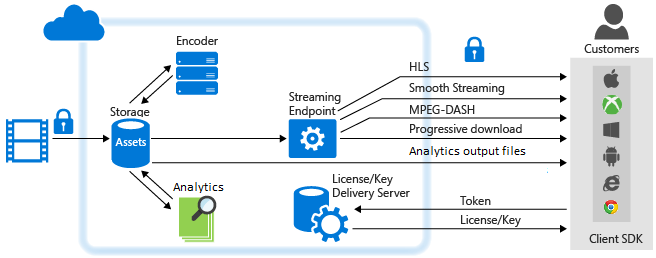

<properties 
	pageTitle="Azure Media Services Overview and Common Scenarios" 
	description="This topic gives an overview of Azure Media Services" 
	services="media-services" 
	documentationCenter="" 
	authors="Juliako" 
	manager="erikre" 
	editor=""/>

<tags 
	ms.service="media-services" 
	ms.workload="media" 
	ms.tgt_pltfrm="na" 
	ms.devlang="na" 
	ms.topic="hero-article" 
	ms.date="06/22/2016"
	ms.author="juliako;anilmur"/>

#Azure Media Services Overview and Common Scenarios

Microsoft Azure Media Services is an extensible cloud-based platform that enables developers to build scalable media management and delivery applications. Media Services is based on REST APIs that enable you to securely upload, store, encode and package video or audio content for both on-demand and live streaming delivery to various clients (for example, TV, PC, and mobile devices).

You can build end-to-end workflows using entirely Media Services. You can also choose to use third-party components for some parts of your workflow. For example, encode using a third-party encoder. Then, upload, protect, package, deliver using Media Services.

You can choose to stream your content live or deliver content on demand. This topic shows common scenarios for delivering your content [live](media-services-overview.md#live_scenarios) or [on demand](media-services-overview.md#vod_scenarios). The topic also links to other relevant topics.

## SDKs and tools 

To build Media Services solutions, you can use:

- [Media Services REST API](https://msdn.microsoft.com/library/azure/hh973617.aspx)
- One of the available client SDKs: 
	- [Azure Media Services SDK for .NET](https://github.com/Azure/azure-sdk-for-media-services), 
	- [Azure SDK for Java](https://github.com/Azure/azure-sdk-for-java), 
	- [Azure PHP SDK](https://github.com/Azure/azure-sdk-for-php), 
	- [Azure Media Services for Node.js](https://github.com/michelle-becker/node-ams-sdk/blob/master/lib/request.js) (This is a non-Microsoft version of a Node.js SDK. It is maintained by a community and currently does not have a 100% coverage of the AMS APIs). 
- Existing tools: 
	- [Azure Classic Portal](http://manage.windowsazure.com/) 
	- [Azure-Media-Services-Explorer](https://github.com/Azure/Azure-Media-Services-Explorer) (Azure Media Services Explorer (AMSE) is a Winforms/C# application for Windows)

##Media Services learning paths

You can view AMS learning paths here:

- [AMS Live Streaming Workflow](https://azure.microsoft.com/documentation/learning-paths/media-services-streaming-live/)
- [AMS on Demand Streaming Workflow](https://azure.microsoft.com/documentation/learning-paths/media-services-streaming-on-demand/)

##Prerequisites

To start using Azure Media Services, you should have the following:
 
3. An Azure account. If you don't have an account, you can create a free trial account in just a couple of minutes. For details, see [Azure Free Trial](https://azure.microsoft.com).
2. An Azure Media Services account. Use the Azure Classic Portal, .NET, or REST API to create Azure Media Services account. For more information, see [Create Account](media-services-create-account.md).
3. (Optional) Set up development environment. Choose .NET or REST API for your development environment. For more information, see [Set up environment](media-services-dotnet-how-to-use.md). 

	Also, learn how to connect  programmatically [Connect](media-services-dotnet-connect-programmatically.md).
4. (Recommended) Allocate one or more scale units. It is recommended to allocate one or more scale units for applications in production environment.   For more information, see [Managing streaming endpoints](media-services-manage-origins.md).

##Concepts and overview

For Azure Media Services concepts, see [Concepts](media-services-concepts.md).

For a how-to series that introduces you to all the main components of Azure Media Services, see [Azure Media Services Step-by-Step tutorials](https://docs.com/fukushima-shigeyuki/3439/english-azure-media-services-step-by-step-series). This series has a great overview of concepts and it uses the AMSE tool to demonstrate the AME tasks. Note that AMSE tool is a Windows tool. This tool supports most of the tasks you can achieve programmatically with [AMS SDK for .NET](https://github.com/Azure/azure-sdk-for-media-services), [Azure SDK for Java](https://github.com/Azure/azure-sdk-for-java), or  [Azure PHP SDK](https://github.com/Azure/azure-sdk-for-php).

##Delivering Media on-Demand with Azure Media Services: common scenarios and tasks

This section describes common scenarios and provides links to relevant topics. The following diagram shows the major parts of the Media Services platform that are involved in delivering content on demand. 

###Protect content in storage and deliver streaming media in the clear (non-encrypted)

1. Upload a high-quality mezzanine file into an asset.
	
	It is recommended to apply storage encryption option to your asset in order to protect your content during upload and while at rest in storage.
 
1. Encode to a set of adaptive bitrate MP4 files. 

	It is recommended to apply storage encryption option to the output asset in order to protect your content at rest.
	
1. Configure asset delivery policy (used by dynamic packaging). 
	
	If your asset is storage encrypted, you **must** configure asset delivery policy. 

1. Publish the asset by creating an OnDemand locator.

	Make sure to have at least one streaming reserved unit on the streaming endpoint from which you want to stream content.

1. Stream published content.

###Protect content in storage, deliver dynamically encrypted streaming media  

To be able to use dynamic encryption, you must first get at least one streaming reserved unit on the streaming endpoint from which you want to stream encrypted content.

1. Upload a high-quality mezzanine file into an asset. Apply storage encryption option to the asset.
1. Encode to a set of adaptive bitrate MP4 files. Apply storage encryption option to the output asset.
1. Create encryption content key for the asset you want to be dynamically encrypted during playback.
2. Configure content key authorization policy.
1. Configure asset delivery policy (used by dynamic packaging and dynamic encryption).
1. Publish the asset by creating an OnDemand locator.
1. Stream published content. 

###Use Media Analytics to derive actionable insights from your videos 

Media Analytics is a collection of speech and vision components that make it easier for organizations and enterprises to derive actionable insights from their video files. For more information, see [Azure Media Services Analytics Overview](media-services-analytics-overview.md).

1. Upload a high-quality mezzanine file into an asset.
2. Use one of the following Media Analytics services to process your videos:
	
	- **Indexer** – [Process videos with Azure Media Indexer 2](media-services-process-content-with-indexer2.md)
	- **Hyperlapse** – [Hyperlapse Media Files with Azure Media Hyperlapse](media-services-hyperlapse-content.md)
	- **Motion detection** – [Motion Detection for Azure Media Analytics](media-services-motion-detection.md).
	- **Face detection and Face emotions** – [Face and Emotion Detection for Azure Media Analytics](media-services-face-and-emotion-detection.md).
	- **Video summarization** – [Use Azure Media Video Thumbnails to Create a Video Summarization](media-services-video-summarization.md)
3. Media Analytics media processors produce MP4 files or JSON files. If a media processor produced an MP4 file, you can progressively download the file. If a media processor produced a JSON file, you can download the file from the Azure blob storage. 

###Deliver progressive download 

1. Upload a high-quality mezzanine file into an asset.
1. Encode to a single MP4 file.
1. Publish the asset by creating an OnDemand or SAS locator.

	If using OnDemand locator, make sure to have at least one streaming reserved unit on the streaming endpoint from which you plan to progressively download content.

	If using SAS locator, the content is downloaded from the Azure blob storage. In this case, you do not need to have streaming reserved units.
  
1. Progressively download content.

##Delivering Live Streaming Events with Azure Media Services

When working with Live Streaming the following components are commonly involved:

- A camera that is used to broadcast an event.
- A live video encoder that converts signals from the camera to streams that are sent to a live streaming service.

	Optionally, multiple live time synchronized encoders. For certain critical live events that demand very high availability and quality of experience, it is recommended to employ active-active redundant encoders with time synchronizationto achieve seamless failover with no data loss.
- A live streaming service that enables you to do the following:
	
	- ingest live content using various live streaming protocols (for example RTMP or Smooth Streaming),
	- (optionally) encode your stream into adaptive bitrate stream
	- preview your live stream,
	- record and store the ingested content in order to be streamed later (Video-on-Demand)
	- deliver the content through common streaming protocols (for example, MPEG DASH, Smooth, HLS, HDS) directly to your customers, or to a Content Delivery Network (CDN) for further distribution.

**Microsoft Azure Media Services** (AMS) provides the ability to ingest,  encode, preview, store, and deliver your live streaming content.

When delivering your content to customers your goal is to deliver a high quality video to various devices under different network conditions. To take care of quality and network conditions, use live encoders to encode your stream to multi-bitrate (adaptive bitrate) video stream.  To take care of streaming on different devices, use Media Services [dynamic packaging](media-services-dynamic-packaging-overview.md) to dynamically re-package your stream to different protocols. Media Services supports delivery of the following adaptive bitrate streaming technologies: HTTP Live Streaming (HLS), Smooth Streaming, MPEG DASH, and HDS (for Adobe PrimeTime/Access licensees only).

In Azure Media Services, **Channels**, **Programs**, and **StreamingEndpoints** handle all the live streaming functionalities including ingest, formatting, DVR, security, scalability and redundancy.

A **Channel** represents a pipeline for processing live streaming content. A Channel can receive a live input streams in the following ways:

- An on-premises live encoder sends multi-bitrate **RTMP** or **Smooth Streaming** (fragmented MP4) to the Channel that is configured for **pass-through** delivery. The **pass-through** delivery is when the ingested streams pass through **Channel**s without any further processing. You can use the following live encoders that output multi-bitrate Smooth Streaming: Elemental, Envivio, Cisco.  The following live encoders output RTMP: Adobe Flash Live, Telestream Wirecast, and Tricaster transcoders.  A live encoder can also send a single bitrate stream to a channel that is not enabled for live encoding, but that is not recommended. When requested, Media Services delivers the stream to customers.

	>[AZURE.NOTE] Using a pass-through method is the most economical way to do live streaming when you are doing multiple events over a long period of time, and you have already invested in on-premises encoders. See [pricing](/pricing/details/media-services/) details.
	
- An on-premises live encoder sends a single-bitrate stream to the Channel that is enabled to perform live encoding with Media Services in one of the following formats: RTP (MPEG-TS), RTMP, or Smooth Streaming (Fragmented MP4). The Channel then performs live encoding of the incoming single bitrate stream to a multi-bitrate (adaptive) video stream. When requested, Media Services delivers the stream to customers.

###Working with Channels that receive multi-bitrate live stream from on-premises encoders (pass-through)

The following diagram shows the major parts of the AMS platform that are involved in the **pass-through** workflow.

![Live workflow][live-overview2]

For more information, see [Working with Channels that Receive Multi-bitrate Live Stream from On-premises Encoders](media-services-live-streaming-with-onprem-encoders.md).

###Working with Channels that are enabled to perform live encoding with Azure Media Services

The following diagram shows the major parts of the AMS platform that are involved in Live Streaming workflow where a Channel is enabled to perform live encoding with Media Services.

![Live workflow][live-overview1]

For more information, see [Working with Channels that are Enabled to Perform Live Encoding with Azure Media Services](media-services-manage-live-encoder-enabled-channels.md).

##Consuming content

Azure Media Services provides the tools you need to create rich, dynamic client player applications for most platforms including: iOS Devices, Android Devices, Windows, Windows Phone, Xbox, and Set-top boxes. The following topic provides links to SDKs and Player Frameworks that you can use to develop your own client applications that can consume streaming media from Media Services.

[Developing Video Player Applications](media-services-develop-video-players.md)

##Enabling Azure CDN

Media Services supports integration with Azure CDN. For information on how to enable Azure CDN, see [How to Manage Streaming Endpoints in a Media Services Account](media-services-manage-origins.md#enable_cdn).

##Scaling a Media Services account

You can scale **Media Services** by specifying the number of **Streaming Reserved Units** and **Encoding Reserved Units** that you would like your account to be provisioned with.

You can also scale your Media Services account by adding storage accounts to it. Each storage account is limited to 500 TB. To expand your storage beyond the default limitations, you can choose to attach multiple storage accounts to a single Media Services account.

[This](media-services-how-to-scale.md) topic links to relevant topics.

##Support

[Azure Support](https://azure.microsoft.com/support/options/) provides support options for Azure, including Media Services.

##Provide feedback

[AZURE.INCLUDE [media-services-user-voice-include](../../includes/media-services-user-voice-include.md)]

##Service Level Agreement (SLA)

- For Media Services Encoding, we guarantee 99.9% availability of REST API transactions.
- For Streaming, we will successfully service requests with a 99.9% availability guarantee for existing media content when at least one Streaming Unit is purchased.
- For Live Channels, we guarantee that running Channels will have external connectivity at least 99.9% of the time.
- For Content Protection, we guarantee that we will successfully fulfill key requests at least 99.9% of the time.
- For Indexer, we will successfully service Indexer Task requests processed with an Encoding Reserved Unit 99.9% of the time.

For more information, see [Microsoft Azure SLA](https://azure.microsoft.com/support/legal/sla/).

<!-- Images -->
[overview]: ./media/media-services-overview/media-services-overview.png
[vod-overview]: ./media/media-services-video-on-demand-workflow/media-services-video-on-demand.png
[live-overview1]: ./media/media-services-live-streaming-workflow/media-services-live-streaming-new.png
[live-overview2]: ./media/media-services-live-streaming-workflow/media-services-live-streaming-current.png
 
