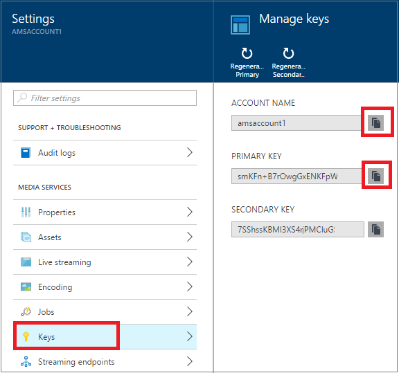

# Create an Azure Media Services account using the Azure portal
> [!div class="op_single_selector"]
> * [Portal](media-services-portal-create-account.md)
> * [PowerShell](media-services-manage-with-powershell.md)
> * [REST](https://docs.microsoft.com/rest/api/media/mediaservice)
> 
> [!NOTE]
> To complete this tutorial, you need an Azure account. For details, see [Azure Free Trial](https://azure.microsoft.com/pricing/free-trial/). 
> 
> 

The Azure portal provides a way to quickly create an Azure Media Services (AMS) account. You can use your account to access Media Services that enable you to store, encrypt, encode, manage, and stream media content in Azure. At the time you create a Media Services account, you also create an associated storage account (or use an existing one) in the same geographic region as the Media Services account.

This article explains some common concepts and shows how to create a Media Services account with the Azure portal.

## Concepts
Accessing Media Services requires two associated accounts:

* A Media Services account. Your account gives you access to a set of cloud-based Media Services that are available in Azure. A Media Services account does not store actual media content. Instead it stores metadata about the media content and media processing jobs in your account. At the time you create the account, you select an available Media Services region. The region you select is a data center that stores the metadata records for your account.
  
    Available Media Services (AMS) regions include the following: North Europe, West Europe, West US, East US, Southeast Asia, East Asia, Japan West, Japan East. Media Services does not use affinity groups.
  
    AMS is now also available in the following data centers: Brazil South, India West, India South, and India Central. You can now use the Azure  portal to create Media Service accounts and perform various tasks described here. However, Live Encoding is not enabled in these data centers. Further, not all types of Encoding Reserved Units are available in these data centers.
  
  * Brazil South: Only Standard and Basic Encoding Reserved Units are available.
  * India West, India South: 
* An Azure storage account. Storage accounts must be located in the same geographic region as the Media Services account. When you create a Media Services account, you can either choose an existing storage account in the same region, or you can create a new storage account in the same region. If you delete a Media Services account, the blobs in your related storage account are not deleted.

## Create an AMS account
The steps in this section show how to create an AMS account.

1. Log in at the [Azure portal](https://portal.azure.com/).
2. Click **+New** > **Web + Mobile** > **Media Services**.
   
    
3. In **CREATE MEDIA SERVICES ACCOUNT** enter required values.
   
    
   
   1. In **Account Name**, enter the name of the new AMS account. A Media Services account name is all lowercase letters or numbers with no spaces, and is 3 to 24 characters in length.
   2. In Subscription, select among the different Azure subscriptions that you have access to.
   3. In **Resource Group**, select the new or existing resource.  A resource group is a collection of resources that share lifecycle, permissions, and policies. Learn more [here](../azure-resource-manager/resource-group-overview.md#resource-groups).
   4. In **Location**,  select the geographic region that will be used to store the media and metadata records for your Media Services account. This  region will be used to process and stream your media. Only the available Media Services regions appear in the drop-down list box. 
   5. In **Storage Account**, select a storage account to provide blob storage of the media content from your Media Services account. You can select an existing storage account in the same geographic region as your Media Services account, or you can create a storage account. A new storage account is created in the same region. The rules for storage account names are the same as for Media Services accounts.
      
       Learn more about storage [here](../storage/storage-introduction.md).
   6. Select **Pin to dashboard** to see the progress of the account deployment.
4. Click **Create** at the bottom of the form.
   
    Once the account is successfully created, overview page loads. In the streaming endpoint table the account will have a default streaming endpoint in the **Stopped** state. 

    >[!NOTE]
    >When your AMS account is created a **default** streaming endpoint is added to your account in the **Stopped** state. To start streaming your content and take advantage of dynamic packaging and dynamic encryption, the streaming endpoint from which you want to stream content has to be in the **Running** state. 
   
    
   
    To manage your AMS account (for example, upload videos, encode assets, monitor job progress) use the **Settings** window.

## Manage Keys
You need the account name and the primary key information to programmatically access the Media Services account.

1. In the Azure portal, select your account. 
   
    The **Settings** window appears on the right. 
2. In the **Settings** window, select **Keys**. 
   
    The **Manage keys** windows shows the account name and the primary and secondary keys is displayed. 
3. Press the copy button to copy the values.
   
    

## Next steps
You can now upload files into your AMS account. For more information, see [Upload files](media-services-portal-upload-files.md).

## Media Services learning paths
[!INCLUDE [media-services-learning-paths-include](../../includes/media-services-learning-paths-include.md)]

## Provide feedback
[!INCLUDE [media-services-user-voice-include](../../includes/media-services-user-voice-include.md)]

