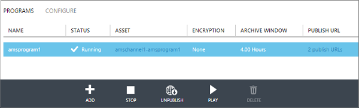
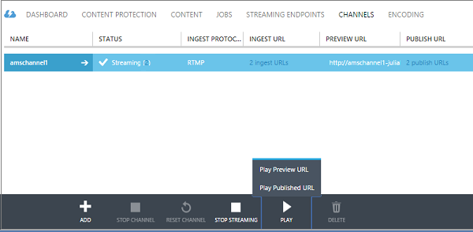

<properties 
	pageTitle="How to perform live streaming using Azure Media Services to create multi-bitrate streams with the Azure Classic Portal" 
	description="This tutorial walks you through the steps of creating a Channel that receives a single-bitrate live stream and encodes it to multi-bitrate stream using the Azure Classic Portal." 
	services="media-services" 
	documentationCenter="" 
	authors="juliako,anilmur" 
	manager="erikre" 
	editor=""/>

<tags 
	ms.service="media-services" 
	ms.workload="media" 
	ms.tgt_pltfrm="na" 
	ms.devlang="na" 
	ms.topic="get-started-article"
	ms.date="06/22/2016"
	ms.author="juliako"/>

#How to perform live streaming using Azure Media Services to create multi-bitrate streams with the Azure Classic Portal

> [AZURE.SELECTOR]
- [Portal](media-services-portal-creating-live-encoder-enabled-channel.md)
- [.NET](media-services-dotnet-creating-live-encoder-enabled-channel.md)
- [REST API](https://msdn.microsoft.com/library/azure/dn783458.aspx)

This tutorial walks you through the steps of creating a **Channel** that receives a single-bitrate live stream and encodes it to multi-bitrate stream.

>[AZURE.NOTE]For more conceptual information related to Channels that are enabled for live encoding, see [Live streaming using Azure Media Services to create multi-bitrate streams](media-services-manage-live-encoder-enabled-channels.md).

##Common Live Streaming Scenario

The following are general steps involved in creating common live streaming applications.

>[AZURE.NOTE] Currently, the max recommended duration of a live event is 8 hours. Please contact  amslived at Microsoft.com if you need to run a Channel for longer periods of time.

1. Connect a video camera to a computer. Launch and configure an on-premises live encoder that can output a single bitrate stream in one of the following protocols: RTMP, Smooth Streaming, or RTP (MPEG-TS). For more information, see [Azure Media Services RTMP Support and Live Encoders](http://go.microsoft.com/fwlink/?LinkId=532824).
	
	This step could also be performed after you create your Channel.

1. Create and start a Channel. 

1. Retrieve the Channel ingest URL. 

	The ingest URL is used by the live encoder to send the stream to the Channel.
1. Retrieve the Channel preview URL. 

	Use this URL to verify that your channel is properly receiving the live stream.

3. Create a program (that will also create an asset). 
1. Publish the program (that will create an  OnDemand locator for the associated asset).  

	Make sure to have at least one streaming reserved unit on the streaming endpoint from which you want to stream content.
1. Start the program when you are ready to start streaming and archiving.
2. Optionally, the live encoder can be signaled to start an advertisement. The advertisement is inserted in the output stream.
1. Stop the program whenever you want to stop streaming and archiving the event.
1. Delete the Program (and optionally delete the asset).   

##In this tutorial

In this tutorial, the Azure Classic Portal is used to accomplish the following tasks: 

2.  Configure streaming endpoints.
3.  Create a channel that is enabled to perform live encoding.
1.  Get the Ingest URL in order to supply it to live encoder. The live encoder will use this URL to ingest the stream into the Channel. .
1.  Create a program (and an asset)
1.  Publish the asset and get streaming URLs  
1.  Play your content 
2.  Cleaning up

##Prerequisites
The following are required to complete the tutorial.

- To complete this tutorial, you need an Azure account. If you don't have an account, you can create a free trial account in just a couple of minutes. 
For details, see [Azure Free Trial](https://azure.microsoft.com/pricing/free-trial/).
- A Media Services account. To create a Media Services account, see [Create Account](media-services-create-account.md).
- A webcam and an encoder that can send a single bitrate live stream.

##Configure streaming endpoint using Portal

When working with Azure Media Services, one of the most common scenarios is delivering adaptive bitrate streaming to your clients. With adaptive bitrate streaming, the client can switch to a higher or lower bitrate stream as the video is displayed based on the current network bandwidth, CPU utilization, and other factors. Media Services supports the following adaptive bitrate streaming technologies: HTTP Live Streaming (HLS), Smooth Streaming, MPEG DASH, and HDS (for Adobe PrimeTime/Access licensees only). 

When working with live streaming, an on-premises live encoder (in our case Wirecast) ingests a multi-bitrate live stream into your channel. When the stream is requested by a user, Media Services uses dynamic packaging to re-package the source stream into the requested adaptive bitrate stream (HLS, DASH, or Smooth). 

To take advantage of dynamic packaging, you need to get at least one streaming unit for the **streaming endpoint** from which you plan to delivery your content.

To change the number of streaming reserved units, do the following:

1. In the [Azure Classic Portal](https://manage.windowsazure.com/), click **Media Services**. Then, click the name of the media service.

2. Select the STREAMING ENDPOINTS page. Then, click on the streaming endpoint that you want to modify.

3. To specify the number of streaming units, select the SCALE tab and move the **reserved capacity** slider.

	

4. Press the SAVE button to save your changes.

	The allocation of any new units takes around 20 minutes to complete. 

	 
	>[AZURE.NOTE] Currently, going from any positive value of streaming units back to none, can disable streaming for up to an hour.
	>
	> The highest number of units specified for the 24-hour period is used in calculating the cost. For information about pricing details, see [Media Services Pricing Details](http://go.microsoft.com/fwlink/?LinkId=275107).

 
##Create a CHANNEL

1.	In the [Azure Classic Portal](http://manage.windowsazure.com/), click Media Services and then click on the Media Services account name.
2.	Select the CHANNELS page.
3.	Select Add+ to add a new channel.

Choose **Standard** encoding types. This type specifies that you want to create a Channel that is enabled for live encoding. That means the incoming single bitrate stream is sent to the Channel and encoded into a multi-bitrate stream using specified live encoder settings. For more information, see [Live streaming using Azure Media Services to create multi-bitrate streams](media-services-manage-live-encoder-enabled-channels.md).

![standard0][standard0]

For the **Standard** encoding type, valid ingest protocol options are:

- Single bitrate Fragmented MP4 (Smooth Streaming)
- Single bitrate RTMP
- RTP (MPEG-TS): MPEG-2 Transport Stream over RTP.

For detailed explanation about each protocol, see [Live streaming using Azure Media Services to create multi-bitrate streams](media-services-manage-live-encoder-enabled-channels.md).

![standard1][standard1]

You cannot change the input protocol while the Channel or its associated programs are running. If you require different protocols, you should create separate channels for each input protocol.  

On the **Advertising Configuration** page you can specify the source for ad markers signals. When using Portal, you can only select API, which indicates that the live encoder within the Channel should listen to an asynchronous Ad Marker API. When using Portal, you can only select API.

For more information, see [Live streaming using Azure Media Services to create multi-bitrate streams](media-services-manage-live-encoder-enabled-channels.md).

![standard2][standard2]

On the **Encoding Preset** page, you can select system presets. Currently, the only system preset you can select is **Default 720p**.

![standard3][standard3]

On the **Channel Creation** page, you can define the IP addresses that are allowed to publish video to this channel. Allowed IP addresses can be specified as either a single IP address (e.g. ‘10.0.0.1’), an IP range using an IP address and a CIDR subnet mask (e.g. ‘10.0.0.1/22’), or an IP range using an IP address and a dotted decimal subnet mask (e.g. ‘10.0.0.1(255.255.252.0)’).

If no IP addresses are specified and there is no rule definition then no IP address will be allowed. To allow any IP address, create a rule and set 0.0.0.0/0.

![standard4][standard4]

>[AZURE.NOTE] Currently, the Channel start can take up to 30 minutes. Channel reset can take up to 5 minutes.

Once you created the Channel, you can select the **ENCODER** tab where you can view your channels configurations. You can also manage advertisements and slates. 

![standard5][standard5]

For more information, see [Live streaming using Azure Media Services to create multi-bitrate streams](media-services-manage-live-encoder-enabled-channels.md).

##Get ingest URLs

Once the channel is created, you can get ingest URLs that you will provide to the live encoder. The encoder uses these URLs to input a live stream.

##Create and manage a program

###Overview

A channel is associated with programs that enable you to control the publishing and storage of segments in a live stream. Channels manage Programs. The Channel and Program relationship is very similar to traditional media where a channel has a constant stream of content and a program is scoped to some timed event on that channel.

You can specify the number of hours you want to retain the recorded content for the program by setting the **Archive Window** length. This value can be set from a minimum of 5 minutes to a maximum of 25 hours. Archive window length also dictates the maximum amount of time clients can seek back in time from the current live position. Programs can run over the specified amount of time, but content that falls behind the window length is continuously discarded. This value of this property also determines how long the client manifests can grow.

Each program is associated with an Asset. To publish the program you must create an OnDemand locator for the associated asset. Having this locator will enable you to build a streaming URL that you can provide to your clients.

A channel supports up to three concurrently running programs so you can create multiple archives of the same incoming stream. This allows you to publish and archive different parts of an event as needed. For example, your business requirement is to archive 6 hours of a program, but to broadcast only last 10 minutes. To accomplish this, you need to create two concurrently running programs. One program is set to archive 6 hours of the event but the program is not published. The other program is set to archive for 10 minutes and this program is published.

You should not reuse existing programs for new events. Instead, create and start a new program for each event.

Start the program when you are ready to start streaming and archiving. Stop the program whenever you want to stop streaming and archiving the event. 

To delete archived content, stop and delete the program and then delete the associated asset. An asset cannot be deleted if it is used by a program; the program must be deleted first. 

Even after you stop and delete the program, the users would be able to stream your archived content as a video on demand, for as long as you do not delete the asset.

If you do want to retain the archived content, but not have it available for streaming, delete the streaming locator.

###Create/Start/Stop Programs

Once you have the stream flowing into the Channel you can begin the streaming event by creating an Asset, Program, and Streaming Locator. This will archive the stream and make it available to viewers through the Streaming Endpoint. 

There are two ways to start event: 

1. From the **CHANNEL** page, press **ADD** to add a new program.

	Specify: program name, asset name, archive window, and encryption option.
	
	
	
	If you left **Publish this program now** checked, the program the PUBLISHING URLs will get created.
	
	You can press **START**, whenever you are ready streaming the program.

	Once you start the program, you can press PLAY to start playing the content.

	

2. Alternatively, you can use a shortcut and press **START STREAMING** button on the **CHANNEL** page. This will create an Asset, Program, and Streaming Locator.

	The program is named DefaultProgram and the archive window is set to 1 hour.

	You can play the published program from the CHANNEL page. 

	

If you click **STOP STREAMING** on the **CHANNEL** page, the default program will be stopped and deleted. The asset will still be there and you can publish or unpublish it from the **CONTENT**  page.

If you switch to the **CONTENT** page, you will see the assets that were created for your programs.

##Playing content

To provide your user with a  URL that can be used to stream your content, you first need to "publish" your asset (as was described in the previous section) by creating a locator (when you publish an asset using Portal, locators are created for you). Locators provide access to files contained in the asset. 

Depending on what streaming protocol you want to use to playback your content, you might need to modify the URL that you get from the **PUBLISH URL** link of the channel\program.

Dynamic packaging will take care of packaging the live stream into the specified protocol. 

By default, a streaming URL has the following format and you can use it to play Smooth Streaming assets:

	{streaming endpoint name-media services account name}.streaming.mediaservices.windows.net/{locator ID}/{filename}.ism/Manifest

To build an HLS streaming URL, append (format=m3u8-aapl) to the URL.

	{streaming endpoint name-media services account name}.streaming.mediaservices.windows.net/{locator ID}/{filename}.ism/Manifest(format=m3u8-aapl)

To build an  MPEG DASH streaming URL, append (format=mpd-time-csf) to the URL.

	{streaming endpoint name-media services account name}.streaming.mediaservices.windows.net/{locator ID}/{filename}.ism/Manifest(format=mpd-time-csf)

For more information about delivering your content, see [Delivering content](media-services-deliver-content-overview.md).

You can playback Smooth Stream using [AMS Player](http://amsplayer.azurewebsites.net/azuremediaplayer.html) or use iOS and Android devices to play HLS version 3.

##Clean up

If you are done streaming events and want to clean up the resources provisioned earlier, follow the following procedure.

- Stop pushing the stream from the encoder.
- Stop the channel. Once the Channel is stopped, it will not incur any charges. When you need to start it again, it will have the same ingest URL so you won't need to reconfigure your encoder.
- You can stop your Streaming Endpoint, unless you want to continue to provide the archive of your live event as an on-demand stream. If the channel is in stopped state, it will not incur any charges.
  

##Considerations

- Currently, the max recommended duration of a live event is 8 hours. Please contact amslived at Microsoft.com if you need to run a Channel for longer periods of time.
- Make sure to have at least one streaming reserved unit on the streaming endpoint from which you want to stream content.

##Media Services learning paths

[AZURE.INCLUDE [media-services-learning-paths-include](../../includes/media-services-learning-paths-include.md)]

##Provide feedback

[AZURE.INCLUDE [media-services-user-voice-include](../../includes/media-services-user-voice-include.md)]

[standard0]: ./media/media-services-portal-creating-live-encoder-enabled-channel/media-services-create-channel-standard0.png
[standard1]: ./media/media-services-portal-creating-live-encoder-enabled-channel/media-services-create-channel-standard1.png
[standard2]: ./media/media-services-portal-creating-live-encoder-enabled-channel/media-services-create-channel-standard2.png
[standard3]: ./media/media-services-portal-creating-live-encoder-enabled-channel/media-services-create-channel-standard3.png
[standard4]: ./media/media-services-portal-creating-live-encoder-enabled-channel/media-services-create-channel-standard4.png
[standard5]: ./media/media-services-portal-creating-live-encoder-enabled-channel/media-services-create-channel-standard_encode.png 