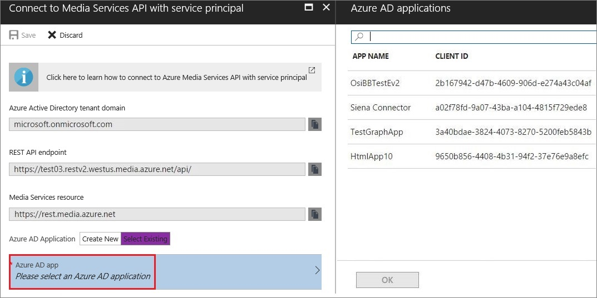

# Getting started with Azure AD authentication by using the Azure portal

Learn how to use the Azure portal to access Azure Active Directory (Azure AD) authentication settings to consume the Azure Media Services API.

## Prerequisites

- An Azure account. For details, see [Azure free trial](https://azure.microsoft.com/pricing/free-trial/). 
- A Media Services account. For more information, see [Create an Azure Media Services account by using the Azure portal](media-services-portal-create-account.md)
- Make sure you review the [Accessing Azure Media Services API with Azure AD authentication overview](media-services-use-aad-auth-to-access-ams-api.md). 

When you use Azure AD authentication with Azure Media Services, you can authenticate in one of two ways:

- **User authentication** is used to authenticate a person who is using the app to interact with AMS resources. The interactive application should first prompt the user for credentials. For example, a management console app used by authorized users to monitor encoding jobs or live streaming. 
- **Service principal authentication** is used to authenticate a service. Applications that commonly use this authentication method are apps that run daemon services, middle-tier services or scheduled jobs: Web Apps, Function Apps, Logic Apps, API, Microservice.

>[!IMPORTANT]
>AMS currently supports ACS authentication model. However, ACS auth is going to be deprecated on June 1st, 2018. We recommend that you migrate to AAD authentication model as soon as possible.

## Select authentication method

1. In the [Azure portal](https://portal.azure.com/), select your Azure Media Services account.
2. Choose how to connect to the AMS API.

	

## User authentication

To connect to the AMS API with the user authentication option, the client app needs to request an AAD token using the following parameters:  

1. AAD tenant endpoint
2. Media Services resource URI, 
3. Media Services (native) application Client ID, 
4. Media Services (native) application redirect URI, 
5. resource URI for Media REST Services.

You can get the values for these parameters on the **Media Services API with user authentication** page. 

If you are connecting to the AMS API using Media Services .NET SDK, the following values will be available to you as part of the SDK. For more information, see [Use AAD authentication to access Azure Media Services API with .NET](media-services-dotnet-get-started-with-aad.md)

If you are not using Media Services .NET client SDK, you will be required to manually create an AAD token request using the parameters shown above. For more information, see [How to use ADAL libaraies to get the AAD token](../active-directory/develop/active-directory-authentication-libraries.md).

## Service principal authentication

To connect to the AMS API with the service principal option, your middle-tier app (Web API or Web Application) needs to requests an AAD token with the following parameters:  

1. AAD tenant endpoint
2. Media Services resource URI, 
3. resource URI for Media REST Services,
4. AAD application values: the **Client ID** and **Client secret**.

You can get the values for these parameters on the **Connect to Media Services API with service principal** page. This page enables you to create a new AAD application or choose an existing one. After you select the AAD app, you will be able to get the **Client ID** (Application ID) and generate the **Client secret** (key) values. 

When the Service Principal blade opens, it selects the first AAD application that meets the following criteria:

- It is a registered AAD application.
- It has "Contributor" or "Owner" RBAC permissions on the account.

After creating or selecting an AAD app, you will be able to create and copy a **Client Secret** (key) and the **Client ID** (Application ID) which are required to get the access token in this scenario.

If you do not have permissions to create AAD apps in your Domain, the AAD app controls of the blade are not shown and a warning message is shown instead.

If you are connecting to the AMS API using Media Services .NET SDK, see [Use AAD authentication to access Azure Media Services API with .NET](media-services-dotnet-get-started-with-aad.md)

If you are not using Media Services .NET client SDK, you will be required to manually create an AAD token request using the parameters shown above. For more information, see [How to use ADAL libaraies to get the AAD token](../active-directory/develop/active-directory-authentication-libraries.md).

### Get Client ID and Client secret

Once you select an existing AAD app or select a new one, the following buttons appear.

Click the **Manage application** button to open the AAD Application blade. On this blade, you can get the app's **Client ID** (Application ID) and generate a **Client Secret** (key) through the **Keys** menu option.

 

### Manage permissions and application

Once you select the AAD application, you will be able to manage the application and permissions. Click **Manage Permissions** to allow your AAD application to talk to other applications. Click **Manage Application** to perform management tasks, such as changing keys and reply URLs or editing the application’s manifest.

### Edit the app's settings or manifest

If you need to edit the app's settings or manifest. Click on the **Manage application** button.

## Next steps

Get started with [uploading files to your account](media-services-portal-upload-files.md).