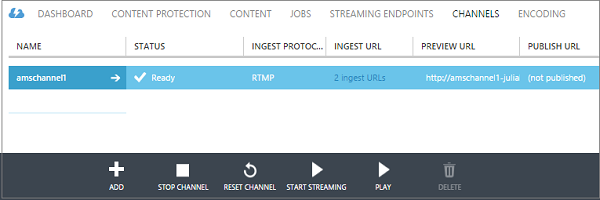

<properties
	pageTitle="Use the Azure Classic Portal to create channels that receive multi-bitrate live streams from on-premises encoders | Microsoft Azure"
	description="This tutorial walks you through the steps of implementing a basic Media Services live streaming application where a channel receives a multi-bitrate live stream from an on-premises live encoder."
	services="media-services"
	documentationCenter=""
	authors="Juliako,cenkdin"
	manager="erikre"
	editor=""/>

<tags
	ms.service="media-services"
	ms.workload="media"
	ms.tgt_pltfrm="na"
	ms.devlang="ne"
	ms.topic="article"
	ms.date="06/22/2016" 
	ms.author="juliako"/>

# Use the Azure Classic Portal to create channels that receive multi-bitrate live streams from on-premises encoders

[AZURE.INCLUDE [media-services-selector-manage-channels](../../includes/media-services-selector-manage-channels.md)]

This tutorial walks you through the steps of implementing a basic Media Services live streaming application where a channel receives a multi-bitrate live stream from an on-premises live encoder. For a more detailed overview of working with channels and related components, see [Working with channels that receive multi-bitrate live stream from on-premises encoders](media-services-live-streaming-with-onprem-encoders.md).

In this tutorial, the Azure Classic Portal is used to accomplish the following tasks:

2.  Configure streaming endpoints.
3.  Create a channel.
1.  Configure a live encoder and ingest live stream into the channel (Wirecast is used in this step).
1.  Create a program (and an asset).
1.  Publish the asset and get streaming URLs.
1.  Play your content.
2.  Clean up.

## Prerequisites
The following are required to complete the tutorial.

- To complete this tutorial, you need an Azure account. For details, see [Azure Free Trial](/pricing/free-trial/?WT.mc_id=A261C142F).
- A Media Services account. To create a Media Services account, see [Create Account](media-services-create-account.md).
- A webcam and an encoder that can send a multi-bitrate live stream.

## Configure streaming endpoint using the Azure Classic Portal

When working with Azure Media Services, one of the most common scenarios is delivering adaptive bitrate streaming to your clients. With adaptive bitrate streaming, the client can switch to a higher or lower bitrate stream because the video is displayed based on the current network bandwidth, CPU utilization, and other factors. Media Services supports the following adaptive bitrate streaming technologies: HTTP Live Streaming (HLS), Smooth Streaming, MPEG DASH, and HDS (for Adobe PrimeTime/Access licensees only).

When working with live streaming, an on-premises live encoder (in our case Wirecast) ingests a multi-bitrate live stream into your channel. When the stream is requested by a user, Media Services uses dynamic packaging to re-package the source stream into the requested adaptive bitrate stream (HLS, DASH, or Smooth).

To take advantage of dynamic packaging, you need to get at least one streaming unit for the *streaming endpoint* from which you plan to delivery your content.

To change the number of streaming reserved units, do the following:

1. In the [Azure Classic Portal](https://manage.windowsazure.com/), click **Media Services**. Then, click the name of the media service.

2. Select the **STREAMING ENDPOINTS** page. Then, click the streaming endpoint that you want to modify.

3. To specify the number of streaming units, select the **SCALE** tab and move the reserved capacity slider.

4. Click the **SAVE** button to save your changes.

The allocation of any new units takes around 20 minutes to complete.

>[AZURE.NOTE] Currently, going from any positive value of streaming units back to none, can disable streaming for up to an hour.
>
> The highest number of units specified for the 24-hour period is used in calculating the cost. For information about pricing details, see [Media Services Pricing Details](http://go.microsoft.com/fwlink/?LinkId=275107).

## Create a channel

In the Azure Classic Portal, select the **CHANNELS** page. Then, click **NEW**. On the **Create a new Live Channel** page enter a name for your channel.

In the lower-right corner of the page, click to check mark to save your updates.

After a few minutes the channel gets created and started.

## Get ingest URLs

Once the channel is created, you can get ingest URLs that you will provide to the live encoder. The encoder uses these URLs to input a live stream.

For more information about Ingest URLs, see [Using on-premises encoders to send multi-bitrate live stream to a channel](media-services-live-streaming-with-onprem-encoders.md).

## Configure a live encoder and ingest live stream

>[AZURE.NOTE] This step will require the channel’s ingest URL that was mentioned in the previous step.

For detailed information about how to configure Wirecast and start ingesting the stream, see [Wirecast Configuration](https://azure.microsoft.com/blog/2014/09/18/azure-media-services-rtmp-support-and-live-encoders/).

>[AZURE.NOTE] If for any reason you stop the encoder and then need to restart it you should first reset the channel by clicking the **RESET** command in the Azure Classic Portal.

## Create and manage a program

### Overview

A channel is associated with programs that enable you to control the publishing and storage of segments in a live stream. Channels manage programs. The channel and program relationship is very similar to traditional media where a channel has a constant stream of content and a program is scoped to some timed event on that channel.

You can specify the number of hours you want to retain the recorded content for the program by setting the **Archive Window** length. This value can be set from a minimum of 5 minutes to a maximum of 25 hours. Archive window length also dictates the maximum amount of time clients can seek back in time from the current live position. Programs can run over the specified amount of time, but content that falls behind the window length is continuously discarded. This value of this property also determines how long the client manifests can grow.

Each program is associated with an asset. To publish the program you must create an OnDemand locator for the associated asset. Having this locator will enable you to build a streaming URL that you can provide to your clients.

A channel supports up to three concurrently running programs so you can create multiple archives of the same incoming stream. This allows you to publish and archive different parts of an event as needed. For example, your business requirement is to archive 6 hours of a program, but to broadcast only the last 10 minutes. To accomplish this, you need to create two concurrently running programs. One program is set to archive 6 hours of the event but the program is not published. The other program is set to archive for 10 minutes and this program is published.

You should not reuse existing programs for new events. Instead, create and start a new program for each event.

Start the program when you are ready to start streaming and archiving. Stop the program whenever you want to stop streaming and archiving the event.

To delete archived content, stop and delete the program and then delete the associated asset. An asset cannot be deleted if it is used by a program; the program must be deleted first.

Even after you stop and delete the program, the users would be able to stream your archived content as a video on demand, for as long as you do not delete the asset.

If you do want to retain the archived content, but not have it available for streaming, delete the streaming locator.

### Create, start, and stop programs

Once you have the stream flowing into the channel you can begin the streaming event by creating an Asset, Program, and Streaming Locator. This will archive the stream and make it available to viewers through the streaming endpoint.

There are two ways to start an event:

1. From the **CHANNELS** page, click **ADD** to add a new program.

On the **Create a new program** page, specify the program name, asset name, archive window, and encryption option.

If **Publish this program now** is selected, the publish URLs are created.

You can click **START** whenever you are ready to stream the program.

Once you start the program, you can click **PLAY** to start playing the content.

2. Alternatively, you can use a shortcut and click the **START STREAMING** button on the **CHANNELS** page. This will create an Asset, Program, and Streaming Locator.

The program is named DefaultProgram and the archive window is set to 1 hour.

You can play the published program from the **CHANNELS** page.

If you click **STOP STREAMING** on the **CHANNELS** page, the default program will be stopped and deleted. The asset will still be there and you can publish or unpublish it from the **CONTENT**  page.

If you switch to the **CONTENT** page, you will see the assets that were created for your programs.

## Playing content

To provide your user with a  URL that can be used to stream your content, you first need to *publish* your asset (as described in the previous section) by creating a locator (when you publish an asset using the Azure Classic Portal, locators are created for you). Locators provide access to files contained in the asset.

Depending on what streaming protocol you want to use to playback your content, you might need to modify the URL that you get from the **PUBLISH URL** link of the channel\program.

Dynamic packaging will take care of packaging the live stream into the specified protocol.

By default, a streaming URL has the following format and you can use it to play Smooth Streaming assets.

{streaming endpoint name-media services account name}.streaming.mediaservices.windows.net/{locator ID}/{filename}.ism/Manifest

To build an HLS streaming URL, append (format=m3u8-aapl) to the URL.

{streaming endpoint name-media services account name}.streaming.mediaservices.windows.net/{locator ID}/{filename}.ism/Manifest(format=m3u8-aapl)

To build an  MPEG DASH streaming URL, append (format=mpd-time-csf) to the URL.

{streaming endpoint name-media services account name}.streaming.mediaservices.windows.net/{locator ID}/{filename}.ism/Manifest(format=mpd-time-csf)

For more information about delivering your content, see [Delivering content](media-services-deliver-content-overview.md).

You can playback Smooth Stream using [AMS Player](http://amsplayer.azurewebsites.net/azuremediaplayer.html) or use iOS and Android devices to play HLS version 3.

## Clean up

If you are done streaming events and want to clean up the resources provisioned earlier, use the following procedure.

- Stop pushing the stream from the encoder.
- Stop the channel. Once the channel is stopped, it will not incur any charges. When you need to start it again, it will have the same ingest URL so you won't need to reconfigure your encoder.
- You can stop your streaming endpoint, unless you want to continue to provide the archive of your live event as an on-demand stream. If the channel is in a stopped state, it will not incur any charges.

##Next Steps: Media Services learning paths

[AZURE.INCLUDE [media-services-learning-paths-include](../../includes/media-services-learning-paths-include.md)]

##Provide feedback

[AZURE.INCLUDE [media-services-user-voice-include](../../includes/media-services-user-voice-include.md)]

### Looking for something else?

If this topic didn't contain what you were expecting, is missing something, or in some other way didn't meet your needs, please provide us with you feedback using the Disqus thread below.

## Additional resources
- [Getting Started with Live Streaming Using the Azure Classic Portal](https://azure.microsoft.com/blog/getting-started-with-live-streaming-using-the-azure-management-portal/)

<!-- URLs. -->
[Azure Classic Portal]: http://manage.windowsazure.com/

<!-- Images -->
