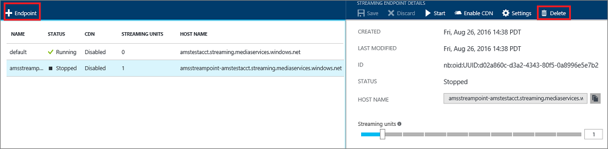
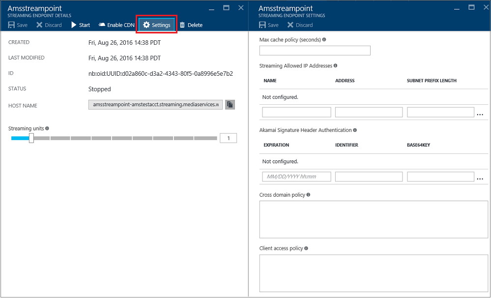
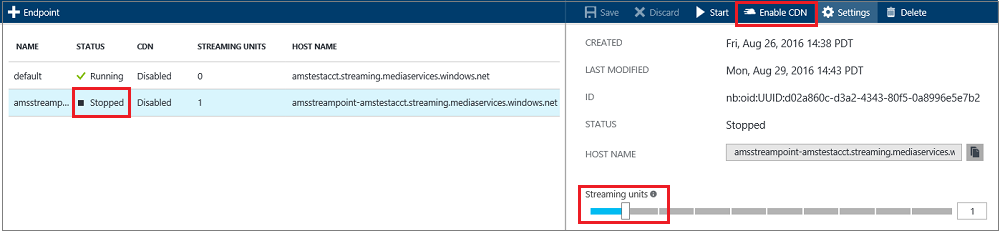

<properties 
	pageTitle="Manage streaming endpoints with the Azure portal | Microsoft Azure" 
	description="This topic shows how to manage streaming endpoints with the Azure portal." 
	services="media-services" 
	documentationCenter="" 
	authors="Juliako" 
	writer="juliako" 
	manager="erikre" 
	editor=""/>

<tags 
	ms.service="media-services" 
	ms.workload="media" 
	ms.tgt_pltfrm="na" 
	ms.devlang="na" 
	ms.topic="article" 
	ms.date="10/24/2016"
	ms.author="juliako"/>

#Manage streaming endpoints with the Azure portal

## Overview

> [AZURE.NOTE] To complete this tutorial, you need an Azure account. For details, see [Azure Free Trial](https://azure.microsoft.com/pricing/free-trial/). 

In Microsoft Azure Media Services, a **Streaming Endpoint** represents a streaming service that can deliver content directly to a client player application, or to a Content Delivery Network (CDN) for further distribution. Media Services also provides seamless Azure CDN integration. The outbound stream from a StreamingEndpoint service can be a live stream, or a video on demand Asset in your Media Services account.

In addition, you can control the capacity of the Streaming Endpoint service to handle growing bandwidth needs by adjusting streaming units. It is recommended to allocate one or more scale units for applications in production environment. Streaming units provide you with both dedicated egress capacity that can be purchased in increments of 200 Mbps and additional functionality, which includes: [dynamic packaging](media-services-dynamic-packaging-overview.md), CDN integration, and advanced configuration.

>[AZURE.NOTE]You are only billed when your Streaming Endpoint is in running state.

This topic gives an overview of the main functionalities that are provided by Streaming Endpoints. The topic also shows how to use the Azure portal to manage streaming endpoints. For information about how to scale the streaming endpoint, see [this](media-services-portal-scale-streaming-endpoints.md) topic.

## Start managing streaming endpoints

To start managing streaming endpoints for your account, do the following.

1. In the [Azure portal](https://portal.azure.com/), select your Azure Media Services account.
2. In the **Settings** window, select **Streaming endpoints**.

	

##Add/delete a streaming endpoint

To add/delete streaming endpoint using the Azure portal, do the following:

1. To add a streaming endpoint, click the **+ Endpoint** at the top of the page. 
2. To delete a streaming endpoint, press **Delete** button. 

	The default streaming endpoint cannot be deleted.
2. Click the **Start** button to start the streaming endpoint.

	

By default you can have up to two streaming endpoints. If you need to request more, see [Quotas and limitations](media-services-quotas-and-limitations.md).
	
##Configuring the Streaming Endpoint

Streaming Endpoint enables you to configure the following properties when you have at least 1 scale unit: 

- Access control
- Cache control
- Cross site access policies

For detailed information about these properties, see [StreamingEndpoint](https://msdn.microsoft.com/library/azure/dn783468.aspx).

You can configure streaming endpoint by doing the following:

1. Select the streaming endpoint that you want to configure.
1. Click **Settings**.
  
A brief description of the fields follows.

  
1. Maximum cache policy: used to configure cache lifetime for assets served through this streaming endpoint. If no value is set, the default is used. The default values can also be defined directly in Azure storage. If Azure CDN is enabled for the streaming endpoint, you should not set the cache policy value to less than 600 seconds.  

2. Allowed IP addresses: used to specify IP addresses that would be allowed to connect to the published streaming endpoint. If no IP addresses specified, any IP address would be able to connect. IP addresses can be specified as either a single IP address (for example, '10.0.0.1'), an IP range using an IP address and a CIDR subnet mask (for example, '10.0.0.1/22'), or an IP range using IP address and a dotted decimal subnet mask (for example, '10.0.0.1(255.255.255.0)').

3. Configuration for Akamai signature header authentication: used to specify how signature header authentication request from Akamai servers is configured. Expiration is in UTC.

##Enable Azure CDN integration

You can specify to enable the Azure CDN integration for a Streaming Endpoint (it is disabled by default.)

To set the Azure CDN integration to true:

- The streaming endpoint must have at least one streaming unit. If later you want to set scale units to 0, you must first disable the CDN integration. By default when you create a new streaming endpoint one streaming unit is automatically set.

- The streaming endpoint must be in a stopped state. Once the CDN gets enabled, you can start the streaming endpoint. 

It could take up to 90 min for the Azure CDN integration to get enabled.  It takes up to two hours for the changes to be active across all the CDN POPs.

CDN integration is enabled in all the Azure data centers: US West, US East, North Europe, West Europe, Japan West, Japan East, South East Asia, and East Asia.

Once it is enabled, the **Access Control** configuration gets disabled.

>[AZURE.IMPORTANT] Azure Media Services integration with Azure CDN is implemented on **Azure CDN from Verizon**.  If you wish to use **Azure CDN from Akamai** for Azure Media Services, you must [configure the endpoint manually](../cdn/cdn-create-new-endpoint.md).  For more information about Azure CDN features, see the [CDN overview](../cdn/cdn-overview.md).

###Additional considerations

- When CDN is enabled for a streaming endpoint, clients cannot request content directly from the origin. If you need the ability to test your content with or without CDN, you can create another streaming endpoint that isn't CDN enabled.
- Your streaming endpoint hostname remains the same after enabling CDN. You don’t need to make any changes to your media services workflow after CDN is enabled. For example, if your streaming endpoint hostname is strasbourg.streaming.mediaservices.windows.net, after enabling CDN, the exact same hostname is used.
- For new streaming endpoints, you can enable CDN simply by creating a new endpoint; for existing streaming endpoints, you need to first stop the endpoint and then enable the CDN.
 

For more information see, [Announcing Azure Media Services integration with Azure CDN (Content Delivery Network)](http://azure.microsoft.com/blog/2015/03/17/announcing-azure-media-services-integration-with-azure-cdn-content-delivery-network/).

##Next steps

Review Media Services learning paths.

[AZURE.INCLUDE [media-services-learning-paths-include](../../includes/media-services-learning-paths-include.md)]

##Provide feedback

[AZURE.INCLUDE [media-services-user-voice-include](../../includes/media-services-user-voice-include.md)]
 
