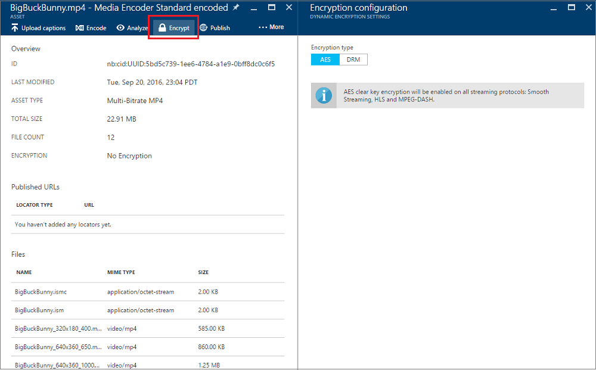

# Configuring content protection policies using the Azure portal
> [!NOTE]
> To complete this tutorial, you need an Azure account. For details, see [Azure Free Trial](https://azure.microsoft.com/pricing/free-trial/).
> 
> 

## Overview
Microsoft Azure Media Services (AMS) enables you to secure your media from the time it leaves your computer through storage, processing, and delivery. Media Services allows you to deliver your content encrypted dynamically with Advanced Encryption Standard (AES) (using 128-bit encryption keys), common encryption (CENC) using PlayReady and/or Widevine DRM, and Apple FairPlay. 

AMS provides a service for delivering DRM licenses and AES clear keys to authorized clients. The Azure portal enables you to create one **key/license authorization policy** for all types of encryptions.

This article demonstrates how to configure content protection policies with the Azure portal. The article also shows how to apply dynamic encryption to your assets.

> [!NOTE]
> If you used the Azure classic portal to create protection policies, the policies may not appear in the [Azure portal](https://portal.azure.com/). However, all the old polices still exist. You can examine them using the Azure Media Services .NET SDK or the [Azure-Media-Services-Explorer](https://github.com/Azure/Azure-Media-Services-Explorer/releases) tool (to see the policies, right-click on the asset -> Display information (F4)->click on Content keys tab-> click on the key). 
> 
> If you want to encrypt your asset using new policies, configure them with the Azure portal, click save, and reapply dynamic encryption. 
> 
> 

## Start configuring content protection
To use the portal to start configuring content protection, global to your AMS account, do the following:

1. In the [Azure portal](https://portal.azure.com/), select your Azure Media Services account.
2. Select **Settings** > **Content protection**.

## Key/license authorization policy
AMS supports multiple ways of authenticating users who make key or license requests. The content key authorization policy must be configured by you and met by your client in order for the key/license to be delived to the client. The content key authorization policy could have one or more authorization restrictions: **open** or **token** restriction.

The Azure portal enables you to create one **key/license authorization policy** for all types of encryptions.

### Open
Open restriction means that the system will deliver the key to anyone who makes a key request. This restriction might be useful for test purposes. 

### Token
The token restricted policy must be accompanied by a token issued by a Secure Token Service (STS). Media Services supports tokens in the Simple Web Tokens (SWT) format and JSON Web Token (JWT) format. Media Services does not provide Secure Token Services. You can create a custom STS or leverage Microsoft Azure ACS to issue tokens. The STS must be configured to create a token signed with the specified key and issue claims that you specified in the token restriction configuration. The Media Services key delivery service will return the requested key (or license) to the client if the token is valid and the claims in the token match those configured for the key (or license).

When configuring the token restricted policy, you must specify the primary verification key, issuer, and audience parameters. The primary verification key contains the key that the token was signed with, issuer is the secure token service that issues the token. The audience (sometimes called scope) describes the intent of the token or the resource the token authorizes access to. The Media Services key delivery service validates that these values in the token match the values in the template.

## PlayReady rights template
For detailed information about the PlayReady rights template, see [Media Services PlayReady License Template Overview](media-services-playready-license-template-overview.md).

### Non persistent
If you configure license as non-persistent, it is only held in memory while the player is using the license.  

### Persistent
If you configure the license  as persistent, it is saved in persistent storage on the client.

## Widevine rights template
For detailed information about the Widevine rights template, see [Widevine License Template Overview](media-services-widevine-license-template-overview.md).

### Basic
When you select **Basic**, the template will be created with all defaults values.

### Advanced
For detailed explanation about advance option of Widevine configurations, see [this](media-services-widevine-license-template-overview.md) topic.

## FairPlay configuration
To enable FairPlay encryption, you need to provide the App Certificate and Application Secret Key (ASK) through the FairPlay Configuration option. For detailed information about FairPlay configuration and requirements, see [this](media-services-protect-hls-with-fairplay.md) article.

## Apply dynamic encryption to your asset
To take advantage of dynamic encryption, you need to encode your source file into a set of adaptive-bitrate MP4 files.

### Select an asset that you want to encrypt
To see all your assets, select **Settings** > **Assets**.

### Encrypt with AES or DRM
Once you press **Encrypt** on an asset, you are presented wtih two choices: **AES** or **DRM**. 

#### AES
AES clear key encryption will be enabled on all streaming protocols: Smooth Streaming, HLS, and MPEG-DASH.

#### DRM
When you select the DRM tab, you are presented with different choices of content protection policies (which you must have configured by now) + a set of streaming protocols.

* **PlayReady and Widevine with MPEG-DASH** - will dynamically encrypt your MPEG-DASH stream with PlayReady and Widevine DRMs.
* **PlayReady and Widevine with MPEG-DASH + FairPlay with HLS** - will dynamically encrypt you MPEG-DASH stream with PlayReady and Widevine DRMs. Will also encrypt your HLS streams with FairPlay.
* **PlayReady only with Smooth Streaming, HLS and MPEG-DASH** - will dynamically encrypt Smooth Streaming, HLS, MPEG-DASH streams with PlayReady DRM.
* **Widevine only with MPEG-DASH** - will dynamically encrypt you MPEG-DASH with Widevine DRM.
* **FairPlay only with HLS** - will dynamically encrypt your HLS stream with FairPlay.

To enable FairPlay encryption, you need to provide the App Certificate and Application Secret Key (ASK) through the FairPlay Configuration option of the Content Protection settings blade.

Once you make the encryption selection, press **Apply**.

## Next steps
Review Media Services learning paths.

[!INCLUDE [media-services-learning-paths-include](../../includes/media-services-learning-paths-include.md)]

## Provide feedback
[!INCLUDE [media-services-user-voice-include](../../includes/media-services-user-voice-include.md)]

