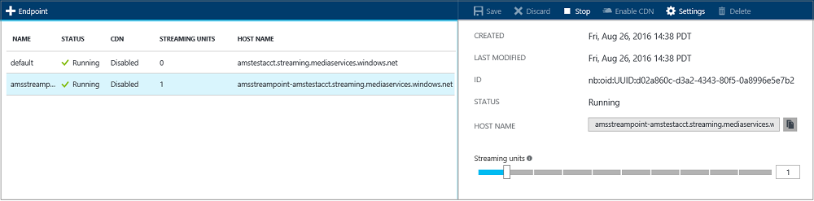

<properties
	pageTitle=" Scale streaming endpoints with the Azure portal | Microsoft Azure"
	description="This tutorial walks you through the steps of scaling streaming endpoints with the Azure portal."
	services="media-services"
	documentationCenter=""
	authors="Juliako"
	manager="erikre"
	editor=""/>

<tags
	ms.service="media-services"
	ms.workload="media"
	ms.tgt_pltfrm="na"
	ms.devlang="na"
	ms.topic="article"
	ms.date="08/29/2016"
	ms.author="juliako"/>

# Scale streaming endpoints with the Azure portal

##Overview

> [AZURE.NOTE] To complete this tutorial, you need an Azure account. For details, see [Azure Free Trial](https://azure.microsoft.com/pricing/free-trial/). 

When working with Azure Media Services one of the most common scenarios is delivering video via adaptive bitrate streaming to your clients. Media Services supports the following adaptive bitrate streaming technologies: HTTP Live Streaming (HLS), Smooth Streaming, MPEG DASH, and HDS (for Adobe PrimeTime/Access licensees only).

Media Services provides dynamic packaging which allows you to deliver your adaptive bitrate MP4  encoded content in streaming formats supported by Media Services (MPEG DASH, HLS, Smooth Streaming, HDS) just-in-time, without you having to store pre-packaged versions of each of these streaming formats.

To take advantage of dynamic packaging, you need to do the following:

- Encode your mezzanine (source) file into a set of adaptive bitrate MP4 files (the encoding steps are demonstrated later in this tutorial).  
- Create at least one streaming unit for the *streaming endpoint* from which you plan to delivery your content. The steps below show how to change the number of streaming units.

With dynamic packaging you only need to store and pay for the files in single storage format and Media Services will build and serve the appropriate response based on requests from a client.

In addition, you can control the capacity of the Streaming Endpoint service to handle growing bandwidth needs by adjusting streaming units. It is recommended to allocate one or more scale units for applications in production environment. Streaming units provide you with both dedicated egress capacity that can be purchased in increments of 200 Mbps and additional functionality which functionality which includes: [dynamic packaging](media-services-dynamic-packaging-overview.md), CDN integration, and advanced configuration. For more information, see [Manage streaming endpoints with the Azure portal](media-services-portal-manage-streaming-endpoints.md).

## Scale streaming endpoints

To create and change the number of streaming reserved units, do the following:

1. Log in at the [Azure portal](https://portal.azure.com/).
2. In the **Settings** window, select **Streaming endpoints**.
3. Click on the streaming endpoint that you want to scale. 
4. Move the slider to specify the number of streaming units
 

The following considerations apply:

- The allocation of any new streaming units can take around 20 minutes to complete. 
- Currently, going from any positive value of streaming units back to none, can disable on-demand streaming for up to an hour.
- The highest number of units specified for the 24-hour period is used in calculating the cost. For information about pricing details, see [Media Services Pricing Details](http://go.microsoft.com/fwlink/?LinkId=275107).

##Next steps

Review Media Services learning paths.

[AZURE.INCLUDE [media-services-learning-paths-include](../../includes/media-services-learning-paths-include.md)]

##Provide feedback

[AZURE.INCLUDE [media-services-user-voice-include](../../includes/media-services-user-voice-include.md)]

