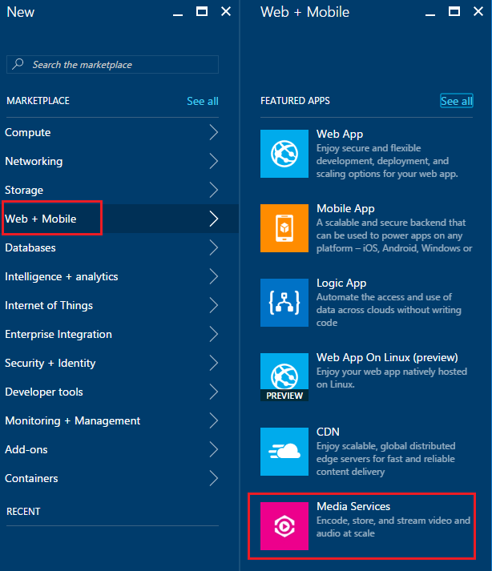
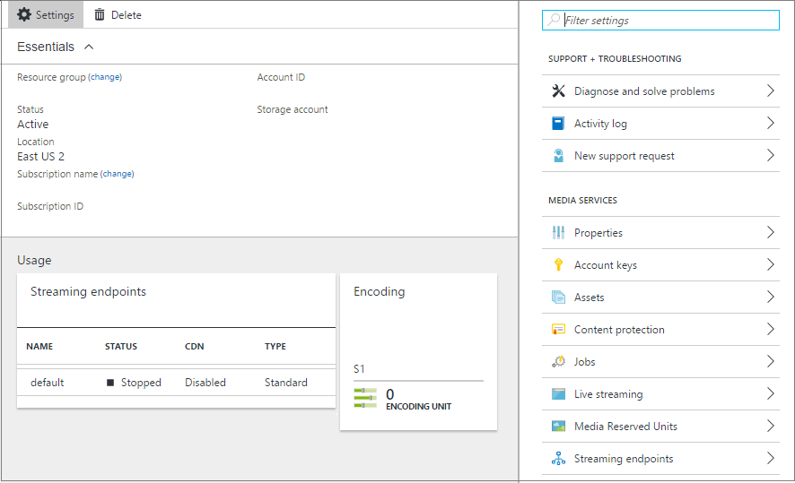
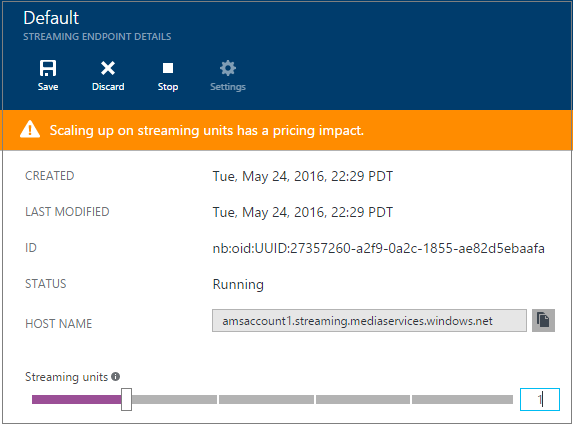
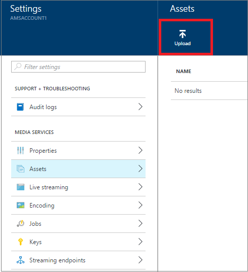
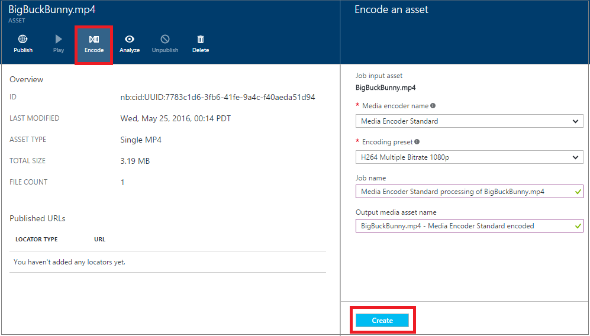
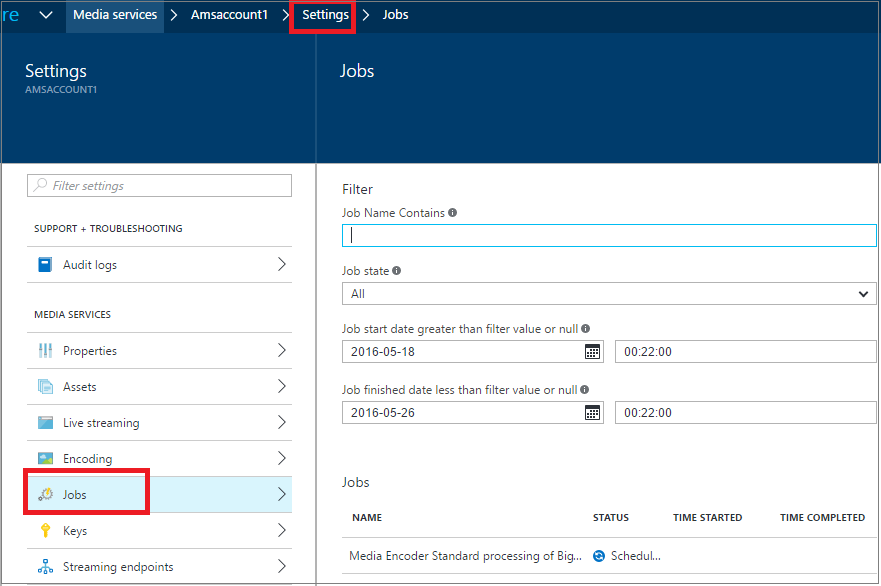
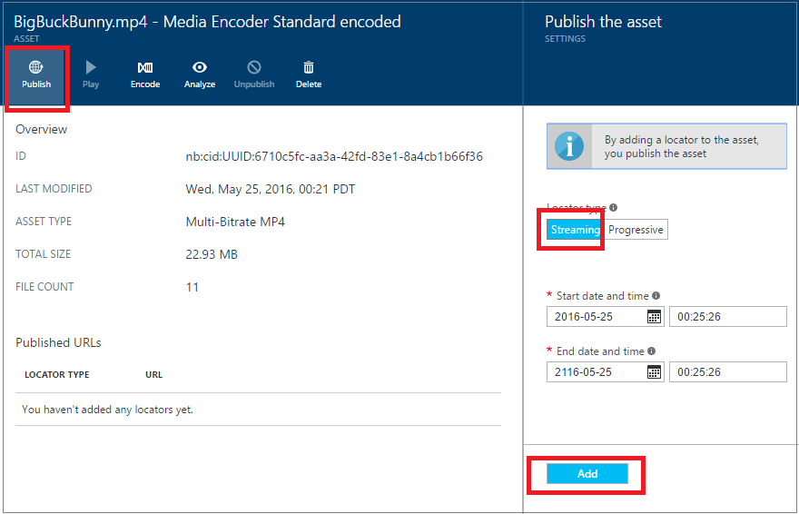
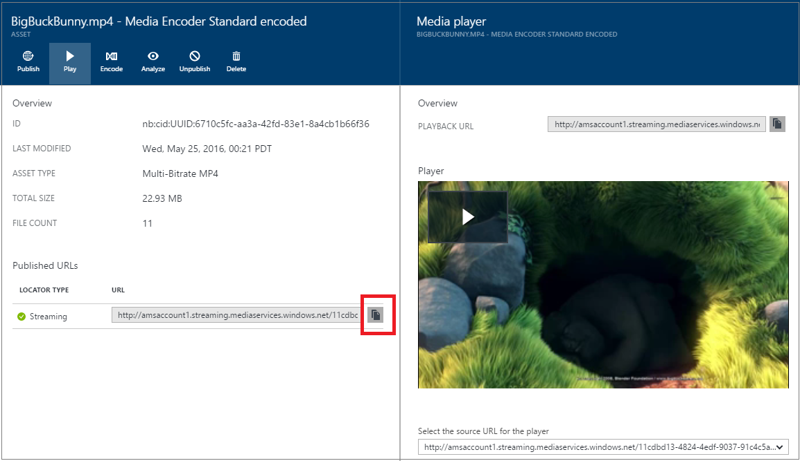

<properties
	pageTitle=" Get started with delivering content on demand using the Azure Portal | Microsoft Azure"
	description="This tutorial walks you through the steps of implementing a basic Video-on-Demand (VoD) content delivery service with Azure Media Services (AMS) application using the Azure Portal."
	services="media-services"
	documentationCenter=""
	authors="Juliako"
	manager="erikre"
	editor=""/>

<tags
	ms.service="media-services"
	ms.workload="media"
	ms.tgt_pltfrm="na"
	ms.devlang="na"
	ms.topic="get-started-article"
	ms.date="06/22/2016"
	ms.author="juliako"/>

# Get started with delivering content on demand using the Azure Portal

This tutorial walks you through the steps of implementing a basic Video-on-Demand (VoD) content delivery service with Azure Media Services (AMS) application using the Azure Portal.

Azure Media Services in the Azure portal is currently in preview. 

> [AZURE.NOTE] To complete this tutorial, you need an Azure account. For details, see [Azure Free Trial](https://azure.microsoft.com/pricing/free-trial/). 

This tutorial includes the following tasks:

1.  Create an Azure Media Services account.
2.  Configure streaming endpoint.
1.  Upload a video file.
1.  Encode the source file into a set of adaptive bitrate MP4 files.
1.  Publish the asset and get streaming and progressive download URLs.  
1.  Play your content.

## Create an Azure Media Services account

The steps in this section show how to create a new AMS account.

1. Log in at the [Azure Portal](https://portal.azure.com/).
2. Click **+New** > **Media + CDN** > **Media Services**.

	

3. In **CREATE MEDIA SERVICES ACCOUNT** enter required values.

	
	
	1. In **Account Name**, enter the name of the new AMS account. A Media Services account name is all lowercase numbers or letters with no spaces, and is 3 to 24 characters in length.
	2. In Subscription, select among the different Azure subscriptions that you have access to.
	
	2. In **Resource Group**, select the new or existing resource.  A resource group is a collection of resources that share the same lifecycle, permissions, and policies. Learn more [here](resource-group-overview.md#resource-groups).
	3. In **Location**,  select the geographic region that will be used to store the media and metadata records for your Media Services account. This  region will be used to process and stream your media. Only the available Media Services regions appear in the drop-down list box. 
	
	3. In **Storage Account**, select a storage account to provide blob storage of the media content from your Media Services account. You can select an existing storage account in the same geographic region as your Media Services account, or you can create a new storage account. A new storage account is created in the same region. The rules for storage account names are the same as for Media Services accounts.

		Learn more about storage [here](storage-introduction.md).

	4. Select **Pin to dashboard** to see the progress of the account deployment.
	
7. Click **Create** at the bottom of the form.

	Once the account is successfully created, the status changes to **Running**. 

	

	To manage your AMS account (for example, upload videos, encode assets, monitor job progress) use the **Settings** window.

## Manage Keys

You need the account name and the primary key information to programmatically access the Media Services account.

1. In the Azure Portal, select your account. 

	The **Settings** window appears on the right. 

2. In the **Settings** window, select **Keys**. 

	The **Manage keys** windows shows the account name and the primary and secondary keys is displayed. 
3. Press on the copy button to copy the values.
	
	

## Configure streaming endpoints

When working with Azure Media Services one of the most common scenarios is delivering video via adaptive bitrate streaming to your clients. With adaptive bitrate streaming, the client can switch to a higher or lower bitrate stream as the video is displayed based on the current network bandwidth, CPU utilization, and other factors. Media Services supports the following adaptive bitrate streaming technologies: HTTP Live Streaming (HLS), Smooth Streaming, MPEG DASH, and HDS (for Adobe PrimeTime/Access licensees only).

Media Services provides dynamic packaging which allows you to deliver your adaptive bitrate MP4  encoded content in streaming formats supported by Media Services (MPEG DASH, HLS, Smooth Streaming, HDS) just-in-time, without you having to store pre-packaged versions of each of these streaming formats.

To take advantage of dynamic packaging, you need to do the following:

- Encode your mezzanine (source) file into a set of adaptive bitrate MP4 files (the encoding steps are demonstrated later in this tutorial).  
- Create at least one streaming unit for the *streaming endpoint* from which you plan to delivery your content. The steps below show how to change the number of streaming units.

With dynamic packaging you only need to store and pay for the files in single storage format and Media Services will build and serve the appropriate response based on requests from a client.

To create and change the number of streaming reserved units, do the following:

1. In the **Settings** window  click **Streaming endpoints**. 

2. Click on the default streaming endpoint. 

	The **DEFAULT STREAMING ENDPOINT DETAILS** window appears.

3. To specify the number of streaming units, slide the **Streaming units** slider.

	

4. Click the **Save** button to save your changes.

	>[AZURE.NOTE]The allocation of any new units can take up to 20 minutes to complete.

## Upload files

In order to stream videos using Azure Media Services, you will need to upload the source videos, encode them into multiple bitrates, and publish the result. The first step is covered in this section. 

1. In the **Setting** window, click **Assets**.

	

3. Click the **Upload** button.

	The **Upload a video asset** window appears.

	>[AZURE.NOTE] There is no file size limitation.
	
4. Browse to the desired video on your computer, select it, and hit OK.  

	The upload starts and you can see the progress under the file name.  

Once the upload completes, you will see the new asset listed in the **Assets** window. 

## Encode assets

When working with Azure Media Services one of the most common scenarios is delivering adaptive bitrate streaming to your clients. Media Services supports the following adaptive bitrate streaming technologies: HTTP Live Streaming (HLS), Smooth Streaming, MPEG DASH, and HDS (for Adobe PrimeTime/Access licensees only). To prepare your videos for adaptive bitrate streaming, you need to encode your source video into multi-bitrate files. You should use the **Media Encoder Standard** encoder to encode your videos.  

Media Services also provides dynamic packaging which allows you to deliver your multi-bitrate MP4s in the following streaming formats: MPEG DASH, HLS, Smooth Streaming, or HDS, without you having to re-package into these streaming formats. With dynamic packaging you only need to store and pay for the files in single storage format and Media Services will build and serve the appropriate response based on requests from a client.

To take advantage of dynamic packaging, you need to do the following:

- Encode your source file into a set of multi-bitrate MP4 files (the encoding steps are demonstrated later in this section).
- Get at least one streaming unit for the streaming endpoint from which you plan to delivery your content. For more information, see [configuring streaming endpoints](media-services-portal-vod-get-started.md#configure-streaming-endpoints). 

### To use the portal to encode

This section describes the steps you can take to encode your content with Media Encoder Standard.

1.  In the **Settings** window, select **Assets**.  
2.  In the **Assets** window, select the asset that you would like to encode.
3.  Press the **Encode** button.
4.  In the **Encode an asset** window, select the "Media Encoder Standard" processor and a preset. For example, if you know your input video has a resolution of 1920x1080 pixels, then you could use the "H264 Multiple Bitrate 1080p" preset. For more information about presets, see [this](https://msdn.microsoft.com/library/azure/mt269960.aspx) article – it is important to select the preset that is most appropriate for your input video. If you have a low resolution (640x360) video, then you should not be using the default "H264 Multiple Bitrate 1080p" preset.
	
	For easier management, you have an option of editing the name of the output asset, and the name of the job.
		
	
5. Press **Create**.

### Monitor encoding job progress

To monitor the progress of the encoding job, click on **Settings** (at the top of the page) and then select **Jobs**.

## Publish content

To provide your user with a  URL that can be used to stream or download your content, you first need to "publish" your asset by creating a locator. Locators provide access to files contained in the asset. Media Services supports two types of locators: 

- Streaming (OnDemandOrigin) locators, used for adaptive streaming (for example, to stream MPEG DASH, HLS, or Smooth Streaming). To create a streaming locator your asset must contain an .ism file. 
- Progressive (SAS) locators, used for delivery of video via progressive download.

A streaming URL has the following format and you can use it to play Smooth Streaming assets.

	{streaming endpoint name-media services account name}.streaming.mediaservices.windows.net/{locator ID}/{filename}.ism/Manifest

To build an HLS streaming URL, append (format=m3u8-aapl) to the URL.

	{streaming endpoint name-media services account name}.streaming.mediaservices.windows.net/{locator ID}/{filename}.ism/Manifest(format=m3u8-aapl)

To build an  MPEG DASH streaming URL, append (format=mpd-time-csf) to the URL.

	{streaming endpoint name-media services account name}.streaming.mediaservices.windows.net/{locator ID}/{filename}.ism/Manifest(format=mpd-time-csf)

A SAS URL has the following format.

	{blob container name}/{asset name}/{file name}/{SAS signature}

>[AZURE.NOTE] If you used the portal to create locators before March 2015, locators with a two year expiration date were created.  

To update an expiration date on a locator, use [REST](http://msdn.microsoft.com/library/azure/hh974308.aspx#update_a_locator ) or [.NET](http://go.microsoft.com/fwlink/?LinkID=533259) APIs. Note that when you update the expiration date of a SAS locator, the URL changes.

### To use the portal to publish an asset

To use the portal to publish an asset, do the following:

1. Select **Settings** > **Assets**.
1. Select the asset that you want to publish.
1. Click the **Publish** button.
1. Select the locator type.
2. Press **Add**.

	

The URL will be added to the list of **Published URLs**.

## Play content from the portal

The Azure Portal provides a content player that you can use to test your video.

Click the desired video and then click the **Play** button.

Some considerations apply:

- Make sure the video has been published.
- This *Media player** plays from the default streaming endpoint. If you want to play from a non-default streaming endpoint, click to copy the URL and use another player. For example, [Azure Media Services Player](http://amsplayer.azurewebsites.net/azuremediaplayer.html).

##Next Steps:Media Services learning paths

[AZURE.INCLUDE [media-services-learning-paths-include](../../includes/media-services-learning-paths-include.md)]

##Provide feedback

[AZURE.INCLUDE [media-services-user-voice-include](../../includes/media-services-user-voice-include.md)]

