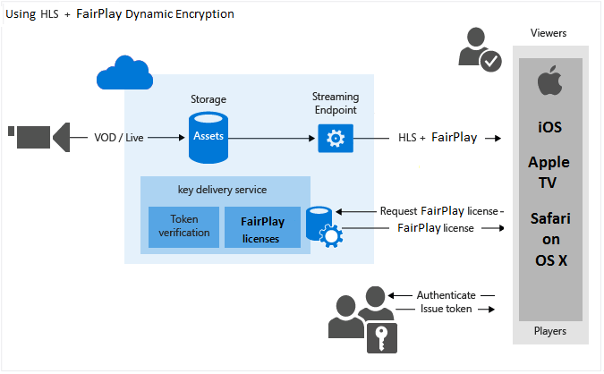

<properties 
	pageTitle="Use Azure Media Services to Stream your HLS content Protected with Apple FairPlay" 
	description="This topic gives an overview and shows how to use Azure Media Services to dynamically encrypt your HTTP Live Streaming (HLS) content with  Apple FairPlay. It also shows how to use the Media Services license delivery service to deliver FairPlay licenses to clients." 
	services="media-services" 
	documentationCenter="" 
	authors="Juliako" 
	manager="erikre" 
	editor=""/>

<tags 
	ms.service="media-services" 
	ms.workload="media" 
	ms.tgt_pltfrm="na" 
	ms.devlang="na" 
	ms.topic="article" 
 	ms.date="04/26/2016"
	ms.author="juliako"/>

#Use Azure Media Services to Stream your HLS content Protected with Apple FairPlay 

Azure Media Services enables your to dynamically encrypt your HTTP Live Streaming (HLS) content using the following formats:  

- **AES-128 envelope clear key** - The entire chunk is encrypted using the **AES-128 CTR** mode. The decryption of the stream is supported by iOS and OSX player natively. For more information , see [this article](media-services-protect-with-aes128.md).

- **Apple FairPlay** -  The individual video and audio samples are encrypted using the **AES-128 CBC** mode. **FairPlay Streaming** (FPS) is integrated into the device operating systems, with native support on iOS and Apple TV. Safari on OS X enables FPS using EME interface support.

	>[AZURE.NOTE]
	>Using AMS to deliver HLS encrypted with FairPlay is currently in preview.

The following image shows the "FairPlay dynamic encryption" workflow.

This topic demonstrates how to use Azure Media Services to dynamically encrypt your HLS content with  Apple FairPlay. It also shows how to use the Media Services license delivery service to deliver FairPlay licenses to clients.

	
## Requirements and considerations

- The following are required when using AMS to deliver HLS encrypted with FairPlay and to deliver FairPlay licenses.

	- An Azure account. For details, see [Azure Free Trial](/pricing/free-trial/?WT.mc_id=A261C142F).
	- A Media Services account. To create a Media Services account, see [Create Account](media-services-create-account.md).
	- Azure Media Services .NET SDK version **3.6.0** or later.
- The following things must be set on AMS key delivery side:
	- **App Cert (AC)** - .pfx file containing private key. This file is created by the customer and encrypted with a password by the same customer. 
		
	 	When the customer configures key delivery policy, they must provide that password and the .pfx in base64 format.

	- **App Cert password** - Customer password for creating the .pfx file.
	- **App Cert password ID**
	- **iv** -  16 bytes random value, must match the iv in the asset delivery policy.
	- **ASk** - ASK (Application Secret Key) is received when you generate the certification using Apple Developer portal. Each development team will receive a unique ASK. Please save a copy of the ASK and store it in a safe place. You will need to configure ASK as FairPlayAsk to Azure Media Services later. 
	-  **ASk ID** - provided by Apple.

- The following things must be set by the FPS client side:
 	- **App Cert (AC)** - .cer/.der file containing public key which OS uses to encrypt some payload. AMS needs to know about it because it is required by the player. The key delivery service decrypts it using the corresponding private key.

- You have to configure separate delivery policies if you want to deliver a stream that is encrypted with FairPlay + another DRM

	- One IAssetDeliveryPolicy to configure DASH with CENC (PlayReady + WideVine) and Smooth with PlayReady. 
	- Another IAssetDeliveryPolicy  to configure FairPlay for HLS
 
- Clients that support HLS with **AES-128 CBC** encryption: Safari on OS X, Apple TV, iOS.

##.NET sample
	
	using System;
	using System.Collections.Generic;
	using System.Configuration;
	using System.IO;
	using System.Linq;
	using System.Threading;
	using Microsoft.WindowsAzure.MediaServices.Client;
	using Microsoft.WindowsAzure.MediaServices.Client.ContentKeyAuthorization;
	using Microsoft.WindowsAzure.MediaServices.Client.DynamicEncryption;
	using Microsoft.WindowsAzure.MediaServices.Client.FairPlay;
	using Newtonsoft.Json;
	using System.Security.Cryptography.X509Certificates;
	
	namespace DynamicEncryptionWithFairPlay
	{
	    class Program
	    {
	        // Read values from the App.config file.
	        private static readonly string _mediaServicesAccountName =
	            ConfigurationManager.AppSettings["MediaServicesAccountName"];
	        private static readonly string _mediaServicesAccountKey =
	            ConfigurationManager.AppSettings["MediaServicesAccountKey"];
	
	        private static readonly Uri _sampleIssuer =
	            new Uri(ConfigurationManager.AppSettings["Issuer"]);
	        private static readonly Uri _sampleAudience =
	            new Uri(ConfigurationManager.AppSettings["Audience"]);
	
	        // Field for service context.
	        private static CloudMediaContext _context = null;
	        private static MediaServicesCredentials _cachedCredentials = null;
	
	        private static readonly string _mediaFiles =
	            Path.GetFullPath(@"../..\Media");
	
	        private static readonly string _singleMP4File =
	            Path.Combine(_mediaFiles, @"BigBuckBunny.mp4");
	
	        static void Main(string[] args)
	        {
	            // Create and cache the Media Services credentials in a static class variable.
	            _cachedCredentials = new MediaServicesCredentials(
	                            _mediaServicesAccountName,
	                            _mediaServicesAccountKey);
	            // Used the cached credentials to create CloudMediaContext.
	            _context = new CloudMediaContext(_cachedCredentials);
	
	            bool tokenRestriction = false;
	            string tokenTemplateString = null;
	
	            IAsset asset = UploadFileAndCreateAsset(_singleMP4File);
	            Console.WriteLine("Uploaded asset: {0}", asset.Id);
	
	            IAsset encodedAsset = EncodeToAdaptiveBitrateMP4Set(asset);
	            Console.WriteLine("Encoded asset: {0}", encodedAsset.Id);
	
	            IContentKey key = CreateCommonCBCTypeContentKey(encodedAsset);
	            Console.WriteLine("Created key {0} for the asset {1} ", key.Id, encodedAsset.Id);
	            Console.WriteLine("FairPlay License Key delivery URL: {0}", key.GetKeyDeliveryUrl(ContentKeyDeliveryType.FairPlay));
	            Console.WriteLine();
	
	            if (tokenRestriction)
	                tokenTemplateString = AddTokenRestrictedAuthorizationPolicy(key);
	            else
	                AddOpenAuthorizationPolicy(key);
	
	            Console.WriteLine("Added authorization policy: {0}", key.AuthorizationPolicyId);
	            Console.WriteLine();
	
	            CreateAssetDeliveryPolicy(encodedAsset, key);
	            Console.WriteLine("Created asset delivery policy. \n");
	            Console.WriteLine();
	
	            if (tokenRestriction && !String.IsNullOrEmpty(tokenTemplateString))
	            {
	                // Deserializes a string containing an Xml representation of a TokenRestrictionTemplate
	                // back into a TokenRestrictionTemplate class instance.
	                TokenRestrictionTemplate tokenTemplate =
	                    TokenRestrictionTemplateSerializer.Deserialize(tokenTemplateString);
	
	                // Generate a test token based on the the data in the given TokenRestrictionTemplate.
	                // Note, you need to pass the key id Guid because we specified 
	                // TokenClaim.ContentKeyIdentifierClaim in during the creation of TokenRestrictionTemplate.
	                Guid rawkey = EncryptionUtils.GetKeyIdAsGuid(key.Id);
	                string testToken = TokenRestrictionTemplateSerializer.GenerateTestToken(tokenTemplate, null, rawkey,
	                                                                        DateTime.UtcNow.AddDays(365));
	                Console.WriteLine("The authorization token is:\nBearer {0}", testToken);
	                Console.WriteLine();
	            }
	
	            string url = GetStreamingOriginLocator(encodedAsset);
	            Console.WriteLine("Encrypted HLS URL: {0}/manifest(format=m3u8-aapl)", url);
	
	            Console.ReadLine();
	        }
	
	        static public IAsset UploadFileAndCreateAsset(string singleFilePath)
	        {
	            if (!File.Exists(singleFilePath))
	            {
	                Console.WriteLine("File does not exist.");
	                return null;
	            }
	
	            var assetName = Path.GetFileNameWithoutExtension(singleFilePath);
	            IAsset inputAsset = _context.Assets.Create(assetName, AssetCreationOptions.None);
	
	            var assetFile = inputAsset.AssetFiles.Create(Path.GetFileName(singleFilePath));
	
	            Console.WriteLine("Created assetFile {0}", assetFile.Name);
	
	            var policy = _context.AccessPolicies.Create(
	                                    assetName,
	                                    TimeSpan.FromDays(30),
	                                    AccessPermissions.Write | AccessPermissions.List);
	
	            var locator = _context.Locators.CreateLocator(LocatorType.Sas, inputAsset, policy);
	
	            Console.WriteLine("Upload {0}", assetFile.Name);
	
	            assetFile.Upload(singleFilePath);
	            Console.WriteLine("Done uploading {0}", assetFile.Name);
	
	            locator.Delete();
	            policy.Delete();
	
	            return inputAsset;
	        }
	
	        static public IAsset EncodeToAdaptiveBitrateMP4Set(IAsset inputAsset)
	        {
	            var encodingPreset = "H264 Adaptive Bitrate MP4 Set 720p";
	
	            IJob job = _context.Jobs.Create(String.Format("Encoding into Mp4 {0} to {1}",
	                                    inputAsset.Name,
	                                    encodingPreset));
	
	            var mediaProcessors =
	                _context.MediaProcessors.Where(p => p.Name.Contains("Media Encoder")).ToList();
	
	            var latestMediaProcessor =
	                mediaProcessors.OrderBy(mp => new Version(mp.Version)).LastOrDefault();
	
	            ITask encodeTask = job.Tasks.AddNew("Encoding", latestMediaProcessor, encodingPreset, TaskOptions.None);
	            encodeTask.InputAssets.Add(inputAsset);
	            encodeTask.OutputAssets.AddNew(String.Format("{0} as {1}", inputAsset.Name, encodingPreset), AssetCreationOptions.StorageEncrypted);
	
	            job.StateChanged += new EventHandler<JobStateChangedEventArgs>(JobStateChanged);
	            job.Submit();
	            job.GetExecutionProgressTask(CancellationToken.None).Wait();
	
	            return job.OutputMediaAssets[0];
	        }
	
	        static public IContentKey CreateCommonCBCTypeContentKey(IAsset asset)
	        {
	            // Create envelope encryption content key
	            Guid keyId = Guid.NewGuid();
	            byte[] contentKey = GetRandomBuffer(16);
	
	            IContentKey key = _context.ContentKeys.Create(
	                                    keyId,
	                                    contentKey,
	                                    "ContentKey",
	                                    ContentKeyType.CommonEncryptionCbcs);
	
	            // Associate the key with the asset.
	            asset.ContentKeys.Add(key);
	
	            return key;
	        }
	
	        static public void AddOpenAuthorizationPolicy(IContentKey contentKey)
	        {
	
	            // Create ContentKeyAuthorizationPolicy with Open restrictions 
	            // and create authorization policy          
	
	            List<ContentKeyAuthorizationPolicyRestriction> restrictions = new List<ContentKeyAuthorizationPolicyRestriction>
	                {
	                    new ContentKeyAuthorizationPolicyRestriction
	                    {
	                        Name = "Open",
	                        KeyRestrictionType = (int)ContentKeyRestrictionType.Open,
	                        Requirements = null
	                    }
	                };
	
	
	
	            // Configure FairPlay policy option.
	            string FairPlayConfiguration = ConfigureFairPlayPolicyOption();
	
	            IContentKeyAuthorizationPolicyOption FairPlayPolicy =
	                _context.ContentKeyAuthorizationPolicyOptions.Create("",
	                ContentKeyDeliveryType.FairPlay,
	                restrictions,
	                FairPlayConfiguration);
	
	
	            IContentKeyAuthorizationPolicy contentKeyAuthorizationPolicy = _context.
	                        ContentKeyAuthorizationPolicies.
	                        CreateAsync("Deliver Common CBC Content Key with no restrictions").
	                        Result;
	
	            contentKeyAuthorizationPolicy.Options.Add(FairPlayPolicy);
	
	            // Associate the content key authorization policy with the content key.
	            contentKey.AuthorizationPolicyId = contentKeyAuthorizationPolicy.Id;
	            contentKey = contentKey.UpdateAsync().Result;
	        }
	
	        private static string ConfigureFairPlayPolicyOption()
	        { 
	            // iv - 16 bytes random value, must match the iv in the asset delivery policy.
	            byte[] iv = Guid.NewGuid().ToByteArray();
	
	            // askId - provided by Apple
	            var askId = Guid.NewGuid();
	
	            var pfxPasswordId = Guid.NewGuid();
	
	            //Customer password for creating the .pfx file.
	            string pfxPassword = "<customer password for creating the .pfx file>";
	
	            //Specify the .pfx file created by the customer.
	            var appCert = new X509Certificate2("path to the .pfx file created by the customer", pfxPassword, X509KeyStorageFlags.Exportable);
	
	            string FairPlayConfiguration = Microsoft.WindowsAzure.MediaServices.Client.FairPlay.FairPlayConfiguration.CreateSerializedFairPlayOptionConfiguration(
	                    appCert,
	                    pfxPassword,
	                    pfxPasswordId,
	                    askId,
	                    iv);
	
	            return FairPlayConfiguration;
	        }
	        public static string AddTokenRestrictedAuthorizationPolicy(IContentKey contentKey)
	        {
	            string tokenTemplateString = GenerateTokenRequirements();
	
	            List<ContentKeyAuthorizationPolicyRestriction> restrictions = new List<ContentKeyAuthorizationPolicyRestriction>
	                {
	                    new ContentKeyAuthorizationPolicyRestriction
	                    {
	                        Name = "Token Authorization Policy",
	                        KeyRestrictionType = (int)ContentKeyRestrictionType.TokenRestricted,
	                        Requirements = tokenTemplateString,
	                    }
	                };
	
	
	            // Configure FairPlay policy option.
	            string FairPlayConfiguration = ConfigureFairPlayPolicyOption();
	
	
	            IContentKeyAuthorizationPolicyOption FairPlayPolicy =
	                _context.ContentKeyAuthorizationPolicyOptions.Create("Token option",
	                       ContentKeyDeliveryType.FairPlay,
	                       restrictions,
	                       FairPlayConfiguration);
	
	            IContentKeyAuthorizationPolicy contentKeyAuthorizationPolicy = _context.
	                        ContentKeyAuthorizationPolicies.
	                        CreateAsync("Deliver Common CBC Content Key with token restrictions").
	                        Result;
	
	            contentKeyAuthorizationPolicy.Options.Add(FairPlayPolicy);
	
	            // Associate the content key authorization policy with the content key
	            contentKey.AuthorizationPolicyId = contentKeyAuthorizationPolicy.Id;
	            contentKey = contentKey.UpdateAsync().Result;
	
	            return tokenTemplateString;
	        }
	
	        static private string GenerateTokenRequirements()
	        {
	            TokenRestrictionTemplate template = new TokenRestrictionTemplate(TokenType.SWT);
	
	            template.PrimaryVerificationKey = new SymmetricVerificationKey();
	            template.AlternateVerificationKeys.Add(new SymmetricVerificationKey());
	            template.Audience = _sampleAudience.ToString();
	            template.Issuer = _sampleIssuer.ToString();
	            template.RequiredClaims.Add(TokenClaim.ContentKeyIdentifierClaim);
	
	            return TokenRestrictionTemplateSerializer.Serialize(template);
	        }
	
	        static public void CreateAssetDeliveryPolicy(IAsset asset, IContentKey key)
	        {
	            // Get the FairPlay license service URL.
	            Uri acquisitionUrl = key.GetKeyDeliveryUrl(ContentKeyDeliveryType.FairPlay);
	
	            Dictionary<AssetDeliveryPolicyConfigurationKey, string> assetDeliveryPolicyConfiguration =
	                new Dictionary<AssetDeliveryPolicyConfigurationKey, string>
	                {
	                        {AssetDeliveryPolicyConfigurationKey.FairPlayLicenseAcquisitionUrl, acquisitionUrl.ToString()},
	                };
	
	            var assetDeliveryPolicy = _context.AssetDeliveryPolicies.Create(
	                    "AssetDeliveryPolicy",
	                AssetDeliveryPolicyType.DynamicCommonEncryptionCbcs,
	                AssetDeliveryProtocol.HLS,
	                assetDeliveryPolicyConfiguration);
	
	            // Add AssetDelivery Policy to the asset
	            asset.DeliveryPolicies.Add(assetDeliveryPolicy);
	
	        }
	
	        /// 

	        /// Gets the streaming origin locator.
	        /// 

	        /// <param name="assets"></param>
	        /// <returns></returns>
	        static public string GetStreamingOriginLocator(IAsset asset)
	        {
	
	            // Get a reference to the streaming manifest file from the  
	            // collection of files in the asset. 
	
	            var assetFile = asset.AssetFiles.Where(f => f.Name.ToLower().
	                                         EndsWith(".ism")).
	                                         FirstOrDefault();
	
	            // Create a 30-day readonly access policy. 
	            IAccessPolicy policy = _context.AccessPolicies.Create("Streaming policy",
	                TimeSpan.FromDays(30),
	                AccessPermissions.Read);
	
	            // Create a locator to the streaming content on an origin. 
	            ILocator originLocator = _context.Locators.CreateLocator(LocatorType.OnDemandOrigin, asset,
	                policy,
	                DateTime.UtcNow.AddMinutes(-5));
	
	            // Create a URL to the manifest file. 
	            return originLocator.Path + assetFile.Name;
	        }
	
	        static private void JobStateChanged(object sender, JobStateChangedEventArgs e)
	        {
	            Console.WriteLine(string.Format("{0}\n  State: {1}\n  Time: {2}\n\n",
	                ((IJob)sender).Name,
	                e.CurrentState,
	                DateTime.UtcNow.ToString(@"yyyy_M_d__hh_mm_ss")));
	        }
	
	        static private byte[] GetRandomBuffer(int length)
	        {
	            var returnValue = new byte[length];
	
	            using (var rng =
	                new System.Security.Cryptography.RNGCryptoServiceProvider())
	            {
	                rng.GetBytes(returnValue);
	            }
	
	            return returnValue;
	        }
	    }
	}

##Next Steps: Media Services learning paths

[AZURE.INCLUDE [media-services-learning-paths-include](../../includes/media-services-learning-paths-include.md)]

##Provide feedback

[AZURE.INCLUDE [media-services-user-voice-include](../../includes/media-services-user-voice-include.md)]
