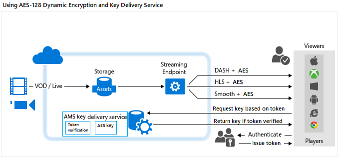

<properties
	pageTitle="Using AES-128 Dynamic Encryption and Key Delivery Service"
	description="Microsoft Azure Media Services enables you to deliver your content encrypted with AES 128-bit encryption keys. Media Services also provides the Key Delivery service that delivers encryption keys to authorized users. This topic shows how to dynamically encrypt with AES-128 and use the key delivery service."
	services="media-services"
	documentationCenter=""
	authors="Juliako"
	manager="erikre"
	editor=""/>

<tags
	ms.service="media-services"
	ms.workload="media"
	ms.tgt_pltfrm="na"
	ms.devlang="na"
	ms.topic="article" 
	ms.date="07/27/2016"
	ms.author="juliako"/>

#Using AES-128 Dynamic Encryption and Key Delivery Service

> [AZURE.SELECTOR]
- [.NET](media-services-protect-with-aes128.md)
- [Java](https://github.com/southworkscom/azure-sdk-for-media-services-java-samples)
- [PHP](https://github.com/Azure/azure-sdk-for-php/tree/master/examples/MediaServices)

##Overview

Microsoft Azure Media Services enables you to deliver Http-Live-Streaming (HLS) and Smooth Streams encrypted with Advanced Encryption Standard (AES) (using 128-bit encryption keys). Media Services also provides the Key Delivery service that delivers encryption keys to authorized users. If you want for Media Services to encrypt an asset, you need to associate an encryption key with the asset and also configure authorization policies for the key. When a stream is requested by a player, Media Services uses the specified key to dynamically encrypt your content using AES encryption. To decrypt the stream, the player will request the key from the key delivery service. To decide whether or not the user is authorized to get the key, the service evaluates the authorization policies that you specified for the key.

Media Services supports multiple ways of authenticating users who make key requests. The content key authorization policy could have one or more authorization restrictions: open or token restriction. The token restricted policy must be accompanied by a token issued by a Secure Token Service (STS). Media Services supports tokens in the [Simple Web Tokens](https://msdn.microsoft.com/library/gg185950.aspx#BKMK_2) (SWT) format and [JSON Web Token](https://msdn.microsoft.com/library/gg185950.aspx#BKMK_3) (JWT) format. For more information, see [Configure the content key’s authorization policy](media-services-protect-with-aes128.md#configure_key_auth_policy).

To take advantage of dynamic encryption, you need to have an asset that contains a set of multi-bitrate MP4 files or multi-bitrate Smooth Streaming source files. You also need to configure the delivery policy for the asset (described later in this topic). Then, based on the format specified in the streaming URL, the On-Demand Streaming server will ensure that the stream is delivered in the protocol you have chosen. As a result, you only need to store and pay for the files in single storage format and Media Services service will build and serve the appropriate response based on requests from a client.

This topic would be useful to developers that work on applications that deliver protected media. The topic shows you how to configure the key delivery service with authorization policies so that only authorized clients could receive the encryption keys. It also shows how to use dynamic encryption.

>[AZURE.NOTE]To start using dynamic encryption, you must first get at least one scale unit (also known as streaming unit). For more information, see [How to Scale a Media Service](media-services-manage-origins.md#scale_streaming_endpoints).

##AES-128 Dynamic Encryption and Key Delivery Service Workflow

The following are general steps that you would need to perform when encrypting your assets with AES, using the Media Services key delivery service, and also using dynamic encryption.

1. [Create an asset and upload files into the asset](media-services-protect-with-aes128.md#create_asset). 
1. [Encode the asset containing the file to the adaptive bitrate MP4 set](media-services-protect-with-aes128.md#encode_asset).
1. [Create a content key and associate it with the encoded asset](media-services-protect-with-aes128.md#create_contentkey). In Media Services, the content key contains the asset’s encryption key.
1. [Configure the content key’s authorization policy](media-services-protect-with-aes128.md#configure_key_auth_policy). The content key authorization policy must be configured by you and met by the client in order for the content key to be delivered to the client. 
1. [Configure the delivery policy for an asset](media-services-protect-with-aes128.md#configure_asset_delivery_policy). The delivery policy configuration includes: key acquisition URL and Initialization Vector (IV) (AES 128 requires the same IV to be supplied when encrypting and decrypting), delivery protocol (for example, MPEG DASH, HLS, HDS, Smooth Streaming or all), the type of dynamic encryption (for example, envelope or no dynamic encryption). 

	You could apply different policy to each protocol on the same asset. For example, you could apply PlayReady encryption to Smooth/DASH and AES Envelope to HLS. Any protocols that are not defined in a delivery policy (for example, you add a single policy that only specifies HLS as the protocol) will be blocked from streaming. The exception to this is if you have no asset delivery policy defined at all. Then, all protocols will be allowed in the clear.

1. [Create an OnDemand locator](media-services-protect-with-aes128.md#create_locator) in order to get a streaming URL.

The topic also shows [how a client application can request a key from the key delivery service](media-services-protect-with-aes128.md#client_request).

You will find a complete .NET [example](media-services-protect-with-aes128.md#example) at the end of the topic.

The following image demonstrates the workflow described above. Here the token is used for authentication.

The rest of this topic provides detailed explanations, code examples, and links to topics that show you how to achieve the tasks described above.

##Current limitations

If you add or update your asset’s delivery policy, you must delete an existing locator (if any) and create a new locator.

##Create an asset and upload files into the asset

In order to manage, encode, and stream your videos, you must first upload your content into Microsoft Azure Media Services. Once uploaded, your content is stored securely in the cloud for further processing and streaming. 

For detailed information, see [Upload Files into a Media Services account](media-services-dotnet-upload-files.md).

##Encode the asset containing the file to the adaptive bitrate MP4 set

With dynamic encryption all you need is to create an asset that contains a set of multi-bitrate MP4 files or multi-bitrate Smooth Streaming source files. Then, based on the specified format in the manifest or fragment request, the On-Demand Streaming server will ensure that you receive the stream in the protocol you have chosen. As a result, you only need to store and pay for the files in single storage format and Media Services service will build and serve the appropriate response based on requests from a client. For more information, see the [Dynamic Packaging Overview](media-services-dynamic-packaging-overview.md) topic.

For instructions on how to encode, see [How to encode an asset using Media Encoder Standard](media-services-dotnet-encode-with-media-encoder-standard.md).

##Create a content key and associate it with the encoded asset

In Media Services, the content key contains the key that you want to encrypt an asset with.

For detailed information, see [Create content key](media-services-dotnet-create-contentkey.md).

##Configure the content key’s authorization policy

Media Services supports multiple ways of authenticating users who make key requests. The content key authorization policy must be configured by you and met by the client (player) in order for the key to be delivered to the client. The content key authorization policy could have one or more authorization restrictions: open, token restriction, or IP restriction.

For detailed information, see [Configure Content Key Authorization Policy](media-services-dotnet-configure-content-key-auth-policy.md).

##Configure asset delivery policy 

Configure the delivery policy for your asset. Some things that the asset delivery policy configuration includes:

- The Key acquisition URL. 
- The Initialization Vector (IV) to use for the envelope encryption. AES 128 requires the same IV to be supplied when encrypting and decrypting. 
- The asset delivery protocol (for example, MPEG DASH, HLS, HDS, Smooth Streaming or all).
- The type of dynamic encryption (for example, AES envelope) or no dynamic encryption. 

For detailed information, see [Configure asset delivery policy ](media-services-rest-configure-asset-delivery-policy.md).

##Create an OnDemand streaming locator in order to get a streaming URL

You will need to provide your user with the streaming URL for Smooth, DASH or HLS.

>[AZURE.NOTE]If you add or update your asset’s delivery policy, you must delete an existing locator (if any) and create a new locator.

For instructions on how to publish an asset and build a streaming URL, see [Build a streaming URL](media-services-deliver-streaming-content.md).

##Get a test token

Get a test token based on the token restriction that was used for the key authorization policy.

	// Deserializes a string containing an Xml representation of a TokenRestrictionTemplate
	// back into a TokenRestrictionTemplate class instance.
	TokenRestrictionTemplate tokenTemplate = 
	    TokenRestrictionTemplateSerializer.Deserialize(tokenTemplateString);
	
	// Generate a test token based on the data in the given TokenRestrictionTemplate.
	//The GenerateTestToken method returns the token without the word “Bearer” in front
	//so you have to add it in front of the token string. 
	string testToken = TokenRestrictionTemplateSerializer.GenerateTestToken(tokenTemplate);
	Console.WriteLine("The authorization token is:\nBearer {0}", testToken);

You can use the [AMS Player](http://amsplayer.azurewebsites.net/azuremediaplayer.html) to test your stream.

##How can your client request a key from the key delivery service?

In the previous step, you constructed the URL that points to a manifest file. Your client needs to extract the necessary information from the streaming manifest files in order to make a request to the key delivery service.

###Manifest files

The client needs to extract the URL (that also contains content key Id (kid)) value from the manifest file. The client will then try to get the encryption key from the key delivery service. The client also needs to extract the IV value and use it do decrypt the stream.The following snippet shows the <Protection> element of the Smooth Streaming manifest.

	<Protection>
	  <ProtectionHeader SystemID="B47B251A-2409-4B42-958E-08DBAE7B4EE9">
	    <ContentProtection xmlns:sea="urn:mpeg:dash:schema:sea:2012" schemeIdUri="urn:mpeg:dash:sea:2012">
	      <sea:SegmentEncryption schemeIdUri="urn:mpeg:dash:sea:aes128-cbc:2013"/>
	      <sea:KeySystem keySystemUri="urn:mpeg:dash:sea:keysys:http:2013"/>
	      <sea:CryptoPeriod IV="0xD7D7D7D7D7D7D7D7D7D7D7D7D7D7D7D7" 
	                        keyUriTemplate="https://wamsbayclus001kd-hs.cloudapp.net/HlsHandler.ashx?
	                                        kid=da3813af-55e6-48e7-aa9f-a4d6031f7b4d"/>
	    </ContentProtection>
	  </ProtectionHeader>
	</Protection>

In the case of HLS, the root manifest is broken into segment files. 

For example, the root manifest is: http://test001.origin.mediaservices.windows.net/8bfe7d6f-34e3-4d1a-b289-3e48a8762490/BigBuckBunny.ism/manifest(format=m3u8-aapl) and it contains a list of segment file names.
	
	. . . 
	#EXT-X-STREAM-INF:PROGRAM-ID=1,BANDWIDTH=630133,RESOLUTION=424x240,CODECS="avc1.4d4015,mp4a.40.2",AUDIO="audio"
	QualityLevels(514369)/Manifest(video,format=m3u8-aapl)
	#EXT-X-STREAM-INF:PROGRAM-ID=1,BANDWIDTH=965441,RESOLUTION=636x356,CODECS="avc1.4d401e,mp4a.40.2",AUDIO="audio"
	QualityLevels(842459)/Manifest(video,format=m3u8-aapl)
	…

If you open one of the segment files in text editor (for example, http://test001.origin.mediaservices.windows.net/8bfe7d6f-34e3-4d1a-b289-3e48a8762490/BigBuckBunny.ism/QualityLevels(514369)/Manifest(video,format=m3u8-aapl), it should contain #EXT-X-KEY which indicates that the file is encrypted.
	
	#EXTM3U
	#EXT-X-VERSION:4
	#EXT-X-ALLOW-CACHE:NO
	#EXT-X-MEDIA-SEQUENCE:0
	#EXT-X-TARGETDURATION:9
	#EXT-X-KEY:METHOD=AES-128,
	URI="https://wamsbayclus001kd-hs.cloudapp.net/HlsHandler.ashx?
	     kid=da3813af-55e6-48e7-aa9f-a4d6031f7b4d",
	        IV=0XD7D7D7D7D7D7D7D7D7D7D7D7D7D7D7D7
	#EXT-X-PROGRAM-DATE-TIME:1970-01-01T00:00:00.000+00:00
	#EXTINF:8.425708,no-desc
	Fragments(video=0,format=m3u8-aapl)
	#EXT-X-ENDLIST
	
###Request the key from the key delivery service

The following code shows how to send a request to the Media Services key delivery service using a key delivery Uri (that was extracted from the manifest) and a token (this topic does not talk about how to get Simple Web Tokens from a Secure Token Service).

	private byte[] GetDeliveryKey(Uri keyDeliveryUri, string token)
	{
	    HttpWebRequest request = (HttpWebRequest)WebRequest.Create(keyDeliveryUri);
	            
	    request.Method = "POST";
	    request.ContentType = "text/xml";
	    if (!string.IsNullOrEmpty(token))
	    {
	        request.Headers[AuthorizationHeader] = token;
	    }
	    request.ContentLength = 0;
	
	    var response = request.GetResponse();
	 
	    var stream = response.GetResponseStream();
	    if (stream == null)
	    {
	        throw new NullReferenceException("Response stream is null");
	    }
	
	    var buffer = new byte[256];
	    var length = 0;
	    while (stream.CanRead && length <= buffer.Length)
	    {
	        var nexByte = stream.ReadByte();
	        if (nexByte == -1)
	        {
	            break;
	        }
	        buffer[length] = (byte)nexByte;
	        length++;
	    }
	    response.Close();
	
	    // AES keys must be exactly 16 bytes (128 bits).
	    var key = new byte[length];
	    Array.Copy(buffer, key, length);
	    return key;
	}
	
##Example

1. Create a new Console project.
1. Use NuGet to install and add Azure Media Services .NET SDK Extensions. Installing this package, also installs Media Services .NET SDK and adds all other required dependencies.
2. Add config file that contains the account name and key information:

	
		<?xml version="1.0" encoding="utf-8"?>
		<configuration>
		    <startup> 
		        <supportedRuntime version="v4.0" sku=".NETFramework,Version=v4.5" />
		    </startup>
			  <appSettings>
			
			    <add key="MediaServicesAccountName" value="AccountName"/>
			    <add key="MediaServicesAccountKey" value="AccountKey"/>
			
			    <add key="Issuer" value="http://testacs.com"/>
			    <add key="Audience" value="urn:test"/>
			  </appSettings>
		</configuration>

1. Overwrite the code in your Program.cs file with the code shown in this section.
	
	Make sure to update variables to point to folders where your input files are located.
			
		
		using System;
		using System.Collections.Generic;
		using System.Configuration;
		using System.IO;
		using System.Linq;
		using System.Net;
		using System.Security.Cryptography;
		using System.Text;
		using System.Threading.Tasks;
		using Microsoft.WindowsAzure.MediaServices.Client;
		using Newtonsoft.Json.Linq;
		using System.Threading;
		using Microsoft.WindowsAzure.MediaServices.Client.ContentKeyAuthorization;
		using Microsoft.WindowsAzure.MediaServices.Client.DynamicEncryption;
		using System.Web;
		using System.Globalization;
		
		namespace AESDynamicEncryptionAndKeyDeliverySvc
		{
		    class Program
		    {
		        // Read values from the App.config file.
		        private static readonly string _mediaServicesAccountName =
		            ConfigurationManager.AppSettings["MediaServicesAccountName"];
		        private static readonly string _mediaServicesAccountKey =
		            ConfigurationManager.AppSettings["MediaServicesAccountKey"];
		
		        // A Uri describing the issuer of the token.  
		        // Must match the value in the token for the token to be considered valid.
		        private static readonly Uri _sampleIssuer =
		            new Uri(ConfigurationManager.AppSettings["Issuer"]);
		        // The Audience or Scope of the token.  
		        // Must match the value in the token for the token to be considered valid.
		        private static readonly Uri _sampleAudience =
		            new Uri(ConfigurationManager.AppSettings["Audience"]);
		
		        // Field for service context.
		        private static CloudMediaContext _context = null;
		        private static MediaServicesCredentials _cachedCredentials = null;
		
		        private static readonly string _mediaFiles =
		            Path.GetFullPath(@"../..\Media");
		
		        private static readonly string _singleMP4File =
		            Path.Combine(_mediaFiles, @"BigBuckBunny.mp4");
		
		
		        static void Main(string[] args)
		        {
		            // Create and cache the Media Services credentials in a static class variable.
		            _cachedCredentials = new MediaServicesCredentials(
		                            _mediaServicesAccountName,
		                            _mediaServicesAccountKey);
		            // Used the chached credentials to create CloudMediaContext.
		            _context = new CloudMediaContext(_cachedCredentials);
		
		            bool tokenRestriction = false;
		            string tokenTemplateString = null;
		
		            IAsset asset = UploadFileAndCreateAsset(_singleMP4File);
		            Console.WriteLine("Uploaded asset: {0}", asset.Id);
		
		            IAsset encodedAsset = EncodeToAdaptiveBitrateMP4Set(asset);
		            Console.WriteLine("Encoded asset: {0}", encodedAsset.Id);
		
		            IContentKey key = CreateEnvelopeTypeContentKey(encodedAsset);
		            Console.WriteLine("Created key {0} for the asset {1} ", key.Id, encodedAsset.Id);
		            Console.WriteLine();
		
		            if (tokenRestriction)
		                tokenTemplateString = AddTokenRestrictedAuthorizationPolicy(key);
		            else
		                AddOpenAuthorizationPolicy(key);
		
		            Console.WriteLine("Added authorization policy: {0}", key.AuthorizationPolicyId);
		            Console.WriteLine();
		
		            CreateAssetDeliveryPolicy(encodedAsset, key);
		            Console.WriteLine("Created asset delivery policy. \n");
		            Console.WriteLine();
		
		            if (tokenRestriction && !String.IsNullOrEmpty(tokenTemplateString))
		            {
		                // Deserializes a string containing an Xml representation of a TokenRestrictionTemplate
		                // back into a TokenRestrictionTemplate class instance.
		                TokenRestrictionTemplate tokenTemplate =
		                    TokenRestrictionTemplateSerializer.Deserialize(tokenTemplateString);
		
		                // Generate a test token based on the data in the given TokenRestrictionTemplate.
		                // Note, you need to pass the key id Guid because we specified 
		                // TokenClaim.ContentKeyIdentifierClaim in during the creation of TokenRestrictionTemplate.
		                Guid rawkey = EncryptionUtils.GetKeyIdAsGuid(key.Id);
		
		                //The GenerateTestToken method returns the token without the word “Bearer” in front
		                //so you have to add it in front of the token string. 
		                string testToken = TokenRestrictionTemplateSerializer.GenerateTestToken(tokenTemplate, null, rawkey);
		                Console.WriteLine("The authorization token is:\nBearer {0}", testToken);
		                Console.WriteLine();
		            }
		
		            // You can use the bit.ly/aesplayer Flash player to test the URL 
		            // (with open authorization policy). 
		            // Paste the URL and click the Update button to play the video. 
		            //
		            string URL = GetStreamingOriginLocator(encodedAsset);
		            Console.WriteLine("Smooth Streaming Url: {0}/manifest", URL);
		            Console.WriteLine();
		            Console.WriteLine("HLS Url: {0}/manifest(format=m3u8-aapl)", URL);
		            Console.WriteLine();
		
		            Console.ReadLine();
		        }
		
		        static public IAsset UploadFileAndCreateAsset(string singleFilePath)
		        {
		            if (!File.Exists(singleFilePath))
		            {
		                Console.WriteLine("File does not exist.");
		                return null;
		            }
		
		            var assetName = Path.GetFileNameWithoutExtension(singleFilePath);
		            IAsset inputAsset = _context.Assets.Create(assetName, AssetCreationOptions.StorageEncrypted);
		
		            var assetFile = inputAsset.AssetFiles.Create(Path.GetFileName(singleFilePath));
		
		            Console.WriteLine("Created assetFile {0}", assetFile.Name);
		
		            var policy = _context.AccessPolicies.Create(
		                                    assetName,
		                                    TimeSpan.FromDays(30),
		                                    AccessPermissions.Write | AccessPermissions.List);
		
		            var locator = _context.Locators.CreateLocator(LocatorType.Sas, inputAsset, policy);
		
		            Console.WriteLine("Upload {0}", assetFile.Name);
		
		            assetFile.Upload(singleFilePath);
		            Console.WriteLine("Done uploading {0}", assetFile.Name);
		
		            locator.Delete();
		            policy.Delete();
		
		            return inputAsset;
		        }
		
		        static public IAsset EncodeToAdaptiveBitrateMP4Set(IAsset asset)
		        {
		            // Declare a new job.
		            IJob job = _context.Jobs.Create("Media Encoder Standard Job");
		            // Get a media processor reference, and pass to it the name of the 
		            // processor to use for the specific task.
		            IMediaProcessor processor = GetLatestMediaProcessorByName("Media Encoder Standard");
		
		            // Create a task with the encoding details, using a string preset.
		            // In this case "H264 Multiple Bitrate 720p" preset is used.
		            ITask task = job.Tasks.AddNew("My encoding task",
		                processor,
		                "H264 Multiple Bitrate 720p",
		                TaskOptions.None);
		
		            // Specify the input asset to be encoded.
		            task.InputAssets.Add(asset);
		            // Add an output asset to contain the results of the job. 
		            // This output is specified as AssetCreationOptions.None, which 
		            // means the output asset is not encrypted. 
		            task.OutputAssets.AddNew("Output asset",
		                AssetCreationOptions.StorageEncrypted);
		
		            job.StateChanged += new EventHandler<JobStateChangedEventArgs>(JobStateChanged);
		            job.Submit();
		            job.GetExecutionProgressTask(CancellationToken.None).Wait();
		
		            return job.OutputMediaAssets[0];
		        }
		
		        private static IMediaProcessor GetLatestMediaProcessorByName(string mediaProcessorName)
		        {
		            var processor = _context.MediaProcessors.Where(p => p.Name == mediaProcessorName).
		            ToList().OrderBy(p => new Version(p.Version)).LastOrDefault();
		
		            if (processor == null)
		                throw new ArgumentException(string.Format("Unknown media processor", mediaProcessorName));
		
		            return processor;
		        }
		
		        static public IContentKey CreateEnvelopeTypeContentKey(IAsset asset)
		        {
		            // Create envelope encryption content key
		            Guid keyId = Guid.NewGuid();
		            byte[] contentKey = GetRandomBuffer(16);
		
		            IContentKey key = _context.ContentKeys.Create(
		                                    keyId,
		                                    contentKey,
		                                    "ContentKey",
		                                    ContentKeyType.EnvelopeEncryption);
		
		            // Associate the key with the asset.
		            asset.ContentKeys.Add(key);
		
		            return key;
		        }
		
		        static public void AddOpenAuthorizationPolicy(IContentKey contentKey)
		        {
		            // Create ContentKeyAuthorizationPolicy with Open restrictions 
		            // and create authorization policy             
		            IContentKeyAuthorizationPolicy policy = _context.
		                                    ContentKeyAuthorizationPolicies.
		                                    CreateAsync("Open Authorization Policy").Result;
		
		            List<ContentKeyAuthorizationPolicyRestriction> restrictions =
		                new List<ContentKeyAuthorizationPolicyRestriction>();
		
		            ContentKeyAuthorizationPolicyRestriction restriction =
		                new ContentKeyAuthorizationPolicyRestriction
		                {
		                    Name = "HLS Open Authorization Policy",
		                    KeyRestrictionType = (int)ContentKeyRestrictionType.Open,
		                    Requirements = null // no requirements needed for HLS
		                        };
		
		            restrictions.Add(restriction);
		
		            IContentKeyAuthorizationPolicyOption policyOption =
		                _context.ContentKeyAuthorizationPolicyOptions.Create(
		                "policy",
		                ContentKeyDeliveryType.BaselineHttp,
		                restrictions,
		                "");
		
		            policy.Options.Add(policyOption);
		
		            // Add ContentKeyAutorizationPolicy to ContentKey
		            contentKey.AuthorizationPolicyId = policy.Id;
		            IContentKey updatedKey = contentKey.UpdateAsync().Result;
		            Console.WriteLine("Adding Key to Asset: Key ID is " + updatedKey.Id);
		        }
		
		        public static string AddTokenRestrictedAuthorizationPolicy(IContentKey contentKey)
		        {
		            string tokenTemplateString = GenerateTokenRequirements();
		
		            IContentKeyAuthorizationPolicy policy = _context.
		                                    ContentKeyAuthorizationPolicies.
		                                    CreateAsync("HLS token restricted authorization policy").Result;
		
		            List<ContentKeyAuthorizationPolicyRestriction> restrictions =
		                    new List<ContentKeyAuthorizationPolicyRestriction>();
		
		            ContentKeyAuthorizationPolicyRestriction restriction =
		                    new ContentKeyAuthorizationPolicyRestriction
		                    {
		                        Name = "Token Authorization Policy",
		                        KeyRestrictionType = (int)ContentKeyRestrictionType.TokenRestricted,
		                        Requirements = tokenTemplateString
		                    };
		
		            restrictions.Add(restriction);
		
		            //You could have multiple options 
		            IContentKeyAuthorizationPolicyOption policyOption =
		                _context.ContentKeyAuthorizationPolicyOptions.Create(
		                    "Token option for HLS",
		                    ContentKeyDeliveryType.BaselineHttp,
		                    restrictions,
		                    null  // no key delivery data is needed for HLS
		                    );
		
		            policy.Options.Add(policyOption);
		
		            // Add ContentKeyAutorizationPolicy to ContentKey
		            contentKey.AuthorizationPolicyId = policy.Id;
		            IContentKey updatedKey = contentKey.UpdateAsync().Result;
		            Console.WriteLine("Adding Key to Asset: Key ID is " + updatedKey.Id);
		
		            return tokenTemplateString;
		        }
		
		        static public void CreateAssetDeliveryPolicy(IAsset asset, IContentKey key)
		        {
		            Uri keyAcquisitionUri = key.GetKeyDeliveryUrl(ContentKeyDeliveryType.BaselineHttp);
		
		            string envelopeEncryptionIV = Convert.ToBase64String(GetRandomBuffer(16));
		    
		            // When configuring delivery policy, you can choose to associate it
		            // with a key acquisition URL that has a KID appended or
		            // or a key acquisition URL that does not have a KID appended  
		            // in which case a content key can be reused. 

		            // EnvelopeKeyAcquisitionUrl:  contains a key ID in the key URL.
		            // EnvelopeBaseKeyAcquisitionUrl:  the URL does not contains a key ID

		            // The following policy configuration specifies: 
		            // key url that will have KID=<Guid> appended to the envelope and
		            // the Initialization Vector (IV) to use for the envelope encryption.
		            
		            Dictionary<AssetDeliveryPolicyConfigurationKey, string> assetDeliveryPolicyConfiguration =
		                new Dictionary<AssetDeliveryPolicyConfigurationKey, string>
		            {
		                        {AssetDeliveryPolicyConfigurationKey.EnvelopeKeyAcquisitionUrl, keyAcquisitionUri.ToString()}
		            };
		
		            IAssetDeliveryPolicy assetDeliveryPolicy =
		                _context.AssetDeliveryPolicies.Create(
		                            "AssetDeliveryPolicy",
		                            AssetDeliveryPolicyType.DynamicEnvelopeEncryption,
		                            AssetDeliveryProtocol.SmoothStreaming | AssetDeliveryProtocol.HLS | AssetDeliveryProtocol.Dash,
		                            assetDeliveryPolicyConfiguration);
		
		            // Add AssetDelivery Policy to the asset
		            asset.DeliveryPolicies.Add(assetDeliveryPolicy);
		            Console.WriteLine();
		            Console.WriteLine("Adding Asset Delivery Policy: " +
		                assetDeliveryPolicy.AssetDeliveryPolicyType);
		        }
		
		        static public string GetStreamingOriginLocator(IAsset asset)
		        {
		
		            // Get a reference to the streaming manifest file from the  
		            // collection of files in the asset. 
		
		            var assetFile = asset.AssetFiles.Where(f => f.Name.ToLower().
		                                        EndsWith(".ism")).
		                                        FirstOrDefault();
		
		            // Create a 30-day readonly access policy. 
                	// You cannot create a streaming locator using an AccessPolicy that includes write or delete permissions.            
		            IAccessPolicy policy = _context.AccessPolicies.Create("Streaming policy",
		                TimeSpan.FromDays(30),
		                AccessPermissions.Read);
		
		            // Create a locator to the streaming content on an origin. 
		            ILocator originLocator = _context.Locators.CreateLocator(LocatorType.OnDemandOrigin, asset,
		                policy,
		                DateTime.UtcNow.AddMinutes(-5));
		
		            // Create a URL to the manifest file. 
		            return originLocator.Path + assetFile.Name;
		        }
		
		        static private string GenerateTokenRequirements()
		        {
		            TokenRestrictionTemplate template = new TokenRestrictionTemplate(TokenType.SWT);
		
		            template.PrimaryVerificationKey = new SymmetricVerificationKey();
		            template.AlternateVerificationKeys.Add(new SymmetricVerificationKey());
		            template.Audience = _sampleAudience.ToString();
		            template.Issuer = _sampleIssuer.ToString();
		
		            template.RequiredClaims.Add(TokenClaim.ContentKeyIdentifierClaim);
		
		            return TokenRestrictionTemplateSerializer.Serialize(template);
		        }
		
		        static private void JobStateChanged(object sender, JobStateChangedEventArgs e)
		        {
		            Console.WriteLine(string.Format("{0}\n  State: {1}\n  Time: {2}\n\n",
		                ((IJob)sender).Name,
		                e.CurrentState,
		                DateTime.UtcNow.ToString(@"yyyy_M_d__hh_mm_ss")));
		        }
		
		        static private byte[] GetRandomBuffer(int size)
		        {
		            byte[] randomBytes = new byte[size];
		            using (RNGCryptoServiceProvider rng = new RNGCryptoServiceProvider())
		            {
		                rng.GetBytes(randomBytes);
		            }
		
		            return randomBytes;
		        }
		    }
		}

##Media Services learning paths

[AZURE.INCLUDE [media-services-learning-paths-include](../../includes/media-services-learning-paths-include.md)]

##Provide feedback

[AZURE.INCLUDE [media-services-user-voice-include](../../includes/media-services-user-voice-include.md)]
