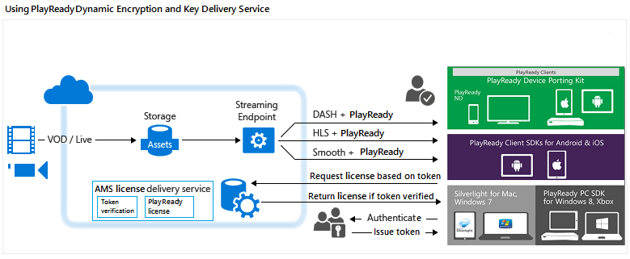

<properties
	pageTitle="Using PlayReady DRM Dynamic Encryption and License Delivery Service"
	description="Microsoft Azure Media Services enables you to deliver MPEG-DASH, Smooth Streaming, and Http-Live-Streaming (HLS) streams protected with Microsoft PlayReady DRM. This topic shows how to dynamically encrypt with AES-128 and use the key delivery service."
	services="media-services"
	documentationCenter=""
	authors="Juliako"
	manager="dwrede"
	editor=""/>

<tags
	ms.service="media-services"
	ms.workload="media"
	ms.tgt_pltfrm="na"
	ms.devlang="na"
	ms.topic="get-started-article" 
	ms.date="08/06/2015"
	ms.author="juliako"/>

#Using PlayReady DRM Dynamic Encryption and License Delivery Service

Microsoft Azure Media Services enables you to deliver MPEG-DASH, Smooth Streaming, and Http-Live-Streaming (HLS) streams protected with [Microsoft PlayReady DRM](https://www.microsoft.com/playready/overview/).

Media Services now provides a service for delivering Microsoft PlayReady licenses. Media Services also provides APIs that let you configure the rights and restrictions that you want for the PlayReady DRM runtime to enforce when a user is trying to play back protected content. When a user requests to watch PlayReady protected content, the client player application requests the content from Azure Media Services. Azure Media Services then redirects the client to an Azure Media Services PlayReady licensing server that authenticates and authorizes the user’s access to the content. A PlayReady license contains the decryption key that can be used by the client player to decrypt and stream the content.

Media Services supports multiple ways of authenticating users who make key requests. The content key authorization policy could have one or more authorization restrictions: open, token restriction, or IP restriction. The token restricted policy must be accompanied by a token issued by a Secure Token Service (STS). Media Services supports tokens in the [Simple Web Tokens](https://msdn.microsoft.com/library/gg185950.aspx#BKMK_2) (SWT) format and [JSON Web Token](https://msdn.microsoft.com/library/gg185950.aspx#BKMK_3) (JWT) format. For more information, see Configure the content key’s authorization policy.

To take advantage of dynamic encryption, you need to have an asset that contains a set of multi-bitrate MP4 files or multi-bitrate Smooth Streaming source files. You also need to configure the delivery policy for the asset (described later in this topic). Then, based on the format specified in the streaming URL, the On-Demand Streaming server will ensure that the stream is delivered in the protocol you have chosen. As a result, you only need to store and pay for the files in single storage format and Media Services service will build and serve the appropriate response based on requests from a client.

This topic would be useful to developers that work on applications that deliver protected media. The topic shows you how to configure the PlayReady license delivery service with authorization policies so that only authorized clients could receive PlayReady licenses. It also shows how to use dynamic encryption.

>[AZURE.NOTE]To start using dynamic encryption, you must first get at least one scale unit (also known as streaming unit). For more information, see [How to Scale a Media Service](media-services-manage-origins.md#scale_streaming_endpoints).

##PlayReady Dynamic Encryption and PlayReady License Delivery Service Workflow

The following are general steps that you would need to perform when protecting your assets with PlayReady, using the Media Services license delivery service, and also using dynamic encryption.

1. Create an asset and upload files into the asset. 
1. Encode the asset containing the file to the adaptive bitrate MP4 set.
1. Create a content key and associate it with the encoded asset. In Media Services, the content key contains the asset’s encryption key. For more information, see ContentKey.
1. Configure the content key’s authorization policy. The content key authorization policy must be configured by you and met by the client in order for the content key to be delivered to the client. 
1. Configure the delivery policy for an asset. The delivery policy configuration includes: delivery protocol (for example, MPEG DASH, HLS, HDS, Smooth Streaming or all), the type of dynamic encryption (for example, common encryption), PlayReady license acquisition URL. 
 
	You could apply different policy to each protocol on the same asset. For example, you could apply PlayReady encryption to Smooth/DASH and AES Envelope to HLS. Any protocols that are not defined in a delivery policy (for example, you add a single policy that only specifies HLS as the protocol) will be blocked from streaming. The exception to this is if you have no asset delivery policy defined at all. Then, all protocols will be allowed in the clear.
1. Create an OnDemand locator in order to get a streaming URL.

You will find a complete .NET example at the end of the topic.

The following image demonstrates the workflow described above. Here the token is used for authentication.

The rest of this topic provides detailed explanations, code examples, and links to topics that show you how to achieve the tasks described above. 

##Current limitations

If you add or update your asset’s delivery policy, you must delete an existing locator (if any) and create a new locator.

##Create an asset and upload files into the asset

In order to manage, encode, and stream your videos, you must first upload your content into Microsoft Azure Media Services. Once uploaded, your content is stored securely in the cloud for further processing and streaming. 

The following code snippet shows how to create an asset and upload the specified file into the asset.

	static public IAsset UploadFileAndCreateAsset(string singleFilePath)
	{
	    if(!File.Exists(singleFilePath))
	    {
	        Console.WriteLine("File does not exist.");
	        return null;
	    }
	
	    var assetName = Path.GetFileNameWithoutExtension(singleFilePath);
	    IAsset inputAsset = _context.Assets.Create(assetName, AssetCreationOptions.StorageEncrypted);
	
	    var assetFile = inputAsset.AssetFiles.Create(Path.GetFileName(singleFilePath));
	
	    Console.WriteLine("Created assetFile {0}", assetFile.Name);
	
	    var policy = _context.AccessPolicies.Create(
	                            assetName,
	                            TimeSpan.FromDays(30),
	                            AccessPermissions.Write | AccessPermissions.List);
	
	    var locator = _context.Locators.CreateLocator(LocatorType.Sas, inputAsset, policy);
	
	    Console.WriteLine("Upload {0}", assetFile.Name);
	
	    assetFile.Upload(singleFilePath);
	    Console.WriteLine("Done uploading {0}", assetFile.Name);
	
	    locator.Delete();
	    policy.Delete();
	
	    return inputAsset;
	}

##Encode the asset containing the file to the adaptive bitrate MP4 set

With dynamic encryption all you need is to create an asset that contains a set of multi-bitrate MP4 files or multi-bitrate Smooth Streaming source files. Then, based on the specified format in the manifest or fragment request, the On-Demand Streaming server will ensure that you receive the stream in the protocol you have chosen. As a result, you only need to store and pay for the files in single storage format and Media Services service will build and serve the appropriate response based on requests from a client. For more information, see the [Dynamic Packaging Overview](media-services-dynamic-packaging-overview.md) topic.

The following code snippet shows you how to encode an asset to adaptive bitrate MP4 set:

	static public IAsset EncodeToAdaptiveBitrateMP4Set(IAsset inputAsset)
	{
	    var encodingPreset = "H264 Adaptive Bitrate MP4 Set 720p";
	
	    IJob job = _context.Jobs.Create(String.Format("Encoding into Mp4 {0} to {1}",
	                            inputAsset.Name,
	                            encodingPreset));
	
	    var mediaProcessors = 
	        _context.MediaProcessors.Where(p => p.Name.Contains("Media Encoder")).ToList();
	
	    var latestMediaProcessor = 
	        mediaProcessors.OrderBy(mp => new Version(mp.Version)).LastOrDefault();
	
	
	
	    ITask encodeTask = job.Tasks.AddNew("Encoding", latestMediaProcessor, encodingPreset, TaskOptions.None);
	    encodeTask.InputAssets.Add(inputAsset);
	    encodeTask.OutputAssets.AddNew(String.Format("{0} as {1}", inputAsset.Name, encodingPreset), AssetCreationOptions.StorageEncrypted);
	
	    job.StateChanged += new EventHandler<JobStateChangedEventArgs>(JobStateChanged);
	    job.Submit();
	    job.GetExecutionProgressTask(CancellationToken.None).Wait();
	
	    return job.OutputMediaAssets[0];
	}
	
	static private void JobStateChanged(object sender, JobStateChangedEventArgs e)
	{
	    Console.WriteLine(string.Format("{0}\n  State: {1}\n  Time: {2}\n\n",
	        ((IJob)sender).Name,
	        e.CurrentState,
	        DateTime.UtcNow.ToString(@"yyyy_M_d__hh_mm_ss")));
	}

##Create a content key and associate it with the encoded asset

In Media Services, the content key contains the key that you want to encrypt an asset with.

For detailed information, see [Create content key](media-services-dotnet-create-contentkey.md).

##Configure the content key’s authorization policy

Media Services supports multiple ways of authenticating users who make key requests. The content key authorization policy must be configured by you and met by the client (player) in order for the key to be delivered to the client. The content key authorization policy could have one or more authorization restrictions: open, token restriction, or IP restriction.

For detailed information, see [Configure Content Key Authorization Policy](media-services-dotnet-configure-content-key-auth-policy.md).

