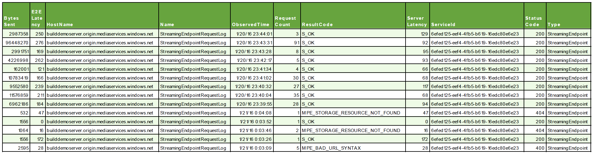

<properties pageTitle="Azure Media Services Telemetry with .NET | Microsoft Azure" 
	description="This article shows you how to use the Azure Media Services telemetry." 
	services="" 
	documentationCenter=""
	authors="juliako" />

# Azure Media Services Telemetry with .NET

## Overview

Media Services telemetry/monitoring allows Media Services customers to access metrics data for its services. Current version supports telemetry data for "Channel" and "StreamingEndpoint" entities. You can configure telemetry on component level granularity. There are two detail levels "Normal" and "Verbose". The current version only supports "Normal".

Telemetry is written to an Azure Storage Account provided by the customer (a storage account must be attached to the Media Services account). Telemetry is written to an Azure Storage Table in the specified storage account. Telemetry system will create a separate table for each new day based at 00:00 UTC. As an example "TelemetryMetrics20160321" where "20160321" is date of table created. For each day there will be separate table.

Telemetry system doesn’t provide data retention nor auto delete of old records. For that reason, you need to manage and delete old records. Having separate tables for each day makes it easy to delete old records. You can just delete old tables.  

This topic shows how to enable telemetry for the specified AMS services and how to query the metrics using .NET.  

## Configuring telemetry for a Media Services account

The following steps are needed to enable telemetry:

- Get the credentials of the storage account attached to the Media Services account. 
- Create a Notification Endpoint with **EndPointType** set to **AzureTable** and endPontAddress pointing to the storage table.

	    INotificationEndPoint notificationEndPoint = 
	                  _context.NotificationEndPoints.Create("monitoring", 
	                  NotificationEndPointType.AzureTable,
	                  "https://" + _mediaServicesStorageAccountName + ".table.core.windows.net/");

- Create a monitoring configuration settings for the services you want to monitor. No more than one monitoring configuration settings is allowed. 
  
        IMonitoringConfiguration monitoringConfiguration = _context.MonitoringConfigurations.Create(notificationEndPoint.Id,
            new List<ComponentMonitoringSetting>()
            {
                new ComponentMonitoringSetting(MonitoringComponent.Channel, MonitoringLevel.Normal),
                new ComponentMonitoringSetting(MonitoringComponent.StreamingEndpoint, MonitoringLevel.Normal)
            });

## StreamingEndpoint log

###Available metrics

You can query for the following StreamingEndPoint metrics. 

- **PartitionKey** gets the partition key of the record.
- **RowKey** gets the row key of the record.
- **AccountId** gets the Media Services account ID.
- **AccountId** gets the Media Services Streaming Endpoint ID.
- **ObservedTime** gets the observed time of the metric.
- **HostName** gets the Streaming Endpoint host name.
- **StatusCode** gets the status code.
- **ResultCode** gets the result code.
- **RequestCount** gets the request count.
- **BytesSent** gets the bytes sent.
- **ServerLatency** gets the server latency.
- **EndToEndLatency** gets the end to end request time.

###Streaming Endpoint query result example

## Live channel heartbeat

###Available metrics

You can query for the following live channel metrics. 

- **PartitionKey** gets the partition key of the record.
- **RowKey** gets the row key of the record.
- **AccountId** gets the Media Services account ID.
- **ChannelId** gets the Media Services Channel ID.
- **ObservedTime** gets the observed time of the metric.
- **CustomAttributes** gets the custom attributes.
- **TrackType** gets the track type.
- **TrackName** gets the track name.
- **Bitrate** gets the bitrate.
- **IncomingBitrate** gets the incoming bitrate.
- **OverlapCount** gets the overlap count.
- **DiscontinuityCount** gets the discontinuity count.
- **LastTimestamp** gets the last time stamp.
 
###Live Channel query result example

## StreamingEndpoint metrics example
		
	using System;
	using System.Collections.Generic;
	using System.Configuration;
	using System.Linq;
	using Microsoft.WindowsAzure.MediaServices.Client;
	
	namespace AMSMetrics
	{
	    class Program
	    {
	        // Read values from the App.config file.
	        private static readonly string _mediaServicesAccountName =
	            ConfigurationManager.AppSettings["MediaServicesAccountName"];
	        private static readonly string _mediaServicesAccountKey =
	            ConfigurationManager.AppSettings["MediaServicesAccountKey"];
	        private static readonly string _mediaServicesAccountID =
	            ConfigurationManager.AppSettings["MediaServicesAccountID"];
	        private static readonly string _streamingEndpointID =
	            ConfigurationManager.AppSettings["StreamingEndpointID"];
	        private static readonly string _mediaServicesStorageAccountName =
	            ConfigurationManager.AppSettings["StorageAccountName"];
	        private static readonly string _mediaServicesStorageAccountKey =
	            ConfigurationManager.AppSettings["StorageAccountKey"];
	
	        // Field for service context.
	        private static CloudMediaContext _context = null;
	        private static MediaServicesCredentials _cachedCredentials = null;
	
	        static void Main(string[] args)
	        {
	            // Create and cache the Media Services credentials in a static class variable.
	            _cachedCredentials = new MediaServicesCredentials(
	                            _mediaServicesAccountName,
	                            _mediaServicesAccountKey);
	            // Used the cached credentials to create CloudMediaContext.
	            _context = new CloudMediaContext(_cachedCredentials);
	
	            INotificationEndPoint notificationEndPoint = 
	                          _context.NotificationEndPoints.Create("monitoring", NotificationEndPointType.AzureTable, GetTableEndPoint());
	
	            var monitoringConfigurations = _context.MonitoringConfigurations;
	            IMonitoringConfiguration monitoringConfiguration = null;
	
	            // No more than one monitoring configuration settings is allowed.
	            if (monitoringConfigurations.ToArray().Length != 0)
	            {
	                monitoringConfiguration = _context.MonitoringConfigurations.FirstOrDefault();
	            }
	            else
	            {
	                monitoringConfiguration = _context.MonitoringConfigurations.Create(notificationEndPoint.Id,
	                    new List<ComponentMonitoringSetting>()
	                    {
	                        new ComponentMonitoringSetting(MonitoringComponent.StreamingEndpoint, MonitoringLevel.Normal)
	                    });
	            }
	
	            //Print metrics for a Streaming Endpoint.
	            PrintStreamingEndpointMetrics();
	
	            Console.ReadLine();
	        }
	
	        private static string GetTableEndPoint()
	        {
	            return "https://" + _mediaServicesStorageAccountName + ".table.core.windows.net/";
	        }
	
	        private static void PrintStreamingEndpointMetrics()
	        {
	            var end = DateTime.UtcNow;
	            var start = DateTime.UtcNow.AddHours(-5);
	
	            // Get some streaming endpoint metrics.
	            var res = _context.StreamingEndPointRequestLogs.GetStreamingEndPointMetrics(
	                    GetTableEndPoint(),
	                    _mediaServicesStorageAccountKey,
	                    _mediaServicesAccountID,
	                    _streamingEndpointID,
	                    start,
	                    end);
	
	
	            Console.Title = "Streaming endpoint metrics:";
	
	            foreach (var log in res)
	            {
	                Console.WriteLine("AccountId: {0}", log.AccountId);
	                Console.WriteLine("BytesSent: {0}", log.BytesSent);
	                Console.WriteLine("EndToEndLatency: {0}", log.EndToEndLatency);
	                Console.WriteLine("HostName: {0}", log.HostName);
	                Console.WriteLine("ObservedTime: {0}", log.ObservedTime);
	                Console.WriteLine("PartitionKey: {0}", log.PartitionKey);
	                Console.WriteLine("RequestCount: {0}", log.RequestCount);
	                Console.WriteLine("ResultCode: {0}", log.ResultCode);
	                Console.WriteLine("RowKey: {0}", log.RowKey);
	                Console.WriteLine("ServerLatency: {0}", log.ServerLatency);
	                Console.WriteLine("StatusCode: {0}", log.StatusCode);
	                Console.WriteLine("StreamingEndpointId: {0}", log.StreamingEndpointId);
	                Console.WriteLine();
	            }
	
	            Console.WriteLine();
	        }

	        private static void PrintChannelMetrics()
	        {
	            var end = DateTime.UtcNow;
	            var start = DateTime.UtcNow.AddHours(-5);
	
	            // Get some channel metrics.
	            var channelMetrics = _context.ChannelMetrics.GetChannelMetrics(
	                GetTableEndPoint(),
	                _mediaServicesStorageAccountKey,
	                _mediaServicesAccountName,
	                _context.Channels.FirstOrDefault().Id,
	                start,
	                end);
	
	            // Print the channel metrics.
	            Console.WriteLine("Channel metrics:");
	
	            foreach (var channelHeartbeat in channelMetrics.OrderBy(x => x.ObservedTime))
	            {
	                Console.WriteLine(
	                    "    Observed time: {0}, Last timestamp: {1}, Incoming bitrate: {2}",
	                    channelHeartbeat.ObservedTime,
	                    channelHeartbeat.LastTimestamp,
	                    channelHeartbeat.IncomingBitrate);
	            }
	
	            Console.WriteLine();
	        }
	    }
	}

##Provide feedback

[AZURE.INCLUDE [media-services-user-voice-include](../../includes/media-services-user-voice-include.md)]

##Next step
 
See Azure Media Services learning paths to help you learn about great features offered by AMS.  

[AZURE.INCLUDE [media-services-learning-paths-include](../../includes/media-services-learning-paths-include.md)]
