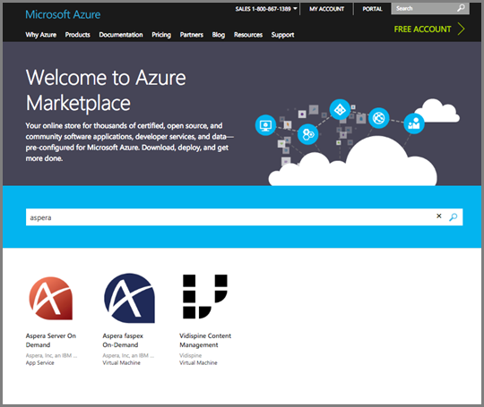
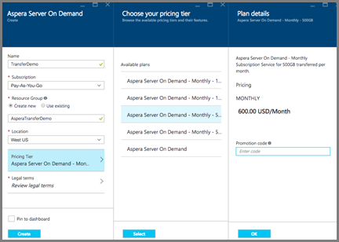
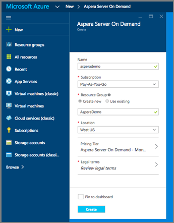
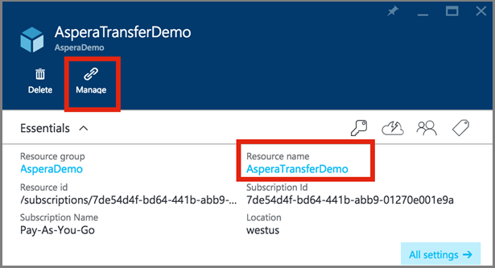
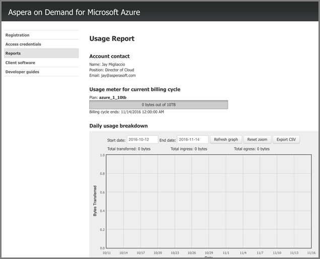
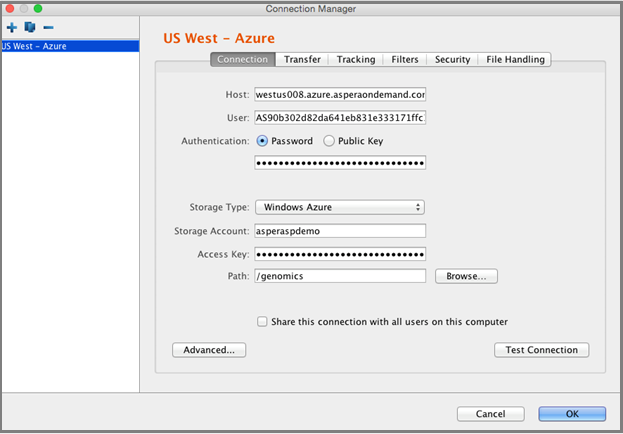

# Upload files into a Media Services account using the an Aspera On Demand service on Azure

## Overview
 
> [!NOTE]
> To complete this tutorial, you need a Windows Live ID and an [Azure account](https://azure.microsoft.com). For details, see [Azure Free Trial](https://azure.microsoft.com/pricing/free-trial/). 
> 

This article is for customers who are ready to get started with an **Aspera On Demand Service** on Azure.  If you are still investigating Aspera On Demand options and want to learn more, please view the [Aspera Cloud](http://cloud.asperasoft.com/) site for more info. 

>[!NOTE]
>Aspera has two offerings in the Azure marketplace. **Aspera Server on Demand** and **Aspera Faspex** on demand. Aspera software that has been purchased for on premise deployments, is not allowed to be installed on virtual machines running on the Azure platform. 

**Aspera Server On Demand** for Azure is a transfer service available for purchase from the Azure Marketplace.  You can find the **Aspera Service** in Azure [here](https://azure.microsoft.com/en-us/marketplace/). In order to complete a purchase Aspera Server On Demand for Azure, please log into Azure Marketplace with your Windows Live ID.

## Purchase Aspera On Demand for Azure

Once you have logged into Azure Marketplace,  follow these basic steps to complete your purchase of Aspera On Demand for Azure.

1. Search for Aspera and select 'Server On Demand'.

   

2. Review the subscription plans and click on 'Sign Up'

   

3. Fill in the specifics for your Server on Demand subscription.

   

4. Click on the "Pricing Tier" and select your desired monthly volume in the sub panel.  Click on "OK" in the Plan details and then "Select" in the "Choose your Pricing Tier" Panel.

   

5. Click on "Legal terms" to view and accept the legal terms in the sub panel.  Once you have reviewed the legal terms, click on "Purchase".

   

6. Complete the purchase by clicking on "Create".

   

7. The Azure dashboard will announce that it is provisioning the service.  Once it is completed with provisioning, you can find the new subscription by searching in your resources for the name of the service.  Once you have found the service, double click on it to launch the service management portal.

   

8. Launch the Aspera management portal.   Once you have found your new Aspera service, you can gain access to the management portal, by clicking on the service.  A new panel will be launched.  From within that new panel, you need to click on the Resource Name of your new service.   In my screenshot, the resource name is 'AsperaTransferDemo'.  Once you click on that, another panel will be launched.  In that newly launched panel, you will see a 'Manage' link.  Click on the 'manage' link to launch the Aspera management portal.

   

9. By clicking on that manage link, you will get to the registration page, which is required to access the service.

   

10. Success!  At this point, you should have access to the Aspera service management portal, where you can create access keys, download Aspera clients and licenses, view usage and learn about the APIs.  Below is a screenshot of the access creation and usage reporting interfaces in the portal. 

   

   

11.Download and install the Aspera Client software:

[Browser plugin](http://downloads.asperasoft.com/connect2/)

[Rich client](http://downloads.asperasoft.com/en/downloads/2)

12. Your first transfer:  In order to use the Aspera client to transfer with the Aspera transfer service, you need to complete the following: 

	1. Create an access key, using the Aspera portal.  
	2. Create a storage account and container using the Azure management portal. 
	3. Download, install and license the Aspera client (software can be found in the Aspera portal).  

	Please read the client guide for configuration information. 

In the connections screen of the Aspera client, you must specify the 'Azure' storage type as well as the blob credentials and container.

## Next steps
You can now encode your uploaded assets. For more information, see [Encode assets](media-services-portal-encode.md).

## Media Services learning paths
[!INCLUDE [media-services-learning-paths-include](../../includes/media-services-learning-paths-include.md)]

## Provide feedback
[!INCLUDE [media-services-user-voice-include](../../includes/media-services-user-voice-include.md)]

