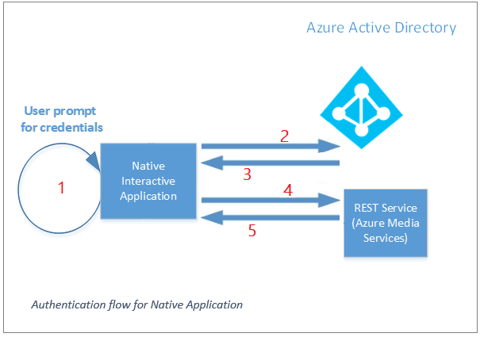

# Access the Azure Media Services API with Azure AD authentication
 
The Azure Media Services API is a RESTful API. You can use it to perform operations on media resources by using a REST API or by using available client SDKs. Azure Media Services offers a Media Services client SDK for Microsoft .NET. To be authorized to access Media Services resources and the Media Services API, you must first be authenticated. 

Media Services supports [Azure Active Directory (Azure AD)-based authentication](../active-directory/active-directory-whatis.md). The Azure Media REST service requires that the user or application that makes the REST API requests have either the **contributor** or **owner** role to  access the resources. For more information, see [Get started with role-based access control in the Azure portal](../active-directory/role-based-access-control-what-is.md).  

> [!IMPORTANT]
> Currently, Media Services supports the Azure Access Control service authentication model. However, Access Control authorization will be deprecated on June 1, 2018. We recommend that you migrate to the Azure AD authentication model as soon as possible.

This document gives an overview of how to access the Media Services API by using REST or .NET APIs.

## Access control

For the Azure Media REST request to succeed, the calling user must have a Contributor or Owner role for the Media Services account it is trying to access.  
Only a user with the Owner role can give media resource (account) access to new users or apps. The Contributor role can only access the media resource.
Unauthorized requests will fail with status code 401. If you see this error message, check whether your user has the Contributor or Owner role assigned for the user's Media Services account. You can check this through the Azure portal. Search for your media account, and then click the **Access control** tab. 

## Types of authentication 
 
When you use Azure AD authentication with Azure Media Services, you have two options for authenticating:

- **User authentication**. Use to authenticate a person who is using the app to interact with Media Services resources. The interactive application should first prompt the user for the user's credentials. An example is a management console app used by authorized users to monitor encoding jobs or live streaming. 
- **Service principal authentication**. Use to authenticate a service. Applications that commonly use this authentication method are apps that run daemon services, middle-tier services, or scheduled jobs. Examples are web apps, function apps, logic apps, API, microservices.

### User authentication 

Applications that should use this authentication method are management or monitoring native apps: mobile apps, Windows apps, and console applications. This type of solution is very useful when you want human interaction with the service that fits one of the following scenarios:

- Monitoring dashboard for your encoding jobs.
- Monitoring dashboard for your live streams.
- Management application for desktop or mobile users to administer resources in a Media Services account.

> [!NOTE]
> This authentication method should not be used for consumer-facing applications. 

A native application has to first acquire an access token from Azure AD and then use it when you make HTTP requests to the Media Services REST API. add the access token to the request header. 

The following diagram shows a typical interactive application authentication flow: 

In the preceding diagram, the numbers represent the flow of the requests in chronological order:

> [!NOTE]
> When you use the user authentication method, all apps share the same (default) "native application client ID" and "native application redirect URI". 

1. Prompt a user for credentials.
2. Request an Azure AD access token with the following parameters:  

	1. Azure AD tenant endpoint.

		The tenant information can be retrieved from the Azure portal. Hover over the logged in user in the top right corner.
	2. Media Services resource URI. 

		This URI is the same for Media Services accounts that are located in the same Azure environment (for example, https://rest.media.azure.net).

	3. Media Services (native) application client ID.
	4. Media Services (native) application redirect URI.
	5. Resource URI for REST Media Services.
		
		The URI represents the REST API endpoint (for example, https://test03.restv2.westus.media.azure.net/api/).

	To get values for these parameters, see [Use the Azure portal to access Azure AD authentication settings](media-services-portal-get-started-with-aad.md) using the "user authentication option".

3. The Azure AD access token is sent to the client.
4. The client sends a request to Azure Media REST API, with the Azure AD access token.
5. The client receives the data from Media Services.

For information about how to use Azure AD authentication to communicate with REST requests by using the Media Services .NET client SDK, see [Use Azure AD authentication to access the Media Services API with .NET](media-services-dotnet-get-started-with-aad.md). 

If you are not using Media Services .NET client SDK, you must manually create an Azure AD access token request by using the parameters described in **step 2**. For more information, see [How to use the Azure AD Authentication Library to get the Azure AD token](../active-directory/develop/active-directory-authentication-libraries.md).

### Service principal authentication

Applications that commonly use this authentication method are apps that run middle-tier services and scheduled jobs: Web Apps, Function Apps, Logic Apps, API, Microservice. This authentication method is also suitable for interactive applications which may want to use a service account to manage resources.

When using the service principal authentication method for building "consumer scenarios", the authentication is typically handled in the middle-tier (through some API) and not directly in a mobile or desktop application. 

To use this method, you need to create an Azure Active Directory application and service principal in its own tenant. After the application is created, give the app Contributor or Owner level access to the Media Services account. These steps can be accomplished through the Azure portal, Azure CLI, or PowerShell script. You also can use an existing Azure AD application. You can register and manage your Azure AD app and service principal with the Azure portal, as shown [here](media-services-portal-get-started-with-aad.md). You can also do it using [CLI 2.0](media-services-use-aad-auth-to-access-ams-api.md) or [PowerShell](media-services-powershell-create-and-configure-aad-app.md). 

After you create your Azure AD application, you will get values for the following settings that you will need to use for authentication.

- Client ID 
- Client secret 

In the diagram above, the numbers represent the flow of the requests in chronological order:
	
1. A middle-tier app (web API or web application) requests an Azure AD access token with the following parameters:  

	1. Azure AD tenant endpoint.

 		The tenant information can be retrieved from the Azure portal. Hover over the signed-in user in the top right corner.
	2. Media Services resource URI. 

		This URI is the same for Media Services accounts that are located in the same Azure environment (for example, https://rest.media.azure.net).

	3. Resource URI for Media REST Services.

		The URI represents the REST API endpoint (for example, https://test03.restv2.westus.media.azure.net/api/).

	4. Azure AD application values: the **Client ID** and **Client secret**.
	
	To get values for these parameters, see [Use the Azure portal to access Azure AD authentication settings](media-services-portal-get-started-with-aad.md) using the "service principal authentication option".

2. The Azure AD access token is sent to the middle tier.
4. The middle tier sends request to Azure Media REST API together with the Azure AD token.
5. The middle tier gets the data back from Media Services.

For information about how to use Azure AD authentication for communicating with REST requests using the Media Services .NET client SDK, see [this](media-services-dotnet-get-started-with-aad.md) topic. 

If you are not using Media Services .NET client SDK, you will be required to manually create an Azure AD token request using parameters described in **step 1**. For more information, see [How to use ADAL libaraies to get the Azure AD token](../active-directory/develop/active-directory-authentication-libraries.md).

## Troubleshooting

Exception: "The remote server returned an error: (401) Unauthorized."

Solution: For the the Media Services REST request to succeed, the calling user must be a "Contributor" or "Owner" of the Media Services account it is trying to access. For more information, see the [Access control](media-services-use-aad-auth-to-access-ams-api.md#access-control) section.

## Resources

The following list of articles provides an overview of Azure AD authentication concepts. 

- [Overview of authentication scenarios addressed by Azure AD](../active-directory/develop/active-directory-authentication-scenarios.md#basics-of-authentication-in-azure-ad)
- [Overview of how to add/update or remove an application in Azure AD](../active-directory/develop/active-directory-integrating-applications.md)
- [Overview of configuring and managing RBAC with PowerShell](../active-directory/role-based-access-control-manage-access-powershell.md)

## Next steps

* [Use the Azure portal to access Azure AD authentication used to consume Azure Media Services API](media-services-portal-get-started-with-aad.md)
* [Use Azure AD authentication to access Azure Media Services API with .NET](media-services-dotnet-get-started-with-aad.md).

