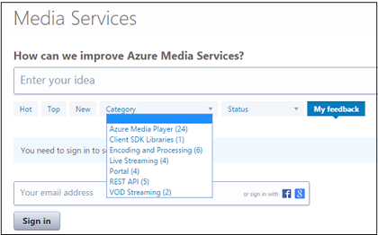
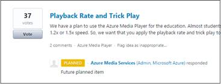

<properties
	pageTitle="Azure Media Services User Voice"
	description="The Azure Media Services User Voice forum invites you to provide feedback and suggest new feature requests. "
	services="media-services"
	documentationCenter=""
	authors="Juliako"
	manager="dwrede"
	editor=""/>

<tags
	ms.service="media-services"
	ms.workload="media"
	ms.tgt_pltfrm="na"
	ms.devlang="na"
	ms.topic="article" 
	ms.date="11/06/2015"
	ms.author="juliako"/>

# Azure Media Services User Voice

The [Azure Media Services User Voice](https://feedback.azure.com/forums/169396-media-services) forum invites you to provide feedback and suggest new feature requests. 

You can view and provide feedback based on a category. 

Or, just access specific categories using these URLs.

- [Azure Media Player](https://feedback.azure.com/forums/169396-media-services/category/109320-azure-media-player)
- [Client SDK Libraries](https://feedback.azure.com/forums/169396-media-services/category/144435-client-sdks)
- [Encoding and Processing](https://feedback.azure.com/forums/169396-media-services/category/144411-encoding-and-processing)
- [Live Streaming](https://feedback.azure.com/forums/169396-media-services/category/144414-live-streaming)
- [Azure Portal](https://feedback.azure.com/forums/169396-media-services/category/144432-portal)
- [REST API and Platform](https://feedback.azure.com/forums/169396-media-services/category/144423-rest-api-and-platform)
- [VoD Streaming](https://feedback.azure.com/forums/169396-media-services/category/144429-vod-streaming)
 
You can view existing requests and track status. If you agree with the feedback or suggestion, you can add your vote.

##Media Services learning paths

You can view AMS learning paths here:

- [AMS Live Streaming Workflow](http://azure.microsoft.com/documentation/learning-paths/media-services-streaming-live/)
- [AMS on Demand Streaming Workflow](http://azure.microsoft.com/documentation/learning-paths/media-services-streaming-on-demand/)