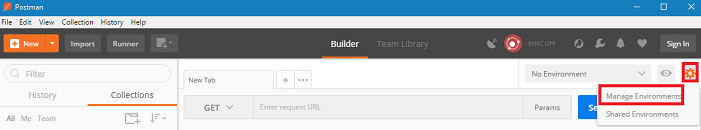
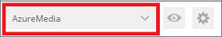
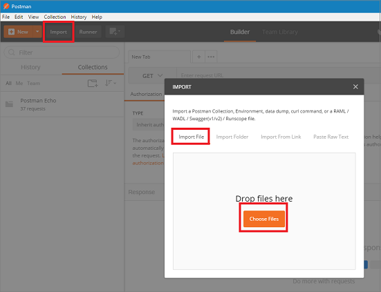

# Configure Postman for Media Services REST API calls  

> [!NOTE]
> No new features or functionality are being added to Media Services v2.  Check out the latest version, [Media Services v3](https://docs.microsoft.com/azure/media-services/latest/). Also, see [migration guidance from v2 to v3](../latest/migrate-from-v2-to-v3.md)

This tutorial shows you how to configure **Postman** so it can be used to call Azure Media Services (AMS) REST APIs. The tutorial shows how to import environment and collection files into **Postman**. The collection contains grouped definitions of HTTP requests that call Azure Media Services (AMS) REST APIs. The environment file contains variables that are used by the collection.

This environment and collection is used in articles that show how to achieve various tasks with Azure Media Services REST APIs.

## Prerequisites

- Install the [Postman](https://www.getpostman.com/) REST client to execute the REST APIs shown in some of the AMS REST tutorials. 

    We are using **Postman** but any REST tool would be suitable. Other alternatives are: **Visual Studio Code** with the REST plugin or **Telerik Fiddler**. 

## Configure the environment 

1. Create a .json file that contains the environment variables used in AMS tutorials. Name the file (for example, **AzureMediaServices.postman_environment.json**). Open the file and paste the code that defines the Postman environment from [this code listing](postman-environment.md). 
2. Open the **Postman**.
3. On the right of the screen, select the **Manage environment** option.

    
4. From the **Manage environment** dialog, click **Import**.
5. Browse and select the **AzureMediaServices.postman_environment.json** file.
6. The **AzureMedia** environment is added.
7. Close the dialog.
8. Select the **AzureMedia** environment.

    

## Configure the collection

1. Create a .json file that contains the **Postman** collection with all the operations that are needed to upload a file to Media Services. Name the file (for example, **AzureMediaServicesOperations.postman_collection.json**). Open the file and paste the code that defines the **Postman** collection from [this code listing](postman-collection.md).
2. Click **Import** to import the collection file.
3. Choose the **AzureMediaServicesOperations.postman_collection.json** file.

    

## Next steps

Check out the [upload assets](media-services-rest-upload-files.md) article.  
