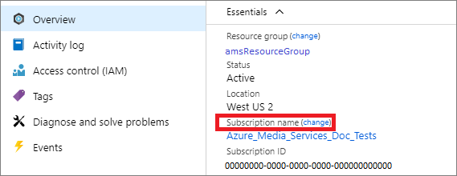

---
# Mandatory fields. See more on aka.ms/skyeye/meta.
title: Azure Media Services accounts | Microsoft Docs
description: This article explains how to manage Azure Media Services accounts. 
services: media-services
documentationcenter: ''
author: Juliako
manager: femila
editor: ''

ms.service: media-services
ms.workload: 
ms.topic: article
ms.date: 06/25/2019
ms.author: juliako
---

# Azure Media Services accounts

To start managing, encrypting, encoding, analyzing, and streaming media content in Azure, you need to create a Media Services account. When creating a Media Services account, you need to supply the name of an Azure Storage account resource. The specified storage account is attached to your Media Services account. The Media Services account and all associated storage accounts must be in the same Azure subscription.  

## Moving a Media Services account between subscriptions 

If you need to move a Media Services account to a new subscription, you need to first move the entire resource group that contains the Media Services account to the new subscription. You must move all attached resources: Azure Storage accounts, Azure CDN profiles, etc. 

> [!NOTE]
> Media Services v2 does not support multi-tenancy model.

You can do the move using the Azure portal or scripts:

* The Azure portal 

    In your Media Services account, select Overview > Subscription name (change)

    
* Scripts 

    For more information, see [Move resources to new resource group or subscription](../../azure-resource-manager/resource-group-move-resources.md). 

As with any resources in Azure, resource group moves can take some time to complete.

### Considerations

* Create backups of all data in your account before migrating to a different subscription.
* You need to stop all the Streaming Endpoints and live streaming resources. Your users will not be able to access your content for the duration of the resource group move. 

> [!IMPORTANT]
> Do not start the Streaming Endpoint until the move completes successfully.

### Troubleshoot 

If a Media Services account or an associated Azure Storage account become "disconnected" following the resource group move, try rotating the Storage Account keys. If rotating the Storage Account keys does not resolve the "disconnected" status of the Media Services account, file a new support request from the "Support + troubleshooting" menu in the Media Services account.  

## Next steps

[Create an account](media-services-portal-create-account.md).
