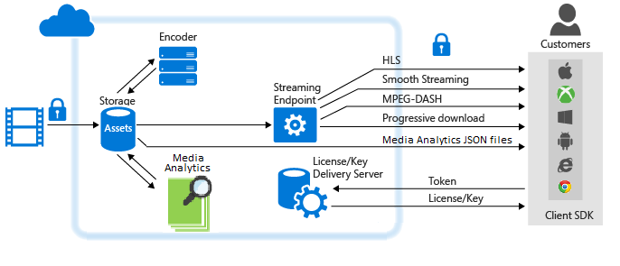

# Media Analytics on the Media Services platform 

## Overview
More organizations are using video as the preferred medium to train their employees, engage their customers, and document business functions. Cloud computing provides a way to store, stream, and access these large media files. But as a company's library of video content grows, it needs an equally effective means of extracting insights from the content. 

To address this growing need, Azure Media Services offers Azure Media Analytics. Media Analytics is a collection of speech and vision components that makes it easier for organizations and enterprises to derive actionable insights from their video files. Built by using the core Media Services platform components, Media Analytics can handle media processing at scale on day one.

With Media Analytics, developers can quickly bring advanced video functionality into applications. It provides enterprise environments with the full scale, compliance, security, and global reach required by large organizations.

The following diagram shows Media Analytics and other major parts of the Media Services platform. 

Media Analytics media processors produce MP4 files or JSON files. If a media processor produces an MP4 file, you can progressively download the file. If a media processor produces a JSON file, you can download the file from Azure Blob storage. 

## Media Analytics services

### Indexer
With Azure Media Indexer, you can make content searchable and generate closed-captioning tracks. Compared to the previous version, Azure Media Indexer 2 Preview has faster indexing and broader language support. Supported languages include English, Spanish, French, German, Italian, Chinese, Portuguese, and Arabic. For detailed information and examples, see [Process videos with Azure Media Indexer 2](media-services-process-content-with-indexer2.md).
### Motion Detector
You can use Motion Detector to detect motion in a video with stationary backgrounds. This makes it possible to check for false positives on motion events detected by surveillance cameras. For detailed information and examples, see [Motion detection for Azure Media Analytics](media-services-motion-detection.md).
### Face Detector
By using Face Detector, you can detect people’s faces and their emotions, including happiness, sadness, and surprise. This has several useful industry applications, described later, including aggregating and analyzing reactions of people attending an event. For detailed information and examples, see [Face and emotion detection for Azure Media Analytics](media-services-face-and-emotion-detection.md).
### Video summarization
Video summarization can help you create summaries of long videos by automatically selecting interesting snippets from the source video. This ability is useful when you want to provide a quick overview of what to expect in a long video. For detailed information and examples, see [Use Azure Media Video Thumbnails to create video summarization](media-services-video-summarization.md).
### Optical character recognition
With Azure Media OCR (optical character recognition), you can convert text content in video files into editable, searchable digital text. You can then automate the extraction of meaningful metadata from the video signal of your media.
### Scalable face redaction
Azure Media Redactor is a Media Analytics media processor that offers scalable face redaction in the cloud. By using face redaction, you can modify your video to blur faces of selected individuals. You might want to use the face redaction service in news media or when public safety is involved. A few minutes of footage that contains multiple faces can take hours to redact manually, but with this service, face redaction takes just a few simple steps. For more information, see the [Redact faces with Azure Media Analytics](media-services-face-redaction.md) article.
### Content Moderation
Azure Content Moderator enables you to use machine-assisted moderation for your videos. For example, you might want to detect possible adult and racy content in videos and review the flagged content by your human moderation teams. Manually moderating videos for undesirable content is a time consuming and expensive task. With this service and associated review tools, you combine machine-assisted moderation with human-in-the-loop capabilities for best results  efficiently and cost-effectively. To learn more, see the [Process your videos with Azure Content Moderator](media-services-content-moderation.md) article.

## Common scenarios
Media Analytics can help organizations and enterprises glean new insights from video and more effectively manage large volumes of video content. Here are several scenarios:

* **Call centers**. Even with the advent of social media, customer call centers still facilitate a large percentage of customer-service transactions. Encoded in this audio data is a large amount of customer information that can be analyzed to achieve higher customer satisfaction. By using Media Indexer, organizations can extract text and build search indexes and dashboards. Then they can extract intelligence around common complaints, sources of complaints, and other relevant data.
* **User-generated content moderation**. From news media outlets to police departments, many organizations have public-facing portals that accept user-generated media such as videos and images. The volume of content can spike due to unexpected events. In these scenarios, it is difficult to conduct effective manual reviews of content for appropriateness. Customers can rely on the content-moderation service to focus on content that is appropriate.

## Media Analytics media processors
This section lists the Media Analytics media processors and shows how to use .NET or REST to get a media processor (MP) object.

### MP names
* Azure Media Indexer 2 Preview
* Azure Media Indexer
* Azure Media Face Detector
* Azure Media Motion Detector
* Azure Media Video Thumbnails
* Azure Media OCR
* Azure Media Content Moderator

### .NET
The following function takes one of the specified MP names and returns an MP object.

    static IMediaProcessor GetLatestMediaProcessorByName(string mediaProcessorName)
    {
        var processor = _context.MediaProcessors
            .Where(p => p.Name == mediaProcessorName)
            .ToList()
            .OrderBy(p => new Version(p.Version))
            .LastOrDefault();

        if (processor == null)
            throw new ArgumentException(string.Format("Unknown media processor",
                                                       mediaProcessorName));

        return processor;
    }

### REST
Request:

    GET https://media.windows.net/api/MediaProcessors()?$filter=Name%20eq%20'Azure%20Media%20OCR' HTTP/1.1
    DataServiceVersion: 1.0;NetFx
    MaxDataServiceVersion: 3.0;NetFx
    Accept: application/json
    Accept-Charset: UTF-8
    User-Agent: Microsoft ADO.NET Data Services
    Authorization: Bearer <token>
    x-ms-version: 2.12
    Host: media.windows.net

Response:

    . . .

    {  
       "odata.metadata":"https://media.windows.net/api/$metadata#MediaProcessors",
       "value":[  
          {  
             "Id":"nb:mpid:UUID:074c3899-d9fb-448f-9ae1-4ebcbe633056",
             "Description":"Azure Media OCR",
             "Name":"Azure Media OCR",
             "Sku":"",
             "Vendor":"Microsoft",
             "Version":"1.1"
          }
       ]
    }

## Demos
See [Azure Media Analytics demos](https://azuremedialabs.azurewebsites.net/demos/Analytics.html).

## Provide feedback
[!INCLUDE [media-services-user-voice-include](../../../includes/media-services-user-voice-include.md)]

## Related articles
See [Media Services Analytics announcement](https://azure.microsoft.com/blog/introducing-azure-media-analytics/).

<!-- Images -->

[overview]: ./media/media-services-video-on-demand-workflow/media-services-video-on-demand.png

## Next steps
Review Media Services learning paths.

[!INCLUDE [media-services-learning-paths-include](../../../includes/media-services-learning-paths-include.md)]
