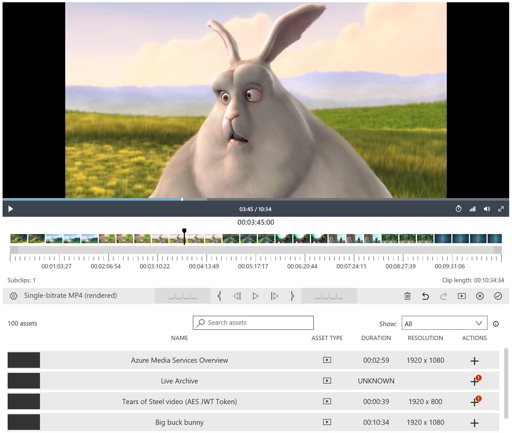

---
# Mandatory fields. See more on aka.ms/skyeye/meta.
title: Create clips with Azure Media Clipper | Microsoft Docs 
description: Overview of Azure Media Clipper, a tool for building media clips from assets
services: media-services
keywords: clip;subclip;encoding;media
author: dbgeorge
manager: jasonsue
ms.author: dwgeo
ms.date: 03/14/2019
ms.topic: article
# Use only one of the following. Use ms.service for services, ms.prod for on premises. Remove the # before the relevant field.
ms.service: media-services
# product-name-from-white-list

# Optional fields. Don't forget to remove # if you need a field.
# ms.custom: can-be-multiple-comma-separated
# ms.devlang:devlang-from-white-list
# ms.suite: 
# ms.tgt_pltfrm:
# ms.reviewer:
# manager: MSFT-alias-manager-or-PM-counterpart
---

# Create clips with Azure Media Clipper 

Azure Media Clipper is a free JavaScript library that enables web developers to provide their users with an interface for creating media clips. This tool can be integrated into any web page and provides APIs for loading assets and submitting clipping jobs.

Azure Media Clipper enables you to:
- Trim the pre-slate and post-slate from live archives 
- Compose video highlights from AMS live events, live archives, or fMP4 VOD files 
- Concatenate videos from multiple sources 
- Produce summary clips from your AMS media assets 
- Clip videos with frame accuracy 
- Generate dynamic manifest filters over existing live and VOD assets with group-of-pictures (GOP) accuracy 
- Produce encoding jobs against the assets in your media services account

To request new features, provide ideas or feedback, submit to [UserVoice for Azure Media Services](https://aka.ms/amsvoice/). If you have and specific issues, questions or find any bugs, drop the Media Services team a line at amcinfo@microsoft.com.

The following image illustrates the Clipper interface:

## Release notes
See the following list for the Clipper blog post, various known issues, and changelog for the latest release of the Clipper:
- [Blog post](https://azure.microsoft.com/blog/azure-media-clipper/)
- [Known issues list](https://amp.azure.net/libs/amc/latest/docs/known_issues.html)
- [Changelog](https://amp.azure.net/libs/amc/latest/docs/changelog.html)

## Browser support
Azure Media Clipper is built using modern HTML5 technologies and supports the following browsers:

- Microsoft Edge 13+
- Internet Explorer 11+
- Chrome 54+
- Safari 10+
- Firefox 50+

> [!NOTE]
> Only HTML5 playback of streams from Azure Media Services is currently supported.

## Language support
The Clipper widget is available in the following 18 languages:
- Chinese (Simplified)
- Chinese (Traditional)
- Czech
- Dutch, Flemish
- English
- French
- German
- Hungarian
- Italian
- Japanese
- Korean
- Polish
- Portuguese (Brazil)
- Portuguese (Portugal)
- Russian
- Spanish
- Swedish
- Turkish

## Next steps
To get started using Azure Media Clipper, read the [getting started](media-services-azure-media-clipper-getting-started.md) article for details on how to deploy the widget.
