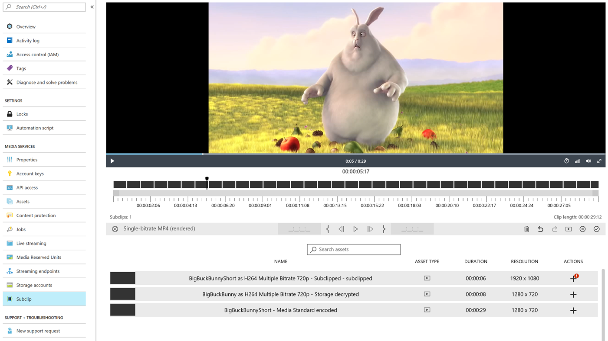
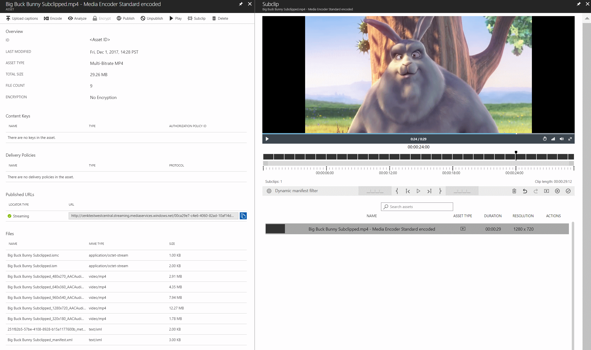

---
# Mandatory fields. See more on aka.ms/skyeye/meta.
title: Use Azure Media Clipper in the Portal | Microsoft Docs 
description: Create clips using Azure Media Clipper from the Azure Portal
services: media-services
keywords: clip;subclip;encoding;media
author: dbgeorge
manager: jasonsue
ms.author: dwgeo
ms.date: 03/14/2019
ms.topic: article
# Use only one of the following. Use ms.service for services, ms.prod for on premises. Remove the # before the relevant field.
ms.service: media-services
# product-name-from-white-list

# Optional fields. Don't forget to remove # if you need a field.
# ms.custom: can-be-multiple-comma-separated
# ms.devlang:devlang-from-white-list
# ms.suite: 
# ms.tgt_pltfrm:
# ms.reviewer:
# manager: MSFT-alias-manager-or-PM-counterpart
---

# Create clips with Azure Media Clipper in the portal  

You can use Azure Media Clipper in the portal to create clips from assets in your media services accounts. To get started, navigate to your media services account in the portal. Next, select the **Subclip** tab.

On the **Subclip** tab, you're able to begin composing clips. In the portal, the Clipper loads single-bitrate MP4s, multi-bitrate MP4s, and live archives that are published with a valid streaming locator. Unpublished assets are not loaded.

The Clipper is currently in public preview. To access the Clipper in the Azure portal, go to this [public preview page](https://portal.azure.com/?feature.subclipper=true).

The following image illustrates the Clipper landing page in your media services account:

## Producing clips
To create a clip, drag and drop an asset onto the clip interface. If the mark-times are known, you can manually enter them into the interface. Otherwise, playback the asset or drag the playhead to find the desired mark-in and mark-out time. If a mark-in or mark-out time is not provided, the clip starts from the beginning or continues to the end of the input asset, respectively.

To navigate with frame-accuracy/GOP-accuracy, use the frame-forward/GOP-forward or frame-backward/GOP-backward buttons. For clipping against multiple assets, drag and drop multiple assets into the clip interface from the asset selection panel. You can select and reorder assets in the interface to the desired order. The asset selection panel provides asset duration, type, and resolution metadata for each asset. When concatenating multiple assets together, consider the source resolution of each input file. If the source resolutions differ, lower resolution input is upscaled to meet the resolution of the highest resolution asset. To preview the output of the clipping job, select the preview button and the clip plays from the selected mark times.

## Producing dynamic manifest filters
[Dynamic manifest filters](https://azure.microsoft.com/blog/dynamic-manifest/) describe a set of rules based on manifest attributes and asset timeline. These rules determine how your streaming endpoint manipulates the output playlist (manifest). The filter can be used to change which segments are streamed for playback. The filters produced by the Clipper are local filters and are specific to the source asset. Unlike rendered clips, filters are not new assets and do not require an encoding job to produce. They can be quickly created via the [.NET SDK](https://docs.microsoft.com/azure/media-services/media-services-dotnet-dynamic-manifest) or [REST API](https://docs.microsoft.com/azure/media-services/media-services-rest-dynamic-manifest), however, they are only GOP-accurate. Typically, assets encoded for streaming have a GOP size of two seconds.

To create a dynamic manifest filter, navigate to the **Assets** tab and select the desired asset. Select the **Subclip** button for the top menu. Select dynamic manifest filter as the clipping mode from the advanced settings menu. You can then follow the same process to produce a rendered clip to create the filter. Filters can only be produced from a single asset.

The following image illustrates the Clipper in dynamic manifest filter mode in the Azure portal:

## Submitting clipping jobs
When you are finished composing the clip, select the submit job button for initiate the corresponding clipping job or dynamic manifest call.

## Next steps
To get started using Azure Media Clipper, read the [getting started](media-services-azure-media-clipper-getting-started.md) article for details on how to deploy the widget.
