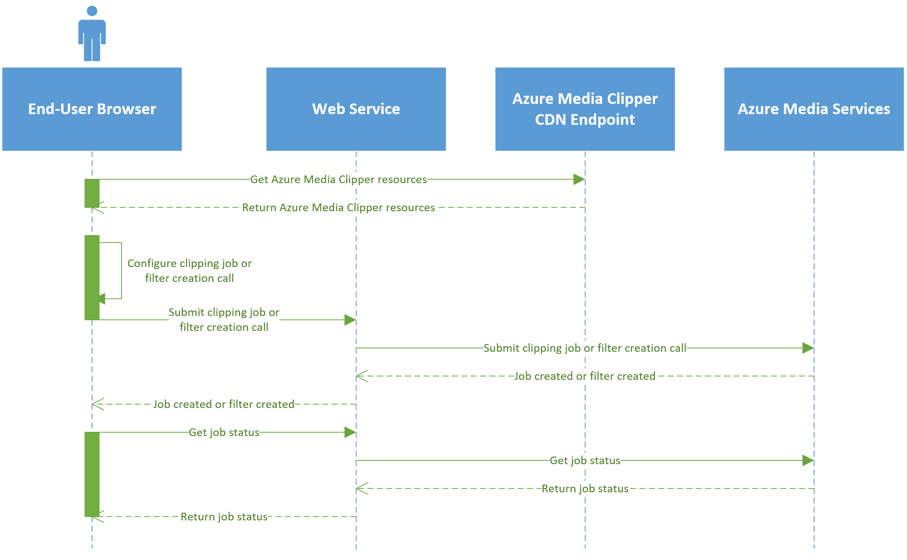

---
# Mandatory fields. See more on aka.ms/skyeye/meta.
title: Submit Azure Media Clipper clipping jobs | Microsoft Docs 
description: Steps for submitting clipping jobs from Azure Media Clipper
services: media-services
keywords: clip;subclip;encoding;media
author: dbgeorge
manager: jasonsue
ms.author: dwgeo
ms.date: 03/14/2019
ms.topic: article
# Use only one of the following. Use ms.service for services, ms.prod for on premises. Remove the # before the relevant field.
ms.service: media-services
# product-name-from-white-list

# Optional fields. Don't forget to remove # if you need a field.
# ms.custom: can-be-multiple-comma-separated
# ms.devlang:devlang-from-white-list
# ms.suite: 
# ms.tgt_pltfrm:
# ms.reviewer:
# manager: MSFT-alias-manager-or-PM-counterpart
---

# Submit clipping jobs from Azure Media Clipper 

Azure Media Clipper requires a **submitSubclipCallback** method to be implemented for handling clipping job submission. This function is for implementing an HTTP POST of the Clipper output to a web service. This web service is where you can submit the encoding job. The output of the Clipper is either a Media Encoder Standard encoding preset for rendered jobs or the REST API payload for dynamic manifest filter calls. This pass-through model is necessary because media services account credentials are not secure in the client's browser.

The following sequence diagram illustrates the workflow between the browser client, your web service, and Azure Media Services:


In the preceding diagram, the four entities are: the end user's browser, your web service, the CDN endpoint hosting the Clipper resources, and Azure Media Services. When the end user navigates to your web page, the page gets the Clipper JavaScript and CSS resources from the hosting CDN endpoint. The end user configures the clipping job or dynamic manifest filter creation call from their browser. When the end user submits the job or filter creation call, the browser puts the job payload to a web service that you must deploy. This web service ultimately submits the clipping job or filter creation call to Azure Media Services using your media services account credentials.

The following code sample illustrates a sample **submitSubclipCallback** method. In this method, you implement the HTTP POST of the Media Encoder Standard encoding preset. If the POST was successful (**result**), the **Promise** is resolved, otherwise, it is rejected with error details.

```javascript
// Submit Subclip Callback
//
// Parameter:
// - subclip: object that represents the subclip (output contract).
//
// Returns: a Promise object that, when resolved, returns true if the operation was accept in the back-end; otherwise, returns false.
var onSubmitSubclip = function (subclip) {
    var promise = new Promise(function (resolve, reject) {
        // TODO: perform the back-end AJAX request to submit the subclip job.
        var result = true;

        if (/* everything turned out fine */ result) {
            resolve(result);
        }
        else {
            reject(Error("error details"));
        }
    });

    return promise;
};

var subclipper = new subclipper({
    selector: '#root',
    restVersion: '2.0',
    submitSubclipCallback: onSubmitSubclip,
});
```
The output of the job submission is either the Media Encoder Standard encoding preset for rendered job or the REST API payload for dynamic manifest filters.

## Submitting encoding job to create video
You can submit a Media Encoder Standard encoding job to create a frame-accurate video clip. Encoding job produce rendered videos, a new fragmented MP4 file.

The job output contract for rendered clipping is a JSON object with the following properties:

```json
{
  /* Required */
  "name": "My New Subclip Output Name",

  /* Required: string specifying the format of the Json file.
   */
  /* NOTE: The REST API version, currently 2.0 is supported
   */
  "restVersion": "2.0"

  /* Required: array containing all the input Ids (both "asset" or "filter" type) used in the subclipper timeline;
  it must contain at least one item. */
  /* NOTE: when "output"."type" === "job", all items must match the "inputsIds"[i]."type" === "asset" condition;
  this array can be used in the back-end to get the input assets for the subclipping job with the Media Encoder Standard (MES) processor. */
  /* NOTE: when "output"."type" === "filter", there must be a single item in the array ("inputsIds".length === 1)
  that can be used in the back-end to get the source for the dynamic manifest filter (create or update). */
  "inputsIds": [{
    /* Required */
    "id": "my-asset-id-1",

    /* Required: must be one of the following values: "asset" or "filter" */
    "type": "asset"
  }, {
    /* Required */
    "id": "my-asset-id-2",

    /* Required: must be one of the following values: "asset" or "filter" */
    "type": "asset"
  }],

  /* Required */
  "output": {

    /* Required: must be one of the following values: "job" or "filter" */
    "type": "job",

    /* Required if "type" === "job" */
    /* NOTE: This is the preset for the Media Encoder Standard (MES) processor that can be used in the back-end to submit the subclip job.
    The encoding profile ("Codecs" property) depends on the "singleBitrateMp4Profile" and "multiBitrateMp4Profile" option parameters
    specified when creating the widget instance. */
    /* REFERENCE: https://docs.microsoft.com/azure/media-services/media-services-advanced-encoding-with-mes */
    "job": {
      "Version": 1.0,
      "Codecs": [{
          "KeyFrameInterval": "00:00:02",
          "SceneChangeDetection": true,
          "H264Layers": [{
            "Profile": "Auto",
            "Level": "auto",
            "Bitrate": 6750,
            "MaxBitrate": 6750,
            "BufferWindow": "00:00:05",
            "Width": 1920,
            "Height": 1080,
            "BFrames": 3,
            "ReferenceFrames": 3,
            "AdaptiveBFrame": true,
            "Type": "H264Layer",
            "FrameRate": "0/1"
          }],
          "Type": "H264Video"
        },
        {
          "Profile": "AACLC",
          "Channels": 2,
          "SamplingRate": 48000,
          "Bitrate": 128,
          "Type": "AACAudio"
        }
      ],
      "Outputs": [{
        "FileName": "{Basename}_{Width}x{Height}_{VideoBitrate}.mp4",
        "Format": {
          "Type": "MP4Format"
        }
      }],
      "Sources": [{
        "AssetId": "my-asset-id-1",
        "StartTime": "0.00:01:15.000",
        "Duration": "0.00:00:25.000"
      }, {
        "AssetId": "my-asset-id-2",
        "StartTime": "0.00:20:04.000",
        "Duration": "0.00:33:07.500"
      }]
    }
  }
}
```

To perform the encoding job, submit the Media Encoder Standard encoding job with the associated preset. See this article for details on submitting encoding jobs using the [.NET SDK](https://docs.microsoft.com/azure/media-services/media-services-dotnet-encode-with-media-encoder-standard) or [REST API](https://docs.microsoft.com/azure/media-services/media-services-rest-encode-asset).

## Quickly creating video clips without encoding
Alternative to creating an encoding job, you can use Azure Media Clipper to create dynamic manifest filters. Filters do not require encoding and can be created quickly as a new asset is not created. The output contract for a filter clipping is a JSON object with the following properties:

```json
{
  /* Required: Filter name (Alphanumeric characters and hyphens only, no whitespace) */
  "name": "FilterName",

  /* Required: string specifying the format of the Json file.
   */
  /* NOTE: This subclipper version always returns '2.0' in this field.
   */
  "restVersion": "2.0"

  /* Required: array containing all the input Ids (both "asset" or "filter" type) used in the subclipper timeline;
  it must contain at least one item. */
  /* NOTE: when "output"."type" === "job", all items must match the "inputsIds"[i]."type" === "asset" condition;
  this array can be used in the back-end to get the input assets for the subclipping job with the Media Encoder Standard (MES) processor. */
  /* NOTE: when "output"."type" === "filter", there must be a single item in the array ("inputsIds".length === 1)
  that can be used in the back-end to get the source for the dynamic manifest filter (create or update). */
  "inputsIds": [{
    /* Required */
    "id": "my-asset-id",

    /* Required: must be one of the following values: "asset" or "filter" */
    "type": "asset"
  }],

  /* Required */
  "output": {

    /* Required: must be one of the following values: "job" or "filter" */
    "type": "filter",

    /* Required if "type" === "filter" */
    /* REFERENCE: https://docs.microsoft.com/rest/api/media/operations/assetfilter */
    "filter": {
      "PresentationTimeRange": {
        "StartTimestamp": "340000000",
        "EndTimestamp": "580000000",
        "Timescale": "10000000"
      },
      "Tracks": [{
        "PropertyConditions": [{
          "Property": "Type",
          "Value": "video",
          "Operator": "Equal"
        }]
      }, {
        "PropertyConditions": [{
          "Property": "Type",
          "Value": "audio",
          "Operator": "Equal"
        }, {
          "Property": "Name",
          "Value": "audio-track-1",
          "Operator": "Equal"
        }]
      }, {
        "PropertyConditions": [{
          "Property": "Type",
          "Value": "text",
          "Operator": "Equal"
        }, {
          "Property": "Language",
          "Value": "en",
          "Operator": "Equal"
        }]
      }]
    }
  }
}
```

To submit the REST call to create dynamic manifest filter, submit the associated filter payload using the [REST API](https://docs.microsoft.com/azure/media-services/media-services-rest-dynamic-manifest).
