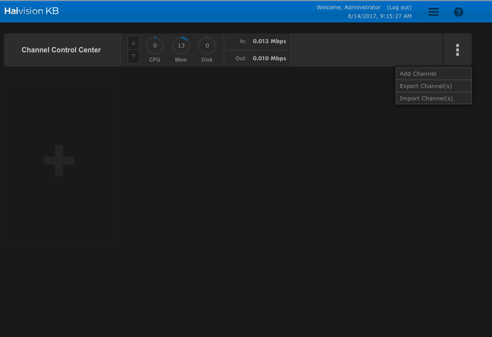
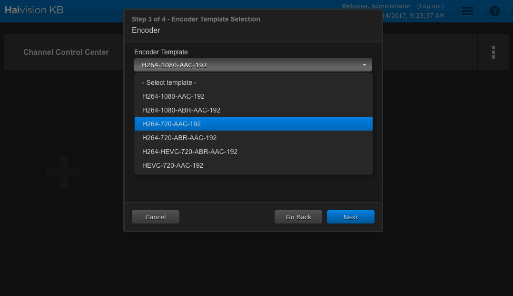
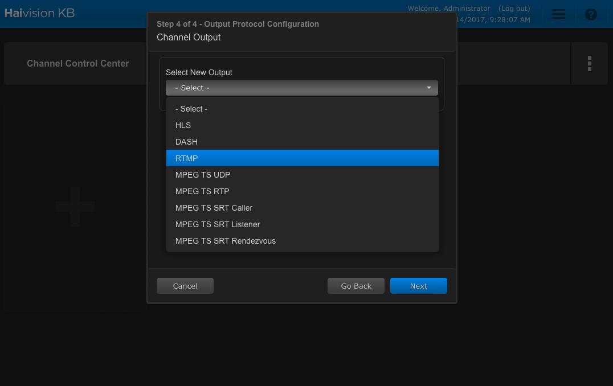
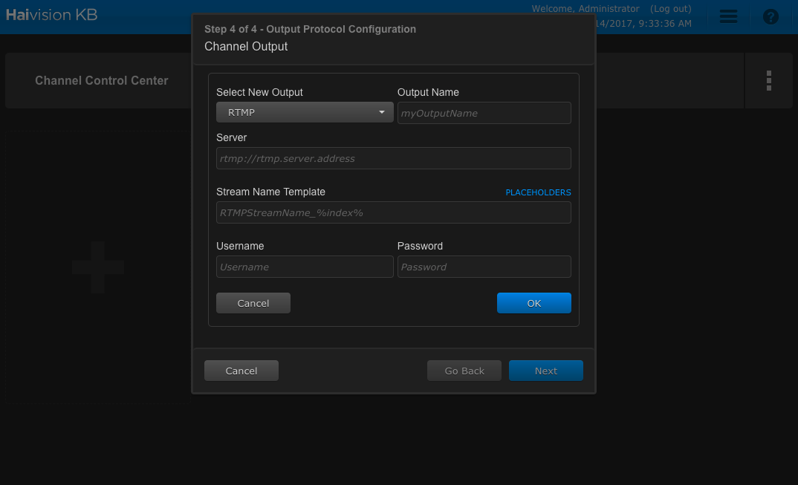
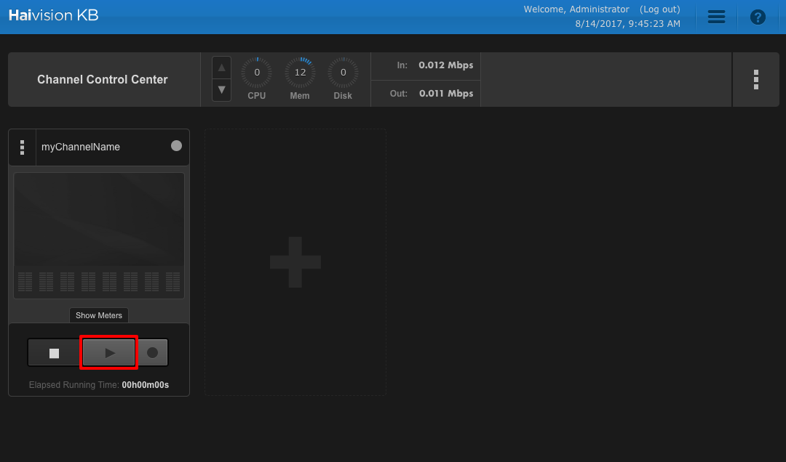

# Use the Haivision KB live encoder to send a single bitrate live stream  
> [!div class="op_single_selector"]
> * [Haivision](media-services-configure-kb-live-encoder.md)
> * [Wirecast](media-services-configure-wirecast-live-encoder.md)

This topic shows how to configure the [Havision KB live encoder](https://www.haivision.com/products/kb-series/) encoder to send a single bitrate stream to AMS channels that are enabled for live encoding. For more information, see [Working with Channels that are Enabled to Perform Live Encoding with Azure Media Services](media-services-manage-live-encoder-enabled-channels.md).

This tutorial shows how to manage Azure Media Services (AMS) with Azure Media Services Explorer (AMSE) tool. This tool only runs on Windows PC. If you are on Mac or Linux, use the Azure portal to create [channels](media-services-portal-creating-live-encoder-enabled-channel.md#create-a-channel) and [programs](media-services-portal-creating-live-encoder-enabled-channel.md).

## Prerequisites
*   Access to a Haivision KB encoder, running SW v5.01, or greater.
* [Create an Azure Media Services account](media-services-portal-create-account.md)
* Ensure there is a Streaming Endpoint running. For more information, see [Manage Streaming Endpoints in a Media Services Account](media-services-portal-manage-streaming-endpoints.md)
* Install the latest version of the [AMSE](https://github.com/Azure/Azure-Media-Services-Explorer) tool.
* Launch the tool and connect to your AMS account.

## Tips
* Whenever possible, use a hardwired internet connection.
* A good rule of thumb when determining bandwidth requirements is to double the streaming bitrates. While this is not a mandatory requirement, it helps mitigate the impact of network congestion.
* When using software-based encoders, close out any unnecessary programs.

## Create a channel
1. In the AMSE tool, navigate to the **Live** tab, and right-click within the channel area. Select **Create channel…** from the menu.
[Haivision](./media/media-services-configure-kb-live-encoder/channel.png)
2. Specify a channel name, the description field is optional. Under Channel Settings, select **Standard** for the Live Encoding option, with the Input Protocol set to **RTMP**. You can leave all other settings as is. Make sure the **Start the new channel now** is selected.
3. Click **Create Channel**.
[Haivision](./media/media-services-configure-kb-live-encoder/livechannel.png)

> [!NOTE]
> The channel can take as long as 20 minutes to start.

## Configure the Haivision KB encoder
In this tutorial, the following output settings are used. The rest of this section describes configuration steps in more detail.

Video:
-   Codec: H.264
-   Profile: High (Level 4.0)
-   Bitrate: 5000 kbps
-   Keyframe: 2 seconds (60 frames)
-   Frame Rate: 30

Audio:
-   Codec: AAC (LC)
-   Bitrate: 192 kbps
-   Sample Rate: 44.1 kHz

## Configuration steps
1.  Log in to the Haivision KB user interface.
2.  Click on the **Menu Button** in the channel control center and select **Add Channel**  
    
3.  Type the **Channel Name** in the Name field and click next.  
    
4.  Select the **Channel Input Source** from the **Input Source** drop-down and click next.
    
5.  From the **Encoder Template** drop-down choose **H264-720-AAC-192** and click next.
    
6.  From the **Select New Output** drop-down choose **RTMP** and click next.  
    
7.  From the **Channel Output** window, populate the Azure stream information. Paste the **RTMP** link from the initial channel setup in the **Server** area. In the **Output Name** area type in the name of the channel. In the Stream Name Template area, use the template RTMPStreamName_%video_bitrate% to name the stream.
    
8.  Click next and then click Done.
9.  Click the **Play Button** to start the encoder channel.  
    

## Test playback
Navigate to the AMSE tool, and right-click the channel to be tested. From the menu, hover over Playback the Preview and select with Azure Media Player.

If the stream appears in the player, then the encoder has been properly configured to connect to AMS.

If an error is received, the channel needs to be reset and encoder settings adjusted. See the troubleshooting article for guidance.

## Create a program
1.  Once channel playback is confirmed, create a program. Under the Live tab in the AMSE tool, right-click within the program area and select Create New Program.
[Haivision](./media/media-services-configure-kb-live-encoder/program.png)
1.  Name the program and, if needed, adjust the Archive Window Length (which defaults to four hours). You can also specify a storage location or leave as the default.
2.  Check the Start the Program now box.
3.  Click Create Program.
4.  Once the program is running, confirm playback by right-clicking the program and navigating to Play back the program(s) and then selecting with Azure Media Player.
5.  Once confirmed, right-click the program again and select Copy the Output URL to Clipboard (or retrieve this information from the Program information and settings option from the menu).

The stream is now ready to be embedded in a player, or distributed to an audience for live viewing.

> [!NOTE]
> Program creation takes less time than channel creation.
