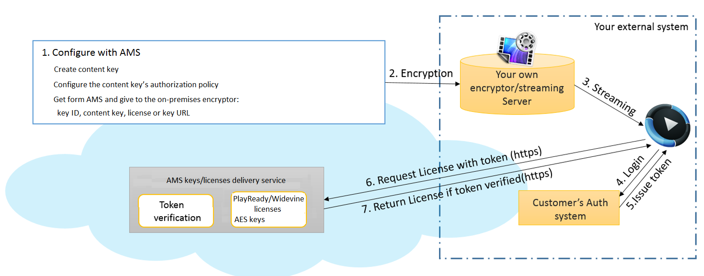

# Use Azure Media Services to deliver DRM licenses or AES keys

Azure Media Services enables you to ingest, encode, add content protection, and stream your content. For more information, see [Use PlayReady and/or Widevine dynamic common encryption](media-services-protect-with-playready-widevine.md). Some customers want to use Media Services only to deliver licenses and/or keys and encode, encrypt, and stream by using their on-premises servers. This article describes how you can use Media Services to deliver PlayReady and/or Widevine licenses but do the rest with your on-premises servers. 

## Overview
Media Services provides a service for delivering PlayReady and Widevine digital rights management (DRM) licenses and AES-128 keys. Media Services also provides APIs that let you configure the rights and restrictions that you want for the DRM runtime to enforce when a user plays back the DRM-protected content. When a user requests the protected content, the player application requests a license from the Media Services license service. If the license is authorized, the Media Services license service issues the license to the player. The PlayReady and Widevine licenses contain the decryption key that can be used by the client player to decrypt and stream the content.

Media Services supports multiple ways of authorizing users who make license or key requests. You configure the content key's authorization policy. The policy can have one or more restrictions. The options are open or token restriction. The token-restricted policy must be accompanied by a token issued by a security token service (STS). Media Services supports tokens in the simple web token (SWT) format and the JSON Web Token (JWT) format.

The following diagram shows the main steps you need to take to use Media Services to deliver PlayReady and/or Widevine licenses but do the rest with your on-premises servers:



## Download sample
To download the sample described in this article, see [Use Azure Media Services to deliver PlayReady and/or Widevine licenses with .NET](https://github.com/Azure/media-services-dotnet-deliver-drm-licenses).

## Create and configure a Visual Studio project

1. Set up your development environment, and populate the app.config file with connection information, as described in [Media Services development with .NET](media-services-dotnet-how-to-use.md).

2. Add the following elements to **appSettings** defined in your app.config file:

    ```xml
    <add key="Issuer" value="http://testissuer.com"/>
    <add key="Audience" value="urn:test"/>
    ```
 
## .NET code example
The following code example shows how to create a common content key and get PlayReady or Widevine license acquisition URLs. To configure your on-premises server, you need a content key, the key ID, and the license acquisition URL. After you configure your on-premises server, you can stream from your own streaming server. Because the encrypted stream points to a Media Services license server, your player requests a license from Media Services. If you choose token authentication, the Media Services license server validates the token you sent through HTTPS. If the token is valid, the license server delivers the license back to your player. The following code example only shows how to create a common content key and get PlayReady or Widevine license acquisition URLs. If you want to deliver AES-128 keys, you need to create an envelope content key and get a key acquisition URL. For more information, see [Use AES-128 dynamic encryption and key delivery service](media-services-protect-with-aes128.md).

```csharp
using System;
using System.Collections.Generic;
using System.Configuration;
using Microsoft.WindowsAzure.MediaServices.Client;
using Microsoft.WindowsAzure.MediaServices.Client.ContentKeyAuthorization;
using Microsoft.WindowsAzure.MediaServices.Client.Widevine;
using Newtonsoft.Json;

namespace DeliverDRMLicenses
{
    class Program
    {
        // Read values from the App.config file.
        private static readonly string _AADTenantDomain =
            ConfigurationManager.AppSettings["AMSAADTenantDomain"];
        private static readonly string _RESTAPIEndpoint =
            ConfigurationManager.AppSettings["AMSRESTAPIEndpoint"];
        private static readonly string _AMSClientId =
            ConfigurationManager.AppSettings["AMSClientId"];
        private static readonly string _AMSClientSecret =
            ConfigurationManager.AppSettings["AMSClientSecret"];

        private static readonly Uri _sampleIssuer =
            new Uri(ConfigurationManager.AppSettings["Issuer"]);
        private static readonly Uri _sampleAudience =
            new Uri(ConfigurationManager.AppSettings["Audience"]);

        // Field for service context.
        private static CloudMediaContext _context = null;

        static void Main(string[] args)
        {
            AzureAdTokenCredentials tokenCredentials =
                new AzureAdTokenCredentials(_AADTenantDomain,
                    new AzureAdClientSymmetricKey(_AMSClientId, _AMSClientSecret),
                    AzureEnvironments.AzureCloudEnvironment);

            var tokenProvider = new AzureAdTokenProvider(tokenCredentials);

            _context = new CloudMediaContext(new Uri(_RESTAPIEndpoint), tokenProvider);

            bool tokenRestriction = true;
            string tokenTemplateString = null;


            IContentKey key = CreateCommonTypeContentKey();

            // Print out the key ID and Key in base64 string format
            Console.WriteLine("Created key {0} with key value {1} ",
                key.Id, System.Convert.ToBase64String(key.GetClearKeyValue()));

            Console.WriteLine("PlayReady License Key delivery URL: {0}",
                key.GetKeyDeliveryUrl(ContentKeyDeliveryType.PlayReadyLicense));

            Console.WriteLine("Widevine License Key delivery URL: {0}",
                key.GetKeyDeliveryUrl(ContentKeyDeliveryType.Widevine));

            if (tokenRestriction)
                tokenTemplateString = AddTokenRestrictedAuthorizationPolicy(key);
            else
                AddOpenAuthorizationPolicy(key);

            Console.WriteLine("Added authorization policy: {0}",
                key.AuthorizationPolicyId);
            Console.WriteLine();
            Console.ReadLine();
        }

        static public void AddOpenAuthorizationPolicy(IContentKey contentKey)
        {

            // Create ContentKeyAuthorizationPolicy with Open restrictions 
            // and create authorization policy          

            List<ContentKeyAuthorizationPolicyRestriction> restrictions =
                new List<ContentKeyAuthorizationPolicyRestriction>
            {
                        new ContentKeyAuthorizationPolicyRestriction
                        {
                            Name = "Open",
                            KeyRestrictionType = (int)ContentKeyRestrictionType.Open,
                            Requirements = null
                        }
            };

            // Configure PlayReady and Widevine license templates.
            string PlayReadyLicenseTemplate = ConfigurePlayReadyLicenseTemplate();

            string WidevineLicenseTemplate = ConfigureWidevineLicenseTemplate();

            IContentKeyAuthorizationPolicyOption PlayReadyPolicy =
                _context.ContentKeyAuthorizationPolicyOptions.Create("",
                    ContentKeyDeliveryType.PlayReadyLicense,
                        restrictions, PlayReadyLicenseTemplate);

            IContentKeyAuthorizationPolicyOption WidevinePolicy =
                _context.ContentKeyAuthorizationPolicyOptions.Create("",
                    ContentKeyDeliveryType.Widevine,
                    restrictions, WidevineLicenseTemplate);

            IContentKeyAuthorizationPolicy contentKeyAuthorizationPolicy = _context.
                        ContentKeyAuthorizationPolicies.
                        CreateAsync("Deliver Common Content Key with no restrictions").
                        Result;


            contentKeyAuthorizationPolicy.Options.Add(PlayReadyPolicy);
            contentKeyAuthorizationPolicy.Options.Add(WidevinePolicy);
            // Associate the content key authorization policy with the content key.
            contentKey.AuthorizationPolicyId = contentKeyAuthorizationPolicy.Id;
            contentKey = contentKey.UpdateAsync().Result;
        }

        public static string AddTokenRestrictedAuthorizationPolicy(IContentKey contentKey)
        {
            string tokenTemplateString = GenerateTokenRequirements();

            List<ContentKeyAuthorizationPolicyRestriction> restrictions =
                new List<ContentKeyAuthorizationPolicyRestriction>
            {
                        new ContentKeyAuthorizationPolicyRestriction
                        {
                            Name = "Token Authorization Policy",
                            KeyRestrictionType = (int)ContentKeyRestrictionType.TokenRestricted,
                            Requirements = tokenTemplateString,
                        }
            };

            // Configure PlayReady and Widevine license templates.
            string PlayReadyLicenseTemplate = ConfigurePlayReadyLicenseTemplate();

            string WidevineLicenseTemplate = ConfigureWidevineLicenseTemplate();

            IContentKeyAuthorizationPolicyOption PlayReadyPolicy =
                _context.ContentKeyAuthorizationPolicyOptions.Create("Token option",
                    ContentKeyDeliveryType.PlayReadyLicense,
                        restrictions, PlayReadyLicenseTemplate);

            IContentKeyAuthorizationPolicyOption WidevinePolicy =
                _context.ContentKeyAuthorizationPolicyOptions.Create("Token option",
                    ContentKeyDeliveryType.Widevine,
                        restrictions, WidevineLicenseTemplate);

            IContentKeyAuthorizationPolicy contentKeyAuthorizationPolicy = _context.
                        ContentKeyAuthorizationPolicies.
                        CreateAsync("Deliver Common Content Key with token restrictions").
                        Result;

            contentKeyAuthorizationPolicy.Options.Add(PlayReadyPolicy);
            contentKeyAuthorizationPolicy.Options.Add(WidevinePolicy);

            // Associate the content key authorization policy with the content key
            contentKey.AuthorizationPolicyId = contentKeyAuthorizationPolicy.Id;
            contentKey = contentKey.UpdateAsync().Result;

            return tokenTemplateString;
        }

        static private string GenerateTokenRequirements()
        {
            TokenRestrictionTemplate template = new TokenRestrictionTemplate(TokenType.SWT);

            template.PrimaryVerificationKey = new SymmetricVerificationKey();
            template.AlternateVerificationKeys.Add(new SymmetricVerificationKey());
            template.Audience = _sampleAudience.ToString();
            template.Issuer = _sampleIssuer.ToString();
            template.RequiredClaims.Add(TokenClaim.ContentKeyIdentifierClaim);

            return TokenRestrictionTemplateSerializer.Serialize(template);
        }

        static private string ConfigurePlayReadyLicenseTemplate()
        {
            // The following code configures PlayReady License Template using .NET classes
            // and returns the XML string.

            //The PlayReadyLicenseResponseTemplate class represents the template 
            //for the response sent back to the end user. 
            //It contains a field for a custom data string between the license server 
            //and the application (may be useful for custom app logic) 
            //as well as a list of one or more license templates.

            PlayReadyLicenseResponseTemplate responseTemplate =
                new PlayReadyLicenseResponseTemplate();

            // The PlayReadyLicenseTemplate class represents a license template 
            // for creating PlayReady licenses
            // to be returned to the end users. 
            // It contains the data on the content key in the license 
            // and any rights or restrictions to be 
            // enforced by the PlayReady DRM runtime when using the content key.
            PlayReadyLicenseTemplate licenseTemplate = new PlayReadyLicenseTemplate();

            // Configure whether the license is persistent 
            // (saved in persistent storage on the client) 
            // or non-persistent (only held in memory while the player is using the license).  
            licenseTemplate.LicenseType = PlayReadyLicenseType.Nonpersistent;

            // AllowTestDevices controls whether test devices can use the license or not.  
            // If true, the MinimumSecurityLevel property of the license
            // is set to 150.  If false (the default), 
            // the MinimumSecurityLevel property of the license is set to 2000.
            licenseTemplate.AllowTestDevices = true;

            // You can also configure the Play Right in the PlayReady license by using the PlayReadyPlayRight class. 
            // It grants the user the ability to play back the content subject to the zero or more restrictions 
            // configured in the license and on the PlayRight itself (for playback specific policy). 
            // Much of the policy on the PlayRight has to do with output restrictions 
            // which control the types of outputs that the content can be played over and 
            // any restrictions that must be put in place when using a given output.
            // For example, if the DigitalVideoOnlyContentRestriction is enabled, 
            //then the DRM runtime will only allow the video to be displayed over digital outputs 
            //(analog video outputs won’t be allowed to pass the content).

            // IMPORTANT: These types of restrictions can be very powerful 
            // but can also affect the consumer experience. 
            // If the output protections are configured too restrictive, 
            // the content might be unplayable on some clients. 
            // For more information, see the PlayReady Compliance Rules document.

            // For example:
            //licenseTemplate.PlayRight.AgcAndColorStripeRestriction = new AgcAndColorStripeRestriction(1);

            responseTemplate.LicenseTemplates.Add(licenseTemplate);

            return MediaServicesLicenseTemplateSerializer.Serialize(responseTemplate);
        }


        private static string ConfigureWidevineLicenseTemplate()
        {
            var template = new WidevineMessage
            {
                allowed_track_types = AllowedTrackTypes.SD_HD,
                content_key_specs = new[]
                {
                            new ContentKeySpecs
                            {
                                required_output_protection =
                                    new RequiredOutputProtection { hdcp = Hdcp.HDCP_NONE},
                                security_level = 1,
                                track_type = "SD"
                            }
                        },
                policy_overrides = new
                {
                    can_play = true,
                    can_persist = true,
                    can_renew = false
                }
            };

            string configuration = JsonConvert.SerializeObject(template);
            return configuration;
        }


        static public IContentKey CreateCommonTypeContentKey()
        {
            // Create envelope encryption content key
            Guid keyId = Guid.NewGuid();
            byte[] contentKey = GetRandomBuffer(16);

            IContentKey key = _context.ContentKeys.Create(
                                    keyId,
                                    contentKey,
                                    "ContentKey",
                                    ContentKeyType.CommonEncryption);

            return key;
        }

        static private byte[] GetRandomBuffer(int length)
        {
            var returnValue = new byte[length];

            using (var rng =
                new System.Security.Cryptography.RNGCryptoServiceProvider())
            {
                rng.GetBytes(returnValue);
            }

            return returnValue;
        }
    }
}
```

## Media Services learning paths
[!INCLUDE [media-services-learning-paths-include](../../../includes/media-services-learning-paths-include.md)]

## Provide feedback
[!INCLUDE [media-services-user-voice-include](../../../includes/media-services-user-voice-include.md)]

## See also
* [Use PlayReady and/or Widevine dynamic common encryption](media-services-protect-with-playready-widevine.md)
* [Use AES-128 dynamic encryption and the key delivery service](media-services-protect-with-aes128.md)
