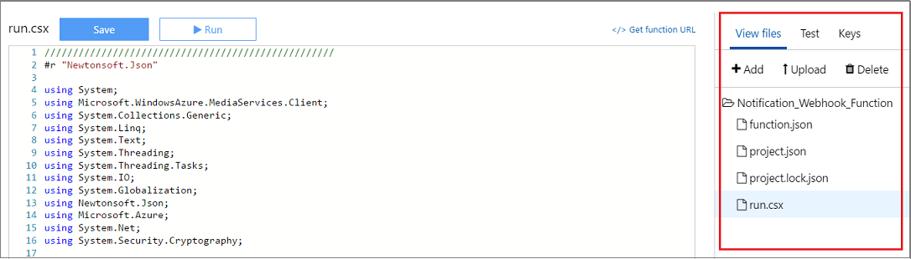

# Use Azure Webhooks to monitor Media Services job notifications with .NET 

> [!NOTE]
> No new features or functionality are being added to Media Services v2. <br/>Check out the latest version, [Media Services v3](https://docs.microsoft.com/azure/media-services/latest/). Also, see [migration guidance from v2 to v3](../latest/migrate-from-v2-to-v3.md)

When you run jobs, you often require a way to track job progress. You can monitor Media Services job notifications by using Azure Webhooks or [Azure Queue storage](media-services-dotnet-check-job-progress-with-queues.md). This article shows how to work with webhooks.

This article shows how to

*  Define an Azure Function that is customized to respond to webhooks. 
	
	In this case, the webhook is triggered by Media Services when your encoding job changes status. The function listens for the webhook call back from Media Services notifications and publishes the output asset once the job finishes. 
	
	>[!TIP]
	>Before continuing, make sure you understand how [Azure Functions HTTP and webhook bindings](../../azure-functions/functions-bindings-http-webhook.md) work.
	>
	
* Add a webhook to your encoding task and specify the webhook URL and secret key that this webhook responds to. You will find an example that adds a webhook to your encoding task at the end of the article.  

You can find definitions of various Media Services .NET Azure Functions (including the one shown in this article) [here](https://github.com/Azure-Samples/media-services-dotnet-functions-integration).

## Prerequisites

The following are required to complete the tutorial:

* An Azure account. For details, see [Azure Free Trial](https://azure.microsoft.com/pricing/free-trial/).
* A Media Services account. To create a Media Services account, see [How to Create a Media Services Account](media-services-portal-create-account.md).
* Understanding of [how to use Azure Functions](../../azure-functions/functions-overview.md). Also, review [Azure Functions HTTP and webhook bindings](../../azure-functions/functions-bindings-http-webhook.md).

## Create a function app

1. Go to the [Azure portal](https://portal.azure.com) and sign-in with your Azure account.
2. Create a function app as described [here](../../azure-functions/functions-create-function-app-portal.md).

## Configure function app settings

When developing Media Services functions, it is handy to add environment variables that will be used throughout your functions. To configure app settings, click the Configure App Settings link. 

The [application settings](media-services-dotnet-how-to-use-azure-functions.md#configure-function-app-settings) section defines parameters that are used in the webhook defined in this article. Also add the following parameters to the app settings. 

|Name|Definition|Example| 
|---|---|---|
|SigningKey |A signing key.| j0txf1f8msjytzvpe40nxbpxdcxtqcgxy0nt|
|WebHookEndpoint | A webhook endpoint address. Once your webhook function is created, you can copy the URL from the **Get function URL** link. | https:\//juliakofuncapp.azurewebsites.net/api/Notification_Webhook_Function?code=iN2phdrTnCxmvaKExFWOTulfnm4C71mMLIy8tzLr7Zvf6Z22HHIK5g==.|

## Create a function

Once your function app is deployed, you can find it among **App Services** Azure Functions.

1. Select your function app and click **New Function**.
2. Select **C#** code and **API & Webhooks** scenario. 
3. Select **Generic Webhook - C#**.
4. Name your webhook and press **Create**.

### Files

Your Azure Function is associated with code files and other files that are described in this section. By default, a function is associated with **function.json** and **run.csx** (C#) files. You need to add a **project.json** file. The rest of this section shows the definitions for these files.



#### function.json

The function.json file defines the function bindings and other configuration settings. The runtime uses this file to determine the events to monitor and how to pass data into and return data from function execution. 

```json
{
  "bindings": [
    {
      "type": "httpTrigger",
      "direction": "in",
      "webHookType": "genericJson",
      "name": "req"
    },
    {
      "type": "http",
      "direction": "out",
      "name": "res"
    }
  ],
  "disabled": false
}
```

#### project.json

The project.json file contains dependencies. 

```json
{
  "frameworks": {
    "net46":{
      "dependencies": {
        "windowsazure.mediaservices": "4.0.0.4",
        "windowsazure.mediaservices.extensions": "4.0.0.4",
        "Microsoft.IdentityModel.Clients.ActiveDirectory": "3.13.1",
        "Microsoft.IdentityModel.Protocol.Extensions": "1.0.2.206221351"
      }
    }
   }
}
```
	
#### run.csx

The code in this section shows an implementation of an Azure Function that is a webhook. In this sample, the function listens for the webhook call back from Media Services notifications and publishes the output asset once the job finishes.

The webhook expects a signing key (credential) to match the one you pass when you configure the notification endpoint. The signing key is the 64-byte Base64 encoded value that is used to protect and secure your WebHooks callbacks from Azure Media Services. 

In the webhook definition code that follows, the **VerifyWebHookRequestSignature** method does the verification of the notification message. The purpose of this validation is to ensure that the message was sent by Azure Media Services and hasn't been tampered with. The signature is optional for Azure Functions as it has the **Code** value as a query parameter over Transport Layer Security (TLS). 

>[!NOTE]
>There is a limit of 1,000,000 policies for different AMS policies (for example, for Locator policy or ContentKeyAuthorizationPolicy). You should use the same policy ID if you are always using the same days / access permissions, for example, policies for locators that are intended to remain in place for a long time (non-upload policies). For more information, see [this](media-services-dotnet-manage-entities.md#limit-access-policies) topic.

```csharp
///////////////////////////////////////////////////
#r "Newtonsoft.Json"

using System;
using Microsoft.WindowsAzure.MediaServices.Client;
using System.Collections.Generic;
using System.Linq;
using System.Text;
using System.Threading;
using System.Threading.Tasks;
using System.IO;
using System.Globalization;
using Newtonsoft.Json;
using Microsoft.Azure;
using System.Net;
using System.Security.Cryptography;
using Microsoft.Azure.WebJobs;
using Microsoft.IdentityModel.Clients.ActiveDirectory;

internal const string SignatureHeaderKey = "sha256";
internal const string SignatureHeaderValueTemplate = SignatureHeaderKey + "={0}";
static string _webHookEndpoint = Environment.GetEnvironmentVariable("WebHookEndpoint");
static string _signingKey = Environment.GetEnvironmentVariable("SigningKey");

static readonly string _AADTenantDomain = Environment.GetEnvironmentVariable("AMSAADTenantDomain");
static readonly string _RESTAPIEndpoint = Environment.GetEnvironmentVariable("AMSRESTAPIEndpoint");

static readonly string _AMSClientId = Environment.GetEnvironmentVariable("AMSClientId");
static readonly string _AMSClientSecret = Environment.GetEnvironmentVariable("AMSClientSecret");

static CloudMediaContext _context = null;

public static async Task<HttpResponseMessage> Run(HttpRequestMessage req, TraceWriter log)
{
    log.Info($"C# HTTP trigger function processed a request. RequestUri={req.RequestUri}");

    Task<byte[]> taskForRequestBody = req.Content.ReadAsByteArrayAsync();
    byte[] requestBody = await taskForRequestBody;

    string jsonContent = await req.Content.ReadAsStringAsync();
    log.Info($"Request Body = {jsonContent}");

    IEnumerable<string> values = null;
    if (req.Headers.TryGetValues("ms-signature", out values))
    {
        byte[] signingKey = Convert.FromBase64String(_signingKey);
        string signatureFromHeader = values.FirstOrDefault();

        if (VerifyWebHookRequestSignature(requestBody, signatureFromHeader, signingKey))
        {
            string requestMessageContents = Encoding.UTF8.GetString(requestBody);

            NotificationMessage msg = JsonConvert.DeserializeObject<NotificationMessage>(requestMessageContents);

            if (VerifyHeaders(req, msg, log))
            { 
                string newJobStateStr = (string)msg.Properties.Where(j => j.Key == "NewState").FirstOrDefault().Value;
                if (newJobStateStr == "Finished")
                {
                    AzureAdTokenCredentials tokenCredentials = new AzureAdTokenCredentials(_AADTenantDomain,
                                new AzureAdClientSymmetricKey(_AMSClientId, _AMSClientSecret),
                                AzureEnvironments.AzureCloudEnvironment);

                    AzureAdTokenProvider tokenProvider = new AzureAdTokenProvider(tokenCredentials);

                    _context = new CloudMediaContext(new Uri(_RESTAPIEndpoint), tokenProvider);

                    if(_context!=null)   
                    {                        
                        string urlForClientStreaming = PublishAndBuildStreamingURLs(msg.Properties["JobId"]);
                        log.Info($"URL to the manifest for client streaming using HLS protocol: {urlForClientStreaming}");
                    }
                }

                return req.CreateResponse(HttpStatusCode.OK, string.Empty);
            }
            else
            {
                log.Info($"VerifyHeaders failed.");
                return req.CreateResponse(HttpStatusCode.BadRequest, "VerifyHeaders failed.");
            }
        }
        else
        {
            log.Info($"VerifyWebHookRequestSignature failed.");
            return req.CreateResponse(HttpStatusCode.BadRequest, "VerifyWebHookRequestSignature failed.");
        }
    }

    return req.CreateResponse(HttpStatusCode.BadRequest, "Generic Error.");
}

private static string PublishAndBuildStreamingURLs(String jobID)
{
    IJob job = _context.Jobs.Where(j => j.Id == jobID).FirstOrDefault();
    IAsset asset = job.OutputMediaAssets.FirstOrDefault();

    // Create a 30-day readonly access policy. 
    // You cannot create a streaming locator using an AccessPolicy that includes write or delete permissions.
    IAccessPolicy policy = _context.AccessPolicies.Create("Streaming policy",
    TimeSpan.FromDays(30),
    AccessPermissions.Read);

    // Create a locator to the streaming content on an origin. 
    ILocator originLocator = _context.Locators.CreateLocator(LocatorType.OnDemandOrigin, asset,
    policy,
    DateTime.UtcNow.AddMinutes(-5));

    // Get a reference to the streaming manifest file from the  
    // collection of files in the asset. 
    var manifestFile = asset.AssetFiles.ToList().Where(f => f.Name.ToLower().
                EndsWith(".ism")).
                FirstOrDefault();

    // Create a full URL to the manifest file. Use this for playback
    // in streaming media clients. 
    string urlForClientStreaming = originLocator.Path + manifestFile.Name + "/manifest" +  "(format=m3u8-aapl)";
    return urlForClientStreaming;

}

private static bool VerifyWebHookRequestSignature(byte[] data, string actualValue, byte[] verificationKey)
{
    using (var hasher = new HMACSHA256(verificationKey))
    {
        byte[] sha256 = hasher.ComputeHash(data);
        string expectedValue = string.Format(CultureInfo.InvariantCulture, SignatureHeaderValueTemplate, ToHex(sha256));

        return (0 == String.Compare(actualValue, expectedValue, System.StringComparison.Ordinal));
    }
}

private static bool VerifyHeaders(HttpRequestMessage req, NotificationMessage msg, TraceWriter log)
{
    bool headersVerified = false;

    try
    {
        IEnumerable<string> values = null;
        if (req.Headers.TryGetValues("ms-mediaservices-accountid", out values))
        {
            string accountIdHeader = values.FirstOrDefault();
            string accountIdFromMessage = msg.Properties["AccountId"];

            if (0 == string.Compare(accountIdHeader, accountIdFromMessage, StringComparison.OrdinalIgnoreCase))
            {
                headersVerified = true;
            }
            else
            {
                log.Info($"accountIdHeader={accountIdHeader} does not match accountIdFromMessage={accountIdFromMessage}");
            }
        }
        else
        {
            log.Info($"Header ms-mediaservices-accountid not found.");
        }
    }
    catch (Exception e)
    {
        log.Info($"VerifyHeaders hit exception {e}");
        headersVerified = false;
    }

    return headersVerified;
}

private static readonly char[] HexLookup = new char[] { '0', '1', '2', '3', '4', '5', '6', '7', '8', '9', 'A', 'B', 'C', 'D', 'E', 'F' };

/// <summary>
/// Converts a <see cref="T:byte[]"/> to a hex-encoded string.
/// </summary>
private static string ToHex(byte[] data)
{
    if (data == null)
    {
        return string.Empty;
    }

    char[] content = new char[data.Length * 2];
    int output = 0;
    byte d;

    for (int input = 0; input < data.Length; input++)
    {
        d = data[input];
        content[output++] = HexLookup[d / 0x10];
        content[output++] = HexLookup[d % 0x10];
    }

    return new string(content);
}

internal enum NotificationEventType
{
    None = 0,
    JobStateChange = 1,
    NotificationEndPointRegistration = 2,
    NotificationEndPointUnregistration = 3,
    TaskStateChange = 4,
    TaskProgress = 5
}

internal sealed class NotificationMessage
{
    public string MessageVersion { get; set; }
    public string ETag { get; set; }
    public NotificationEventType EventType { get; set; }
    public DateTime TimeStamp { get; set; }
    public IDictionary<string, string> Properties { get; set; }
}
```

Save and run your function.

### Function output

Once the webhook is triggered, the example above produces the following output, your values will vary.

	C# HTTP trigger function processed a request. RequestUri=https://juliako001-functions.azurewebsites.net/api/Notification_Webhook_Function?code=9376d69kygoy49oft81nel8frty5cme8hb9xsjslxjhalwhfrqd79awz8ic4ieku74dvkdfgvi
	Request Body = 
    {
	  "MessageVersion": "1.1",
	  "ETag": "b8977308f48858a8f224708bc963e1a09ff917ce730316b4e7ae9137f78f3b20",
	  "EventType": 4,
	  "TimeStamp": "2017-02-16T03:59:53.3041122Z",
	  "Properties": {
	    "JobId": "nb:jid:UUID:badd996c-8d7c-4ae0-9bc1-bd7f1902dbdd",
	    "TaskId": "nb:tid:UUID:80e26fb9-ee04-4739-abd8-2555dc24639f",
	    "NewState": "Finished",
	    "OldState": "Processing",
	    "AccountName": "mediapkeewmg5c3peq",
	    "AccountId": "301912b0-659e-47e0-9bc4-6973f2be3424",
	    "NotificationEndPointId": "nb:nepid:UUID:cb5d707b-4db8-45fe-a558-19f8d3306093"
	  }
	}
	
	URL to the manifest for client streaming using HLS protocol: http://mediapkeewmg5c3peq.streaming.mediaservices.windows.net/0ac98077-2b58-4db7-a8da-789a13ac6167/BigBuckBunny.ism/manifest(format=m3u8-aapl)

## Add a webhook to your encoding task

In this section, the code that adds a webhook notification to a Task is shown. You can also add a job level notification, which would be more useful for a job with chained tasks.  

1. Create a new C# Console Application in Visual Studio. Enter the Name, Location, and Solution name, and then click OK.
2. Use [NuGet](https://www.nuget.org/packages/windowsazure.mediaservices) to install Azure Media Services.
3. Update App.config file with appropriate values: 
	
   * Azure Media Services connection information, 
   * webhook URL that expects to get the notifications, 
   * the signing key that matches the key that your webhook expects. The signing key is the 64-byte Base64 encoded value that is used to protect and secure your webhooks callbacks from Azure Media Services. 

     ```xml
           <appSettings>
               <add key="AMSAADTenantDomain" value="domain" />
               <add key="AMSRESTAPIEndpoint" value="endpoint" />

               <add key="AMSClientId" value="clinet id" />
               <add key="AMSClientSecret" value="client secret" />

               <add key="WebhookURL" value="https://yourapp.azurewebsites.net/api/functionname?code=ApiKey" />
               <add key="WebhookSigningKey" value="j0txf1f8msjytzvpe40nxbpxdcxtqcgxy0nt" />
           </appSettings>
     ```

4. Update your Program.cs file with the following code:

    ```csharp
            using System;
            using System.Configuration;
            using System.Linq;
            using Microsoft.WindowsAzure.MediaServices.Client;

            namespace NotificationWebHook
            {
                class Program
                {
                // Read values from the App.config file.
                private static readonly string _AMSAADTenantDomain =
                    ConfigurationManager.AppSettings["AMSAADTenantDomain"];
                private static readonly string _AMSRESTAPIEndpoint =
                    ConfigurationManager.AppSettings["AMSRESTAPIEndpoint"];

                private static readonly string _AMSClientId =
                    ConfigurationManager.AppSettings["AMSClientId"];
                private static readonly string _AMSClientSecret =
                    ConfigurationManager.AppSettings["AMSClientSecret"];

                private static readonly string _webHookEndpoint =
                    ConfigurationManager.AppSettings["WebhookURL"];
                private static readonly string _signingKey =
                    ConfigurationManager.AppSettings["WebhookSigningKey"];

                // Field for service context.
                private static CloudMediaContext _context = null;

                static void Main(string[] args)
                {
                    AzureAdTokenCredentials tokenCredentials = new AzureAdTokenCredentials(_AMSAADTenantDomain,
                        new AzureAdClientSymmetricKey(_AMSClientId, _AMSClientSecret),
                        AzureEnvironments.AzureCloudEnvironment);

                    AzureAdTokenProvider tokenProvider = new AzureAdTokenProvider(tokenCredentials);

                    _context = new CloudMediaContext(new Uri(_AMSRESTAPIEndpoint), tokenProvider);

                    byte[] keyBytes = Convert.FromBase64String(_signingKey);

                    IAsset newAsset = _context.Assets.FirstOrDefault();

                    // Check for existing Notification Endpoint with the name "FunctionWebHook"

                    var existingEndpoint = _context.NotificationEndPoints.Where(e => e.Name == "FunctionWebHook").FirstOrDefault();
                    INotificationEndPoint endpoint = null;

                    if (existingEndpoint != null)
                    {
                    Console.WriteLine("webhook endpoint already exists");
                    endpoint = (INotificationEndPoint)existingEndpoint;
                    }
                    else
                    {
                    endpoint = _context.NotificationEndPoints.Create("FunctionWebHook",
                        NotificationEndPointType.WebHook, _webHookEndpoint, keyBytes);
                    Console.WriteLine("Notification Endpoint Created with Key : {0}", keyBytes.ToString());
                    }

                    // Declare a new encoding job with the Standard encoder
                    IJob job = _context.Jobs.Create("MES Job");

                    // Get a media processor reference, and pass to it the name of the 
                    // processor to use for the specific task.
                    IMediaProcessor processor = GetLatestMediaProcessorByName("Media Encoder Standard");

                    ITask task = job.Tasks.AddNew("My encoding task",
                    processor,
                    "Adaptive Streaming",
                    TaskOptions.None);

                    // Specify the input asset to be encoded.
                    task.InputAssets.Add(newAsset);

                    // Add an output asset to contain the results of the job. 
                    // This output is specified as AssetCreationOptions.None, which 
                    // means the output asset is not encrypted. 
                    task.OutputAssets.AddNew(newAsset.Name, AssetCreationOptions.None);

                    // Add the WebHook notification to this Task and request all notification state changes.
                    // Note that you can also add a job level notification
                    // which would be more useful for a job with chained tasks.  
                    if (endpoint != null)
                    {
                    task.TaskNotificationSubscriptions.AddNew(NotificationJobState.All, endpoint, true);
                    Console.WriteLine("Created Notification Subscription for endpoint: {0}", _webHookEndpoint);
                    }
                    else
                    {
                    Console.WriteLine("No Notification Endpoint is being used");
                    }

                    job.Submit();

                    Console.WriteLine("Expect WebHook to be triggered for the Job ID: {0}", job.Id);
                    Console.WriteLine("Expect WebHook to be triggered for the Task ID: {0}", task.Id);

                    Console.WriteLine("Job Submitted");

                }
                private static IMediaProcessor GetLatestMediaProcessorByName(string mediaProcessorName)
                {
                    var processor = _context.MediaProcessors.Where(p => p.Name == mediaProcessorName).
                    ToList().OrderBy(p => new Version(p.Version)).LastOrDefault();

                    if (processor == null)
                    throw new ArgumentException(string.Format("Unknown media processor", mediaProcessorName));

                    return processor;
                }
                }
            }
    ```

## Next steps

[!INCLUDE [media-services-learning-paths-include](../../../includes/media-services-learning-paths-include.md)]

## Provide feedback
[!INCLUDE [media-services-user-voice-include](../../../includes/media-services-user-voice-include.md)]
