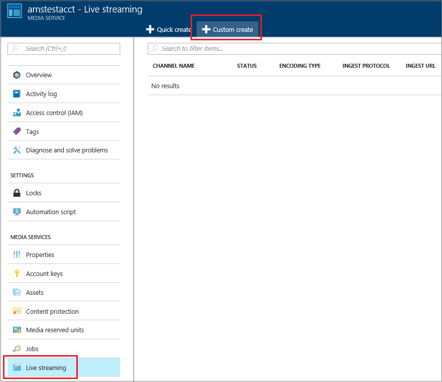
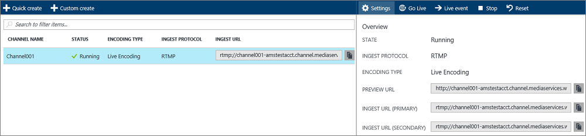
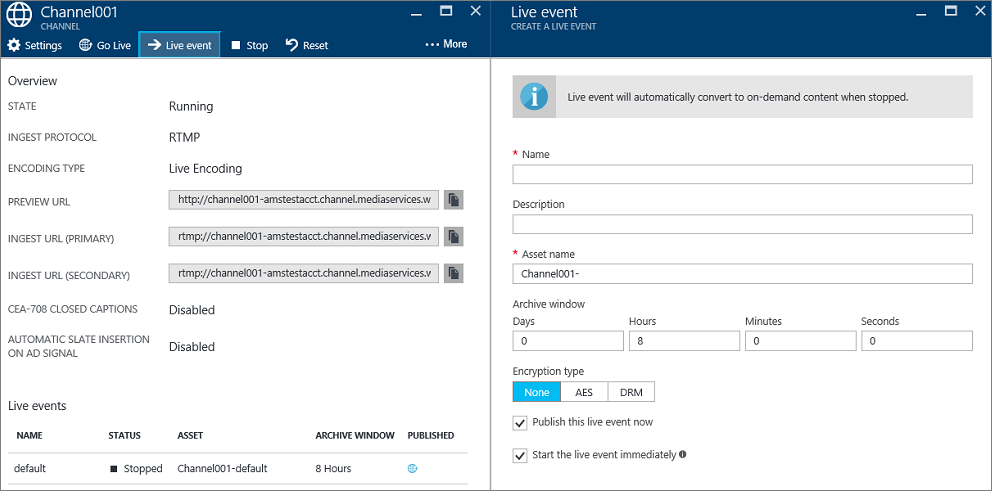
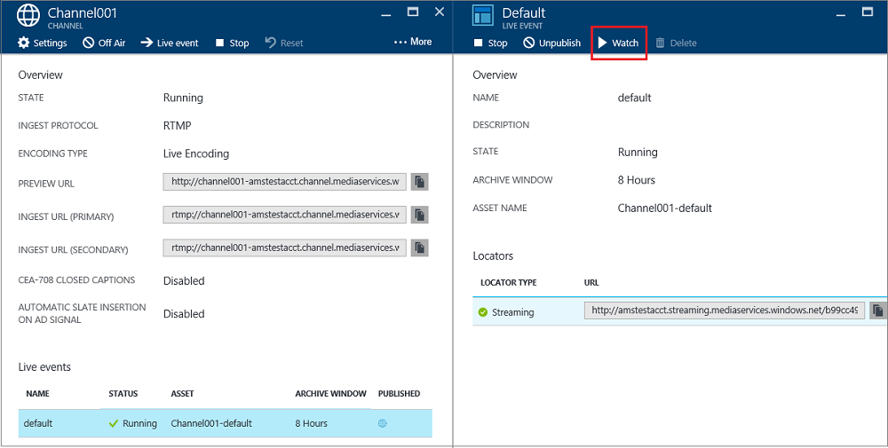

# Perform live streaming using Media Services to create multi-bitrate streams with Azure portal  
> [!div class="op_single_selector"]
> * [Portal](media-services-portal-creating-live-encoder-enabled-channel.md)
> * [.NET](media-services-dotnet-creating-live-encoder-enabled-channel.md)
> * [REST API](https://docs.microsoft.com/rest/api/media/operations/channel)
> 

> [!NOTE]
> No new features or functionality are being added to Media Services v2.  Check out the latest version, [Media Services v3](https://docs.microsoft.com/azure/media-services/latest/). Also, see [migration guidance from v2 to v3](../latest/migrate-from-v2-to-v3.md)

This tutorial walks you through the steps of creating a **Channel** that receives a single-bitrate live stream and encodes it to multi-bitrate stream.

For more conceptual information related to Channels that are enabled for live encoding, see [Live streaming using Azure Media Services to create multi-bitrate streams](media-services-manage-live-encoder-enabled-channels.md).

## Common Live Streaming Scenario
The following are general steps involved in creating common live streaming applications.

> [!NOTE]
> Currently, the max recommended duration of a live event is 8 hours. Please contact amshelp@microsoft.com if you need to run a Channel for longer periods of time.

1. Connect a video camera to a computer.  For setup ideas, check out [Simple and portable event video gear setup]( https://link.medium.com/KNTtiN6IeT).

    If you do not have access to a camera, tools such as [Telestream Wirecast](media-services-configure-wirecast-live-encoder.md) can be used generate a live feed from a video file.
1. Launch and configure an on-premises live encoder that can output a single bitrate stream in one of the following protocols: RTMP or Smooth Streaming. For more information, see [Azure Media Services RTMP Support and Live Encoders](https://go.microsoft.com/fwlink/?LinkId=532824).  Also, check out this blog: [Live streaming production with OBS](https://link.medium.com/ttuwHpaJeT).

    This step could also be performed after you create your Channel.
1. Create and start a Channel. 
1. Retrieve the Channel ingest URL. 

    The ingest URL is used by the live encoder to send the stream to the Channel.
1. Retrieve the Channel preview URL. 

    Use this URL to verify that your channel is properly receiving the live stream.
1. Create an event/program (that will also create an asset). 
1. Publish the event (that will create an  OnDemand locator for the associated asset).    
1. Start the event when you are ready to start streaming and archiving.
1. Optionally, the live encoder can be signaled to start an advertisement. The advertisement is inserted in the output stream.
1. Stop the event whenever you want to stop streaming and archiving the event.
1. Delete the event (and optionally delete the asset).   

## Prerequisites

The following are required to complete the tutorial.

* To complete this tutorial, you need an Azure account. If you don't have an account, you can create a free trial account in just a couple of minutes. 
  For details, see [Azure Free Trial](https://azure.microsoft.com/pricing/free-trial/).
* A Media Services account. To create a Media Services account, see [Create Account](media-services-portal-create-account.md).
* A webcam and an encoder that can send a single bitrate live stream.

## Create a channel

1. In the [Azure portal](https://portal.azure.com/), select Media Services and then click on your Media Services account name.
2. Select **Live Streaming**.
3. Select **Custom create**. This option will let you create a channel that is enabled for live encoding.

    
4. Click on **Settings**.

   1. Choose the **Live Encoding** channel type. This type specifies that you want to create a Channel that is enabled for live encoding. That means the incoming single bitrate stream is sent to the Channel and encoded into a multi-bitrate stream using specified live encoder settings. For more information, see [Live streaming using Azure Media Services to create multi-bitrate streams](media-services-manage-live-encoder-enabled-channels.md). Click OK.
   2. Specify a channel's name.
   3. Click OK at the bottom of the screen.
5. Select the **Ingest** tab.

   1. On this page, you can select a streaming protocol. For the **Live Encoding** channel type, valid protocol options are:

      * Single bitrate Fragmented MP4 (Smooth Streaming)
      * Single bitrate RTMP

        For detailed explanation about each protocol, see [Live streaming using Azure Media Services to create multi-bitrate streams](media-services-manage-live-encoder-enabled-channels.md).

        You cannot change the protocol option while the Channel or its associated events/programs are running. If you require different protocols, you should create separate channels for each streaming protocol.  
   2. You can apply IP restriction on the ingest. 

       You can define the IP addresses that are allowed to ingest a video to this channel. Allowed IP addresses can be specified as either a single IP address (e.g. '10.0.0.1'), an IP range using an IP address and a CIDR subnet mask (e.g. '10.0.0.1/22'), or an IP range using an IP address and a dotted decimal subnet mask (e.g. '10.0.0.1(255.255.252.0)').

       If no IP addresses are specified and there is no rule definition then no IP address will be allowed. To allow any IP address, create a rule and set 0.0.0.0/0.
6. On the **Preview** tab, apply IP restriction on the preview.
7. On the **Encoding** tab, specify the encoding preset. 

    Currently, the only system preset you can select is **Default 720p**. To specify a custom preset, open a Microsoft support ticket. Then, enter the name of the preset created for you. 

> [!NOTE]
> Currently, the Channel start can take up to 30 minutes. Channel reset can take up to 5 minutes.
> 
> 

Once you created the Channel, you can click on the channel and select **Settings** where you can view your channels configurations. 

For more information, see [Live streaming using Azure Media Services to create multi-bitrate streams](media-services-manage-live-encoder-enabled-channels.md).

## Get ingest URLs
Once the channel is created, you can get ingest URLs that you will provide to the live encoder. The encoder uses these URLs to input a live stream.

## Create and manage events

### Overview
A channel is associated with events/programs that enable you to control the publishing and storage of segments in a live stream. Channels manage events/programs. The Channel and Program relationship is very similar to traditional media where a channel has a constant stream of content and a program is scoped to some timed event on that channel.

You can specify the number of hours you want to retain the recorded content for the event by setting the **Archive Window** length. This value can be set from a minimum of 5 minutes to a maximum of 25 hours. Archive window length also dictates the maximum amount of time clients can seek back in time from the current live position. Events can run over the specified amount of time, but content that falls behind the window length is continuously discarded. This value of this property also determines how long the client manifests can grow.

Each event is associated with an Asset. To publish the event you must create an OnDemand locator for the associated asset. Having this locator will enable you to build a streaming URL that you can provide to your clients.

A channel supports up to three concurrently running events so you can create multiple archives of the same incoming stream. This allows you to publish and archive different parts of an event as needed. For example, your business requirement is to archive 6 hours of an event, but to broadcast only last 10 minutes. To accomplish this, you need to create two concurrently running event. One event is set to archive 6 hours of the event but the program is not published. The other event is set to archive for 10 minutes and this program is published.

You should not reuse existing programs for new events. Instead, create and start a new program for each event.

Start an event/program when you are ready to start streaming and archiving. Stop the event whenever you want to stop streaming and archiving the event. 

To delete archived content, stop and delete the event and then delete the associated asset. An asset cannot be deleted if it is used by the event; the event must be deleted first. 

Even after you stop and delete the event, the users would be able to stream your archived content as a video on demand, for as long as you do not delete the asset.

If you do want to retain the archived content, but not have it available for streaming, delete the streaming locator.

### Create/start/stop events
Once you have the stream flowing into the Channel you can begin the streaming event by creating an Asset, Program, and Streaming Locator. This will archive the stream and make it available to viewers through the Streaming Endpoint. 

>[!NOTE]
>When your AMS account is created a **default** streaming endpoint is added to your account in the **Stopped** state. To start streaming your content and take advantage of dynamic packaging and dynamic encryption, the streaming endpoint from which you want to stream content has to be in the **Running** state. 

There are two ways to start event: 

1. From the **Channel** page, press **Live Event** to add a new event.

    Specify: event name, asset name, archive window, and encryption option.

    

    If you left **Publish this live event now** checked, the event the PUBLISHING URLs will get created.

    You can press **Start**, whenever you are ready to stream the event.

    Once you start the event, you can press **Watch** to start playing the content.
2. Alternatively, you can use a shortcut and press **Go Live** button on the **Channel** page. This will create a default Asset, Program, and Streaming Locator.

    The event is named **default** and the archive window is set to 8 hours.

You can watch the published event from the **Live event** page. 

If you click **Off Air**, it will stop all live events. 

## Watch the event
To watch the event, click **Watch** in the Azure portal or copy the streaming URL and use a player of your choice. 

Live event automatically converts events to on-demand content when stopped.

## Clean up
If you are done streaming events and want to clean up the resources provisioned earlier, follow the following procedure.

* Stop pushing the stream from the encoder.
* Stop the channel. Once the Channel is stopped, it will not incur any charges. When you need to start it again, it will have the same ingest URL so you won't need to reconfigure your encoder.
* You can stop your Streaming Endpoint, unless you want to continue to provide the archive of your live event as an on-demand stream. If the channel is in stopped state, it will not incur any charges.

## View archived content
Even after you stop and delete the event, the users would be able to stream your archived content as a video on demand, for as long as you do not delete the asset. An asset cannot be deleted if it is used by an event; the event must be deleted first. 

To manage your assets, select **Setting** and click **Assets**.

## Considerations
* Currently, the max recommended duration of a live event is 8 hours. Please contact amshelp@microsoft.com if you need to run a Channel for longer periods of time.
* Make sure the streaming endpoint from which you want to stream  your content is in the **Running** state.

## Next step
Review Media Services learning paths.

[!INCLUDE [media-services-learning-paths-include](../../../includes/media-services-learning-paths-include.md)]

## Provide feedback
[!INCLUDE [media-services-user-voice-include](../../../includes/media-services-user-voice-include.md)]

