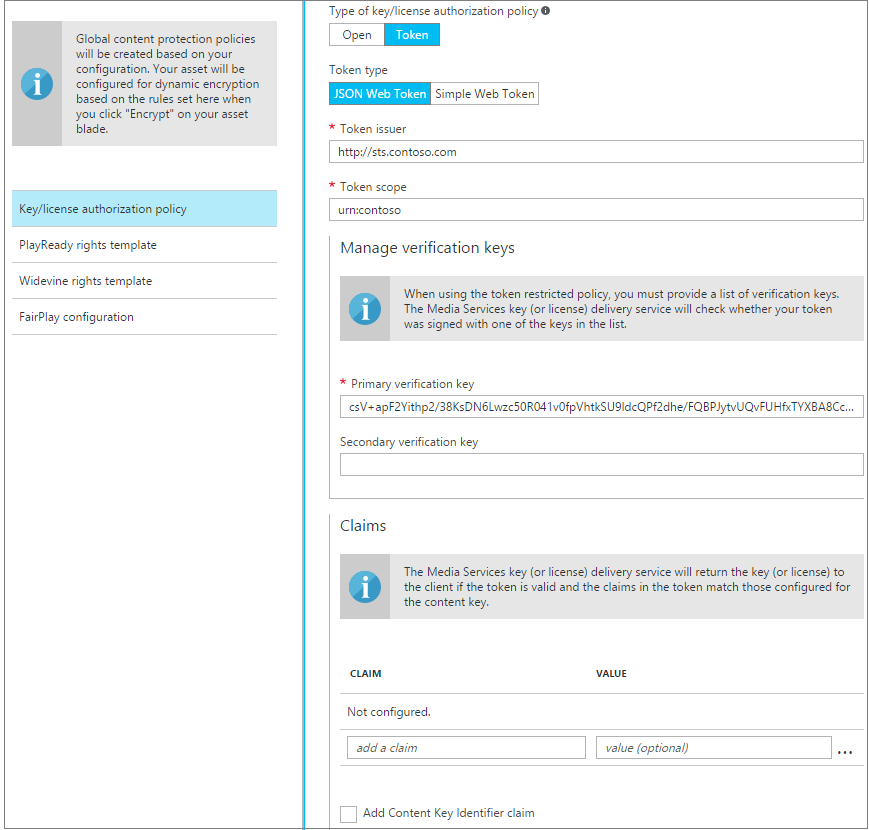
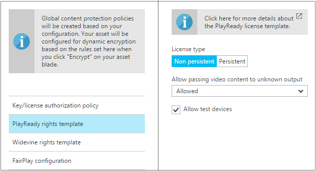
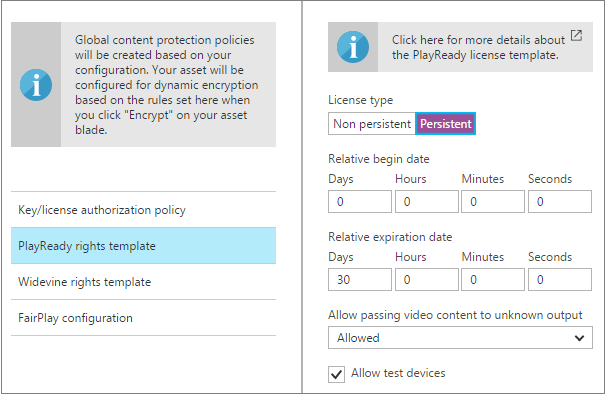
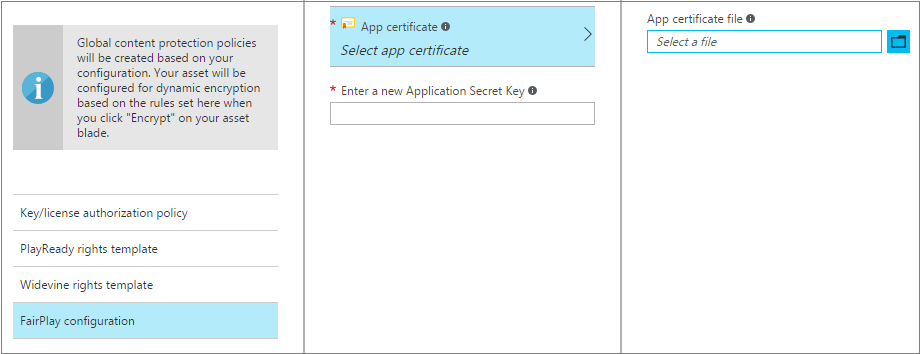
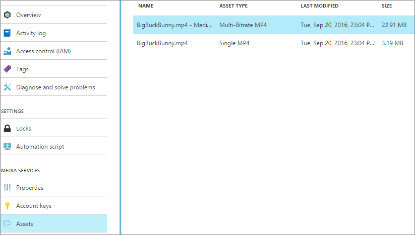
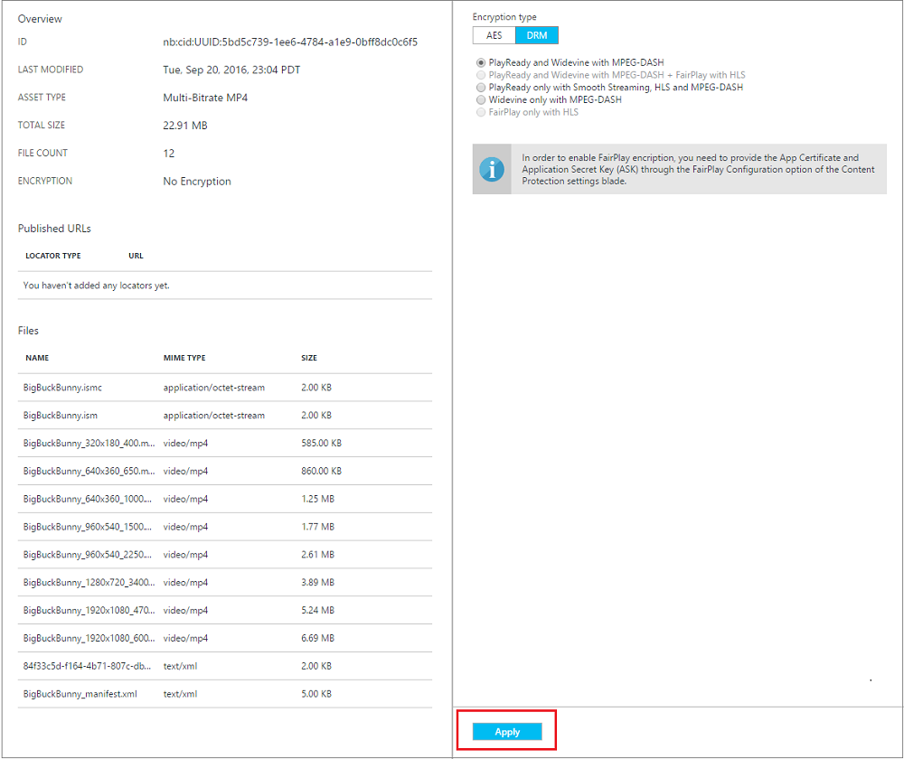

# Configure content protection policies by using the Azure portal

> [!NOTE]
> To complete this tutorial, you need an Azure account. For details, see [Azure Free Trial](https://azure.microsoft.com/pricing/free-trial/). 	> No new features or functionality are being added to Media Services v2.  Check out the latest version, [Media Services v3](https://docs.microsoft.com/azure/media-services/latest/). Also, see [migration guidance from v2 to v3](../latest/migrate-from-v2-to-v3.md)
>

 With Azure Media Services, you can secure your media from the time it leaves your computer through storage, processing, and delivery. You can use Media Services to deliver your content encrypted dynamically with the Advanced Encryption Standard (AES) by using 128-bit encryption keys. You also can use it with common encryption (CENC) by using PlayReady and/or Widevine digital rights management (DRM) and Apple FairPlay. 

Media Services provides a service for delivering DRM licenses and AES clear keys to authorized clients. You can use the Azure portal to create one key/license authorization policy for all types of encryptions.

This article demonstrates how to configure a content protection policy by using the portal. The article also shows how to apply dynamic encryption to your assets.

## Start to configure content protection
To use the portal to configure global content protection by using your Media Services account, take the following steps:

1. In the [portal](https://portal.azure.com/), select your Media Services account.

1. Select **Settings** > **Content protection**.

    

## Key/license authorization policy
Media Services supports multiple ways of authenticating users who make key or license requests. You must configure the content key authorization policy. Your client then must meet the policy before the key/license can be delivered to it. The content key authorization policy can have one or more authorization restrictions, either open or token restrictions.

You can use the portal to create one key/license authorization policy for all types of encryptions.

### Open authorization
Open restriction means that the system delivers the key to anyone who makes a key request. This restriction might be useful for test purposes. 

### Token authorization
The token-restricted policy must be accompanied by a token issued by a security token service (STS). Media Services supports tokens in the simple web token (SWT) and JSON Web Token (JWT) formats. Media Services doesn't provide an STS. You can create a custom STS or use Azure Access Control Service to issue tokens. The STS must be configured to create a token signed with the specified key and issue claims that you specified in the token restriction configuration. If the token is valid and the claims in the token match those configured for the key (or license), the Media Services key delivery service returns the requested key (or license) to the client.

When you configure the token-restricted policy, you must specify the primary verification key, issuer, and audience parameters. The primary verification key contains the key that the token was signed with. The issuer is the secure token service that issues the token. The audience (sometimes called scope) describes the intent of the token or the resource the token authorizes access to. The Media Services key delivery service validates that these values in the token match the values in the template.

## PlayReady license template
The PlayReady license template sets the functionality that is enabled on your PlayReady license. For more information about the PlayReady license template, see the [Media Services PlayReady license template overview](media-services-playready-license-template-overview.md).

### Nonpersistent
If you configure a license as nonpersistent, it's held in memory only while the player uses the license.  

### Persistent
If you configure a license as persistent, it's saved in persistent storage on the client.

## Widevine license template
The Widevine license template sets the functionality that is enabled on your Widevine licenses.

### Basic
When you select **Basic**, the template is created with all default values.

### Advanced
For more information about the Widevine rights template, see the [Widevine license template overview](media-services-widevine-license-template-overview.md).

## FairPlay configuration
To enable FairPlay encryption, select **FairPlay configuration**. Then select the **App certificate** and enter the **Application Secret Key**. For more information about FairPlay configuration and requirements, see [Protect your HLS content with Apple FairPlay or Microsoft PlayReady](media-services-protect-hls-with-FairPlay.md).

## Apply dynamic encryption to your asset
To take advantage of dynamic encryption, encode your source file into a set of adaptive-bitrate MP4 files.

### Select an asset that you want to encrypt
To see all your assets, select **Settings** > **Assets**.

### Encrypt with AES or DRM
When you select **Encrypt** for an asset, you see two choices: **AES** or **DRM**. 

#### AES
AES clear key encryption is enabled on all streaming protocols: Smooth Streaming, HLS, and MPEG-DASH.

#### DRM
1. After you select **DRM**, you see different content protection policies (which must be configured by this point) and a set of streaming protocols:

    a. **PlayReady and Widevine with MPEG-DASH** dynamically encrypts your MPEG-DASH stream with PlayReady and Widevine DRMs.

    b. **PlayReady and Widevine with MPEG-DASH + FairPlay with HLS** dynamically encrypt your MPEG-DASH stream with PlayReady and Widevine DRMs. This option also encrypts your HLS streams with FairPlay.

    c. **PlayReady only with Smooth Streaming, HLS, and MPEG-DASH** dynamically encrypts Smooth Streaming, HLS, and MPEG-DASH streams with PlayReady DRM.

    d. **Widevine only with MPEG-DASH** dynamically encrypts your MPEG-DASH with Widevine DRM.
    
    e. **FairPlay only with HLS** dynamically encrypts your HLS stream with FairPlay.

1. To enable FairPlay encryption, on the **Content Protection Global Settings** blade, select **FairPlay configuration**. Then select the **App certificate**, and enter the **Application Secret Key**.

    

1. After you make the encryption selection, select **Apply**.

>[!NOTE] 
>If you plan to play an AES-encrypted HLS in Safari, see the blog post [Encrypted HLS in Safari](https://azure.microsoft.com/blog/how-to-make-token-authorized-aes-encrypted-hls-stream-working-in-safari/).

## Additional notes

* Widevine is a service provided by Google Inc. and subject to the terms of service and Privacy Policy of Google, Inc.

## Next steps
[!INCLUDE [media-services-learning-paths-include](../../../includes/media-services-learning-paths-include.md)]

## Provide feedback
[!INCLUDE [media-services-user-voice-include](../../../includes/media-services-user-voice-include.md)]

