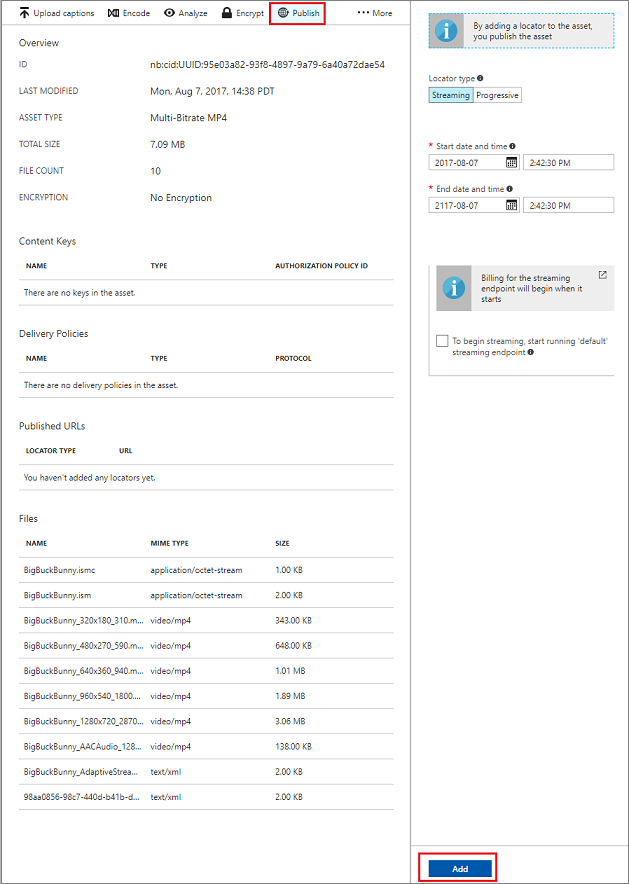

# Publish content in the Azure portal  
> [!div class="op_single_selector"]
> * [Portal](media-services-portal-publish.md)
> * [.NET](media-services-deliver-streaming-content.md)
> * [REST](media-services-rest-deliver-streaming-content.md)
> 
> 

## Overview
> [!NOTE]
> To complete this tutorial, you need an Azure account. For details, see [Azure free trial](https://azure.microsoft.com/pricing/free-trial/). 
> 
> 

To provide your user with a URL that they can use to stream or download your content, first you must publish your asset by creating a locator. Locators provide access to asset files. Azure Media Services supports two types of locators: 

* **Streaming (OnDemandOrigin) locators**. Streaming locators are used for adaptive streaming. Examples of adaptive streaming include Apple HTTP Live Streaming (HLS), Microsoft Smooth Streaming, and Dynamic Adaptive Streaming over HTTP (DASH, also called MPEG-DASH). To create a streaming locator, your asset must include an .ism file. For example, `http://amstest.streaming.mediaservices.windows.net/61b3da1d-96c7-489e-bd21-c5f8a7494b03/scott.ism/manifest`.
* **Progressive (shared access signature) locators**. Progressive locators are used to deliver video via progressive download.

To build an HLS streaming URL, append *(format=m3u8-aapl)* to the URL:

    {streaming endpoint name-media services account name}/{locator ID}/{file name}.ism/Manifest(format=m3u8-aapl)

To build a streaming URL to play Smooth Streaming assets, use the following URL format:

    {streaming endpoint name-media services account name}/{locator ID}/{file name}.ism/Manifest

To build an MPEG-DASH streaming URL, append *(format=mpd-time-csf)* to the URL:

    {streaming endpoint name-media services account name}/{locator ID}/{file name}.ism/Manifest(format=mpd-time-csf)

A shared access signature URL has the following format:

    {blob container name}/{asset name}/{file name}/{shared access signature}

For more information, see the [delivering content overview](media-services-deliver-content-overview.md).

> [!NOTE]
> Locators that were created in the Azure portal before March 2015 have a two-year expiration date.  
> 
> 

To update an expiration date on a locator, use can use a [REST API](https://docs.microsoft.com/rest/api/media/operations/locator#update_a_locator) or a [.NET API](https://go.microsoft.com/fwlink/?LinkID=533259). 

> [!NOTE]
> When you update the expiration date of a shared access signature locator, the URL changes.

### To use the portal to publish an asset
1. In the [Azure portal](https://portal.azure.com/), select your Azure Media Services account.
2. Select **Settings** > **Assets**. Select the asset that you want to publish.
3. Select the **Publish** button.
4. Select the locator type.
5. Select **Add**.
   
    

The URL is added to the list of **Published URLs**.

## Play content in the portal
You can test your video on a content player in the Azure portal.

Select the video, and then select the **Play** button.

Some considerations apply:

* Make sure that the video has been published.
* The Azure portal media player plays from the default streaming endpoint. If you want to play from a non-default streaming endpoint, select and copy the URL, and then paste it into another player. For example, you can test your video on the [Azure Media Player](https://aka.ms/azuremediaplayer).
* The streaming endpoint from which you are streaming must be running.  

## Provide feedback
[!INCLUDE [media-services-user-voice-include](../../../includes/media-services-user-voice-include.md)]

## Next steps
[!INCLUDE [media-services-learning-paths-include](../../../includes/media-services-learning-paths-include.md)]

