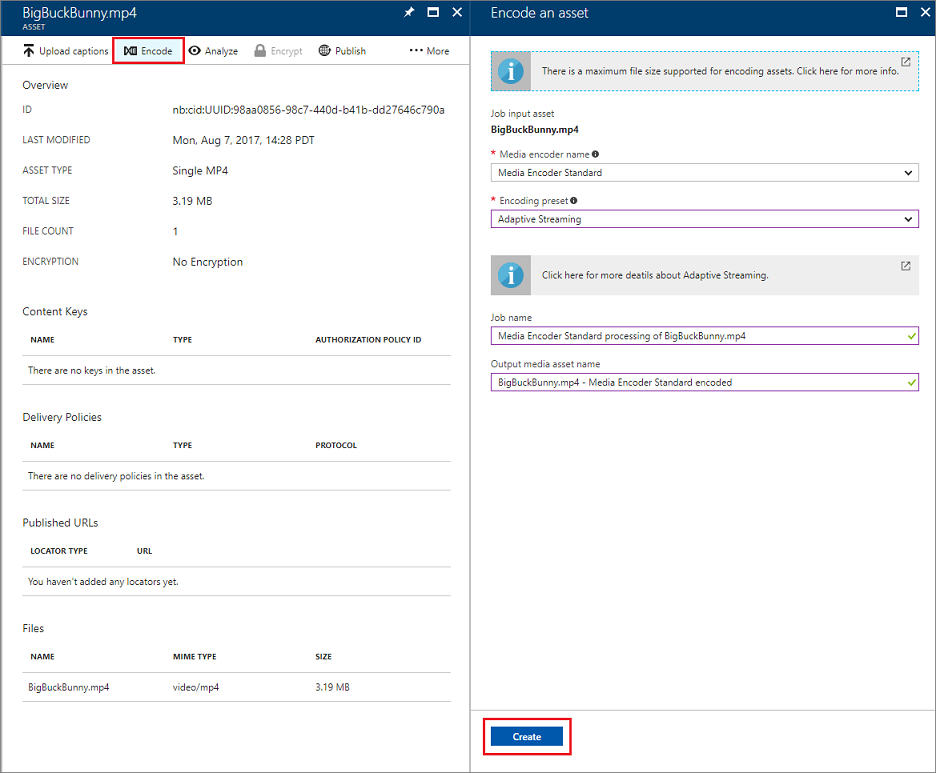
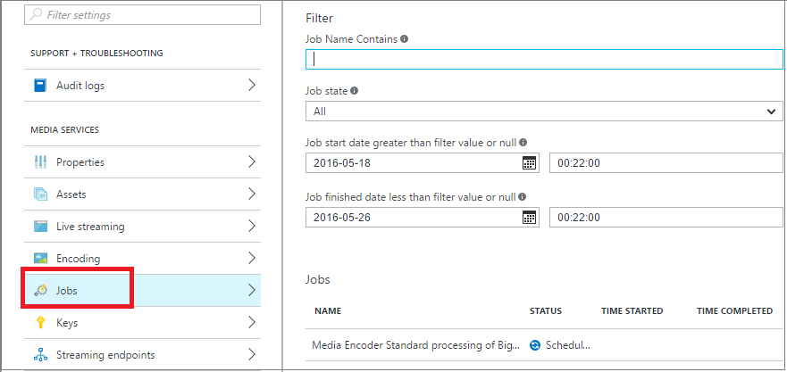

# Get started with delivering content on demand by using the Azure portal

> [!NOTE]
> No new features or functionality are being added to Media Services v2.  Check out the latest version, [Media Services v3](https://docs.microsoft.com/azure/media-services/latest/). Also, see [migration guidance from v2 to v3](../latest/migrate-from-v2-to-v3.md)

This tutorial walks you through the steps of implementing a basic video-on-demand content delivery service with an Azure Media Services application in the Azure portal.

## Prerequisites
The following items are required to complete the tutorial:

* An Azure account. For details, see [Azure free trial](https://azure.microsoft.com/pricing/free-trial/). 
* A Media Services account. To create a Media Services account, see [How to create a Media Services account](media-services-portal-create-account.md).

This tutorial includes the following tasks:

1. Start the streaming endpoint.
2. Upload a video file.
3. Encode the source file into a set of adaptive bitrate MP4 files.
4. Publish the asset, and get streaming and progressive download URLs.  
5. Play your content.

## Start the streaming endpoint

One of the most common scenarios when working with Azure Media Services is delivering video via adaptive bitrate streaming. Media Services gives you dynamic packaging. With dynamic packaging, you can deliver your adaptive bitrate MP4 encoded content in just-in-time streaming formats that are supported by Media Services. Examples include Apple HTTP Live Streaming (HLS), Microsoft Smooth Streaming, and Dynamic Adaptive Streaming over HTTP (DASH, also called MPEG-DASH). By using Media Services adaptive bitrate streaming, you can deliver your videos without storing prepackaged versions of each of these streaming formats.

> [!NOTE]
> When you create your Media Services account, a default streaming endpoint is added to your account in the **Stopped** state. To start streaming your content, and to take advantage of dynamic packaging and dynamic encryption, the streaming endpoint from which you want to stream content has to be in the **Running** state. 

To start the streaming endpoint:

1. Sign in to the [Azure portal](https://portal.azure.com/).
2. Select **Settings** > **Streaming endpoints**. 
3. Select the default streaming endpoint. The **DEFAULT STREAMING ENDPOINT DETAILS** window appears.
4. Select the **Start** icon.
5. Select the **Save** button.

## Upload files
To stream videos by using Media Services, you upload the source videos, encode them into multiple bitrates, and then publish the result. The first step is covered in this section. 

1. In the [Azure portal](https://portal.azure.com/), select your Azure Media Services account.
2. Select **Settings** > **Assets**. Then, select the **Upload** button.
   
    
   
    The **Upload a video asset** window appears.
   
   > [!NOTE]
   > Media Services doesn't limit the file size for uploading videos.
   > 
   > 
3. On your computer, go to the video that you want to upload. Select the video, and then select **OK**.  
   
    The upload begins. You can see the progress under the file name.  

When the upload is finished, the new asset is listed in the **Assets** pane. 

## Encode assets
To take advantage of dynamic packaging, you must encode your source file into a set of multi-bitrate MP4 files. The encoding steps are demonstrated in this section.

### Encode assets in the portal
To encode your content by using Media Encoder Standard in the Azure portal:

1. In the [Azure portal](https://portal.azure.com/), select your Azure Media Services account.
2. Select **Settings** > **Assets**. Select the asset that you want to encode.
3. Select the **Encode** button.
4. In the **Encode an asset** pane, select the **Media Encoder Standard** processor and a preset. For information about presets, see [Auto-generate a bitrate ladder](media-services-autogen-bitrate-ladder-with-mes.md) and [Task presets for Media Encoder Standard](media-services-mes-presets-overview.md). It's important to choose the preset that will work best for your input video. For example, if you know your input video has a resolution of 1920 &#215; 1080 pixels, you might choose the **H264 Multiple Bitrate 1080p** preset. If you have a low-resolution (640 &#215; 360) video, you shouldn't use the **H264 Multiple Bitrate 1080p** preset.
   
   To help you manage your resources, you can edit the name of the output asset and the name of the job.
   
   
5. Select **Create**.

### Monitor encoding job progress
To monitor the progress of the encoding job, at the top of the page, select **Settings**, and then select **Jobs**.

## Publish content
To provide your user with a URL that they can use to stream or download your content, first you must publish your asset by creating a locator. Locators provide access to files that are in the asset. Azure Media Services supports two types of locators: 

* **Streaming (OnDemandOrigin) locators**. Streaming locators are used for adaptive streaming. Examples of adaptive streaming include HLS, Smooth Streaming, and MPEG-DASH. To create a streaming locator, your asset must include an .ism file. 
* **Progressive (shared access signature) locators**. Progressive locators are used to deliver video via progressive download.

To build an HLS streaming URL, append *(format=m3u8-aapl)* to the URL:

    {streaming endpoint name-media services account name}.streaming.mediaservices.windows.net/{locator ID}/{file name}.ism/Manifest(format=m3u8-aapl)

To build a streaming URL to play Smooth Streaming assets, use the following URL format:

    {streaming endpoint name-media services account name}.streaming.mediaservices.windows.net/{locator ID}/{file name}.ism/Manifest

To build an MPEG-DASH streaming URL, append *(format=mpd-time-csf)* to the URL:

    {streaming endpoint name-media services account name}.streaming.mediaservices.windows.net/{locator ID}/{file name}.ism/Manifest(format=mpd-time-csf)

A shared access signature URL has the following format:

    {blob container name}/{asset name}/{file name}/{shared access signature}

> [!NOTE]
> Locators that were created in the Azure portal before March 2015 have a two-year expiration date.  
> 
> 

To update an expiration date on a locator, you can use a [REST API](https://docs.microsoft.com/rest/api/media/operations/locator#update_a_locator) or a [.NET API](https://go.microsoft.com/fwlink/?LinkID=533259). 

> [!NOTE]
> When you update the expiration date of a shared access signature locator, the URL changes.

### To use the portal to publish an asset
1. In the [Azure portal](https://portal.azure.com/), select your Azure Media Services account.
2. Select **Settings** > **Assets**. Select the asset that you want to publish.
3. Select the **Publish** button.
4. Select the locator type.
5. Select **Add**.
   
    

The URL is added to the list of **Published URLs**.

## Play content from the portal
You can test your video on a content player in the Azure portal.

Select the video, and then select the **Play** button.

Some considerations apply:

* To begin streaming, start running the default streaming endpoint.
* Make sure that the video has been published.
* The Azure portal media player plays from the default streaming endpoint. If you want to play from a non-default streaming endpoint, select and copy the URL, and then paste it into another player. For example, you can test your video on the [Azure Media Player](https://aka.ms/azuremediaplayer).

## Provide feedback
[!INCLUDE [media-services-user-voice-include](../../../includes/media-services-user-voice-include.md)]

## Next steps
[!INCLUDE [media-services-learning-paths-include](../../../includes/media-services-learning-paths-include.md)]
