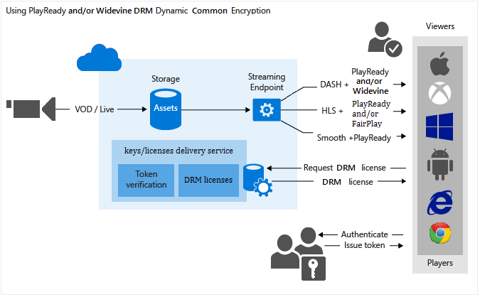

# Use PlayReady and/or Widevine dynamic common encryption

> [!NOTE]
> To complete this tutorial, you need an Azure account. For details, see [Azure Free Trial](https://azure.microsoft.com/pricing/free-trial/). 	> No new features or functionality are being added to Media Services v2. <br/>Check out the latest version, [Media Services v3](https://docs.microsoft.com/azure/media-services/latest/). Also, see [migration guidance from v2 to v3](../latest/migrate-from-v2-to-v3.md)
> 	

## Overview

 You can use Media Services to deliver MPEG-DASH, Smooth Streaming, and HTTP Live Streaming (HLS) streams protected with [PlayReady digital rights management (DRM)](https://www.microsoft.com/playready/overview/). You also can deliver encrypted DASH streams with Widevine DRM licenses. Both PlayReady and Widevine are encrypted per the common encryption (ISO/IEC 23001-7 CENC) specification. You can use the [Media Services .NET SDK](https://www.nuget.org/packages/windowsazure.mediaservices/) (starting with version 3.5.1) or the REST API to configure AssetDeliveryConfiguration to use Widevine.

Media Services provides a service for delivering PlayReady and Widevine DRM licenses. Media Services also provides APIs that you can use to configure the rights and restrictions that you want the PlayReady or Widevine DRM runtime to enforce when a user plays back protected content. When a user requests DRM-protected content, the player application requests a license from the Media Services license service. If the player application is authorized, the Media Services license service issues a license to the player. A PlayReady or Widevine license contains the decryption key that can be used by the client player to decrypt and stream the content.

You also can use the following Media Services partners to help you deliver Widevine licenses: 

* [Axinom](https://www.axinom.com) 
* [EZDRM](https://ezdrm.com/) 
* [castLabs](https://castlabs.com/company/partners/azure/) 

For more information, see integration with [Axinom](media-services-axinom-integration.md) and [castLabs](media-services-castlabs-integration.md).

Media Services supports multiple ways of authorizing users who make key requests. The content key authorization policy can have one or more authorization restrictions, either open or token restrictions. The token-restricted policy must be accompanied by a token issued by a security token service (STS). Media Services supports tokens in the [simple web token](https://msdn.microsoft.com/library/gg185950.aspx#BKMK_2) (SWT) and [JSON Web Token](https://msdn.microsoft.com/library/gg185950.aspx#BKMK_3) (JWT) formats. 

For more information, see [Configure the content key's authorization policy](media-services-protect-with-aes128.md#configure_key_auth_policy).

To take advantage of dynamic encryption, you need an asset that contains a set of multi-bitrate MP4 files or multi-bitrate Smooth Streaming source files. You also need to configure the delivery policies for the asset (described later in this topic). Then, based on the format specified in the streaming URL, the on-demand streaming server ensures that the stream is delivered in the protocol you selected. As a result, you store and pay for the files in only a single storage format. Media Services builds and serves the appropriate HTTP response based on each request from a client.

This article is useful to developers who work on applications that deliver media protected with multiple DRMs, such as PlayReady and Widevine. The article shows you how to configure the PlayReady license delivery service with authorization policies so that only authorized clients can receive PlayReady or Widevine licenses. It also shows how to use dynamic encryption with PlayReady or Widevine DRM over DASH.

>[!NOTE]
>When your Media Services account is created, a default streaming endpoint is added to your account in the "Stopped" state. To start streaming your content and take advantage of dynamic packaging and dynamic encryption, the streaming endpoint from which you want to stream content must be in the "Running" state. 

## Download the sample
You can download the sample described in this article from [Azure samples on GitHub](https://github.com/Azure-Samples/media-services-dotnet-dynamic-encryption-with-drm).

## Configure dynamic common encryption and DRM license delivery services

Perform the following general steps when you protect your assets with PlayReady by using the Media Services license delivery service and also by using dynamic encryption:

1. Create an asset, and upload files into the asset.

2. Encode the asset that contains the file to the adaptive bitrate MP4 set.

3. Create a content key, and associate it with the encoded asset. In Media Services, the content key contains the asset's encryption key.

4. Configure the content key's authorization policy. You must configure the content key authorization policy. The client must meet the policy before the content key is delivered to the client.

	When you create the content key authorization policy, you must specify the delivery method (PlayReady or Widevine) and the restrictions (open or token). You also must specify information specific to the key delivery type that defines how the key is delivered to the client ([PlayReady](media-services-playready-license-template-overview.md) or [Widevine](media-services-widevine-license-template-overview.md) license template).

5. Configure the delivery policy for an asset. The delivery policy configuration includes the delivery protocol (for example, MPEG-DASH, HLS, Smooth Streaming, or all). The configuration also includes the type of dynamic encryption (for example, common encryption) and the PlayReady or Widevine license acquisition URL.

	You can apply a different policy to each protocol on the same asset. For example, you can apply PlayReady encryption to Smooth/DASH and an AES envelope to HLS. Any protocols that aren't defined in a delivery policy (for example, if you add a single policy that specifies only HLS as the protocol) are blocked from streaming. The exception is if you have no asset delivery policy defined at all. Then, all protocols are allowed in the clear.

6. Create an OnDemand locator to get a streaming URL.

You can find a complete .NET example at the end of the article.

The following image demonstrates the workflow previously described. Here, the token is used for authentication.



The remainder of this article provides detailed explanations, code examples, and links to topics that show you how to achieve the tasks previously described.

## Current limitations
If you add or update an asset delivery policy, you must delete any associated locator and create a new locator.

Currently, multiple content keys aren't supported when you encrypt by using Widevine with Media Services. 

## Create an asset and upload files into the asset
To manage, encode, and stream your videos, you must first upload your content into Media Services. After it's uploaded, your content is stored securely in the cloud for further processing and streaming.

For more information, see [Upload files into a Media Services account](media-services-dotnet-upload-files.md).

## Encode the asset that contains the file to the adaptive bitrate MP4 set
With dynamic encryption, you create an asset that contains a set of multi-bitrate MP4 files or multi-bitrate Smooth Streaming source files. Then, based on the specified format in the manifest and fragment request, the on-demand streaming server ensures that you receive the stream in the protocol you selected. Then, you store and pay for the files in only a single storage format. Media Services builds and serves the appropriate response based on requests from a client. For more information, see [Dynamic packaging overview](media-services-dynamic-packaging-overview.md).

For instructions on how to encode, see [Encode an asset by using Media Encoder Standard](media-services-dotnet-encode-with-media-encoder-standard.md).

## <a id="create_contentkey"></a>Create a content key and associate it with the encoded asset
In Media Services, the content key contains the key that you want to encrypt an asset with.

For more information, see [Create a content key](media-services-dotnet-create-contentkey.md).

## <a id="configure_key_auth_policy"></a>Configure the content key's authorization policy
Media Services supports multiple ways of authenticating users who make key requests. You must configure the content key authorization policy. The client (player) must meet the policy before the key is delivered to the client. The content key authorization policy can have one or more authorization restrictions, either open or token restrictions.

For more information, see [Configure a content key authorization policy](media-services-dotnet-configure-content-key-auth-policy.md#playready-dynamic-encryption).

## <a id="configure_asset_delivery_policy"></a>Configure an asset delivery policy
Configure the delivery policy for your asset. Some things that the asset delivery policy configuration includes are:

* The DRM license acquisition URL.
* The asset delivery protocol (for example, MPEG-DASH, HLS, Smooth Streaming, or all).
* The type of dynamic encryption (in this case, common encryption).

For more information, see [Configure an asset delivery policy](media-services-dotnet-configure-asset-delivery-policy.md).

## <a id="create_locator"></a>Create an OnDemand streaming locator to get a streaming URL
You need to provide your user with the streaming URL for Smooth Streaming, DASH, or HLS.

> [!NOTE]
> If you add or update your asset's delivery policy, you must delete any existing locator and create a new locator.
>
>

For instructions on how to publish an asset and build a streaming URL, see [Build a streaming URL](media-services-deliver-streaming-content.md).

## Get a test token
Get a test token based on the token restriction that was used for the key authorization policy.

```csharp
// Deserializes a string containing an XML representation of a TokenRestrictionTemplate
// back into a TokenRestrictionTemplate class instance.
TokenRestrictionTemplate tokenTemplate =
TokenRestrictionTemplateSerializer.Deserialize(tokenTemplateString);

// Generate a test token based on the data in the given TokenRestrictionTemplate.
//The GenerateTestToken method returns the token without the word "Bearer" in front,
//so you have to add it in front of the token string.
string testToken = TokenRestrictionTemplateSerializer.GenerateTestToken(tokenTemplate);
Console.WriteLine("The authorization token is:\nBearer {0}", testToken);
```

You can use the [Azure Media Services Player](https://aka.ms/azuremediaplayer) to test your stream.

## Create and configure a Visual Studio project

1. Set up your development environment, and populate the app.config file with connection information, as described in [Media Services development with .NET](media-services-dotnet-how-to-use.md).

2. Add the following elements to **appSettings** defined in your app.config file:

	```xml
	<add key="Issuer" value="http://testissuer.com"/>
	<add key="Audience" value="urn:test"/>
	```

## Example

The following sample demonstrates functionality that was introduced in the Media Services SDK for .NET version 3.5.2. (Specifically, it includes the ability to define a Widevine license template and request a Widevine license from Media Services.)

Overwrite the code in your Program.cs file with the code shown in this section.

>[!NOTE]
>There is a limit of 1 million policies for different Media Services policies (for example, for Locator policy or ContentKeyAuthorizationPolicy). If you always use the same days/access permissions, use the same policy ID. An example is policies for locators that are intended to remain in place for a long time (non-upload policies). 

For more information, see [Manage assets and related entities with the Media Services .NET SDK](media-services-dotnet-manage-entities.md#limit-access-policies).

Make sure to update variables to point to folders where your input files are located.

```csharp
using System;
using System.Collections.Generic;
using System.Configuration;
using System.IO;
using System.Linq;
using System.Threading;
using Microsoft.WindowsAzure.MediaServices.Client;
using Microsoft.WindowsAzure.MediaServices.Client.ContentKeyAuthorization;
using Microsoft.WindowsAzure.MediaServices.Client.DynamicEncryption;
using Microsoft.WindowsAzure.MediaServices.Client.Widevine;
using Newtonsoft.Json;

namespace DynamicEncryptionWithDRM
{
    class Program
    {
        // Read values from the App.config file.
        private static readonly string _AADTenantDomain =
            ConfigurationManager.AppSettings["AMSAADTenantDomain"];
        private static readonly string _RESTAPIEndpoint =
            ConfigurationManager.AppSettings["AMSRESTAPIEndpoint"];
        private static readonly string _AMSClientId =
            ConfigurationManager.AppSettings["AMSClientId"];
        private static readonly string _AMSClientSecret =
            ConfigurationManager.AppSettings["AMSClientSecret"];

        private static readonly Uri _sampleIssuer =
            new Uri(ConfigurationManager.AppSettings["Issuer"]);
        private static readonly Uri _sampleAudience =
            new Uri(ConfigurationManager.AppSettings["Audience"]);

        // Field for service context.
        private static CloudMediaContext _context = null;

        private static readonly string _mediaFiles =
            Path.GetFullPath(@"../..\Media");

        private static readonly string _singleMP4File =
            Path.Combine(_mediaFiles, @"BigBuckBunny.mp4");

        static void Main(string[] args)
        {
            AzureAdTokenCredentials tokenCredentials =
                new AzureAdTokenCredentials(_AADTenantDomain,
                    new AzureAdClientSymmetricKey(_AMSClientId, _AMSClientSecret),
                    AzureEnvironments.AzureCloudEnvironment);

            var tokenProvider = new AzureAdTokenProvider(tokenCredentials);

            _context = new CloudMediaContext(new Uri(_RESTAPIEndpoint), tokenProvider);

            bool tokenRestriction = false;
            string tokenTemplateString = null;

            IAsset asset = UploadFileAndCreateAsset(_singleMP4File);
            Console.WriteLine("Uploaded asset: {0}", asset.Id);

            IAsset encodedAsset = EncodeToAdaptiveBitrateMP4Set(asset);
            Console.WriteLine("Encoded asset: {0}", encodedAsset.Id);

            IContentKey key = CreateCommonTypeContentKey(encodedAsset);
            Console.WriteLine("Created key {0} for the asset {1} ", key.Id, encodedAsset.Id);
            Console.WriteLine("PlayReady License Key delivery URL: {0}", key.GetKeyDeliveryUrl(ContentKeyDeliveryType.PlayReadyLicense));
            Console.WriteLine();

            if (tokenRestriction)
                tokenTemplateString = AddTokenRestrictedAuthorizationPolicy(key);
            else
                AddOpenAuthorizationPolicy(key);

            Console.WriteLine("Added authorization policy: {0}", key.AuthorizationPolicyId);
            Console.WriteLine();

            CreateAssetDeliveryPolicy(encodedAsset, key);
            Console.WriteLine("Created asset delivery policy. \n");
            Console.WriteLine();

            if (tokenRestriction && !String.IsNullOrEmpty(tokenTemplateString))
            {
                // Deserializes a string containing an XML representation of a TokenRestrictionTemplate
                // back into a TokenRestrictionTemplate class instance.
                TokenRestrictionTemplate tokenTemplate =
                    TokenRestrictionTemplateSerializer.Deserialize(tokenTemplateString);

                // Generate a test token based on the data in the given TokenRestrictionTemplate.
                // Note that you need to pass the key ID GUID because 
                // TokenClaim.ContentKeyIdentifierClaim was specified during the creation of TokenRestrictionTemplate.
                Guid rawkey = EncryptionUtils.GetKeyIdAsGuid(key.Id);
                string testToken = TokenRestrictionTemplateSerializer.GenerateTestToken(tokenTemplate, null, rawkey,
                                            DateTime.UtcNow.AddDays(365));
                Console.WriteLine("The authorization token is:\nBearer {0}", testToken);
                Console.WriteLine();
            }

            // You can use the https://amsplayer.azurewebsites.net/azuremediaplayer.html player to test streams.
            // Note that DASH works on Internet Explorer 11 (via PlayReady), Microsoft Edge (via PlayReady), and Chrome (via Widevine).

            string url = GetStreamingOriginLocator(encodedAsset);
            Console.WriteLine("Encrypted DASH URL: {0}/manifest(format=mpd-time-csf)", url);

            Console.ReadLine();
        }

        static public IAsset UploadFileAndCreateAsset(string singleFilePath)
        {
            if (!File.Exists(singleFilePath))
            {
                Console.WriteLine("File does not exist.");
                return null;
            }

            var assetName = Path.GetFileNameWithoutExtension(singleFilePath);
            IAsset inputAsset = _context.Assets.Create(assetName, AssetCreationOptions.None);

            var assetFile = inputAsset.AssetFiles.Create(Path.GetFileName(singleFilePath));

            Console.WriteLine("Created assetFile {0}", assetFile.Name);

            Console.WriteLine("Upload {0}", assetFile.Name);

            assetFile.Upload(singleFilePath);
            Console.WriteLine("Done uploading {0}", assetFile.Name);

            return inputAsset;
        }

        static public IAsset EncodeToAdaptiveBitrateMP4Set(IAsset inputAsset)
        {
            var encodingPreset = "Adaptive Streaming";

            IJob job = _context.Jobs.Create(String.Format("Encoding into Mp4 {0} to {1}",
                        inputAsset.Name,
                        encodingPreset));

            var mediaProcessors =
            _context.MediaProcessors.Where(p => p.Name.Contains("Media Encoder Standard")).ToList();

            var latestMediaProcessor =
            mediaProcessors.OrderBy(mp => new Version(mp.Version)).LastOrDefault();

            ITask encodeTask = job.Tasks.AddNew("Encoding", latestMediaProcessor, encodingPreset, TaskOptions.None);
            encodeTask.InputAssets.Add(inputAsset);
            encodeTask.OutputAssets.AddNew(String.Format("{0} as {1}", inputAsset.Name, encodingPreset), AssetCreationOptions.StorageEncrypted);

            job.StateChanged += new EventHandler<JobStateChangedEventArgs>(JobStateChanged);
            job.Submit();
            job.GetExecutionProgressTask(CancellationToken.None).Wait();

            return job.OutputMediaAssets[0];
        }


        static public IContentKey CreateCommonTypeContentKey(IAsset asset)
        {

            Guid keyId = Guid.NewGuid();
            byte[] contentKey = GetRandomBuffer(16);

            IContentKey key = _context.ContentKeys.Create(
                        keyId,
                        contentKey,
                        "ContentKey",
                        ContentKeyType.CommonEncryption);

            // Associate the key with the asset.
            asset.ContentKeys.Add(key);

            return key;
        }

        static public void AddOpenAuthorizationPolicy(IContentKey contentKey)
        {

            // Create ContentKeyAuthorizationPolicy with open restrictions
            // and create an authorization policy.         

            List<ContentKeyAuthorizationPolicyRestriction> restrictions = new List<ContentKeyAuthorizationPolicyRestriction>
                {
                new ContentKeyAuthorizationPolicyRestriction
                {
                    Name = "Open",
                    KeyRestrictionType = (int)ContentKeyRestrictionType.Open,
                    Requirements = null
                }
                };

            // Configure PlayReady and Widevine license templates.
            string PlayReadyLicenseTemplate = ConfigurePlayReadyLicenseTemplate();

            string WidevineLicenseTemplate = ConfigureWidevineLicenseTemplate();

            IContentKeyAuthorizationPolicyOption PlayReadyPolicy =
            _context.ContentKeyAuthorizationPolicyOptions.Create("",
                ContentKeyDeliveryType.PlayReadyLicense,
                restrictions, PlayReadyLicenseTemplate);

            IContentKeyAuthorizationPolicyOption WidevinePolicy =
            _context.ContentKeyAuthorizationPolicyOptions.Create("",
                ContentKeyDeliveryType.Widevine,
                restrictions, WidevineLicenseTemplate);

            IContentKeyAuthorizationPolicy contentKeyAuthorizationPolicy = _context.
                ContentKeyAuthorizationPolicies.
                CreateAsync("Deliver Common Content Key with no restrictions").
                Result;


            contentKeyAuthorizationPolicy.Options.Add(PlayReadyPolicy);
            contentKeyAuthorizationPolicy.Options.Add(WidevinePolicy);
            // Associate the content key authorization policy with the content key.
            contentKey.AuthorizationPolicyId = contentKeyAuthorizationPolicy.Id;
            contentKey = contentKey.UpdateAsync().Result;
        }

        public static string AddTokenRestrictedAuthorizationPolicy(IContentKey contentKey)
        {
            string tokenTemplateString = GenerateTokenRequirements();

            List<ContentKeyAuthorizationPolicyRestriction> restrictions = new List<ContentKeyAuthorizationPolicyRestriction>
                {
                new ContentKeyAuthorizationPolicyRestriction
                {
                    Name = "Token Authorization Policy",
                    KeyRestrictionType = (int)ContentKeyRestrictionType.TokenRestricted,
                    Requirements = tokenTemplateString,
                }
                };

            // Configure PlayReady and Widevine license templates.
            string PlayReadyLicenseTemplate = ConfigurePlayReadyLicenseTemplate();

            string WidevineLicenseTemplate = ConfigureWidevineLicenseTemplate();

            IContentKeyAuthorizationPolicyOption PlayReadyPolicy =
            _context.ContentKeyAuthorizationPolicyOptions.Create("Token option",
                ContentKeyDeliveryType.PlayReadyLicense,
                restrictions, PlayReadyLicenseTemplate);

            IContentKeyAuthorizationPolicyOption WidevinePolicy =
            _context.ContentKeyAuthorizationPolicyOptions.Create("Token option",
                ContentKeyDeliveryType.Widevine,
                restrictions, WidevineLicenseTemplate);

            IContentKeyAuthorizationPolicy contentKeyAuthorizationPolicy = _context.
                ContentKeyAuthorizationPolicies.
                CreateAsync("Deliver Common Content Key with token restrictions").
                Result;

            contentKeyAuthorizationPolicy.Options.Add(PlayReadyPolicy);
            contentKeyAuthorizationPolicy.Options.Add(WidevinePolicy);

            // Associate the content key authorization policy with the content key.
            contentKey.AuthorizationPolicyId = contentKeyAuthorizationPolicy.Id;
            contentKey = contentKey.UpdateAsync().Result;

            return tokenTemplateString;
        }

        static private string GenerateTokenRequirements()
        {
            TokenRestrictionTemplate template = new TokenRestrictionTemplate(TokenType.SWT);

            template.PrimaryVerificationKey = new SymmetricVerificationKey();
            template.AlternateVerificationKeys.Add(new SymmetricVerificationKey());
            template.Audience = _sampleAudience.ToString();
            template.Issuer = _sampleIssuer.ToString();
            template.RequiredClaims.Add(TokenClaim.ContentKeyIdentifierClaim);

            return TokenRestrictionTemplateSerializer.Serialize(template);
        }

        static private string ConfigurePlayReadyLicenseTemplate()
        {
            // The following code configures the PlayReady license template by using .NET classes
            // and returns the XML string.

            //The PlayReadyLicenseResponseTemplate class represents the template for the response sent back to the end user.
            //It contains a field for a custom data string between the license server and the application
            //(which might be useful for custom app logic) as well as a list of one or more license templates.
            PlayReadyLicenseResponseTemplate responseTemplate = new PlayReadyLicenseResponseTemplate();

            // The PlayReadyLicenseTemplate class represents a license template you can use to create PlayReady licenses
            // to be returned to end users.
            //It contains the data on the content key in the license and any rights or restrictions to be
            //enforced by the PlayReady DRM runtime when you use the content key.
            PlayReadyLicenseTemplate licenseTemplate = new PlayReadyLicenseTemplate();
            //Configure whether the license is persistent (saved in persistent storage on the client)
            //or nonpersistent (held in memory only while the player uses the license).  
            licenseTemplate.LicenseType = PlayReadyLicenseType.Nonpersistent;

            // AllowTestDevices controls whether test devices can use the license or not.  
            // If true, the MinimumSecurityLevel property of the license
            // is set to 150. If false (the default), the MinimumSecurityLevel property of the license is set to 2,000.
            licenseTemplate.AllowTestDevices = true;

            // You also can configure the PlayRight in the PlayReady license by using the PlayReadyPlayRight class.
            // It grants the user the ability to play back the content subject to the zero or more restrictions
            // configured in the license and on the PlayRight itself (for playback-specific policy).
            // Much of the policy on the PlayRight has to do with output restrictions,
            // which control the types of outputs that the content can be played over and
            // any restrictions that must be put in place when you use a given output.
            // For example, if DigitalVideoOnlyContentRestriction is enabled,
            // the DRM runtime allows the video to be displayed only over digital outputs
            //(analog video outputs aren't allowed to pass the content).

            //IMPORTANT: These types of restrictions can be very powerful but also can affect the consumer experience.
            // If output protections are too restrictive, 
            // content might be unplayable on some clients. For more information, see the PlayReady Compliance Rules document.

            // For example:
            //licenseTemplate.PlayRight.AgcAndColorStripeRestriction = new AgcAndColorStripeRestriction(1);

            responseTemplate.LicenseTemplates.Add(licenseTemplate);

            return MediaServicesLicenseTemplateSerializer.Serialize(responseTemplate);
        }

        private static string ConfigureWidevineLicenseTemplate()
        {
            var template = new WidevineMessage
            {
                allowed_track_types = AllowedTrackTypes.SD_HD,
                content_key_specs = new[]
            {
                    new ContentKeySpecs
                    {
                    required_output_protection = new RequiredOutputProtection { hdcp = Hdcp.HDCP_NONE},
                    security_level = 1,
                    track_type = "SD"
                    }
                },
                policy_overrides = new
                {
                    can_play = true,
                    can_persist = true,
                    can_renew = false
                }
            };

            string configuration = JsonConvert.SerializeObject(template);
            return configuration;
        }

        static public void CreateAssetDeliveryPolicy(IAsset asset, IContentKey key)
        {
            // Get the PlayReady license service URL.
            Uri acquisitionUrl = key.GetKeyDeliveryUrl(ContentKeyDeliveryType.PlayReadyLicense);

            // GetKeyDeliveryUrl for Widevine attaches the KID to the URL.
            // For example: https://amsaccount1.keydelivery.mediaservices.windows.net/Widevine/?KID=268a6dcb-18c8-4648-8c95-f46429e4927c.  
            // WidevineBaseLicenseAcquisitionUrl (used in the following) also tells dynamic encryption
            // to append /? KID =< keyId > to the end of the URL when you create the manifest.
            // As a result, the Widevine license acquisition URL has the KID appended twice,
            // so you need to remove the KID in the URL when you call GetKeyDeliveryUrl.

            Uri widevineUrl = key.GetKeyDeliveryUrl(ContentKeyDeliveryType.Widevine);
            UriBuilder uriBuilder = new UriBuilder(widevineUrl);
            uriBuilder.Query = String.Empty;
            widevineUrl = uriBuilder.Uri;

            Dictionary<AssetDeliveryPolicyConfigurationKey, string> assetDeliveryPolicyConfiguration =
            new Dictionary<AssetDeliveryPolicyConfigurationKey, string>
            {
                    {AssetDeliveryPolicyConfigurationKey.PlayReadyLicenseAcquisitionUrl, acquisitionUrl.ToString()},
                    {AssetDeliveryPolicyConfigurationKey.WidevineBaseLicenseAcquisitionUrl, widevineUrl.ToString()}

            };

            // In this case, we specify only the DASH streaming protocol in the delivery policy.
            // All other protocols are blocked from streaming.
            var assetDeliveryPolicy = _context.AssetDeliveryPolicies.Create(
                "AssetDeliveryPolicy",
            AssetDeliveryPolicyType.DynamicCommonEncryption,
            AssetDeliveryProtocol.Dash,
            assetDeliveryPolicyConfiguration);


            // Add AssetDelivery Policy to the asset.
            asset.DeliveryPolicies.Add(assetDeliveryPolicy);

        }

        /// <summary>
        /// Gets the streaming origin locator.
        /// </summary>
        /// <param name="assets"></param>
        /// <returns></returns>
        static public string GetStreamingOriginLocator(IAsset asset)
        {

            // Get a reference to the streaming manifest file from the 
            // collection of files in the asset.

            var assetFile = asset.AssetFiles.ToList().Where(f => f.Name.ToLower().
                         EndsWith(".ism")).
                         FirstOrDefault();

            // Create a 30-day read-only access policy.
            IAccessPolicy policy = _context.AccessPolicies.Create("Streaming policy",
            TimeSpan.FromDays(30),
            AccessPermissions.Read);

            // Create a locator to the streaming content on an origin.
            ILocator originLocator = _context.Locators.CreateLocator(LocatorType.OnDemandOrigin, asset,
            policy,
            DateTime.UtcNow.AddMinutes(-5));

            // Create a URL to the manifest file.
            return originLocator.Path + assetFile.Name;
        }

        static private void JobStateChanged(object sender, JobStateChangedEventArgs e)
        {
            Console.WriteLine(string.Format("{0}\n  State: {1}\n  Time: {2}\n\n",
            ((IJob)sender).Name,
            e.CurrentState,
            DateTime.UtcNow.ToString(@"yyyy_M_d__hh_mm_ss")));
        }

        static private byte[] GetRandomBuffer(int length)
        {
            var returnValue = new byte[length];

            using (var rng =
            new System.Security.Cryptography.RNGCryptoServiceProvider())
            {
                rng.GetBytes(returnValue);
            }

            return returnValue;
        }
    }
}
```

## Additional notes

* Widevine is a service provided by Google Inc. and subject to the terms of service and Privacy Policy of Google, Inc.

## Next steps

[!INCLUDE [media-services-learning-paths-include](../../../includes/media-services-learning-paths-include.md)]

## Provide feedback
[!INCLUDE [media-services-user-voice-include](../../../includes/media-services-user-voice-include.md)]

## See also

* [Use the CENC with multi-DRM and access control](media-services-cenc-with-multidrm-access-control.md)
* [Configure Widevine packaging with Media Services](https://mingfeiy.com/how-to-configure-widevine-packaging-with-azure-media-services)
* [Get started with the Java client SDK for Azure Media Services](https://docs.microsoft.com/azure/media-services/media-services-java-how-to-use)
* To download the latest PHP SDK for Media Services, look for version 0.5.7 of the Microsoft/WindowsAzure package in the [Packagist repository](https://packagist.org/packages/microsoft/windowsazure#v0.5.7). 

