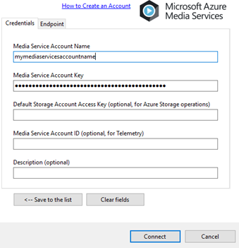
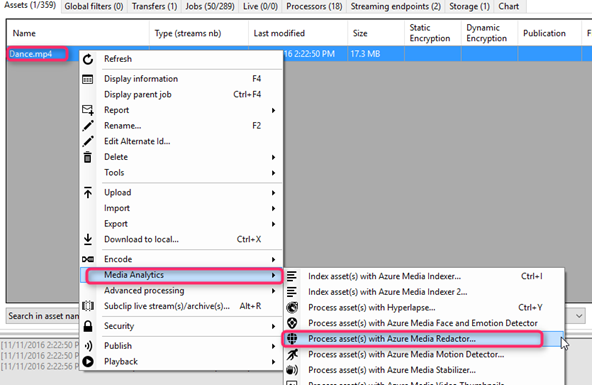
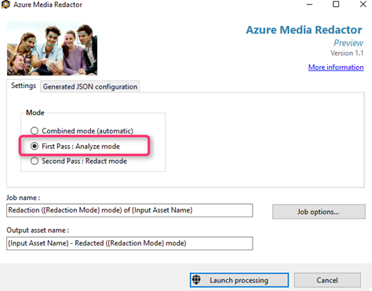
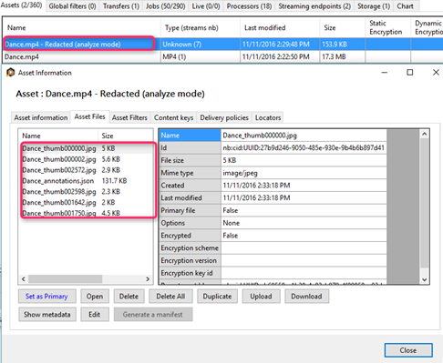
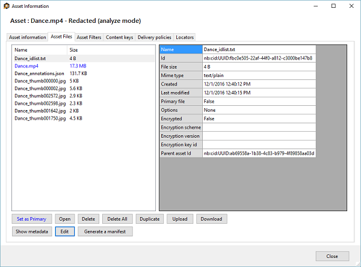
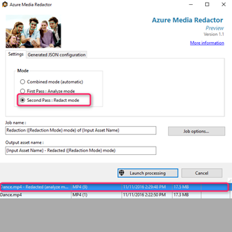
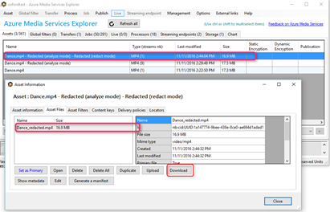
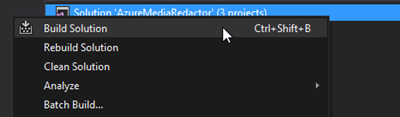
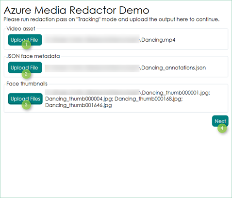
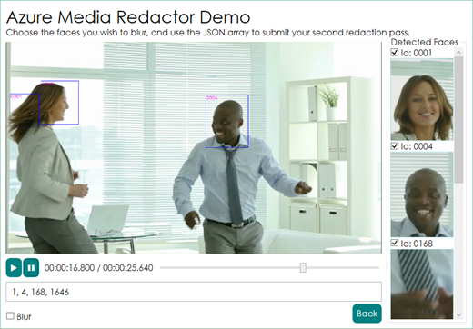

# Redact faces with Azure Media Analytics walkthrough

## Overview

**Azure Media Redactor** is an [Azure Media Analytics](media-services-analytics-overview.md) media processor (MP) that offers scalable face redaction in the cloud. Face redaction enables you to modify your video in order to blur faces of selected individuals. You may want to use the face redaction service in public safety and news media scenarios. A few minutes of footage that contains multiple faces can take hours to redact manually, but with this service the face redaction process will require just a few simple steps. For  more information, see [this](https://azure.microsoft.com/blog/azure-media-redactor/) blog.

For details about  **Azure Media Redactor**, see the [Face redaction overview](media-services-face-redaction.md) topic.

This topic shows step by step instructions on how to run a full redaction workflow using Azure Media Services Explorer (AMSE) and Azure Media Redactor Visualizer (open source tool).

For more information, see [this](https://azure.microsoft.com/blog/redaction-preview-available-globally) blog.

## Azure Media Services Explorer workflow

The easiest way to get started with Redactor is to use the open source AMSE tool on GitHub. You can run a simplified workflow via **combined** mode if you don’t need access to the annotation json or the face jpg images.

### Download and setup

1. Download the AMSE tool from [here](https://github.com/Azure/Azure-Media-Services-Explorer).
1. Log in to your Media Services account using your service key.

	To obtain the account name and key information, go to the [Azure portal](https://portal.azure.com/) and select your AMS account. Then, select Settings > Keys. The Manage keys windows shows the account name and the primary and secondary keys is displayed. Copy values of the account name and the primary key.

### First pass – analyze mode

1. Upload your media file through Asset –> Upload, or via drag and drop. 
1. Right click and process your media file using Media Analytics –> Azure Media Redactor –> Analyze mode. 

The output will include an annotations json file with face location data, as well as a jpg of each detected face. 

### Second pass – redact mode

1. Upload your original video asset to the output from the first pass and set as a primary asset. 

	

2. (Optional) Upload a 'Dance_idlist.txt' file which includes a newline delimited list of the IDs you wish to redact. 

	

3. (Optional) Make any edits to the annotations.json file such as increasing the bounding box boundaries. 
4. Right click the output asset from the first pass, select the Redactor, and run with the **Redact** mode. 

	

5. Download or share the final redacted output asset. 

	

## Azure Media Redactor Visualizer open source tool

An open source [visualizer tool](https://github.com/Microsoft/azure-media-redactor-visualizer) is designed to help developers just starting with the annotations format with parsing and using the output.

After you clone the repo, in order to run the project, you will need to download FFMPEG from their [official site](https://ffmpeg.org/download.html).

If you are a developer trying to parse the JSON annotation data, look inside Models.MetaData for sample code examples.

### Set up the tool

1.	Download and build the entire solution. 

	

2.	Download FFMPEG from [here](https://ffmpeg.org/download.html). This project was originally developed with version be1d324 (2016-10-04) with static linking. 
3.	Copy ffmpeg.exe and ffprobe.exe to the same output folder as AzureMediaRedactor.exe. 

	

4. Run AzureMediaRedactor.exe. 

### Use the tool

1. Process your video in your Azure Media Services account with the Redactor MP on Analyze mode. 
2. Download both the original video file and the output of the Redaction - Analyze job. 
3. Run the visualizer application and choose the files above. 

	

4. Preview your file. Select which faces you'd like to blur via the sidebar on the right. 
	
	

5.	The bottom text field will update with the face IDs. Create a file called "idlist.txt" with these IDs as a newline delimited list. 

	>[!NOTE]
	> The idlist.txt should be saved in ANSI. You can use notepad to save in ANSI.
	
6.	Upload this file to the output asset from step 1. Upload the original video to this asset as well and set as primary asset. 
7.	Run Redaction job on this asset with "Redact" mode to get the final redacted video. 

## Next steps 

[!INCLUDE [media-services-learning-paths-include](../../../includes/media-services-learning-paths-include.md)]

## Provide feedback
[!INCLUDE [media-services-user-voice-include](../../../includes/media-services-user-voice-include.md)]

## Related links
[Azure Media Services Analytics Overview](media-services-analytics-overview.md)

[Azure Media Analytics demos](https://azuremedialabs.azurewebsites.net/demos/Analytics.html)

[Announcing Face Redaction for Azure Media Analytics](https://azure.microsoft.com/blog/azure-media-redactor/)
