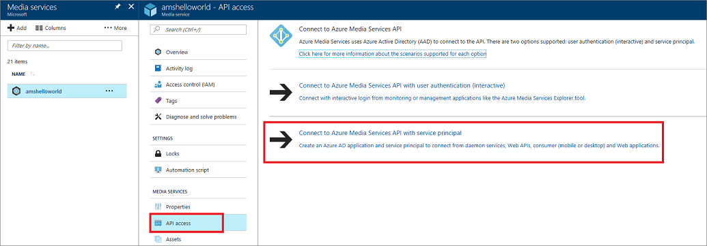
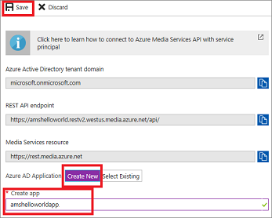
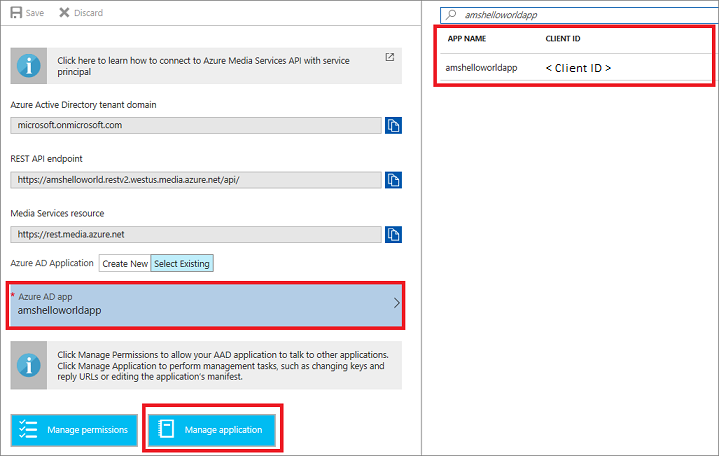
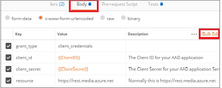
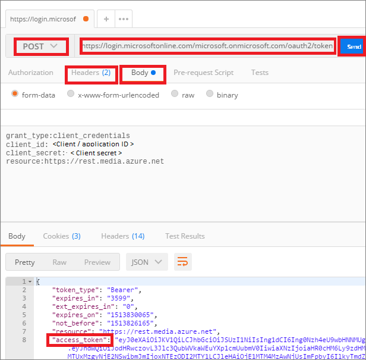
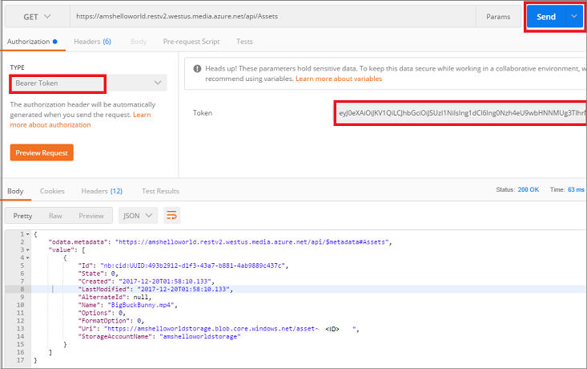
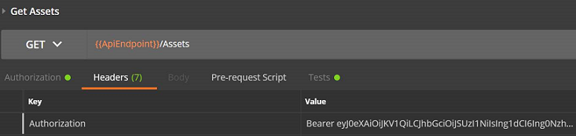

# Use Azure AD authentication to access the Media Services API with REST

> [!NOTE]
> No new features or functionality are being added to Media Services v2.  Check out the latest version, [Media Services v3](https://docs.microsoft.com/azure/media-services/latest/). Also, see [migration guidance from v2 to v3](../latest/migrate-from-v2-to-v3.md)

When you're using Azure AD authentication with Azure Media Services, you can authenticate in one of two ways:

- **User authentication** authenticates a person who is using the app to interact with Azure Media Services resources. The interactive application should first prompt the user for credentials. An example is a management console app that's used by authorized users to monitor encoding jobs or live streaming. 
- **Service principal authentication** authenticates a service. Applications that commonly use this authentication method are apps that run daemon services, middle-tier services, or scheduled jobs, such as web apps, function apps, logic apps, APIs, or microservices.

    This tutorial shows you how to use Azure AD **service principal** authentication to access AMS API with REST. 

    > [!NOTE]
    > **Service principal** is the recommended best practice for most applications connecting to Azure Media Services. 

In this tutorial, you learn how to:

> [!div class="checklist"]
> * Get the authentication information from the Azure portal
> * Get the access token using Postman
> * Test the **Assets** API using the access token

> [!IMPORTANT]
> Currently, Media Services supports the Azure Access Control services authentication model. However, Access Control authentication will be deprecated June 1, 2018. We recommend that you migrate to the Azure AD authentication model as soon as possible.

## Prerequisites

- If you don't have an Azure subscription, create a [free account](https://azure.microsoft.com/free/?ref=microsoft.com&utm_source=microsoft.com&utm_medium=docs&utm_campaign=visualstudio) before you begin.
- [Create an Azure Media Services account using the Azure portal](media-services-portal-create-account.md).
- Review the [Accessing Azure Media Services API with Azure AD authentication overview](media-services-use-aad-auth-to-access-ams-api.md) article.
- Install the [Postman](https://www.getpostman.com/) REST client to execute the REST APIs shown in this article. 

    In this tutorial, we are using **Postman** but any REST tool would be suitable. Other alternatives are: **Visual Studio Code** with the REST plugin or **Telerik Fiddler**. 

## Get the authentication information from the Azure portal

### Overview

To access Media Services API, you need to collect the following data points.

|Setting|Example|Description|
|---|-------|-----|
|Azure Active Directory tenant domain|microsoft.onmicrosoft.com|Azure AD as a Secure Token Service (STS) endpoint is created using the following format: <https://login.microsoftonline.com/{your-ad-tenant-name.onmicrosoft.com}/oauth2/token>. Azure AD issues a JWT in order to access resources (an access token).|
|REST API endpoint|<https://amshelloworld.restv2.westus.media.azure.net/api/>|This is the endpoint against which all Media Services REST API calls in your application are made.|
|Client ID (Application ID)|f7fbbb29-a02d-4d91-bbc6-59a2579259d2|Azure AD application (client) ID. The client ID is required to get the access token. |
|Client Secret|+mUERiNzVMoJGggD6aV1etzFGa1n6KeSlLjIq+Dbim0=|Azure AD application keys (client secret). The client secret is required to get the access token.|

### Get AAD auth info from the Azure portal

To get the information, follow these steps:

1. Log in to the [Azure portal](https://portal.azure.com).
2. Navigate to your AMS instance.
3. Select **API access**.
4. Click on **Connect to Azure Media Services API with service principal**.

    

5. Select an existing **Azure AD application** or create a new one (shown below).

    > [!NOTE]
    > For the Azure Media REST request to succeed, the calling user must have a **Contributor** or **Owner** role for the Media Services account it is trying to access. If you get an exception that says "The remote server returned an error: (401) Unauthorized," see [Access control](media-services-use-aad-auth-to-access-ams-api.md#access-control).

    If you need to create a new AD app, follow these steps:
    
   1. Press **Create New**.
   2. Enter a name.
   3. Press **Create New** again.
   4. Press **Save**.

      

      The new app shows up on the page.

6. Get the **Client ID** (Application ID).
    
   1. Select the application.
   2. Get the **Client ID** from the window on the right. 

      

7. Get the application's **Key** (client secret). 

   1. Click the **Manage application** button (notice that the Client ID info is under **Application ID**). 
   2. Press **Keys**.
    
       
   3. Generate the app key (client secret) by filling in **DESCRIPTION** and **EXPIRES** and pressing **Save**.
    
       Once the **Save** button is pressed, the key value appears. Copy the key value before leaving the blade.

   

You can add values for AD connection parameters to your web.config or app.config file, to later use in your code.

> [!IMPORTANT]
> The **Client key** is an important secret and should be properly secured in a key vault or encrypted in production.

## Get the access token using Postman

This section shows how to use **Postman** to execute a REST API that returns a JWT Bearer Token (access token). To call any Media Services REST API, you need to add the "Authorization" header to the calls, and add the value of "Bearer *your_access_token*" to each call (as shown in the next section of this tutorial). 

1. Open **Postman**.
2. Select **POST**.
3. Enter the URL that includes your tenant name using the following format: the tenant name should end with **.onmicrosoft.com** and the URL should end with **oauth2/token**: 

    https://login.microsoftonline.com/{your-aad-tenant-name.onmicrosoft.com}/oauth2/token

4. Select the **Headers** tab.
5. Enter the **Headers** information using the "Key/Value" data grid. 

    

    Alternatively, click **Bulk Edit** link on the right of the Postman window and paste the following code.

        Content-Type:application/x-www-form-urlencoded
        Keep-Alive:true

6. Press the **Body** tab.
7. Enter the body information using the "Key/Value" data grid (replace the client ID and secret values). 

    

    Alternatively, click **Bulk Edit** on the right of the Postman window and paste the following body (replace the client ID and secret values):

        grant_type:client_credentials
        client_id:{Your Client ID that you got from your Azure AD Application}
        client_secret:{Your client secret that you got from your Azure AD Application's Keys}
        resource:https://rest.media.azure.net

8. Press **Send**.

    

The returned response contains the **access token** that you need to use to access any AMS APIs.

## Test the **Assets** API using the access token

This section shows how to access the **Assets** API using **Postman**.

1. Open **Postman**.
2. Select **GET**.
3. Paste the REST API endpoint (for example, https://amshelloworld.restv2.westus.media.azure.net/api/Assets)
4. Select the **Authorization** tab. 
5. Select **Bearer Token**.
6. Paste the token that was created in the previous section.

    

    > [!NOTE]
    > The Postman UX could be different between a Mac and PC. If the Mac version does not have the "Bearer Token" option in the **Authentication** section dropdown, you should add the **Authorization** header manually on the Mac client.

   

7. Select **Headers**.
5. Click **Bulk Edit** link on the right the Postman window.
6. Paste the following headers:

        x-ms-version:2.15
        Accept:application/json
        Content-Type:application/json
        DataServiceVersion:3.0
        MaxDataServiceVersion:3.0

7. Press **Send**.

The returned response contains the assets that are in your account.

## Next steps

* Try this sample code in [Azure AD Authentication for Azure Media Services Access: Both via REST API](https://github.com/willzhan/WAMSRESTSoln)
* [Upload files with .NET](media-services-dotnet-upload-files.md)
