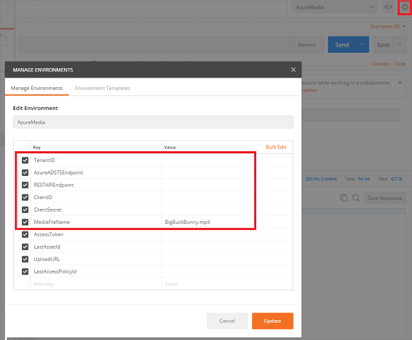
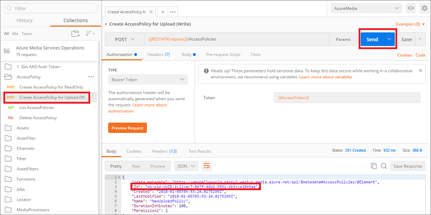
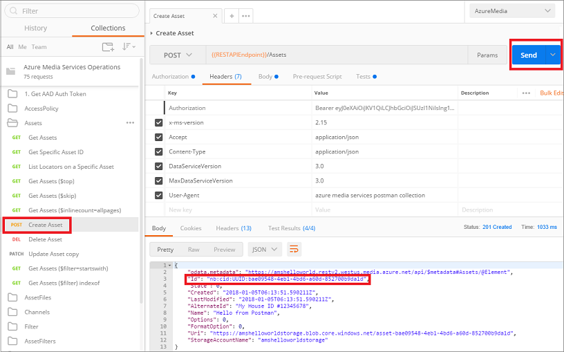
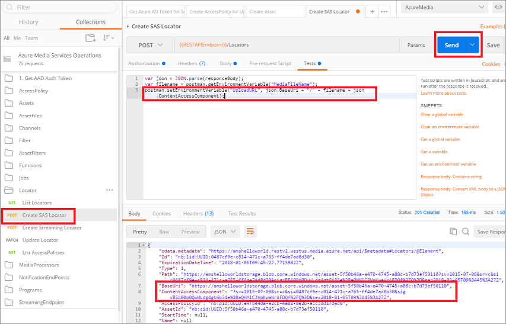
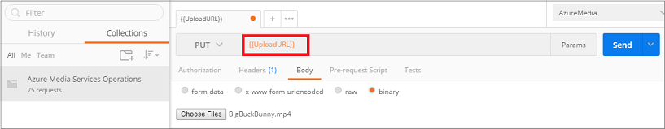
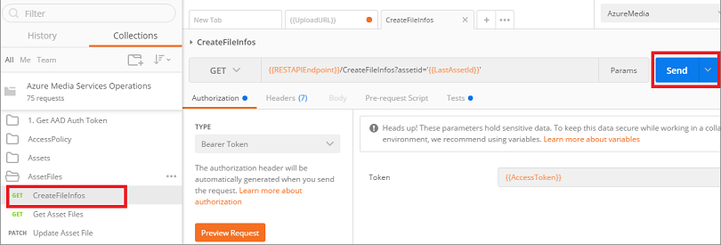

# Upload files into a Media Services account using REST  
> [!div class="op_single_selector"]
> * [.NET](media-services-dotnet-upload-files.md)
> * [REST](media-services-rest-upload-files.md)
> * [Portal](media-services-portal-upload-files.md)
> 

In Media Services, you upload your digital files into an asset. The [Asset](https://docs.microsoft.com/rest/api/media/operations/asset) entity can contain video, audio, images, thumbnail collections, text tracks and closed caption files (and the metadata about these files.)  Once the files are uploaded into the asset, your content is stored securely in the cloud for further processing and streaming. 

In this tutorial, you learn how to upload a file and other operation associated with it:

> [!div class="checklist"]
> * Set up Postman for all the upload operations
> * Connect to Media Services 
> * Create an access policy with write permission
> * Create an asset
> * Create a SAS locator and create the upload URL
> * Upload a file to blob storage using the upload URL
> * Create a metadata in the asset for the media file you uploaded

## Prerequisites

- If you don't have an Azure subscription, create a [free account](https://azure.microsoft.com/free/?ref=microsoft.com&utm_source=microsoft.com&utm_medium=docs&utm_campaign=visualstudio) before you begin.
- [Create an Azure Media Services account using the Azure portal](media-services-portal-create-account.md).
- Review the [Accessing Azure Media Services API with AAD authentication overview](media-services-use-aad-auth-to-access-ams-api.md) article.
- Configure **Postman** as described in [Configure Postman for Media Services REST API calls](media-rest-apis-with-postman.md).

## Considerations

The following considerations apply when using Media Services REST API:
 
* When accessing entities using Media Services REST API, you must set specific header fields and values in your HTTP requests. For more information, see [Setup for Media Services REST API Development](media-services-rest-how-to-use.md). <br/>The Postman collection used in this tutorial takes care of setting all the necessary headers.
* Media Services uses the value of the IAssetFile.Name property when building URLs for the streaming content (for example, http://{AMSAccount}.origin.mediaservices.windows.net/{GUID}/{IAssetFile.Name}/streamingParameters.) For this reason, percent-encoding is not allowed. The value of the **Name** property cannot have any of the following [percent-encoding-reserved characters](https://en.wikipedia.org/wiki/Percent-encoding#Percent-encoding_reserved_characters): !*'();:@&=+$,/?%#[]". Also, there can only be one '.' for the file name extension.
* The length of the name should not be greater than 260 characters.
* There is a limit to the maximum file size supported for processing in Media Services. See [this](media-services-quotas-and-limitations.md) article for details about the file size limitation.

## Set up Postman

For steps on how to set up Postman for this tutorial, see [Configure Postman](media-rest-apis-with-postman.md).

## Connect to Media Services

1. Add connection values to your environment. 

    Some variables that are part of the **MediaServices** [environment](postman-environment.md) need to be set manually before you can start executing operations defined in the [collection](postman-collection.md).

    To get values for the first five variables, see [Access the Azure Media Services API with Azure AD authentication](media-services-use-aad-auth-to-access-ams-api.md). 

    
2. Specify the value for the **MediaFileName** environment variable.

    Specify the file name of the media you are planning to upload. In this example, we are going to upload the BigBuckBunny.mp4. 
3. Examine the **AzureMediaServices.postman_environment.json** file. You will see that almost all operations in the collection execute a "test" script. The scripts take some values returned by the response and set appropriate environment variables.

    For example, the first operation gets an access token and set it on the **AccessToken** environment variable that is used in all other operations.

	```    
	"listen": "test",
	"script": {
		"type": "text/javascript",
		"exec": [
			"var json = JSON.parse(responseBody);",
			"postman.setEnvironmentVariable(\"AccessToken\", json.access_token);"
		]
	}
	```
4. On the left of the **Postman** window, click on **1. Get AAD Auth token** -> **Get Azure AD Token for Service Principal**.

    The URL portion is filled with the **AzureADSTSEndpoint** environment variable (earlier in the tutorial, you set the values of environment variables that support the collection).

    

5. Press **Send**.

    You can see the response that contains "access_token". The "test" script takes this value and sets the **AccessToken** environment variable (as described above). If you examine your environment variables, you will see that this variable now contains the access token (bearer token) value that is used in the rest of the operations. 

    If the token expires go through the "Get Azure AD Token for Service Principal" step again. 

## Create an access policy with write permission

### Overview 

>[!NOTE]
>There is a limit of 1,000,000 policies for different AMS policies (for example, for Locator policy or ContentKeyAuthorizationPolicy). You should use the same policy ID if you are always using the same days / access permissions, for example, policies for locators that are intended to remain in place for a long time (non-upload policies). For more information, see [this](media-services-dotnet-manage-entities.md#limit-access-policies) article.

Before uploading any files into blob storage, set the access policy rights for writing to an asset. To do that, POST an HTTP request to the AccessPolicies entity set. Define a DurationInMinutes value upon creation or you receive a 500 Internal Server error message back in response. For more information on AccessPolicies, see [AccessPolicy](https://docs.microsoft.com/rest/api/media/operations/accesspolicy).

### Create an access policy

1. Select **AccessPolicy** -> **Create AccessPolicy for Upload**.
2. Press **Send**.

    

    The "test" script gets the AccessPolicy Id and sets the appropriate environment variable.

## Create an asset

### Overview

An [asset](https://docs.microsoft.com/rest/api/media/operations/asset) is a container for multiple types or sets of objects in Media Services, including video, audio, images, thumbnail collections, text tracks, and closed caption files. In the REST API, creating an Asset requires sending POST request to Media Services and placing any property information about your asset in the request body.

One of the properties that you can add when creating an asset is **Options**. You can specify one of the following encryption options: **None** (default, no encryption is used), **StorageEncrypted** (for content that has been pre-encrypted with client-side storage encryption), **CommonEncryptionProtected**, or **EnvelopeEncryptionProtected**. When you have an encrypted asset, you need to configure a delivery policy. For more information, see [Configuring asset delivery policies](media-services-rest-configure-asset-delivery-policy.md).

If your asset is encrypted, you must create a **ContentKey** and link it to your asset as described in the following article: [How to create a ContentKey](media-services-rest-create-contentkey.md). After you upload the files into the asset, you need to update the encryption properties on the **AssetFile** entity with the values you got during the **Asset** encryption. Do it by using the **MERGE** HTTP request. 

In this example, we are creating an unencrypted asset. 

### Create an asset

1. Select **Assets** -> **Create Asset**.
2. Press **Send**.

    

    The "test" script gets the Asset Id and sets the appropriate environment variable.

## Create a SAS locator and create the Upload URL

### Overview

Once you have the AccessPolicy and Locator set, the actual file is uploaded to an Azure Blob Storage container using the Azure Storage REST APIs. You must upload the files as block blobs. Page blobs are not supported by Azure Media Services.  

For more information on working with Azure storage blobs, see [Blob Service REST API](https://docs.microsoft.com/rest/api/storageservices/Blob-Service-REST-API).

To receive the actual upload URL, create a SAS Locator (shown below). Locators define the start time and type of connection endpoint for clients that want to access Files in an Asset. You can create multiple Locator entities for a given AccessPolicy and Asset pair to handle different client requests and needs. Each of these Locators uses the StartTime value plus the DurationInMinutes value of the AccessPolicy to determine the length of time a URL can be used. For more information, see [Locator](https://docs.microsoft.com/rest/api/media/operations/locator).

A SAS URL has the following format:

    {https://myaccount.blob.core.windows.net}/{asset name}/{video file name}?{SAS signature}

### Considerations

Some considerations apply:

* You cannot have more than five unique Locators associated with a given Asset at one time. For more information, see Locator.
* If you need to upload your files immediately, you should set your StartTime value to five minutes before the current time. This is because there may be clock skew between your client machine and Media Services. Also, your StartTime value must be in the following DateTime format: YYYY-MM-DDTHH:mm:ssZ (for example, "2014-05-23T17:53:50Z").    
* There may be a 30-40 second delay after a Locator is created to when it is available for use.

### Create a SAS locator

1. Select **Locator** -> **Create SAS Locator**.
2. Press **Send**.

    The "test" script creates the "Upload URL" based on the media file name you specified and SAS locator information and sets the appropriate environment variable.

    

## Upload a file to blob storage using the upload URL

### Overview

Now that you have the upload URL, you need to write some code using the Azure Blob APIs directly to upload your file to the SAS container. For more information, see the following articles:

- [Using the Azure Storage REST API](https://docs.microsoft.com/azure/storage/common/storage-rest-api-auth?toc=%2fazure%2fstorage%2fblobs%2ftoc.json)
- [PUT Blob](https://docs.microsoft.com/rest/api/storageservices/put-blob)
- [Upload blobs to Blob storage](https://docs.microsoft.com/previous-versions/azure/storage/storage-use-azcopy#upload-blobs-to-blob-storage)

### Upload a file with Postman

As an example, we use Postman to upload a small .mp4 file. There may be a file size limit on uploading binary through Postman.

The upload request is not part of the **AzureMedia** collection. 

Create and set up a new request:
1. Press **+**, to create a new request tab.
2. Select **PUT** operation and paste **{{UploadURL}}** in the URL.
2. Leave **Authorization** tab as is (do not set it to the **Bearer Token**).
3. In the **Headers** tab, specify: **Key**: "x-ms-blob-type" and **Value**: "BlockBlob".
2. In the **Body** tab, click **binary**.
4. Choose the file with the name that you specified in the **MediaFileName** environment variable.
5. Press **Send**.

    

##  Create a metadata in the asset

Once the file has been uploaded, you need to create a metadata in the asset for the media file you uploaded into the blob storage associated with your asset.

1. Select **AssetFiles** -> **CreateFileInfos**.
2. Press **Send**.

    

The file should be uploaded and its metadata set.

## Validate

To validate that the file has been uploaded successfully, you might want to query the [AssetFile](https://docs.microsoft.com/rest/api/media/operations/assetfile) and compare the **ContentFileSize** (or other details) to what you expect to see in the new asset. 

For example, the following **GET** operation brings file data for your asset file (in or case, the BigBuckBunny.mp4 file). The query is using the [environment variables](postman-environment.md) that you set earlier.

    {{RESTAPIEndpoint}}/Assets('{{LastAssetId}}')/Files

Response will contain size, name, and other information.

    "Id": "nb:cid:UUID:69e72ede-2886-4f2a-8d36-80a59da09913",
    "Name": "BigBuckBunny.mp4",
    "ContentFileSize": "3186542",
    "ParentAssetId": "nb:cid:UUID:0b8f3b04-72fb-4f38-8e7b-d7dd78888938",
            
## Next steps

You can now encode your uploaded assets. For more information, see [Encode assets](media-services-portal-encode.md).

You can also use Azure Functions to trigger an encoding job based on a file arriving in the configured container. For more information, see [this sample](https://azure.microsoft.com/resources/samples/media-services-dotnet-functions-integration/ ).

